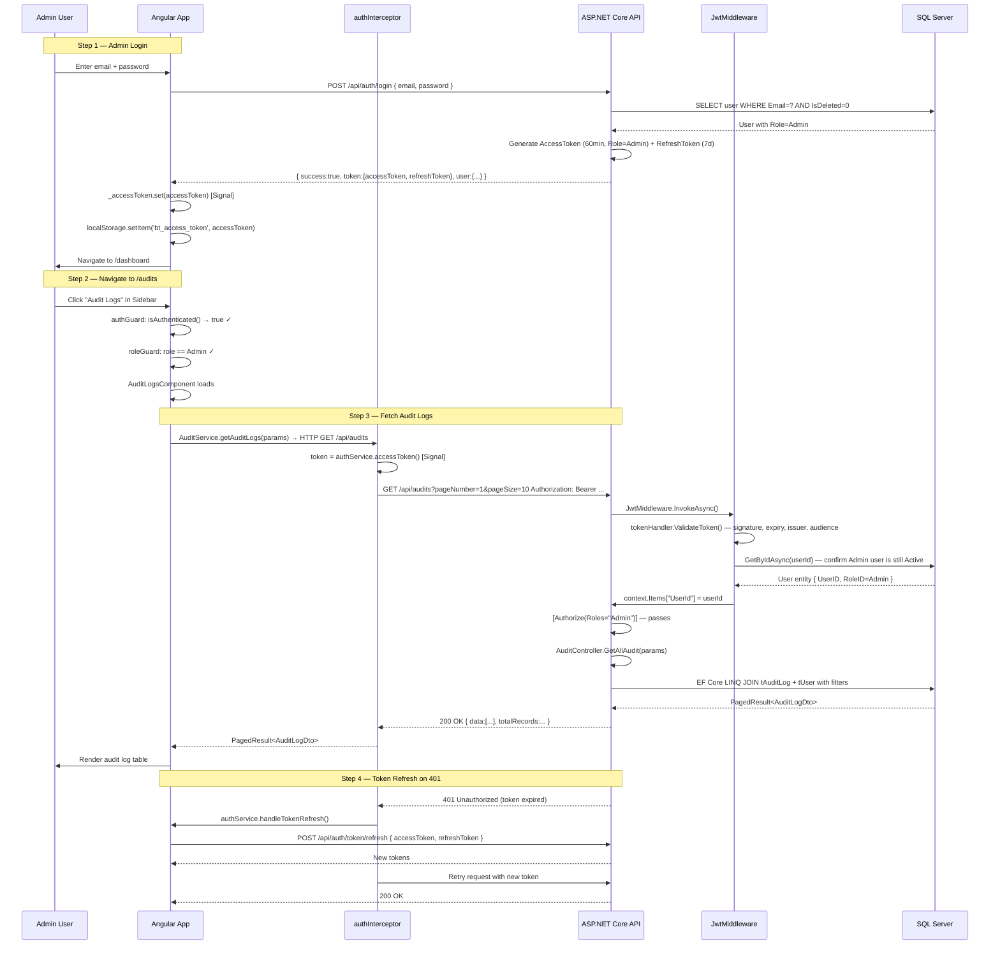
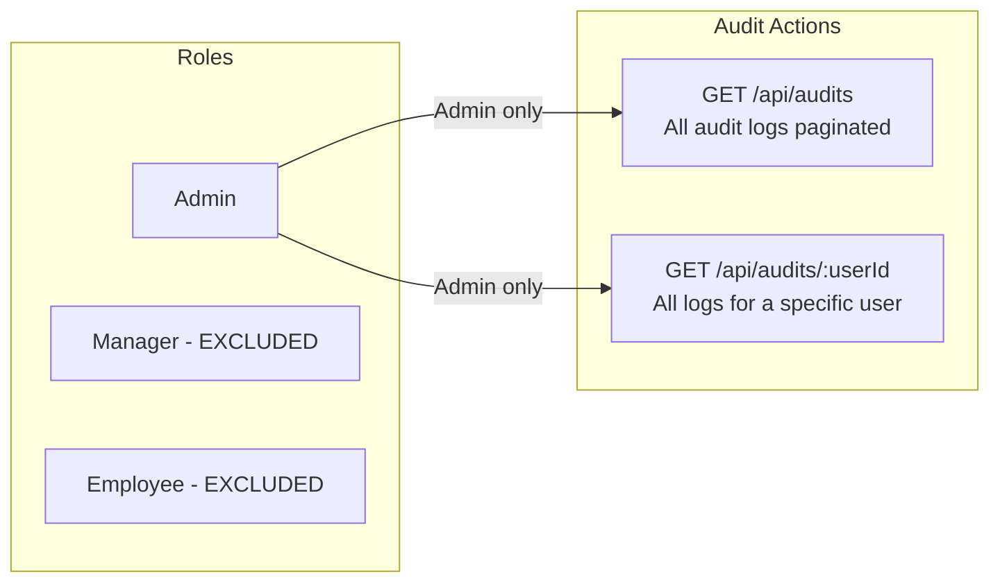
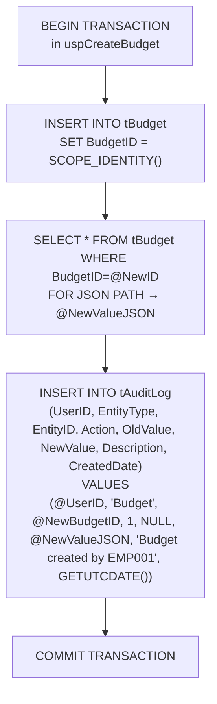
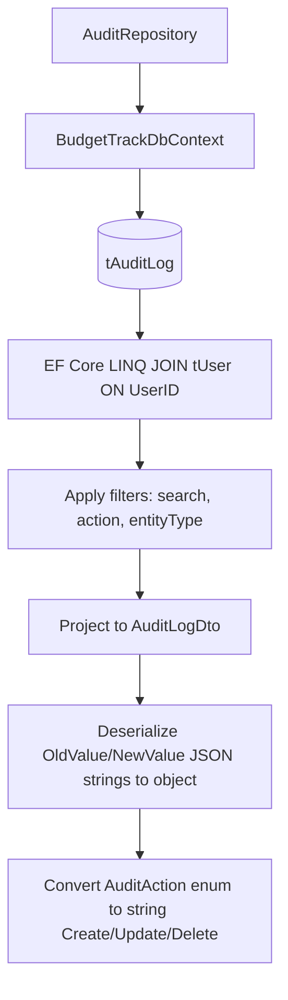
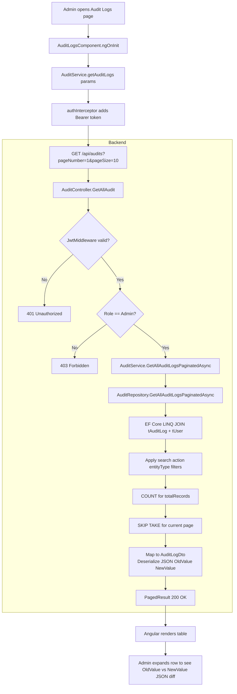
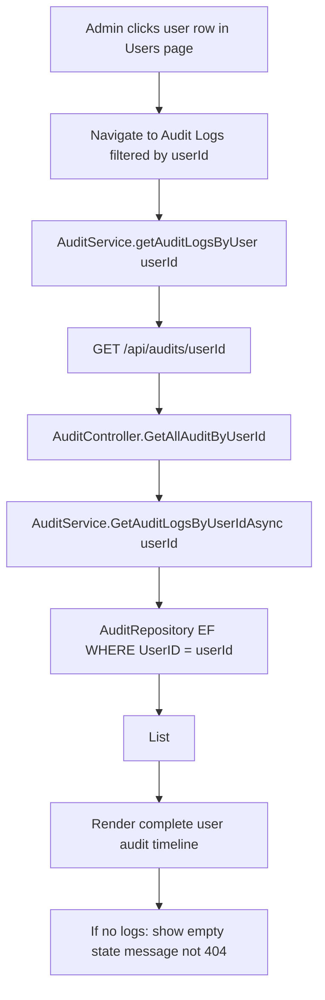
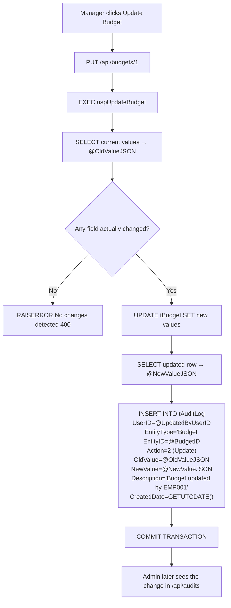

# Audit Module — Complete Documentation

> **Stack:** ASP.NET Core 10 · Entity Framework Core 10 · SQL Server · Angular 21 · Bootstrap 5
> **Base URL:** `http://localhost:5131`
> **Generated:** 2026-03-07

---

## Table of Contents

1. [Module Overview](#1-module-overview)
2. [Authentication & Authorization Flow](#2-authentication--authorization-flow)
3. [Role-Based Access Control](#3-role-based-access-control)
4. [Database Layer — Embedded Audit INSERTs](#4-database-layer--embedded-audit-inserts)
5. [Entity & DTOs](#5-entity--dtos)
6. [Repository Layer](#6-repository-layer)
7. [Service Layer](#7-service-layer)
8. [Controller Layer](#8-controller-layer)
9. [Complete API Reference](#9-complete-api-reference)
10. [Angular Frontend](#10-angular-frontend)
11. [End-to-End Data Flow Diagrams](#11-end-to-end-data-flow-diagrams)
12. [Audit Trail Integrity Design](#12-audit-trail-integrity-design)

---

## 1. Module Overview

The **Audit Module** provides a complete, immutable record of all data mutations across the system. Audit logs are written **automatically inside stored procedures** of other modules — no manual API calls are needed to create them. The module exposes **read-only** endpoints for Admins only.

### What the Audit Module Does

| Capability          | Description                                                         |
| ------------------- | ------------------------------------------------------------------- |
| View All Audit Logs | Admin retrieves paginated audit trail with search and filters       |
| View by User        | Admin retrieves all audit entries for a specific user               |
| Auto-Generated      | Created inside Budget/Expense/Category/Department stored procedures |
| JSON Snapshots      | Full `OldValue` and `NewValue` JSON stored per change               |
| Change Detection    | SP only writes audit log if actual data changed                     |
| Immutable           | No update or delete endpoints — audit data is permanent             |

### What Gets Audited

| Entity     | Actions Logged                             | Written By SP                                                  |
| ---------- | ------------------------------------------ | -------------------------------------------------------------- |
| Budget     | Create, Update, Delete                     | `uspCreateBudget`, `uspUpdateBudget`, `uspDeleteBudget`        |
| Expense    | Create (Submit), Update (Approve/Reject)   | `uspCreateExpense`, `uspUpdateExpenseStatus`                   |
| Category   | Create, Update, Delete                     | `uspCreateCategory`, `uspUpdateCategory`, `uspDeleteCategory`  |
| Department | Create, Update, Delete                     | `uspCreateDepartment`, `uspUpdateDepartment`, `uspDeleteDepartment` |
| User       | Create, Update, Delete (via EF Core)       | `UserRepository.SaveChangesAsync()` (not via SP)              |

> **No dedicated `Audit.sql` file** — audit `INSERT` statements are embedded inside each module's stored procedure within a `BEGIN TRANSACTION` block, ensuring atomicity with the data mutation.

---

## 2. Authentication & Authorization Flow

Every request to the Audit module requires a valid JWT Bearer token with the **Admin** role.



### JWT Token Claims Used

| Claim Type                  | Example Value | Used For                           |
| --------------------------- | ------------- | ---------------------------------- |
| `ClaimTypes.NameIdentifier` | `1`           | Identifies requesting Admin        |
| `ClaimTypes.Role`           | `Admin`       | `[Authorize(Roles="Admin")]` check |

### Token Storage

| Token         | Storage                       | Duration   |
| ------------- | ----------------------------- | ---------- |
| Access Token  | Angular Signal + localStorage | 60 minutes |
| Refresh Token | localStorage only             | 7 days     |

---

## 3. Role-Based Access Control



### Access Logic in Code

```
GET /api/audits           → [Authorize(Roles="Admin")]
GET /api/audits/{userId}  → [Authorize(Roles="Admin")]
│
└── No UserId claim usage required — AuditController does NOT extend BaseApiController
     It only needs the Admin role claim from JWT for access.
```

> **Only Admins have access.** Managers and Employees who try to access these endpoints receive `403 Forbidden`.

---

## 4. Database Layer — Embedded Audit INSERTs

There is **no dedicated Audit SQL file**. The `tAuditLog` table receives `INSERT` statements embedded within each module's stored procedure in a transaction block.

### `tAuditLog` Table Structure

```sql
CREATE TABLE tAuditLog (
    AuditLogID   INT IDENTITY(1,1) PRIMARY KEY,
    UserID       INT NULL REFERENCES tUser(UserID) ON DELETE SET NULL,
    EntityType   NVARCHAR(50) NOT NULL,      -- 'Budget', 'Expense', 'Category', 'Department'
    EntityID     INT NOT NULL,               -- FK to the affected record
    Action       TINYINT NOT NULL,           -- 1=Create, 2=Update, 3=Delete
    OldValue     NVARCHAR(MAX) NULL,         -- JSON before change (NULL on Create)
    NewValue     NVARCHAR(MAX) NULL,         -- JSON after change (NULL on Delete)
    Description  NVARCHAR(500) NULL,         -- Human-readable summary
    CreatedDate  DATETIME NOT NULL DEFAULT GETUTCDATE()
);
```

### How Audit Logs Are Written (Example: Budget SP)



### Audit Entry Written by Each Module

| Module     | Entity Type   | Action  | OldValue | NewValue |
| ---------- | ------------- | ------- | -------- | -------- |
| Budget     | `'Budget'`    | Create  | NULL     | JSON     |
| Budget     | `'Budget'`    | Update  | JSON     | JSON     |
| Budget     | `'Budget'`    | Delete  | JSON     | NULL     |
| Expense    | `'Expense'`   | Create  | NULL     | JSON     |
| Expense    | `'Expense'`   | Update  | JSON     | JSON     |
| Category   | `'Category'`  | Create  | NULL     | JSON     |
| Category   | `'Category'`  | Update  | JSON     | JSON     |
| Category   | `'Category'`  | Delete  | JSON     | NULL     |
| Department | `'Department'`| Create  | NULL     | JSON     |
| Department | `'Department'`| Update  | JSON     | JSON     |
| Department | `'Department'`| Delete  | JSON     | NULL     |

### Change Detection (Update SPs Only)

```sql
-- Inside uspUpdateBudget (example)
IF @OldTitle = @NewTitle AND @OldAmount = @NewAmount AND @OldStatus = @NewStatus
    RAISERROR('No changes detected', 16, 1);
-- Audit log only written if data actually changed
```

### JSON Snapshot Examples

**Budget Create** (`NewValue`):
```json
{
  "BudgetID": 1, "Title": "Q1 Engineering",
  "BudgetCode": "BT26001", "AmountAllocated": 5000000.00,
  "Status": 1, "CreatedDate": "2026-03-07T04:38:00",
  "CreatedByUserID": 5
}
```

**Budget Update** (`OldValue` → `NewValue`):
```json
// OldValue
{ "BudgetID": 1, "Title": "Q1 Engineering", "AmountAllocated": 5000000.00, "Status": 1 }
// NewValue
{ "BudgetID": 1, "Title": "Q1 Engineering", "AmountAllocated": 6000000.00, "Status": 1, "UpdatedDate": "2026-03-07T05:00:00" }
```

---

## 5. Entity & DTOs

### 5.1 `AuditLog` Entity (`Models/Entities/AuditLog.cs`)

```csharp
[Table("tAuditLog")]
[Index(nameof(EntityType))]
[Index(nameof(UserID))]
public class AuditLog
{
    [Key] public int AuditLogID { get; set; }
    public int? UserID { get; set; }                       // Nullable: SET NULL on user delete
    [Required][MaxLength(50)] public required string EntityType { get; set; }
    [Required] public required int EntityID { get; set; }
    [Required] public required AuditAction Action { get; set; }
    public string? OldValue { get; set; }                  // JSON string — NULL on Create
    public string? NewValue { get; set; }                  // JSON string — NULL on Delete
    [MaxLength(500)] public string? Description { get; set; }
    [Required] public required DateTime CreatedDate { get; set; } = DateTime.UtcNow;
    // Navigation
    public virtual User? User { get; set; }
}
```

**Key Design Decisions:**
- `UserID` uses `OnDelete(DeleteBehavior.SetNull)` — if a user is soft-deleted, audit rows are preserved but `UserID` becomes NULL
- `OldValue` / `NewValue` are full JSON snapshots, not field-level diffs
- No `IsDeleted` flag — audit records are **permanently immutable**

---

### 5.2 Enum: `AuditAction`

| Value | Name     | Trigger                        |
| ----- | -------- | ------------------------------ |
| 1     | `Create` | New record inserted            |
| 2     | `Update` | Existing record modified       |
| 3     | `Delete` | Soft-delete performed          |

---

### 5.3 DTO: `AuditLogDto`

| Field        | Type     | Description                                    |
| ------------ | -------- | ---------------------------------------------- |
| `AuditLogID` | int      | Log entry identifier                           |
| `UserID`     | int?     | User who performed action (null if deleted)    |
| `UserName`   | string?  | Full name of acting user                       |
| `EmployeeId` | string?  | Employee ID of acting user                     |
| `EntityType` | string   | Entity that was changed (Budget, Expense, etc) |
| `EntityID`   | int      | ID of the changed record                       |
| `Action`     | string   | `"Create"`, `"Update"`, `"Delete"`             |
| `OldValue`   | object?  | Deserialized JSON of before state              |
| `NewValue`   | object?  | Deserialized JSON of after state               |
| `Timestamp`  | DateTime | When the action occurred (UTC)                 |
| `Notes`      | string?  | Human-readable description from SP             |

---

## 6. Repository Layer

**Interface:** `IAuditRepository`

```csharp
Task<List<AuditLogDto>> GetAllAuditLogsAsync();
Task<PagedResult<AuditLogDto>> GetAllAuditLogsPaginatedAsync(
    int pageNumber, int pageSize,
    string? search = null,
    string? action = null,
    string? entityType = null);
Task<List<AuditLogDto>> GetAuditLogsByUserIdAsync(int userId);
```

**Implementation: `AuditRepository`**



| Method                          | Mechanism            | Description                                          |
| ------------------------------- | -------------------- | ---------------------------------------------------- |
| `GetAllAuditLogsAsync`          | EF Core LINQ + JOIN  | All logs with user info — no pagination              |
| `GetAllAuditLogsPaginatedAsync` | EF Core LINQ + WHERE | Filtered by search/action/entityType; paginated      |
| `GetAuditLogsByUserIdAsync`     | EF Core WHERE userid | All logs for a specific user                         |

**Filtering in Repository:**
```csharp
var query = _context.AuditLogs
    .Include(a => a.User)
    .Where(a => search == null || a.EntityType.Contains(search) || ...)
    .Where(a => action == null || a.Action == parseAction(action))
    .Where(a => entityType == null || a.EntityType == entityType)
    .OrderByDescending(a => a.CreatedDate);

var totalRecords = await query.CountAsync();
var data = await query.Skip((pageNumber-1)*pageSize).Take(pageSize)
    .Select(a => new AuditLogDto {
        Action = a.Action.ToString(),               // enum → string
        OldValue = JsonSerializer.Deserialize<object>(a.OldValue ?? "null"),
        ...
    }).ToListAsync();
```

---

## 7. Service Layer

**Interface:** `IAuditService`

```csharp
Task<List<AuditLogDto>> GetAllAuditLogsAsync();
Task<PagedResult<AuditLogDto>> GetAllAuditLogsPaginatedAsync(
    int pageNumber, int pageSize,
    string? search = null,
    string? action = null,
    string? entityType = null);
Task<List<AuditLogDto>> GetAuditLogsByUserIdAsync(int userId);
```

**`AuditService`** is a direct pass-through to `AuditRepository`. There is no additional business logic — all filtering and deserialization are handled in the repository.

**Dependency Injection:**
```csharp
// Program.cs
builder.Services.AddScoped<IAuditService, AuditService>();
builder.Services.AddScoped<IAuditRepository, AuditRepository>();
```

---

## 8. Controller Layer

**`AuditController`** — note: **does NOT extend `BaseApiController`** (no UserId needed):

```csharp
[ApiController]
[Route("api/audits")]
public class AuditController : ControllerBase   // Not BaseApiController
{
    private readonly IAuditService _auditService;
}
```

**Action Mapping:**

| Method | Route                  | Roles | Action                | Description                              |
| ------ | ---------------------- | ----- | --------------------- | ---------------------------------------- |
| GET    | `/api/audits`          | Admin | `GetAllAudit`         | Paginated + filtered audit log list      |
| GET    | `/api/audits/{userId}` | Admin | `GetAllAuditByUserId` | All logs for a specific user (no paging) |

**Error Handling:**

| Exception             | HTTP Response             |
| --------------------- | ------------------------- |
| `ArgumentException`   | 400 Bad Request           |
| Unhandled             | 500 Internal Server Error |

> Returns `[]` (empty array) — never `404` — when no logs found for a userId.

---

## 9. Complete API Reference

> **Auth Header required:** `Authorization: Bearer <accessToken>`  
> **Role:** Admin only. Manager/Employee receives `403 Forbidden`.

---

### `GET /api/audits`

**Roles:** Admin only

**Query Parameters:**

| Parameter    | Type    | Default | Description                                                     |
| ------------ | ------- | ------- | --------------------------------------------------------------- |
| `pageNumber` | int     | `1`     | Page index                                                      |
| `pageSize`   | int     | `10`    | Records per page                                                |
| `search`     | string? | —       | Search by entity type, entity ID, user name, or employee ID     |
| `action`     | string? | —       | Filter by action: `Create`, `Update`, `Delete`                  |
| `entityType` | string? | —       | Filter by entity: `Budget`, `Expense`, `Category`, `Department` |

**Response `200 OK`:**
```json
{
  "data": [
    {
      "auditLogID": 142,
      "userID": 5,
      "userName": "Sanika Anil",
      "employeeId": "MGR2601",
      "entityType": "Budget",
      "entityID": 1,
      "action": "Update",
      "oldValue": { "title": "Engineering Operations", "amountAllocated": 5000000.00 },
      "newValue": { "title": "Engineering Operations", "amountAllocated": 6000000.00 },
      "timestamp": "2026-02-25T06:26:11",
      "notes": "Budget updated by MGR2601"
    }
  ],
  "pageNumber": 1,
  "pageSize": 10,
  "totalRecords": 340,
  "totalPages": 34,
  "hasNextPage": true,
  "hasPreviousPage": false
}
```

**Status Codes:**

| Code  | When                         |
| ----- | ---------------------------- |
| `200` | Success                      |
| `400` | Invalid filter argument      |
| `401` | Not authenticated            |
| `403` | Not Admin                    |
| `500` | Server error                 |

---

### `GET /api/audits/{userId}`

**Roles:** Admin only

**Route Param:** `userId` (int) — the `UserID` of the user whose logs to retrieve.

**Response `200 OK`:**
```json
[
  {
    "auditLogID": 88,
    "userID": 7,
    "userName": "Shivali Sharma",
    "employeeId": "EMP2601",
    "entityType": "Expense",
    "entityID": 23,
    "action": "Create",
    "oldValue": null,
    "newValue": { "title": "Monthly Cloud Hosting", "amount": 109913.00 },
    "timestamp": "2026-01-28T03:56:07",
    "notes": "Expense submitted by EMP2601"
  }
]
```

> Returns an **empty array `[]`** — never `404` — if no audit logs exist for that user.

**Status Codes:**

| Code  | When                             |
| ----- | -------------------------------- |
| `200` | Success (or `[]` if none found)  |
| `400` | Invalid userId argument          |
| `401` | Not authenticated                |
| `403` | Not Admin                        |
| `500` | Server error                     |

---

## 10. Angular Frontend

### Component: `AuditLogsComponent`

**File:** `Frontend/Budget-Track/src/app/features/audits/audit-logs/audit-logs.component.ts`

#### Injected Dependencies

| Dependency     | Purpose                                         |
| -------------- | ----------------------------------------------- |
| `AuditService` | HTTP calls to `GET /api/audits`                 |
| `AuthService`  | Reads `isAdmin()` to guard Admin-only route     |
| `ToastService` | Error toast if fetch fails                      |

#### Angular Signals Used

```typescript
loading     = signal(true);                                     // Spinner while fetching
auditLogs   = signal<PagedResult<AuditLogDto>>({ data:[], ... }); // Paginated log list
search      = signal('');                                        // Search box
actionFilter = signal('');                                       // Create/Update/Delete
entityFilter = signal('');                                       // Budget/Expense/etc
pageNumber  = signal(1);
pageSize    = signal(10);

// No computed signals needed — all filtering is server-side
```

#### Filter Strategy

| Filter       | Where Applied | API Param             |
| ------------ | ------------- | --------------------- |
| Search text  | Backend EF    | `search=...`          |
| Action       | Backend EF    | `action=Create/Update/Delete` |
| Entity Type  | Backend EF    | `entityType=Budget/Expense/...` |
| Pagination   | Backend EF    | `pageNumber`, `pageSize` |

> All filtering is **server-side** — the audit log table can have millions of rows.

#### JSON Diff Display

The component renders the `oldValue` / `newValue` JSON objects side-by-side for Update entries, allowing Admins to visually diff what changed:

```typescript
// Template uses Angular JSON pipe
{{ log.oldValue | json }}  // Before state
{{ log.newValue | json }}  // After state
```

#### SSG Compatibility

```typescript
ngOnInit() {
    if (!isPlatformBrowser(this.platformId)) return;
    this.loadAuditLogs();
}
```

---

### Angular Service: `AuditService`

**File:** `Frontend/Budget-Track/src/services/audit.service.ts`

```typescript
@Injectable({ providedIn: 'root' })
export class AuditService {
    private http = inject(HttpClient);
    private apiUrl = environment.apiUrl;  // http://localhost:5131

    getAuditLogs(
        pageNumber = 1,
        pageSize = 10,
        search?: string,
        action?: string,
        entityType?: string
    ): Observable<PagedResult<AuditLogDto>>
        → GET /api/audits  (with HttpParams)

    getAuditLogsByUser(userId: number): Observable<AuditLogDto[]>
        → GET /api/audits/{userId}
}
```

**HttpParams construction:**
```typescript
let params = new HttpParams()
    .set('pageNumber', pageNumber.toString())
    .set('pageSize', pageSize.toString());
if (search)     params = params.set('search', search);
if (action)     params = params.set('action', action);
if (entityType) params = params.set('entityType', entityType);
```

---

### TypeScript Models (`audit.models.ts`)

```typescript
export interface AuditLogDto {
    auditLogID: number;
    userID: number | null;
    userName: string | null;
    employeeId: string | null;
    entityType: string;
    entityID: number;
    action: 'Create' | 'Update' | 'Delete';
    oldValue: object | null;
    newValue: object | null;
    timestamp: string;
    notes: string | null;
}
```

---

### Bootstrap UI Components Used

| Component                            | Usage                                                      |
| ------------------------------------ | ---------------------------------------------------------- |
| `table table-hover table-responsive` | Audit log data grid                                        |
| `badge bg-success`                   | Create action badge (green)                                |
| `badge bg-warning`                   | Update action badge (orange)                               |
| `badge bg-danger`                    | Delete action badge (red)                                  |
| `badge bg-info`                      | Entity type badge (Budget / Expense / etc)                 |
| `form-control form-select`           | Search box, Action filter, Entity filter                   |
| `pagination`                         | Server-side page navigation                                |
| `accordion` / `collapse`             | Expand OldValue / NewValue JSON diff                       |
| `code` / `pre`                       | JSON snapshot display with `json` pipe                     |
| `spinner-border`                     | Loading indicator                                          |

---

## 11. End-to-End Data Flow Diagrams

### Admin Views Audit Logs (Paginated & Filtered)



### Admin Views All Logs for a Specific User



### How a Budget Update Creates an Audit Log



---

## 12. Audit Trail Integrity Design

### Why Logs Cannot Be Modified or Deleted

The `tAuditLog` table has **no soft-delete flag** and the API exposes **no PUT or DELETE endpoints**. This ensures:

1. **Non-repudiation** — Users cannot deny making changes; the log proves what happened.
2. **Legal/compliance continuity** — Audit history is preserved even if the affected entity is soft-deleted.
3. **SetNull on user delete** — When a user record is soft-deleted, `AuditLog.UserID` becomes `NULL` but the log row is retained.

```mermaid
flowchart LR
    A[Budget Record Created] --> B[AuditLog Created Action=1]
    B --> C[Budget Record Updated]
    C --> D[AuditLog Created Action=2]
    D --> E[Budget Soft-Deleted]
    E --> F[AuditLog Created Action=3]
    F --> G[User who made changes is deleted]
    G --> H[AuditLog.UserID SET NULL - row preserved]
    H --> I[Admin still sees full history - UserName=null]
```



**Audit Log Lifecycle:**

| State   | When Created           | Can Be Modified? | Can Be Deleted? |
| ------- | ---------------------- | ---------------- | --------------- |
| Created | Inside module SP       | ❌ No             | ❌ No            |
| Persists | Permanently in tAuditLog | ❌ No           | ❌ No            |

> **Integrity guarantee:** Because audit INSERTs happen within the same `BEGIN TRANSACTION ... COMMIT` block as the data change, if the data write fails, the audit log is also rolled back — and vice versa.

---

*Audit Module Documentation — BudgetTrack v1.0 | Generated 2026-03-07*
