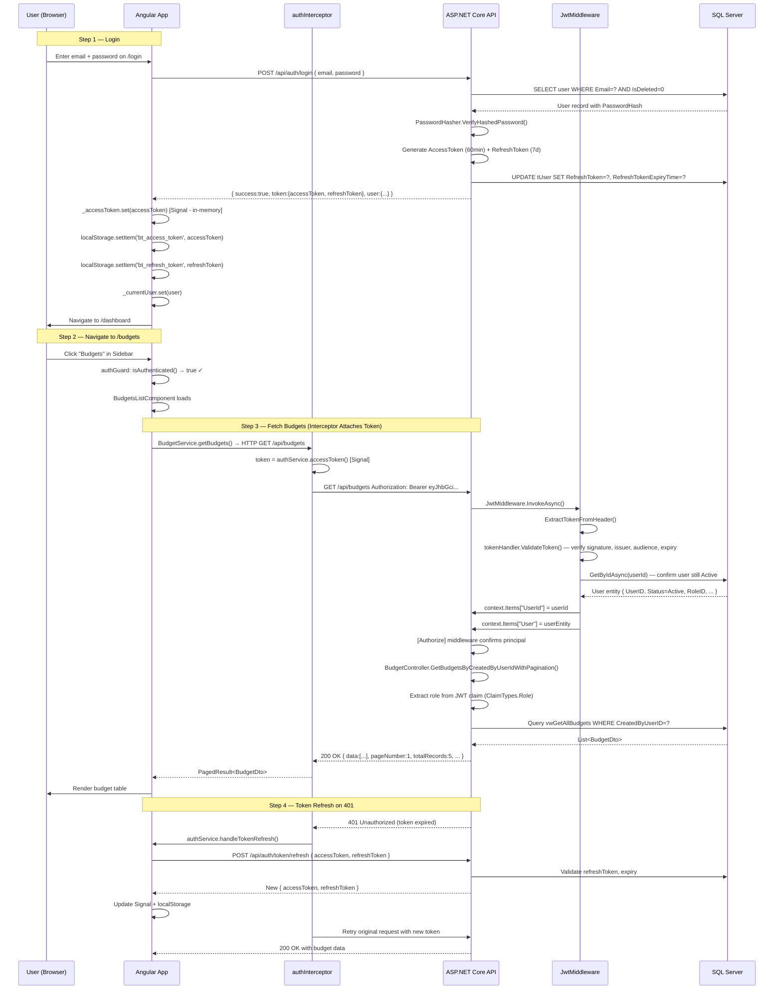
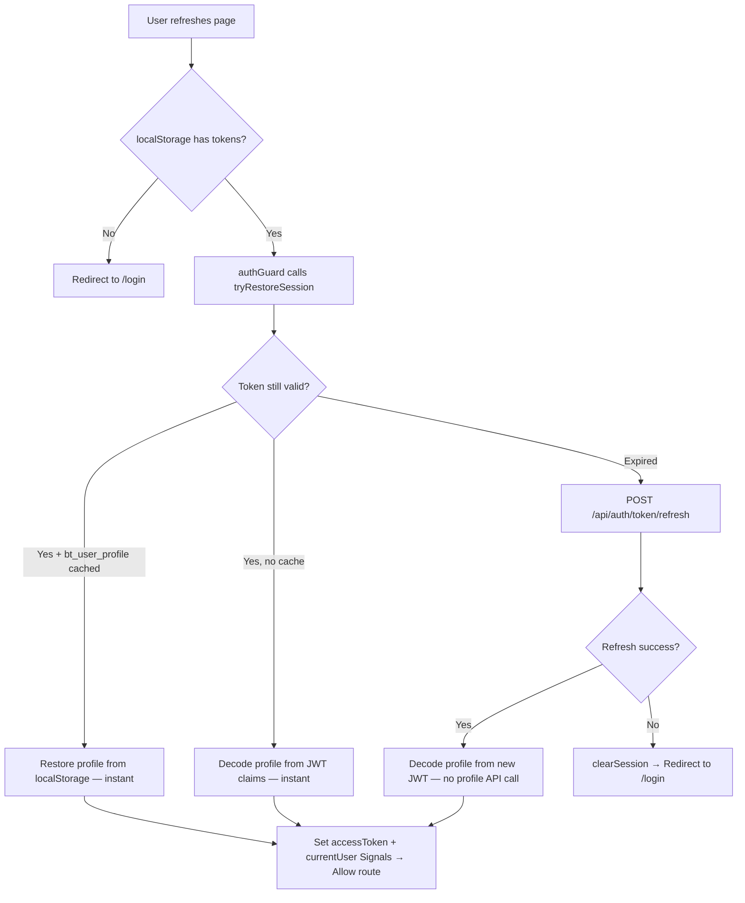
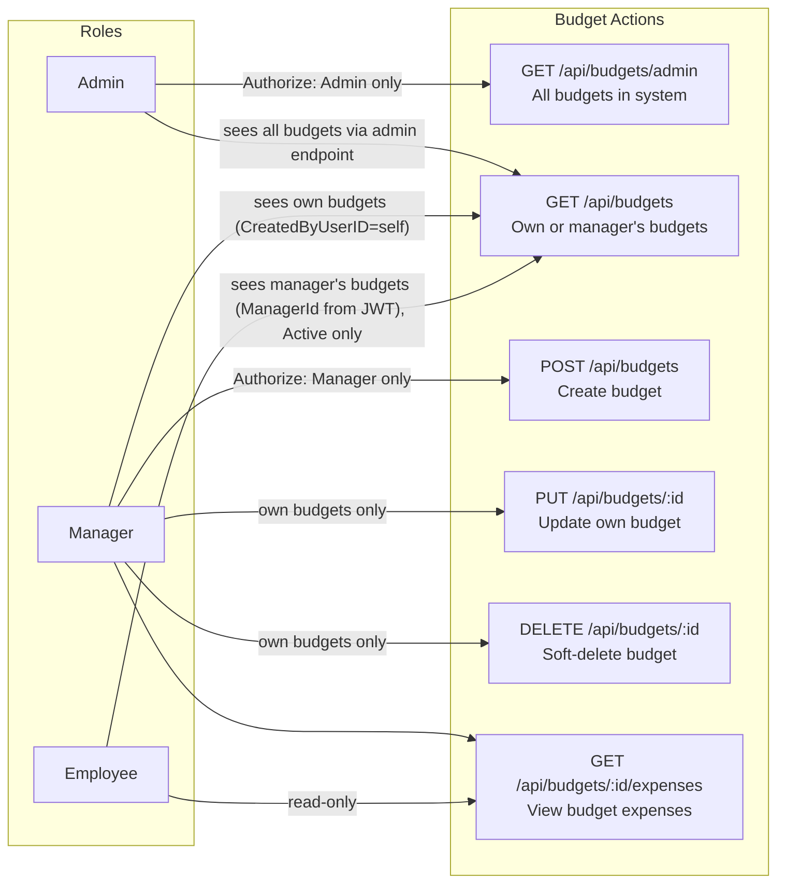
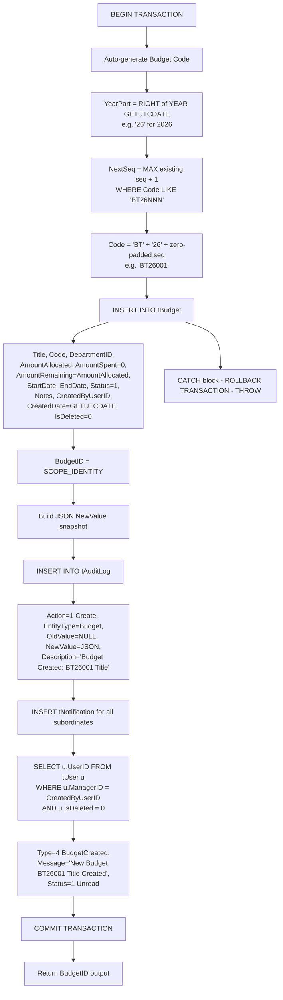
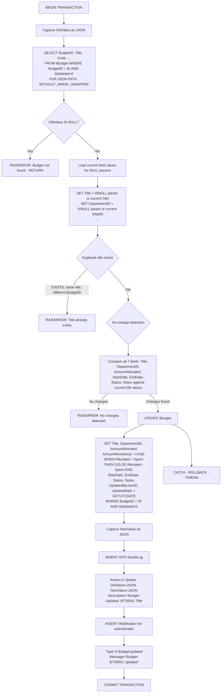
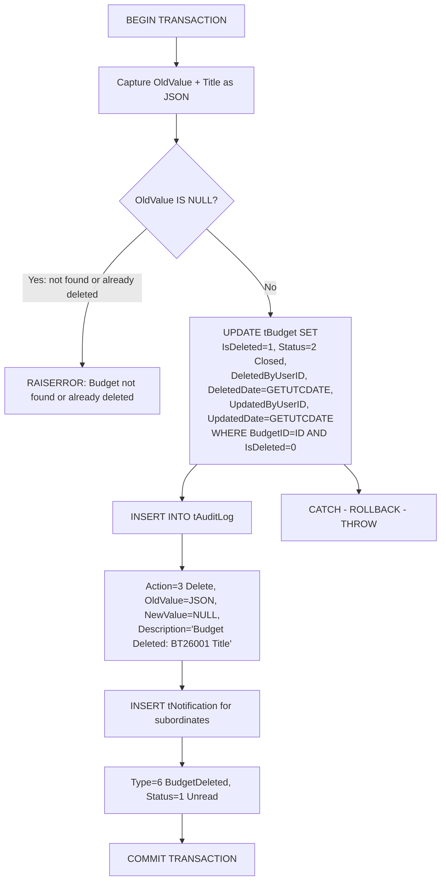
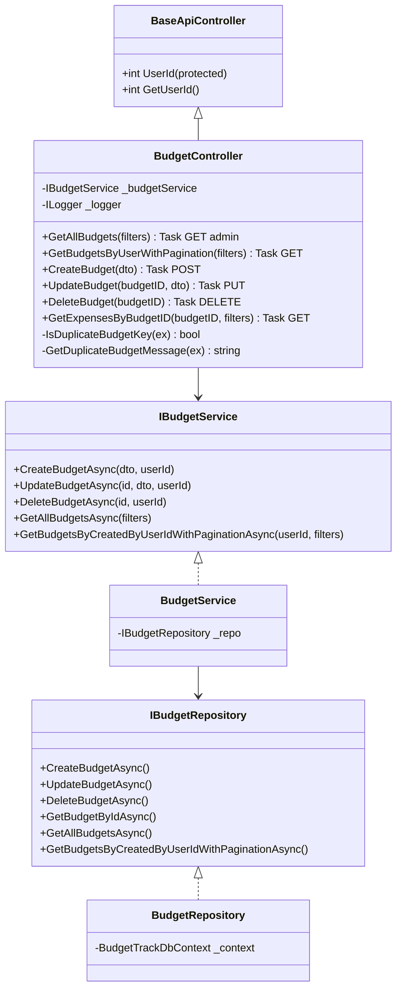
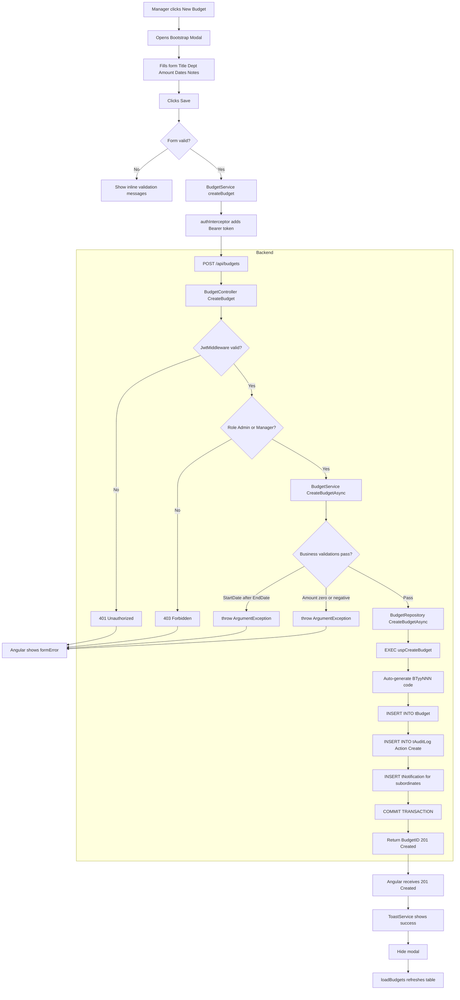
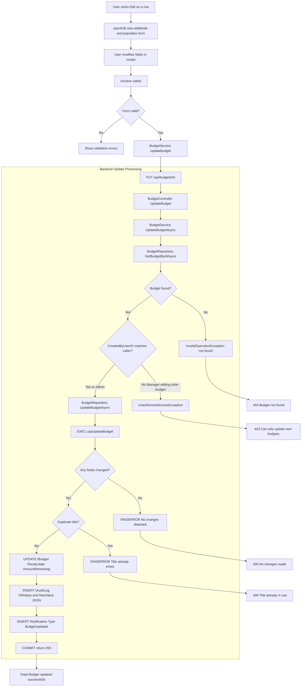
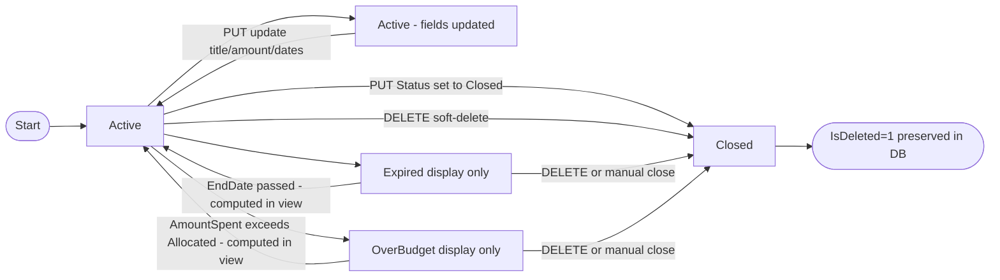

# Budget Module — Complete Documentation

> **Stack:** ASP.NET Core 10 · Entity Framework Core 10 · SQL Server Stored Procedures · Angular 21 · Bootstrap 5  
> **Base URL:** `http://localhost:5131`  
> **Generated:** 2026-03-07

---

## Table of Contents

1. [Module Overview](#1-module-overview)
2. [Authentication & Authorization Flow](#2-authentication--authorization-flow)
3. [Role-Based Access Control in Budget Module](#3-role-based-access-control-in-budget-module)
4. [Database Layer — Budget.sql](#4-database-layer--budgetsql)
5. [Entity & DTOs](#5-entity--dtos)
6. [Repository Layer](#6-repository-layer)
7. [Service Layer](#7-service-layer)
8. [Controller Layer](#8-controller-layer)
9. [Complete API Reference](#9-complete-api-reference)
10. [Angular Frontend](#10-angular-frontend)
11. [End-to-End Data Flow Diagrams](#11-end-to-end-data-flow-diagrams)
12. [Budget Lifecycle State Machine](#12-budget-lifecycle-state-machine)

---

## 1. Module Overview

The **Budget Module** is the central financial planning unit in BudgetTrack. It allows **Admins** and **Managers** to allocate funds to departments for specific time periods. **Employees** can view budgets linked to their manager and submit expenses against them.

### What the Budget Module Does

| Capability            | Description                                                               |
| --------------------- | ------------------------------------------------------------------------- |
| Create Budget         | Admin/Manager creates a budget with title, amount, dates, department      |
| Auto-Code Generation  | Budget code is auto-generated as `BTyyNNN` (e.g., `BT26001`)              |
| View Budgets          | Role-filtered — Admin sees all, Manager sees own, Employee sees manager's |
| Update Budget         | Modify title, amount, dates, status, notes — with change detection        |
| Soft Delete           | Mark budget as deleted (`IsDeleted=1`, `Status=Closed`); data preserved   |
| Utilization Tracking  | `AmountSpent`, `AmountRemaining`, `UtilizationPercentage` tracked live    |
| Expiry Detection      | `IsExpired` flag computed from `EndDate < NOW()`                          |
| Over-Budget Detection | `IsOverBudget` flag when `AmountSpent > AmountAllocated`                  |
| Notifications         | All subordinates notified on budget create/update/delete                  |
| Audit Logging         | Full JSON snapshots of old/new state logged to `tAuditLog`                |
| Linked Expenses       | Drill-down into all expenses under a specific budget                      |

---

## 2. Authentication & Authorization Flow

Every API request to the Budget module requires a valid JWT Bearer token. Here is the complete flow from login to budget access:



### JWT Token Claims

When a user logs in, the following claims are embedded in the JWT:

| Claim Type                  | Example Value     | Used For                                                 |
| --------------------------- | ----------------- | -------------------------------------------------------- |
| `ClaimTypes.NameIdentifier` | `5`               | `UserId` in BaseApiController                            |
| `ClaimTypes.Email`          | `mgr@company.com` | Identity                                                 |
| `ClaimTypes.Role`           | `Manager`         | `[Authorize(Roles="...")]` checks                        |
| `EmployeeId`                | `MGR2601`         | Display purposes                                         |
| `ManagerId`                 | `5`               | Employee sees manager's budgets (set on Employee tokens) |

### Token Storage Strategy

| Token                  | Storage                          | Duration   | Why                                                        |
| ---------------------- | -------------------------------- | ---------- | ---------------------------------------------------------- |
| Access Token           | Angular Signal + localStorage    | 60 minutes | In-memory = XSS-safe; localStorage = survives page refresh |
| Refresh Token          | localStorage only                | 7 days     | Persistent for session restore                             |
| User Profile           | localStorage (`bt_user_profile`) | Session    | Enables instant restore on refresh — no API call needed    |
| Refresh Token (server) | `tUser.RefreshToken` column      | 7 days     | Server revocation on logout                                |

### Session Restore on Page Refresh

> **SSG note:** All static routes (including authenticated ones) are `RenderMode.Prerender` in `app.routes.server.ts`. Components use `isPlatformBrowser()` in `ngOnInit` to skip API calls during prerender. Session restore runs entirely in the browser from localStorage/JWT — no backend needed on refresh.



---

## 3. Role-Based Access Control in Budget Module



### Access Logic in Code

```
GET /api/budgets  (BudgetController)
│
├── Extract role from JWT: ClaimTypes.Role
├── IF role == "Employee"
│    └── Extract ManagerId from JWT claim "ManagerId"
│    └── createdByUserId = managerID (see their manager's budgets)
├── IF role == "Manager"
│    └── createdByUserId = UserId (own budgets)
│
└── IF Manager/Employee → calls GetBudgetsByCreatedByUserIdWithPaginationAsync(createdByUserId, filters)
                          [vwGetAllBudgets — non-deleted only]
```

---

## 4. Database Layer — Budget.sql

The entire Budget module database logic is implemented in `Database/Budget-Track/Budget.sql`. It contains **2 Views** and **3 Stored Procedures**.

---

### 4.1 `vwGetAllBudgetsAdmin` — Admin View

**Purpose:** Returns ALL budgets including soft-deleted ones. Used exclusively by the admin endpoint.

```sql
CREATE OR ALTER VIEW vwGetAllBudgetsAdmin AS
SELECT
    b.BudgetID, b.Title, b.Code,
    b.DepartmentID, d.DepartmentName,
    b.AmountAllocated, b.AmountSpent, b.AmountRemaining,
    -- Calculated: utilization % from actual spend vs allocation
    CASE WHEN b.AmountAllocated > 0
         THEN (b.AmountSpent / b.AmountAllocated) * 100
         ELSE 0
    END AS UtilizationPercentage,
    b.StartDate, b.EndDate, b.Status,
    CASE b.Status
        WHEN 1 THEN 'Active'
        WHEN 2 THEN 'Closed'
    END AS StatusName,
    b.Notes,
    b.CreatedByUserID,
    CONCAT(u.FirstName, ' ', u.LastName) AS CreatedByName,
    u.EmployeeID AS CreatedByEmployeeID,
    b.CreatedDate, b.UpdatedDate, b.DeletedDate, b.DeletedByUserID,
    CONCAT(du.FirstName, ' ', du.LastName) AS DeletedByName,
    -- Calculated: days until end date (negative if expired)
    DATEDIFF(DAY, GETUTCDATE(), b.EndDate) AS DaysRemaining,
    -- Calculated: 1 if past end date
    CAST(CASE WHEN b.EndDate < GETUTCDATE() THEN 1 ELSE 0 END AS BIT) AS IsExpired,
    -- Calculated: 1 if spent exceeds allocated
    CAST(CASE WHEN b.AmountSpent > b.AmountAllocated THEN 1 ELSE 0 END AS BIT) AS IsOverBudget,
    b.IsDeleted
FROM tBudget b
INNER JOIN tUser u ON b.CreatedByUserID = u.UserID
INNER JOIN tDepartment d ON b.DepartmentID = d.DepartmentID
LEFT JOIN tUser du ON b.DeletedByUserID = du.UserID
-- No WHERE clause — includes deleted budgets
```

**Joins:**
- `INNER JOIN tUser u` — resolves creator name and employee ID
- `INNER JOIN tDepartment d` — resolves department name
- `LEFT JOIN tUser du` — resolves deleter name (nullable, hence LEFT JOIN)

**Computed Columns (not stored in DB):**

| Column                  | Formula                                  | Purpose               |
| ----------------------- | ---------------------------------------- | --------------------- |
| `UtilizationPercentage` | `(AmountSpent / AmountAllocated) * 100`  | Budget efficiency     |
| `StatusName`            | CASE on `Status` int                     | Human-readable label  |
| `DaysRemaining`         | `DATEDIFF(DAY, GETUTCDATE(), EndDate)`   | Time tracking         |
| `IsExpired`             | `EndDate < GETUTCDATE()`                 | Expiry flag (BIT)     |
| `IsOverBudget`          | `AmountSpent > AmountAllocated`          | Over-spend flag (BIT) |
| `CreatedByName`         | `CONCAT(FirstName, ' ', LastName)`       | Display name          |
| `DeletedByName`         | `CONCAT(du.FirstName, ' ', du.LastName)` | Nullable display name |

---

### 4.2 `vwGetAllBudgets` — Standard View (Non-Deleted)

**Purpose:** Same as Admin view but filters out soft-deleted records. Used by Manager and Employee endpoints.

```sql
CREATE OR ALTER VIEW vwGetAllBudgets AS
-- Identical SELECT to vwGetAllBudgetsAdmin
-- ...
WHERE b.IsDeleted = 0  -- Only active (non-deleted) budgets
```

**Difference:** Single `WHERE b.IsDeleted = 0` clause prevents deleted budgets from appearing in non-admin views.

---

### 4.3 `uspCreateBudget` — Create Stored Procedure

**Parameters:**

| Parameter          | Type           | Required   | Description                   |
| ------------------ | -------------- | ---------- | ----------------------------- |
| `@Title`           | NVARCHAR(200)  | ✅          | Budget title (must be unique) |
| `@DepartmentID`    | INT            | ✅          | FK to tDepartment             |
| `@AmountAllocated` | DECIMAL(18,2)  | ✅          | Total budget amount           |
| `@StartDate`       | DATETIME2      | ✅          | Budget period start           |
| `@EndDate`         | DATETIME2      | ✅          | Budget period end             |
| `@Status`          | INT            | Default: 1 | Always Active on create       |
| `@Notes`           | NVARCHAR(1000) | NULL       | Optional notes                |
| `@CreatedByUserID` | INT            | ✅          | Authenticated user's DB ID    |
| `@BudgetID`        | INT OUTPUT     | —          | Returns new BudgetID          |

**Step-by-Step Execution Flow:**



**Auto-Code Logic:**
```sql
-- Extract 2-digit year suffix
SET @YearPart = RIGHT(CAST(YEAR(GETUTCDATE()) AS NVARCHAR(4)), 2);  -- '26'
-- Find next sequential number for this year
SELECT @NextSeq = ISNULL(MAX(CAST(SUBSTRING(Code, 5, 3) AS INT)), 0) + 1
FROM tBudget WHERE Code LIKE 'BT' + @YearPart + '[0-9][0-9][0-9]';
-- e.g. BT26001, BT26002, BT26003 ...
SET @Code = 'BT' + @YearPart + RIGHT('000' + CAST(@NextSeq AS VARCHAR(10)), 3);
```

---

### 4.4 `uspUpdateBudget` — Update Stored Procedure

**Parameters:**

| Parameter          | Type           | Required | Description                         |
| ------------------ | -------------- | -------- | ----------------------------------- |
| `@BudgetID`        | INT            | ✅        | Target budget ID                    |
| `@Title`           | NVARCHAR(200)  | NULL     | New title (or NULL to keep current) |
| `@DepartmentID`    | INT            | NULL     | New department (or NULL to keep)    |
| `@AmountAllocated` | DECIMAL(18,2)  | NULL     | New amount (or NULL to keep)        |
| `@StartDate`       | DATETIME2      | NULL     | New start date                      |
| `@EndDate`         | DATETIME2      | NULL     | New end date                        |
| `@Status`          | INT            | ✅        | New status (1=Active, 2=Closed)     |
| `@Notes`           | NVARCHAR(1000) | NULL     | New notes                           |
| `@UpdatedByUserID` | INT            | ✅        | Authenticated user's ID             |

**Step-by-Step Execution with No-Change Detection:**



**Key behaviors:**
- `AmountRemaining` is **automatically recalculated** when `AmountAllocated` changes: `CASE WHEN Allocated < Spent THEN 0 ELSE Allocated - Spent END` — never goes negative
- No-change detection compares ALL 7 fields; if identical → `RAISERROR`
- Duplicate title check excludes the current budget (`BudgetID != @BudgetID`)
- JSON audit contains both old and new states for full diff tracking

---

### 4.5 `uspDeleteBudget` — Soft Delete Stored Procedure

**Parameters:**

| Parameter          | Type | Required | Description                     |
| ------------------ | ---- | -------- | ------------------------------- |
| `@BudgetID`        | INT  | ✅        | Budget to delete                |
| `@DeletedByUserID` | INT  | ✅        | Admin/Manager performing delete |

**Flow:**



**Important:** Data is NEVER physically deleted. The `WHERE b.IsDeleted = 0` clause in `vwGetAllBudgets` hides it from normal queries. Admin view (`vwGetAllBudgetsAdmin`) still shows it.

---

### 4.6 Audit Log JSON Examples

**On Create** (`tAuditLog.NewValue`):
```json
{
  "BudgetID": 7,
  "Title": "Q1 Operations",
  "Code": "BT26007",
  "DepartmentID": 1,
  "AmountAllocated": 500000.00,
  "AmountSpent": 0.00,
  "AmountRemaining": 500000.00,
  "StartDate": "2026-01-01T00:00:00",
  "EndDate": "2026-03-31T00:00:00",
  "Status": 1,
  "CreatedDate": "2026-03-05T18:07:00"
}
```

**On Update** (`tAuditLog.OldValue` → `tAuditLog.NewValue`):
```json
// OldValue
{"BudgetID":7,"Title":"Q1 Operations","AmountAllocated":500000.00,"Status":1,...}
// NewValue
{"BudgetID":7,"Title":"Q1 Operations Updated","AmountAllocated":600000.00,"AmountRemaining":600000.00,"Status":1,"UpdatedDate":"2026-03-05T18:30:00",...}
```

---

## 5. Entity & DTOs

### 5.1 `Budget` Entity (`Models/Entities/Budget.cs`)

```csharp
[Table("tBudget")]
[Index(nameof(DepartmentID))]
[Index(nameof(Title), IsUnique = true)]
[Index(nameof(Code), IsUnique = true)]
public class Budget
{
    [Key] public int BudgetID { get; set; }
    [Required][MaxLength(200)] public required string Title { get; set; }
    [MaxLength(50)] public string? Code { get; set; }
    [Required] public required int DepartmentID { get; set; }
    [Column(TypeName="decimal(18,2)")] public required decimal AmountAllocated { get; set; }
    [Column(TypeName="decimal(18,2)")] public decimal AmountSpent { get; set; } = 0;
    [Column(TypeName="decimal(18,2)")] public decimal AmountRemaining { get; set; } = 0;
    [Required] public required DateTime StartDate { get; set; }
    [Required] public required DateTime EndDate { get; set; }
    [Required] public required BudgetStatus Status { get; set; } = BudgetStatus.Active;
    [Required] public required int CreatedByUserID { get; set; }
    [MaxLength(1000)] public string? Notes { get; set; }
    [Required] public required DateTime CreatedDate { get; set; } = DateTime.UtcNow;
    public DateTime? UpdatedDate { get; set; }
    public int? UpdatedByUserID { get; set; }
    public bool IsDeleted { get; set; } = false;
    public DateTime? DeletedDate { get; set; }
    public int? DeletedByUserID { get; set; }
    // Navigation Properties
    public virtual Department Department { get; set; } = null!;
    public virtual User? CreatedByUser { get; set; }
    public virtual User? UpdatedByUser { get; set; }
    public virtual User? DeletedByUser { get; set; }
    public virtual ICollection<Expense> Expenses { get; set; } = new List<Expense>();
}
```

**Unique Indexes:** `IX_tBudget_Title`, `IX_tBudget_Code` — enforced at DB level.

---

### 5.2 `BudgetStatus` Enum

```csharp
public enum BudgetStatus
{
    Active = 1,
    Closed = 2
}
```

> **Note:** `Expired` and `OverBudget` are **computed display states** (not stored enum values). They are derived from `EndDate` and `AmountSpent` comparisons.

---

### 5.3 DTOs

**`BudgetDto`** — Response shape (from Views)

| Field                   | Type      | Source                                 |
| ----------------------- | --------- | -------------------------------------- |
| `BudgetID`              | int       | DB column                              |
| `Title`                 | string    | DB column                              |
| `Code`                  | string?   | DB column (auto-generated)             |
| `DepartmentID`          | int       | DB column                              |
| `DepartmentName`        | string    | JOIN tDepartment                       |
| `AmountAllocated`       | decimal   | DB column                              |
| `AmountSpent`           | decimal   | DB column (updated on expense approve) |
| `AmountRemaining`       | decimal   | DB column (= Alloc - Spent)            |
| `UtilizationPercentage` | decimal   | SQL computed                           |
| `StartDate`             | DateTime  | DB column                              |
| `EndDate`               | DateTime  | DB column                              |
| `Status`                | int       | DB column (1=Active, 2=Closed)         |
| `StatusName`            | string?   | SQL CASE                               |
| `Notes`                 | string?   | DB column                              |
| `CreatedByUserID`       | int       | DB column                              |
| `CreatedByName`         | string?   | JOIN tUser (CONCAT)                    |
| `CreatedByEmployeeID`   | string?   | JOIN tUser                             |
| `CreatedDate`           | DateTime  | DB column                              |
| `UpdatedDate`           | DateTime? | DB column                              |
| `DeletedDate`           | DateTime? | DB column                              |
| `DeletedByUserID`       | int?      | DB column                              |
| `DeletedByName`         | string?   | LEFT JOIN tUser (CONCAT)               |
| `DaysRemaining`         | int       | SQL DATEDIFF                           |
| `IsExpired`             | bool      | SQL BIT computed                       |
| `IsOverBudget`          | bool      | SQL BIT computed                       |
| `IsDeleted`             | bool      | DB column                              |

**`CreateBudgetDto`** — Create request (6 fields):
```csharp
public required string Title { get; set; }     // Required, max 200 chars
public int DepartmentID { get; set; }           // Required
public decimal AmountAllocated { get; set; }    // Required, > 0
public DateTime StartDate { get; set; }         // Required
public DateTime EndDate { get; set; }           // Required
public string? Notes { get; set; }              // Optional, max 1000 chars
```

**`UpdateBudgetDto`** — Update request (all nullable except Status):
```csharp
public string? Title { get; set; }
public int? DepartmentID { get; set; }
public decimal? AmountAllocated { get; set; }
public DateTime? StartDate { get; set; }
public DateTime? EndDate { get; set; }
public string? Notes { get; set; }
public BudgetStatus Status { get; set; }   // Required
```

**`BudgetFilterDto`** — Query filter params:
```csharp
public string? Title { get; set; }
public string? Code { get; set; }
public List<string>? Status { get; set; }
public bool? IsDeleted { get; set; }
public string? SortBy { get; set; } = "CreatedDate";
public string? SortOrder { get; set; } = "desc";
public int? PageNumber { get; set; }
public int? PageSize { get; set; }
```

---

## 6. Repository Layer

**Interface:** `IBudgetRepository`
```csharp
Task<int> CreateBudgetAsync(CreateBudgetDto dto, int createdByUserID);
Task UpdateBudgetAsync(int budgetID, UpdateBudgetDto dto, int updatedByUserID);
Task DeleteBudgetAsync(int budgetID, int deletedByUserID);
Task<BudgetDto?> GetBudgetByIdAsync(int budgetID);
Task<PagedResult<BudgetDto>> GetAllBudgetsAsync(BudgetFilterDto filters);
Task<PagedResult<BudgetDto>> GetBudgetsByCreatedByUserIdWithPaginationAsync(int createdByUserID, BudgetFilterDto filters);
```

**Implementation: `BudgetRepository`**

All write operations call stored procedures via `Database.ExecuteSqlRawAsync()`:

```csharp
// CREATE — calls uspCreateBudget, outputs new BudgetID
var budgetIDParam = new SqlParameter { ParameterName = "@BudgetID", Direction = ParameterDirection.Output };
await _context.Database.ExecuteSqlRawAsync(
    "EXEC dbo.uspCreateBudget @Title, @DepartmentID, @AmountAllocated, @StartDate, @EndDate, @Status, @Notes, @CreatedByUserID, @BudgetID OUTPUT",
    params...
);
return (int)budgetIDParam.Value;

// UPDATE — calls uspUpdateBudget
await _context.Database.ExecuteSqlRawAsync(
    "EXEC dbo.uspUpdateBudget @BudgetID, @Title, @DepartmentID, @AmountAllocated, @StartDate, @EndDate, @Status, @Notes, @UpdatedByUserID",
    params...
);

// DELETE — calls uspDeleteBudget
await _context.Database.ExecuteSqlRawAsync(
    "EXEC dbo.uspDeleteBudget @BudgetID, @DeletedByUserID",
    params...
);
```

Read operations query SQL Views directly via `Database.SqlQueryRaw<BudgetDto>()`:

```csharp
// Admin list query (includes deleted)
var sql = "SELECT * FROM dbo.vwGetAllBudgetsAdmin WHERE 1=1";
// + dynamic filters: Title LIKE, Code LIKE, Status IN, IsDeleted =
// + ORDER BY Title/Code/CreatedDate ASC/DESC
// + OFFSET n ROWS FETCH NEXT m ROWS ONLY

// Manager/Employee list query (no deleted)
var sql = "SELECT * FROM dbo.vwGetAllBudgets WHERE 1=1 AND CreatedByUserID = @CreatedByUserID";
```

**Pagination Logic:**
```
offset = (pageNumber - 1) * pageSize
sql += $" OFFSET {offset} ROWS FETCH NEXT {pageSize} ROWS ONLY"
return PagedResult<BudgetDto>.Create(items, pageNumber, pageSize, totalCount)
```

---

## 7. Service Layer

**Interface:** `IBudgetService`

```csharp
Task<int> CreateBudgetAsync(CreateBudgetDto dto, int createdByUserID);
Task UpdateBudgetAsync(int budgetID, UpdateBudgetDto dto, int updatedByUserID);
Task DeleteBudgetAsync(int budgetID, int deletedByUserID);
Task<PagedResult<BudgetDto>> GetAllBudgetsAsync(BudgetFilterDto filters);
Task<PagedResult<BudgetDto>> GetBudgetsByCreatedByUserIdWithPaginationAsync(int createdByUserID, BudgetFilterDto filters);
```

**Business Rules enforced in `BudgetService`:**

| Method              | Validation                        | Exception                     |
| ------------------- | --------------------------------- | ----------------------------- |
| `CreateBudgetAsync` | StartDate must be before EndDate  | `ArgumentException`           |
| `CreateBudgetAsync` | AmountAllocated must be > 0       | `ArgumentException`           |
| `CreateBudgetAsync` | DepartmentID must be > 0          | `ArgumentException`           |
| `CreateBudgetAsync` | Title cannot be blank             | `ArgumentException`           |
| `UpdateBudgetAsync` | Budget must exist (non-deleted)   | `InvalidOperationException`   |
| `UpdateBudgetAsync` | Caller must be creator (Managers) | `UnauthorizedAccessException` |
| `UpdateBudgetAsync` | If dates provided, start < end    | `ArgumentException`           |
| `UpdateBudgetAsync` | If amount provided, must be > 0   | `ArgumentException`           |

> **Note:** Admins bypass the creator-ownership check (`budget.CreatedByUserID != updatedByUserID`) because they are authorized by `[Authorize(Roles="Admin,Manager")]` — the controller does not pass admin edits through the ownership check path.

---

## 8. Controller Layer

**`BudgetController`** extends `BaseApiController` which provides:
```csharp
protected int UserId => int.Parse(User.FindFirst(ClaimTypes.NameIdentifier)!.Value);
```

All endpoints decorated with `[Route("api/budgets")]`.



**Duplicate Key Detection (in `BudgetController`):**
```csharp
private static bool IsDuplicateBudgetKey(Exception ex)
{
    var msg = ex.Message + (ex.InnerException?.Message ?? string.Empty);
    return msg.Contains("duplicate key", OrdinalIgnoreCase)
        || msg.Contains("IX_tBudget_Title", OrdinalIgnoreCase)
        || msg.Contains("IX_tBudget_Code", OrdinalIgnoreCase)
        || msg.Contains("already exists", OrdinalIgnoreCase);
}
```

---

## 9. Complete API Reference

> **Auth Header required on all endpoints:** `Authorization: Bearer <accessToken>`

---

### `GET /api/budgets/admin`

**Roles:** Admin only  
**View used:** `vwGetAllBudgetsAdmin` (includes deleted records)

**Query Parameters:**

| Parameter    | Type        | Default       | Description                    |
| ------------ | ----------- | ------------- | ------------------------------ |
| `title`      | string      | —             | Partial match filter           |
| `code`       | string      | —             | Partial match filter           |
| `status`     | List\<int\> | —             | `1`=Active, `2`=Closed         |
| `isDeleted`  | bool        | —             | `true`=show deleted only       |
| `sortBy`     | string      | `CreatedDate` | `Title`, `Code`, `CreatedDate` |
| `sortOrder`  | string      | `desc`        | `asc` or `desc`                |
| `pageNumber` | int         | `1`           | Page index                     |
| `pageSize`   | int         | `10`          | Max 100                        |

**Response `200 OK`:**
```json
{
  "data": [{
    "budgetID": 1,
    "title": "Engineering Operations",
    "code": "BT2601",
    "departmentID": 1,
    "departmentName": "Engineering",
    "amountAllocated": 5000000.00,
    "amountSpent": 1068348.00,
    "amountRemaining": 3931652.00,
    "utilizationPercentage": 21.37,
    "startDate": "2026-02-25T01:24:20",
    "endDate": "2027-02-25T01:24:20",
    "status": 1,
    "statusName": "Active",
    "notes": null,
    "createdByUserID": 2,
    "createdByName": "Sanika Anil",
    "createdByEmployeeID": "MGR2601",
    "createdDate": "2026-02-25T01:24:20",
    "updatedDate": "2026-02-25T06:26:11",
    "deletedDate": null,
    "deletedByUserID": null,
    "deletedByName": null,
    "daysRemaining": 365,
    "isExpired": false,
    "isOverBudget": false,
    "isDeleted": false
  }],
  "pageNumber": 1,
  "pageSize": 10,
  "totalRecords": 1,
  "totalPages": 1,
  "hasNextPage": false,
  "hasPreviousPage": false
}
```

**Status Codes:**

| Code  | When                              |
| ----- | --------------------------------- |
| `200` | Success                           |
| `401` | No/invalid token                  |
| `403` | Token valid but role is not Admin |
| `500` | Server error                      |

---

### `GET /api/budgets`

**Roles:** Manager, Employee  
**View used (by role):**
- Manager → `vwGetAllBudgets WHERE CreatedByUserID = {managerId}`
- Employee → `vwGetAllBudgets WHERE CreatedByUserID = {JWT.ManagerId}`

**Query Parameters:** Same as `/api/budgets/admin`

**Response:** Same structure as above

**Status Codes:**

| Code  | When                                                     |
| ----- | -------------------------------------------------------- |
| `200` | Success                                                  |
| `400` | Manager ID missing from token (Employee with no manager) |
| `401` | Not authenticated or role claim missing                  |
| `403` | Forbidden                                                |
| `500` | Server error                                             |

---

### `POST /api/budgets`

**Roles:** Manager only

**Request Body:**
```json
{
  "title": "Q1 2026 Operations",
  "departmentID": 1,
  "amountAllocated": 5000000.00,
  "startDate": "2026-01-01T00:00:00",
  "endDate": "2026-03-31T00:00:00",
  "notes": "Annual engineering budget"
}
```

**Field Validations:**

| Field             | Rule                                         |
| ----------------- | -------------------------------------------- |
| `title`           | Required, max 200 chars, **globally unique** |
| `departmentID`    | Required, must be valid department           |
| `amountAllocated` | Required, must be > 0                        |
| `startDate`       | Required, must be before `endDate`           |
| `endDate`         | Required                                     |
| `notes`           | Optional, max 1000 chars                     |

**Responses:**

`201 Created`:
```json
{ "success": true, "message": "Budget is created" }
```

`400 Bad Request` (validation):
```json
{
  "type": "https://tools.ietf.org/html/rfc9110#section-15.5.1",
  "title": "One or more validation errors occurred.",
  "status": 400,
  "errors": { "Title": ["Title is required."] }
}
```

`409 Conflict` (duplicate title):
```json
{ "success": false, "message": "Title already in use" }
```

`409 Conflict` (duplicate code — rare race condition):
```json
{ "success": false, "message": "Code already in use" }
```

---

### `PUT /api/budgets/{budgetID}`

**Roles:** Manager only (Managers can only update budgets they created)

**Route Param:** `budgetID` (int)

**Request Body:**
```json
{
  "title": "Q1 2026 Operations — Revised",
  "departmentID": 1,
  "amountAllocated": 6000000.00,
  "startDate": "2026-01-01T00:00:00",
  "endDate": "2026-03-31T00:00:00",
  "status": 1,
  "notes": "Revised after board approval"
}
```

**Responses:**

`200 OK`:
```json
{ "success": true, "message": "Budget is updated" }
```

`400 Bad Request` (no changes):
```json
{ "success": false, "message": "No changes made" }
```

`403 Forbidden` (Manager editing someone else's budget):
```json
{}
```

`404 Not Found`:
```json
{ "success": false, "message": "Budget not found" }
```

`409 Conflict`:
```json
{ "success": false, "message": "Title already in use" }
```

---

### `DELETE /api/budgets/{budgetID}`

**Roles:** Manager only  
**Effect:** Soft delete — sets `IsDeleted=1`, `Status=2 (Closed)`

**Route Param:** `budgetID` (int)

**Responses:**

`200 OK`:
```json
{ "success": true, "message": "Budget is deleted" }
```

`404 Not Found` (or already deleted):
```json
{ "success": false, "message": "Budget not found" }
```

---

### `GET /api/budgets/{budgetID}/expenses`

**Roles:** Admin, Manager, Employee

**Query Parameters:**

| Parameter               | Type   | Description              |
| ----------------------- | ------ | ------------------------ |
| `title`                 | string | Expense title filter     |
| `status`                | string | Expense status filter    |
| `categoryName`          | string | Category name filter     |
| `submittedUserName`     | string | Submitter name filter    |
| `submittedByEmployeeID` | string | Employee ID filter       |
| `sortBy`                | string | Default: `SubmittedDate` |
| `sortOrder`             | string | `asc` / `desc`           |
| `pageNumber`            | int    | Default: 1               |
| `pageSize`              | int    | Default: 10              |

**Response `200 OK`:**
```json
{
  "data": [{
    "expenseID": 1,
    "budgetID": 1,
    "budgetTitle": "Engineering Operations",
    "budgetCode": "BT2601",
    "categoryID": 4,
    "categoryName": "Cloud Infrastructure",
    "title": "Monthly Cloud Hosting",
    "amount": 109913.00,
    "merchantName": "HashiCorp Inc",
    "status": 1,
    "statusName": "Pending",
    "submittedDate": "2026-01-28T03:56:07",
    "submittedByUserID": 7,
    "submittedByUserName": "Shivali Sharma",
    "submittedByEmployeeID": "EMP2601"
  }],
  "pageNumber": 1,
  "pageSize": 10,
  "totalRecords": 5,
  "totalPages": 1,
  "hasNextPage": false,
  "hasPreviousPage": false
}
```

---

## 10. Angular Frontend

### Component: `BudgetsListComponent`

**File:** `Frontend/Budget-Track/src/app/features/budgets/budgets-list/budgets-list.component.ts`

#### Injected Dependencies

| Dependency          | Purpose                                                         |
| ------------------- | --------------------------------------------------------------- |
| `BudgetService`     | CRUD HTTP calls                                                 |
| `DepartmentService` | Populates department dropdown in form                           |
| `AuthService`       | Reads `isAdmin()`, `isManager()`, `userRole()`, `currentUser()` |
| `ToastService`      | Shows success/error toasts                                      |
| `RefreshService`    | Cross-component refresh event bus                               |
| `FormBuilder`       | Reactive form creation                                          |

#### Angular Signals Used

```typescript
loading = signal(true);           // Show loading spinner
saving = signal(false);           // Disable button during save
formError = signal('');           // Inline form error message
editMode = signal(false);         // Create vs Edit modal mode
selectedBudget = signal<BudgetDto | null>(null);  // Current row for edit/delete
data = signal<PagedResult<BudgetDto>>({...});     // Budget list response
departments = signal<DepartmentDto[]>([]);         // Dropdown data

// Computed KPI values from current page
totalBudgets = computed(() => this.data().totalRecords);
totalAllocated = computed(() => this.data().data.reduce((s,b) => s + b.amountAllocated, 0));
totalSpent = computed(() => this.data().data.reduce((s,b) => s + b.amountSpent, 0));
totalRemaining = computed(() => this.data().data.reduce((s,b) => s + b.amountRemaining, 0)); // Sums DB-stored AmountRemaining (capped at 0 by SP) — never negative

// Client-side derived list after applying Expired/OverBudget/Department filters
filteredData = computed(() => { ... });
```

#### Filter Strategy

The component uses a **hybrid filtering approach**:

| Filter                  | Where Applied                           | API Param         |
| ----------------------- | --------------------------------------- | ----------------- |
| Title search            | Backend SQL `LIKE '%?%'`                | `title=...`       |
| Code search             | Backend SQL `LIKE '%?%'`                | `code=...`        |
| Status = Active         | Backend `Status IN (1)`                 | `status=[1]`      |
| Status = Closed         | Backend `Status IN (2)`                 | `status=[2]`      |
| Status = Deleted        | Backend `IsDeleted=true`                | `isDeleted=true`  |
| Status = **Expired**    | **Client-side** `b.isExpired`           | Loads 500 records |
| Status = **OverBudget** | **Client-side** `b.isOverBudget`        | Loads 500 records |
| Department              | **Client-side** `b.departmentID === id` | Loads 500 records |

> **Why client-side for Expired/OverBudget?** These are **computed columns** in SQL views (not stored enums), so they cannot be filtered server-side with a SQL `WHERE` clause on an indexed column.

#### Form Validation (Reactive Forms)

**Create form:**
```typescript
this.budgetForm = this.fb.group({
  title:           ['', Validators.required],
  departmentID:    [deptId, Validators.required],
  amountAllocated: ['', [Validators.required, Validators.min(1)]],
  startDate:       ['', Validators.required],
  endDate:         ['', Validators.required],
  notes:           [''],
}, { validators: this.dateRangeValidator });
```

**Date range validator:**
```typescript
private dateRangeValidator(group: any) {
  const start = group.get('startDate')?.value;
  const end = group.get('endDate')?.value;
  if (start && end && new Date(start) >= new Date(end)) {
    return { dateRange: true };
  }
  return null;
}
```

#### Utilization Color Logic

```typescript
utilClass(p: number): string { return p >= 80 ? 'high' : p >= 50 ? 'medium' : 'low'; }
utilColor(p: number): string {
  if (p > 100) return 'var(--danger)';   // Red — over budget
  if (p >= 80) return 'var(--warning)';  // Orange — approaching limit
  return 'var(--success)';               // Green — healthy
}
```

#### Amount Formatting

```typescript
formatAmt(v: number): string {
  if (v >= 10_000_000) return `₹${(v / 10_000_000).toFixed(2)} Cr`;
  if (v >= 100_000)    return `₹${(v / 100_000).toFixed(2)} L`;
  return `₹${v.toLocaleString('en-IN')}`;
}
```

#### Bootstrap UI Components Used

| Component                                  | Usage                                                                             |
| ------------------------------------------ | --------------------------------------------------------------------------------- |
| `table table-hover table-responsive`       | Budget data grid                                                                  |
| `modal` (via `bootstrap.Modal`)            | Create/Edit and Delete confirmation dialogs                                       |
| `card card-body`                           | KPI summary tiles (Total, Allocated, Spent, Remaining)                            |
| `progress-bar`                             | Utilization percentage bar with dynamic colour                                    |
| `badge`                                    | Status badge (Active=green, Closed=secondary, Expired=warning, OverBudget=danger) |
| `form-control form-select`                 | All form inputs                                                                   |
| `invalid-feedback`                         | Inline validation messages                                                        |
| `btn btn-primary btn-danger btn-secondary` | Action buttons                                                                    |
| `d-none d-md-block`                        | Responsive column visibility                                                      |
| `dropdown`                                 | Filter controls                                                                   |

---

### Angular Service: `BudgetService`

**File:** `Frontend/Budget-Track/src/services/budget.service.ts`

```typescript
@Injectable({ providedIn: 'root' })
export class BudgetService {
  private http = inject(HttpClient);
  private apiUrl = environment.apiUrl; // http://localhost:5131

  // Admin only — vwGetAllBudgetsAdmin (includes deleted)
  getAdminBudgets(params): Observable<BudgetPagedResult>
    → GET /api/budgets/admin

  // Role-filtered — vwGetAllBudgets (non-deleted, creator-scoped)
  getBudgets(params): Observable<BudgetPagedResult>
    → GET /api/budgets

  createBudget(dto: CreateBudgetDto): Observable<ApiResponse>
    → POST /api/budgets

  updateBudget(budgetId: number, dto: UpdateBudgetDto): Observable<ApiResponse>
    → PUT /api/budgets/{budgetId}

  deleteBudget(budgetId: number): Observable<ApiResponse>
    → DELETE /api/budgets/{budgetId}
}
```

HTTP params are built via `HttpParams` builder — array values like `status` use `.append()` to support multi-value query strings:
```typescript
params.status.forEach(s => { p = p.append('status', s.toString()); });
// Produces: ?status=1&status=2
```

---

### TypeScript Models (`budget.models.ts`)

```typescript
export enum BudgetStatus { Active = 1, Closed = 2 }

export interface BudgetDto {
  budgetID: number; title: string; code: string;
  departmentID: number; departmentName: string;
  amountAllocated: number; amountSpent: number; amountRemaining: number;
  utilizationPercentage: number; startDate: string; endDate: string;
  status: number; statusName: string; notes: string | null;
  createdByUserID: number; createdByName: string; createdByEmployeeID: string;
  createdDate: string; updatedDate: string;
  daysRemaining: number; isExpired: boolean; isOverBudget: boolean; isDeleted: boolean;
}

export interface CreateBudgetDto {
  title: string; departmentID: number; amountAllocated: number;
  startDate: string; endDate: string; notes?: string;
}

export interface UpdateBudgetDto extends CreateBudgetDto { status: number; }

export interface BudgetListParams extends PaginationParams, SortParams {
  title?: string; code?: string; status?: number[];
  isDeleted?: boolean; departmentId?: number;
}

export type BudgetPagedResult = PagedResult<BudgetDto>;
```

---

## 11. End-to-End Data Flow Diagrams

### Create Budget Flow



### Update Budget Flow



---

## 12. Budget Lifecycle State Machine



**Status Values Reference:**

| DB Value              | Stored In           | Meaning                                 |
| --------------------- | ------------------- | --------------------------------------- |
| `Status = 1`          | `tBudget.Status`    | Active budget                           |
| `Status = 2`          | `tBudget.Status`    | Closed (manually or on delete)          |
| `IsExpired = true`    | **Computed** (View) | `EndDate < NOW()`                       |
| `IsOverBudget = true` | **Computed** (View) | `AmountSpent > AmountAllocated`         |
| `IsDeleted = true`    | `tBudget.IsDeleted` | Soft-deleted (hidden from normal views) |

---

*Budget Module Documentation — BudgetTrack v1.0 | Generated 2026-03-05*
