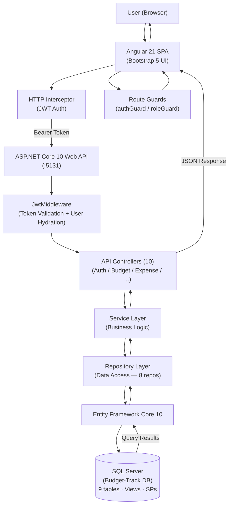
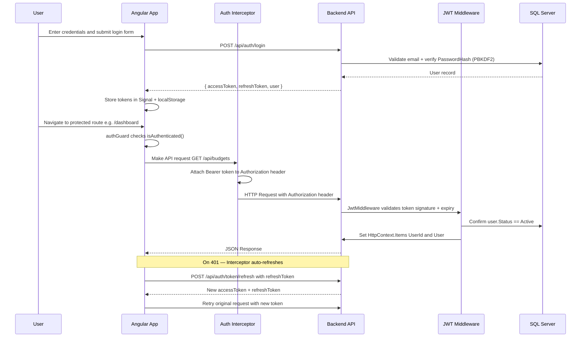

# BudgetTrack — Complete Technical Reference

> **Internal Budget Planning & Expense Management System**
> **Stack:** Angular 21 · ASP.NET Core 10 · Entity Framework Core 10 · SQL Server · Bootstrap 5
> **Last Updated:** 2026-03-07 · **Status:** Active Development

---

## Table of Contents

1. [What Is BudgetTrack?](#1-what-is-budgettrack)
2. [Business Problem](#2-business-problem)
3. [Key Features](#3-key-features)
4. [Tech Stack](#4-tech-stack)
5. [User Roles & Permissions](#5-user-roles--permissions)
6. [System Architecture](#6-system-architecture)
7. [Folder Structure](#7-folder-structure)
8. [Database Schema](#8-database-schema)
9. [Backend — Entities, Enums & DTOs](#9-backend--entities-enums--dtos)
10. [Backend — Controllers & Endpoints](#10-backend--controllers--endpoints)
11. [Backend — Services & Repositories](#11-backend--services--repositories)
12. [Authentication & Authorization](#12-authentication--authorization)
13. [Frontend Architecture](#13-frontend-architecture)
14. [Stored Procedures & Views](#14-stored-procedures--views)
15. [Dependencies & Libraries](#15-dependencies--libraries)
16. [Build & Run Instructions](#16-build--run-instructions)
17. [Design Patterns & Code Quality](#17-design-patterns--code-quality)

---

## 1. What Is BudgetTrack?

**BudgetTrack** is an enterprise-grade, full-stack web application for departmental budget planning and employee expense management. It provides a centralized, role-aware platform that replaces manual, spreadsheet-driven expense workflows with a structured digital process — from budget creation through expense submission all the way to manager approval and executive reporting.

Built with **Angular 21** standalone components (SSG), **ASP.NET Core 10** Web API, and **SQL Server** via EF Core 10.

---

## 2. Business Problem

| Problem | BudgetTrack Solution |
|---|---|
| Manual expense claims via email/spreadsheets | Structured digital expense submission with category tagging |
| No real-time budget utilization visibility | Live `AmountSpent` / `AmountRemaining` tracking per budget |
| Weak approval workflows & compliance risk | Manager-gated approval/rejection with full audit trail |
| Fragmented, delayed departmental reporting | On-demand period, department, and budget-level reports |
| No user access control | JWT-based role system: Admin / Manager / Employee |

---

## 3. Key Features

| # | Feature | Description |
|---|---|---|
| 1 | **JWT Auth with Token Rotation** | Secure login, access token (60 min), refresh token (7 days), automatic renewal via interceptor |
| 2 | **Role-Based UI & API** | Three roles (Admin, Manager, Employee) with dedicated views and scoped API access |
| 3 | **Budget Lifecycle Management** | Budgets flow through Active → Closed states with real-time spend tracking |
| 4 | **Expense Approval Workflow** | Employees submit; Managers approve or reject with comments; budget amounts update atomically via SP |
| 5 | **In-App Notifications** | Automatic alerts on expense submission, approval, rejection, and budget events — fanout inside SPs |
| 6 | **Audit Logging** | Immutable, searchable log of every create/update/delete action with old/new JSON value snapshots |
| 7 | **Analytics & Reports** | Chart.js dashboards + period, department, and budget-scoped reports |
| 8 | **Pagination, Filtering & Sorting** | All list views support server-side pagination, multi-field filtering, and sort-direction toggling |
| 9 | **Soft Delete** | Records are never permanently removed — flagged `IsDeleted = true` preserving full history |
| 10 | **SSG Prerendering** | Angular `outputMode: "static"` — all named routes prerendered at build time |
| 11 | **Code Auto-Generation** | Budget codes, Employee IDs, Category codes, Department codes auto-generated inside SPs |

---

## 4. Tech Stack

### Frontend

| Technology | Version | Purpose |
|---|---|---|
| Angular | 21.1.0 | SPA framework — standalone components, Signals, `@for`/`@if` |
| Angular SSR | ^21.2.0 | SSG — all static routes prerendered at build time |
| TypeScript | ~5.9.2 | Strongly-typed JavaScript |
| Bootstrap | ^5.3.8 | CSS layout & component library |
| Chart.js | ^4.5.1 | Dashboard & report charts (bar, doughnut, pie) |
| Font Awesome | ^7.2.0 | Icon library |
| RxJS | ~7.8.0 | Reactive streams & HTTP observables |
| Angular CLI | ^21.1.4 | Build toolchain |
| xlsx | ^0.18.5 | Excel export of tabular data |
| Vitest | ^4.0.8 | Unit testing |

### Backend

| Technology | Version | Purpose |
|---|---|---|
| ASP.NET Core Web API | .NET 10.0 | REST API server |
| Entity Framework Core | 10.0.2 | ORM / database access |
| SQL Server / LocalDB | — | Relational database |
| JWT Bearer Authentication | 10.0.2 | Stateless authentication (HMAC-SHA256) |
| ASP.NET Identity `PasswordHasher<T>` | built-in | PBKDF2 password hashing |
| Swashbuckle / Swagger | 6.5.0 | API documentation UI at `/swagger` |

---

## 5. User Roles & Permissions

| Role | Level | Key Capabilities |
|---|---|---|
| **Admin** | 1 | Register/update/delete users; manage departments & categories; view all budgets; view audit logs; generate period & department reports |
| **Manager** | 2 | Create/update/delete own budgets; approve or reject team expense submissions; view team; generate budget-level reports; receive notifications |
| **Employee** | 3 | Submit expenses against active budgets; view own expenses & notifications on status changes |

### Per-Role Feature Detail

**Admin**
- Create, update, and soft-delete users (Admin / Manager / Employee)
- Manage all departments and categories
- View all budgets (including deleted) with real-time utilization metrics
- Full audit log viewer with per-user drilldown
- Generate Period, Department, and Budget reports with charts

**Manager**
- Create and manage budgets for their department
- Approve or reject expenses submitted by their team
- View team member list and budget utilization
- Receive notifications for expense submissions

**Employee**
- Submit expenses against an active budget
- Track expense approval status (Pending / Approved / Rejected)
- View own budget allocations
- Receive notifications for approval decisions

**Common (All Roles)**
- Secure login with JWT access token + refresh token rotation
- Change own password
- View and update personal profile
- Real-time notification badge with mark-read / mark-all-read
- Dashboard with KPI cards and Chart.js visualizations

---

## 6. System Architecture

### Runtime Architecture



### Build-Time Architecture (SSG)

```
┌─────────────────────────────────────────────────────────┐
│              Angular CLI  (ng build)                    │
│                                                         │
│  app.routes.server.ts → RenderMode.Prerender (static)  │
│                       → RenderMode.Client   (dynamic)  │
│  outputMode: "static" → Prerenders all known routes    │
└──────────────────────────┬──────────────────────────────┘
                           │  Static HTML + JS + CSS
┌──────────────────────────▼──────────────────────────────┐
│           dist/Budget-Track/browser/                    │
│  index.html · per-route *.html · Deployable to CDN     │
└─────────────────────────────────────────────────────────┘
```

### Communication Details

| Concern | Detail |
|---|---|
| Protocol | HTTP REST (`HttpClient` with `withFetch()`) |
| Auth header | `Authorization: Bearer <access_token>` |
| Base URL | `http://localhost:5131` (dev) |
| CORS | `AllowAll` policy (dev) — restrict origins in production |
| SSG | Angular `outputMode: "static"` — all named routes prerendered at build time |
| Token refresh | `authInterceptor` catches 401, calls `/api/auth/token/refresh`, retries original request |

### Key Patterns

| Pattern | Description |
|---|---|
| Repository Pattern | Each entity has `IRepository` / `Implementation` pair; controllers never touch `DbContext` directly |
| Service Layer | Business logic isolated in `IService` / `Implementation`; repos injected via DI |
| Soft Delete | All major entities have `IsDeleted`, `DeletedDate`, `DeletedByUserID`; EF global query filters exclude them automatically |
| Audit Logging | Every create / update / delete action writes a row to `tAuditLog` with old/new JSON snapshots |
| JWT Flow | Login → `access_token` (60 min) + `refresh_token` (7 days stored in DB); `/api/auth/token/refresh` rotates both |

---

## 7. Folder Structure

### Repository Root

```
BudgetTrack/
├── Backend/
│   └── Budget-Track/          # ASP.NET Core 10 Web API (C#)
├── Database/
│   └── Budget-Track/          # Raw SQL scripts (9 .sql files)
├── Documentation/
│   ├── BudgetTrack.md         # This file — full technical reference
│   ├── ClassDiagram.md        # UML class diagrams
│   ├── SequenceDiagram.md     # Sequence diagrams by use case
│   ├── lld.md                 # Low-level design
│   ├── API/                   # Per-module API docs (9 .md files)
│   └── *.md                   # Domain docs (Auth, Budget, Expense, Category …)
├── Frontend/
│   └── Budget-Track/          # Angular 21 SPA (TypeScript)
└── README.md
```

### Backend Structure

```
Backend/Budget-Track/
├── Controllers/
│   ├── BaseApiController.cs        # Abstract base — extracts UserId from JWT context
│   ├── AuthController.cs           # Login, register, token refresh, user list/profile/update
│   ├── BudgetController.cs         # Budget CRUD + expense sub-list
│   ├── ExpenseController.cs        # Expense CRUD, stats, approval
│   ├── CategoryController.cs       # Category CRUD
│   ├── DepartmentController.cs     # Department CRUD
│   ├── UserController.cs           # User stats, managers list, employees, soft-delete
│   ├── NotificationController.cs   # Notification read/delete/unread-count
│   ├── AuditController.cs          # Audit log queries
│   └── ReportController.cs         # Period / department / budget reports
├── Data/
│   ├── BudgetTrackDbContext.cs      # EF Core DbContext — relations, indexes, global filters
│   └── DataSeeder.cs               # Seeds roles, departments, admin user
├── Middleware/
│   ├── JwtMiddleware.cs            # Validates JWT, attaches User & UserId to HttpContext.Items
│   └── JwtSettings.cs              # POCO: SecretKey, Issuer, Audience, expiry settings
├── Migrations/                     # EF Core auto-generated migration files
├── Models/
│   ├── Entities/                   # 9 EF Core entity classes
│   ├── DTOs/                       # 9 domain sub-folders with request/response DTOs
│   └── Enums/                      # Shared enum types
├── Repositories/
│   ├── Interfaces/                 # 8 repository interfaces
│   └── Implementation/             # 8 concrete repository classes
├── Services/
│   ├── Interfaces/                 # Service interfaces
│   └── Implementation/             # 9 service classes incl. JwtTokenService, AuthService
├── Program.cs                      # DI registration, middleware pipeline, startup
└── appsettings.json                # JWT config + DB connection string
```

**Layer responsibilities:**

| Layer | Responsibility |
|---|---|
| `Controllers` | Handle HTTP; extract JWT claims; delegate to services; return typed responses |
| `Services` | Implement business rules; orchestrate multiple repositories |
| `Repositories` | Execute EF Core queries + SP calls; abstract data access |
| `Models/Entities` | EF Core mapped classes — one per DB table |
| `Models/DTOs` | Strongly-typed request/response shapes; prevent over-posting |
| `Models/Enums` | Shared enum values stored as integers in the DB |
| `Data` | DbContext, model config (relationships, indexes, query filters), seeding |
| `Middleware` | Cross-cutting JWT concern applied before the controller pipeline |

### Frontend Structure

```
Frontend/Budget-Track/src/
├── app/
│   ├── app.routes.ts            # Lazy-loaded route definitions
│   ├── app.routes.server.ts     # SSG render mode per route
│   ├── app.config.ts            # Browser application config
│   ├── app.config.server.ts     # SSG server config
│   ├── auth/login/              # Login page component
│   ├── layout/
│   │   ├── shell/               # Root layout wrapper (sidebar + router-outlet)
│   │   ├── navbar/              # Top navigation bar (notification badge)
│   │   └── sidebar/             # Side navigation menu
│   ├── features/                # Feature components (one per domain)
│   │   ├── dashboard/           # KPI cards + Chart.js bar/doughnut charts
│   │   ├── budgets/             # Budget list, create/edit/delete modals
│   │   ├── expenses/            # Expense list, create, approve/reject modals
│   │   ├── categories/          # Category management
│   │   ├── departments/         # Department management
│   │   ├── users/               # User management (Admin/Manager)
│   │   ├── notifications/       # In-app notification centre
│   │   ├── audits/              # Audit log viewer (Admin only)
│   │   ├── reports/             # Period, department & budget reports
│   │   └── profile/             # User profile & password change
│   └── shared/
│       ├── components/          # confirm-modal, pagination, status-badge, toast-container, user-avatar
│       └── pipes/               # Custom Angular pipes
├── core/
│   ├── guards/
│   │   ├── auth.guard.ts        # Blocks unauthenticated users; restores session on refresh
│   │   └── role.guard.ts        # Factory guard — checks user role before route activation
│   ├── interceptors/
│   │   └── auth.interceptor.ts  # Attaches Bearer token; handles 401 token refresh & retry
│   └── services/
│       ├── auth.service.ts      # Login, logout, token signals, session restore
│       └── toast.service.ts     # Global toast notification service
├── models/                      # TypeScript interfaces mirroring backend DTOs
├── services/                    # Domain-specific HTTP services (8 files)
├── environments/                # environment.ts with apiUrl
├── main.ts                      # Browser bootstrap
├── main.server.ts               # SSG bootstrap
└── styles.css                   # Global CSS (variables, utility classes)
```

---

## 8. Database Schema

### Tables

| Table | SQL Name | Purpose |
|---|---|---|
| Role | `tRole` | System roles: Admin (1), Manager (2), Employee (3) |
| Department | `tDepartment` | Organizational departments |
| User | `tUser` | All system users with role, dept, manager and auth fields |
| Budget | `tBudget` | Budget allocations by department with spend tracking |
| Category | `tCategory` | Expense categories (Travel, Software, Office Supply, etc.) |
| Expense | `tExpense` | Employee expense claims against a budget |
| Notification | `tNotification` | In-app notifications between users |
| Report | `tReport` | Generated report metadata + serialized metrics |
| AuditLog | `tAuditLog` | Immutable log of all user-triggered data changes |

### Column Details

**tUser**

| Column | Type | Constraints |
|---|---|---|
| UserID | int | PK, Identity |
| FirstName | nvarchar(50) | NOT NULL |
| LastName | nvarchar(50) | NOT NULL |
| EmployeeID | nvarchar(50) | NOT NULL, UNIQUE |
| Email | nvarchar(100) | NOT NULL, UNIQUE |
| PasswordHash | nvarchar(500) | NOT NULL |
| DepartmentID | int | FK → tDepartment, Indexed |
| RoleID | int | FK → tRole, Indexed |
| Status | int | Enum: Active=0, Inactive=1 |
| ManagerID | int | Self-ref FK → tUser, Nullable |
| RefreshToken | nvarchar(500) | Nullable |
| RefreshTokenExpiryTime | datetime2 | Nullable |
| LastLoginDate | datetime2 | Nullable |
| CreatedDate | datetime2 | NOT NULL |
| IsDeleted | bit | Default: 0 |
| DeletedDate / DeletedByUserID | datetime2 / int | Nullable |

**tBudget**

| Column | Type | Constraints |
|---|---|---|
| BudgetID | int | PK, Identity |
| Title | nvarchar(200) | NOT NULL, UNIQUE |
| Code | nvarchar(50) | UNIQUE, auto-generated `BT<YY><seq>` |
| DepartmentID | int | FK → tDepartment, Indexed |
| AmountAllocated | decimal(18,2) | NOT NULL |
| AmountSpent | decimal(18,2) | Default: 0 |
| AmountRemaining | decimal(18,2) | Default: 0 |
| StartDate | datetime2 | NOT NULL |
| EndDate | datetime2 | NOT NULL |
| Status | int | Enum: Active=1, Closed=2 |
| CreatedByUserID | int | FK → tUser |
| Notes | nvarchar(1000) | Nullable |
| IsDeleted | bit | Default: 0 |

**tExpense**

| Column | Type | Constraints |
|---|---|---|
| ExpenseID | int | PK, Identity |
| BudgetID | int | FK → tBudget, Indexed |
| CategoryID | int | FK → tCategory |
| Title | nvarchar(500) | NOT NULL, Indexed |
| Amount | decimal(18,2) | NOT NULL |
| MerchantName | nvarchar(200) | Nullable |
| SubmittedByUserID | int | FK → tUser |
| SubmittedDate | datetime2 | NOT NULL |
| Status | int | Enum: Pending=1, Approved=2, Rejected=3 |
| ManagerUserID | int | FK → tUser (Approver), Nullable |
| StatusApprovedDate | datetime2 | Nullable |
| RejectionReason | nvarchar(500) | Nullable |
| ApprovalComments | nvarchar(1000) | Nullable |
| IsDeleted | bit | Default: 0 |

**tNotification**

| Column | Type | Constraints |
|---|---|---|
| NotificationID | int | PK, Identity |
| SenderUserID | int | FK → tUser |
| ReceiverUserID | int | FK → tUser, Indexed |
| Type | int | Enum: 1-6 (see Enums section) |
| Message | nvarchar(500) | NOT NULL |
| Status | int | Enum: Unread=1, Read=2 |
| CreatedDate | datetime2 | NOT NULL |
| ReadDate | datetime2 | Nullable |
| RelatedEntityType | nvarchar(50) | Nullable |
| RelatedEntityID | int | Nullable |
| IsDeleted | bit | Default: 0 |

**tAuditLog**

| Column | Type | Constraints |
|---|---|---|
| AuditLogID | int | PK, Identity |
| UserID | int | FK → tUser (SetNull on delete), Nullable, Indexed |
| EntityType | nvarchar(50) | NOT NULL, Indexed |
| EntityID | int | NOT NULL |
| Action | int | Enum: Create=1, Update=2, Delete=3 |
| OldValue | nvarchar(max) | Nullable (JSON snapshot) |
| NewValue | nvarchar(max) | Nullable (JSON snapshot) |
| Description | nvarchar(500) | Nullable |
| CreatedDate | datetime2 | NOT NULL |

**tReport**

| Column | Type | Constraints |
|---|---|---|
| ReportID | int | PK, Identity |
| Title | nvarchar(200) | NOT NULL |
| Scope | int | Enum: Period, Department, Budget |
| Metrics | nvarchar(max) | Nullable (serialized JSON) |
| GeneratedDate | datetime2 | NOT NULL |
| GeneratedByUserID | int | FK → tUser |
| IsDeleted | bit | Default: 0 |

### ER Diagram

```mermaid
erDiagram
    tRole { int RoleID PK; nvarchar RoleName; bit IsActive }
    tDepartment { int DepartmentID PK; nvarchar DepartmentName; nvarchar DepartmentCode }
    tUser { int UserID PK; nvarchar EmployeeID; nvarchar Email; int DepartmentID FK; int RoleID FK; int ManagerID FK; int Status }
    tBudget { int BudgetID PK; nvarchar Code; int DepartmentID FK; decimal AmountAllocated; decimal AmountSpent; decimal AmountRemaining; int Status; int CreatedByUserID FK }
    tCategory { int CategoryID PK; nvarchar CategoryName; nvarchar CategoryCode }
    tExpense { int ExpenseID PK; int BudgetID FK; int CategoryID FK; decimal Amount; int SubmittedByUserID FK; int ManagerUserID FK; int Status }
    tNotification { int NotificationID PK; int SenderUserID FK; int ReceiverUserID FK; int Type; int Status }
    tAuditLog { int AuditLogID PK; int UserID FK; nvarchar EntityType; int EntityID; int Action }
    tReport { int ReportID PK; int Scope; int GeneratedByUserID FK }

    tRole ||--o{ tUser : "has role"
    tDepartment ||--o{ tUser : "belongs to"
    tDepartment ||--o{ tBudget : "funds"
    tUser ||--o{ tUser : "manages (self-ref)"
    tUser ||--o{ tBudget : "creates"
    tUser ||--o{ tExpense : "submits"
    tUser ||--o{ tExpense : "approves"
    tBudget ||--o{ tExpense : "covers"
    tCategory ||--o{ tExpense : "classifies"
    tUser ||--o{ tNotification : "sends"
    tUser ||--o{ tNotification : "receives"
    tUser ||--o{ tAuditLog : "logs action"
    tUser ||--o{ tReport : "generates"
```

---

## 9. Backend — Entities, Enums & DTOs

### Enums

| Enum | Values |
|---|---|
| `UserRole` | Admin = 1, Manager = 2, Employee = 3 |
| `UserStatus` | Active = 0, Inactive = 1 |
| `BudgetStatus` | Active = 1, Closed = 2 |
| `ExpenseStatus` | Pending = 1, Approved = 2, Rejected = 3 |
| `NotificationStatus` | Unread = 1, Read = 2 |
| `NotificationType` | ExpenseSubmitted=1, ExpenseApproved=2, ExpenseRejected=3, BudgetCreated=4, BudgetUpdated=5, BudgetDeleted=6 |
| `AuditAction` | Create = 1, Update = 2, Delete = 3 |
| `ReportScopeType` | Period, Department, Budget |
| `SortOrder` | Asc, Desc |

### Code Auto-Generation

| Entity | Format | Example |
|---|---|---|
| Budget | `BT<YY><seq>` | `BT26001` |
| Category | `CAT<seq:D3>` | `CAT007` |
| Department | `DEPT<seq:D3>` | `DEPT003` |
| Employee | `EMP<seq:D3>` | `EMP012` |
| Manager | `MGR<seq:D3>` | `MGR002` |

### DTO Folders

| Folder | Key DTOs |
|---|---|
| `User/` | `AdminUserRegisterDto`, `UpdateUserByAdminDto`, `UserLoginDto`, `ChangePasswordDto`, `UserListResponseDto`, `UserProfileDto` |
| `Budget/` | `CreateBudgetDto`, `UpdateBudgetDto`, `BudgetFilterDto`, `BudgetResponseDto` |
| `Expense/` | `CreateExpenseDTO`, `UpdateExpenseStatusDto`, `ExpenseFilterDto`, `ManagedExpenseFilterDto`, `AllExpenseDto`, `ExpenseStatisticsDto` |
| `Category/` | `CreateCategoryDto`, `UpdateCategoryDto`, `CategoryResponseDto` |
| `Department/` | `CreateDepartmentDto`, `UpdateDepartmentDto`, `DepartmentResponseDto` |
| `Notification/` | `GetNotificationDto`, `CreateNotificationDto` |
| `Report/` | `PeriodReportDto`, `DepartmentReportDto`, `BudgetReportDto` |
| `Audit/` | `AuditLogDto` |
| `Pagination/` | `PagedResult<T>` (Data, PageNumber, PageSize, TotalRecords, TotalPages) |

---

## 10. Backend — Controllers & Endpoints

> **Base URL:** `http://localhost:5131`
> **Auth Header:** `Authorization: Bearer <access_token>`

### Auth & User Endpoints

| Method | URL | Roles | Description |
|---|---|---|---|
| POST | `/api/auth/login` | Public | Login — returns access + refresh tokens |
| POST | `/api/auth/createuser` | Admin | Admin creates new user |
| POST | `/api/auth/changepassword` | Any | Authenticated user changes own password |
| POST | `/api/auth/token/refresh` | Public | Rotate access token using refresh token |
| POST | `/api/auth/logout` | Public | Revoke refresh token |
| GET | `/api/auth/verify` | Any | Confirm token is valid |
| GET | `/api/users/profile` | All | Get authenticated user's own profile |
| GET | `/api/users` | Admin, Manager | Paginated & filtered user list |
| PUT | `/api/users/{userId}` | Admin | Update user details |
| DELETE | `/api/users/{userId}` | Admin | Soft-delete user |
| GET | `/api/users/stats` | Admin | Count totals: total, active, by role |
| GET | `/api/users/managers` | All | List all managers |
| GET | `/api/users/{managerId}/employees` | All | Employees under a specific manager |

### Budget Endpoints

| Method | URL | Roles | Description |
|---|---|---|---|
| GET | `/api/budgets/admin` | Admin | All budgets including deleted (global view) |
| GET | `/api/budgets` | All authenticated | Budgets scoped to current user role |
| POST | `/api/budgets` | Admin, Manager | Create a new budget |
| PUT | `/api/budgets/{budgetID}` | Admin, Manager | Update budget |
| DELETE | `/api/budgets/{budgetID}` | Admin, Manager | Soft-delete budget |
| GET | `/api/budgets/{budgetID}/expenses` | All | Paginated expenses under a specific budget |

**Budget Scoping:**
- **Admin** → `/api/budgets/admin` — all budgets globally
- **Manager** → `/api/budgets` — budgets they created
- **Employee** → `/api/budgets` — budgets created by their manager (via `ManagerId` JWT claim)

### Expense Endpoints

| Method | URL | Roles | Description |
|---|---|---|---|
| GET | `/api/expenses/stats` | All | KPI statistics (counts by status, totals) |
| GET | `/api/expenses` | Admin | All expenses (global, paginated & filtered) |
| GET | `/api/expenses/managed` | Manager, Employee | Scoped expenses for current user's team |
| POST | `/api/expenses` | Manager, Employee | Submit a new expense claim |
| PUT | `/api/expenses/status/{expenseID}` | Manager | Approve or reject an expense |

**POST `/api/expenses` — Request:**
```json
{
  "budgetID": 5,
  "categoryID": 2,
  "title": "AWS Cloud Services - March",
  "amount": 1250.00,
  "merchantName": "Amazon Web Services",
  "notes": "Monthly cloud infrastructure cost"
}
```

**PUT `/api/expenses/status/{expenseID}` — Request:**
```json
{ "status": 2, "comments": "Approved as per Q1 budget", "reason": null }
```
Status values: `1 = Pending`, `2 = Approved`, `3 = Rejected`

### Category Endpoints

| Method | URL | Roles | Description |
|---|---|---|---|
| GET | `/api/categories` | All | List all active categories |
| POST | `/api/categories` | Admin, Manager | Create category |
| PUT | `/api/categories/{categoryID}` | Admin, Manager | Update category |
| DELETE | `/api/categories/{categoryID}` | Admin, Manager | Soft-delete category |

### Department Endpoints

| Method | URL | Roles | Description |
|---|---|---|---|
| GET | `/api/departments` | All | List all active departments |
| POST | `/api/departments` | Admin | Create department |
| PUT | `/api/departments/{departmentID}` | Admin | Update department |
| DELETE | `/api/departments/{departmentID}` | Admin | Soft-delete department |

### Notification Endpoints

| Method | URL | Roles | Description |
|---|---|---|---|
| GET | `/api/notifications` | Manager, Employee | Paginated notifications for current user |
| GET | `/api/notifications/unread-count` | Manager, Employee | Count of unread notifications |
| PUT | `/api/notifications/read/{notificationID}` | Manager, Employee | Mark one as read |
| PUT | `/api/notifications/readAll` | Manager, Employee | Mark all as read |
| DELETE | `/api/notifications/{notificationID}` | Manager, Employee | Soft-delete one notification |
| DELETE | `/api/notifications/deleteAll` | Manager, Employee | Soft-delete all notifications |

### Audit Endpoints

| Method | URL | Roles | Description |
|---|---|---|---|
| GET | `/api/audits` | Admin | Paginated audit logs (filter: `search`, `action`, `entityType`) |
| GET | `/api/audits/{userId}` | Admin | All audit logs for a specific user |

### Report Endpoints

| Method | URL | Roles | Description |
|---|---|---|---|
| GET | `/api/reports/period?startDate=&endDate=` | Admin | Budget summary for a date range |
| GET | `/api/reports/department?departmentName=` | Admin | Stats grouped by department |
| GET | `/api/reports/budget?budgetCode=` | Admin, Manager | Full budget detail with all expenses |

### Common Response Patterns

**Paginated Response (`PagedResult<T>`):**
```json
{
  "data": [...],
  "pageNumber": 1,
  "pageSize": 10,
  "totalRecords": 45,
  "totalPages": 5,
  "hasNextPage": true,
  "hasPreviousPage": false
}
```

**Error Response:**
```json
{ "success": false, "message": "Descriptive error message" }
```

---

## 11. Backend — Services & Repositories

### Services

| Service | Key Responsibilities |
|---|---|
| `AuthService` | Register user, login (validate password, issue tokens), change password, refresh token, revoke, update user |
| `JwtTokenService` | Generate access token (UserID/Email/Role/EmployeeId/ManagerId claims), generate refresh token, validate expired token |
| `BudgetService` | CRUD for budgets, ownership validation, pagination/filtering delegation |
| `ExpenseService` | Create expense, update status (triggers SP for budget recalculation), stats aggregation |
| `CategoryService` | CRUD with duplicate detection via SP |
| `DepartmentService` | CRUD with duplicate detection via SP |
| `NotificationService` | Get user notifications, mark read, delete, unread count |
| `AuditService` | Query audit logs paginated with entity/action filters |
| `ReportService` | Aggregate period, department, and budget-level metrics via SPs |

### Repositories

| Repository | Key Operations |
|---|---|
| `UserRepository` | GetByIdAsync, GetByEmailAsync, GetUserProfileByIdAsync, GetUsersListAsync, GetAllManagersAsync, GetEmployeesByManagerIdAsync, DeleteAsync |
| `BudgetRepository` | GetAllAsync (paginated), GetByCreatedByUserIdAsync, CreateAsync (SP), UpdateAsync (SP), DeleteAsync (SP) |
| `ExpenseRepository` | GetAllAsync, GetByBudgetIdAsync, GetManagedAsync, CreateAsync (SP), UpdateStatusAsync (SP) |
| `CategoryRepository` | GetAllAsync (SP), CreateAsync (SP), UpdateAsync (SP), DeleteAsync (SP) |
| `DepartmentRepository` | GetAllAsync (SP), CreateAsync (SP), UpdateAsync (SP), DeleteAsync (SP) |
| `NotificationRepository` | GetByReceiverIdAsync (SP), MarkReadAsync (SP), MarkAllReadAsync (SP), DeleteAsync, DeleteAllAsync, GetUnreadCountAsync |
| `AuditRepository` | GetAllPaginatedAsync, GetByUserIdAsync |
| `ReportRepository` | GetPeriodReportAsync (SP), GetDepartmentReportAsync (SP), GetBudgetReportAsync (3 SPs) |

---

## 12. Authentication & Authorization

### Authentication Flow



### JWT Configuration

| Setting | Value |
|---|---|
| Algorithm | HMAC SHA-256 (symmetric) |
| Issuer | `BudgetTrack` |
| Audience | `BudgetTrackUsers` |
| Access Token Expiry | 60 minutes |
| Refresh Token Expiry | 7 days |
| Access Token Storage | Angular Signal (in-memory) + `localStorage` key `bt_access_token` |
| Refresh Token Storage | `localStorage` key `bt_refresh_token` |
| User Profile Cache | `localStorage` key `bt_user_profile` (enables instant session restore without API call) |

### Claims Embedded in JWT

| Claim | Value |
|---|---|
| `ClaimTypes.NameIdentifier` | Numeric `UserID` (int) |
| `ClaimTypes.Email` | User email |
| `ClaimTypes.Role` | Role name: Admin / Manager / Employee |
| `EmployeeId` | Alphanumeric employee ID string |
| `ManagerId` | Manager's numeric UserID (present on Employee tokens) |

### Backend Authorization Attributes

```csharp
[Authorize(Roles = "Admin")]                      // Admin-only
[Authorize(Roles = "Admin,Manager")]              // Admin or Manager
[Authorize(Roles = "Manager")]                    // Manager only
[Authorize(Roles = "Manager,Employee")]           // Manager or Employee
[Authorize(Roles = "Admin,Manager,Employee")]     // Any authenticated user
[AllowAnonymous]                                  // Public (login, refresh, logout)
```

### Security Properties

- Passwords hashed with `PasswordHasher<User>` (PBKDF2 / HMAC-SHA256) via ASP.NET Identity
- `JwtMiddleware` validates token on every request AND checks `user.Status == Active` from DB — inactive users rejected even with valid token
- Global EF Core query filters (`IsDeleted == false`) ensure soft-deleted records are excluded from all queries automatically
- `AuditLog.UserID` uses `DeleteBehavior.SetNull` — audit trail survives user soft-deletion
- Soft-deleted users have their email and EmployeeID scrambled to free unique DB indexes

---

## 13. Frontend Architecture

### Application Bootstrap

Angular uses the **standalone component** architecture (no NgModules). `app.config.ts`:
- `provideRouter(routes, withRouterConfig(...))` — lazy-loaded routing with `paramsInheritanceStrategy: 'always'`
- `provideHttpClient(withFetch(), withInterceptors([authInterceptor]))` — fetch-based HTTP with functional interceptor
- `provideBrowserGlobalErrorListeners()` — global error handling

### Routing & Guards

| Path | Guards | Roles |
|---|---|---|
| `/` or `/login` | None (public) | — |
| `/dashboard` | `authGuard` | All |
| `/budgets` | `authGuard` | All |
| `/budgets/:id/expenses` | `authGuard` | All |
| `/expenses` | `authGuard` | All |
| `/categories` | `authGuard` + `roleGuard` | Admin, Manager |
| `/departments` | `authGuard` + `roleGuard` | Admin, Manager |
| `/reports` | `authGuard` + `roleGuard` | Admin, Manager |
| `/users` | `authGuard` + `roleGuard` | Admin, Manager |
| `/audits` | `authGuard` + `roleGuard` | Admin only |
| `/notifications` | `authGuard` + `roleGuard` | Manager, Employee |
| `/profile` | `authGuard` | All |
| `**` | — | Redirect to `/login` |

- **`authGuard`** — Checks `AuthService.isAuthenticated()`. On page refresh calls `tryRestoreSession()` which decodes JWT locally from localStorage without an API call. Only calls `/api/auth/token/refresh` if token is expired.
- **`roleGuard(...roles)`** — Factory function returning `CanActivateFn`. Redirects to `/dashboard` if authenticated but wrong role.

### SSG Rendering Strategy

| Route | Render Mode | Notes |
|---|---|---|
| `/`, `/login` | Prerender (SSG) | Public — no API calls |
| `/dashboard` through `/profile` | Prerender (SSG) | `ngOnInit` skips API calls via `isPlatformBrowser()` |
| `/budgets/:id/expenses` | Client-side only | Dynamic `:id` — unknown at build time |
| `**` | Client-side only | Catch-all redirect |

> **How refresh-without-logout works:** On page refresh, `authGuard` calls `tryRestoreSession()`. It checks `bt_user_profile` + decodes JWT locally — no API call. Only if the token is expired does it call `/api/auth/token/refresh`. The backend being down has zero effect on staying logged in.

Guards, the HTTP interceptor, and all feature components check `isPlatformBrowser(platformId)` before making any API call or accessing `localStorage`.

### Angular Services

| Service | File | Purpose |
|---|---|---|
| `AuthService` | `core/services/auth.service.ts` | Login, logout, token signals, session restore |
| `ToastService` | `core/services/toast.service.ts` | Global success/error toast notifications |
| `BudgetService` | `services/budget.service.ts` | Budget CRUD API calls |
| `ExpenseService` | `services/expense.service.ts` | Expense CRUD + stats |
| `CategoryService` | `services/category.service.ts` | Category CRUD |
| `DepartmentService` | `services/department.service.ts` | Department CRUD |
| `UserService` | `services/user.service.ts` | User management API calls |
| `NotificationService` | `services/notification.service.ts` | Notification read/delete/unread-count |
| `AuditService` | `services/audit.service.ts` | Audit log fetching |
| `ReportService` | `services/report.service.ts` | Period/department/budget reports |

### Angular Signals & State

Component state is managed with Angular Signals (`signal()`, `computed()`, `effect()`):
- `AuthService._accessToken` — signal holding the current JWT
- `AuthService._currentUser` — signal holding the logged-in user profile
- Feature components use local signals for loading state, paginated data, and filter values

### Shared Components

| Component | Purpose |
|---|---|
| `confirm-modal` | Reusable Bootstrap modal for delete/action confirmations |
| `pagination` | Generic pagination control bound to `PagedResult<T>` responses |
| `status-badge` | Color-coded badge for Pending/Approved/Rejected/Active/Closed states |
| `toast-container` | Renders stacked toast notifications from `ToastService` |
| `user-avatar` | Renders initials-based avatar circle |

### TypeScript Model Layer

Strongly-typed interfaces in `src/models/`:

`auth.models.ts` · `user.models.ts` · `budget.models.ts` · `expense.models.ts` · `category.models.ts` · `department.models.ts` · `audit.models.ts` · `notification.models.ts` · `report.models.ts` · `pagination.models.ts`

---

## 14. Stored Procedures & Views

### Views

| Name | Table | Description |
|---|---|---|
| `vwGetUserProfile` | `tUser` | Active users enriched with department name, role name, manager full name |
| `vwGetAllBudgetsAdmin` | `tBudget` | All budgets including soft-deleted; calculates `UtilizationPct`, `DaysRemaining`, `IsExpired`, `IsOverBudget` |
| `vwGetAllBudgets` | `tBudget` | Non-deleted budgets only; same enriched calculated fields |
| `vwGetAllExpenses` | `tExpense` | Non-deleted expenses joined with budget, category, submitter name, approver name, department |
| `vwGetExpensesByBudgetID` | `tExpense` | Same as above filtered to a specific `BudgetID` |

### Stored Procedures

| Procedure | Parameters | Description |
|---|---|---|
| `uspGetUserProfile` | `@UserId` | Returns single user profile from `vwGetUserProfile` |
| `uspGetUsersList` | `@PageNumber`, `@PageSize`, `@Role`, `@Status`, `@IsDeleted`, `@SearchTerm`, `@SortBy`, `@SortOrder` | Paginated, filterable user list with total count |
| `uspCreateBudget` | `@Title`, `@DepartmentID`, `@AmountAllocated`, `@StartDate`, `@EndDate`, `@CreatedByUserID`, `@Notes`, `@NewBudgetID OUTPUT` | Creates budget with auto-code `BT<YY><seq>`, writes audit log, notifies team employees |
| `uspUpdateBudget` | `@BudgetID`, `@Title`, `@AmountAllocated`, `@StartDate`, `@EndDate`, `@UpdatedByUserID`, `@Notes` | Updates budget, no-change detection, old/new audit log, notifies team |
| `uspDeleteBudget` | `@BudgetID`, `@DeletedByUserID` | Soft-deletes budget, writes audit log, notifies team |
| `uspCreateExpense` | `@BudgetID`, `@CategoryID`, `@Title`, `@Amount`, `@MerchantName`, `@SubmittedByUserID`, `@Notes`, `@NewExpenseID OUTPUT` | Creates expense, notifies manager, writes audit log |
| `uspUpdateExpenseStatus` | `@ExpenseID`, `@Status`, `@ApprovedByUserID`, `@Comments`, `@Reason` | Approves/rejects expense; updates `AmountSpent`/`AmountRemaining` on budget atomically; notifies submitter; writes audit log |
| `uspGetAllCategories` | — | All active categories ordered alphabetically |
| `uspCreateCategory` | `@CategoryName`, `@CreatedByUserID`, `@NewCategoryID OUTPUT` | Auto-codes `CAT<seq:D3>`, uniqueness check, writes audit log |
| `uspUpdateCategory` | `@CategoryID`, `@CategoryName`, `@UpdatedByUserID` | Updates category with before/after audit log, no-change detection |
| `uspDeleteCategory` | `@CategoryID`, `@DeletedByUserID` | Soft-deletes category, writes audit log |
| `uspGetAllDepartments` | — | All active departments ordered alphabetically |
| `uspCreateDepartment` | `@DepartmentName`, `@CreatedByUserID`, `@NewDepartmentID OUTPUT` | Auto-codes `DEPT<seq:D3>`, uniqueness check, writes audit log |
| `uspUpdateDepartment` | `@DepartmentID`, `@DepartmentName`, `@UpdatedByUserID` | Updates department, no-change detection, audit log |
| `uspDeleteDepartment` | `@DepartmentID`, `@DeletedByUserID` | Soft-deletes department, writes audit log |
| `uspGetNotificationsByReceiverUserId` | `@ReceiverUserID`, `@PageNumber`, `@PageSize`, `@Status`, `@SortOrder` | Paginated notifications for a user with read/unread filter |
| `uspMarkNotificationAsRead` | `@NotificationID`, `@ReceiverUserID` | Marks single notification read; validates ownership |
| `uspMarkAllNotificationsAsRead` | `@ReceiverUserID` | Marks all unread notifications as read for a user |
| `uspDeleteNotification` | `@NotificationID`, `@ReceiverUserID` | Soft-deletes single notification |
| `uspDeleteAllNotifications` | `@ReceiverUserID` | Soft-deletes all notifications for a user |
| `uspGetPeriodReport` | `@StartDate`, `@EndDate` | Budget summary filtered by date range (approved expenses only) |
| `uspGetDepartmentReport` | `@DepartmentName` | Budget & expense stats grouped by department with utilization percentages |
| `uspGetBudgetReport` | `@BudgetCode` | Budget header with manager info, AmountRemaining capped at 0 |
| `uspGetBudgetReportExpenseCounts` | `@BudgetCode` | Pending/Approved/Rejected counts + ApprovalRate for a budget |
| `uspGetBudgetReportExpenses` | `@BudgetCode` | Full expense list for a budget ordered by SubmittedDate DESC |

---

## 15. Dependencies & Libraries

### Backend NuGet Packages

| Package | Version | Purpose |
|---|---|---|
| `Microsoft.AspNetCore.Authentication.JwtBearer` | 10.0.2 | JWT Bearer token validation middleware |
| `Microsoft.EntityFrameworkCore.SqlServer` | 10.0.2 | EF Core SQL Server provider |
| `Microsoft.EntityFrameworkCore.Design` | 10.0.2 | EF Core design-time tools (migrations) |
| `Microsoft.EntityFrameworkCore.Tools` | 10.0.2 | `dotnet ef` CLI commands |
| `Swashbuckle.AspNetCore` | 6.5.0 | Swagger/OpenAPI UI at `/swagger` |
| `Microsoft.AspNetCore.Identity` | built-in | `PasswordHasher<User>` for password hashing |

**Target Framework:** `.NET 10.0`
**C# features used:** Nullable reference types (`#nullable enable`), pattern-matching exception filters, `required` keyword on entity properties

### Frontend npm Packages

| Package | Version | Purpose |
|---|---|---|
| `@angular/core` + ecosystem | ^21.1.0 | Angular standalone components, Signals, lazy routing |
| `@angular/ssr` | ^21.2.0 | SSG / server-side rendering |
| `@angular/forms` | ^21.1.0 | Template-driven & reactive forms |
| `bootstrap` | ^5.3.8 | CSS framework — grid, modals, tables, badges |
| `chart.js` | ^4.5.1 | Canvas-based bar & doughnut charts |
| `@fortawesome/fontawesome-free` | ^7.2.0 | Icon library |
| `rxjs` | ~7.8.0 | Observables, BehaviorSubject, switchMap |
| `xlsx` | ^0.18.5 | Excel export of tabular data |
| `typescript` | ~5.9.2 | Strongly-typed JavaScript |
| `vitest` | ^4.0.8 | Unit test runner |

**Angular architecture features used:**
- Standalone components (no NgModules)
- Angular Signals (`signal`, `computed`) for reactive auth state
- Functional route guards (`CanActivateFn`)
- HTTP functional interceptors (`HttpInterceptorFn`)
- `@if` / `@for` control-flow syntax
- Lazy-loaded routes (`loadComponent()`)

---

## 16. Build & Run Instructions

### Prerequisites

| Tool | Version | Notes |
|---|---|---|
| .NET SDK | 10.0+ | [dotnet.microsoft.com](https://dotnet.microsoft.com/download) |
| Node.js | 20+ LTS | [nodejs.org](https://nodejs.org) |
| npm | 11+ | Bundled with Node.js |
| Angular CLI | 21.x | `npm install -g @angular/cli@21` |
| SQL Server | 2019+ | LocalDB, Developer, or Express edition |
| EF Core Tools | 10.0.2 | `dotnet tool install --global dotnet-ef` |

### Backend Setup

```powershell
cd Backend\Budget-Track
dotnet restore
dotnet build

# Run — auto-migrates DB + seeds data on first run
dotnet run
# API:     http://localhost:5131
# Swagger: http://localhost:5131/swagger
```

> On first run `Program.cs` calls `context.Database.Migrate()` then `DataSeeder.SeedData(context)`,
> which creates all tables and seeds: default Roles (Admin, Manager, Employee), a default Department, and one Admin user.

### Frontend Setup

```powershell
cd Frontend\Budget-Track
npm install

# Development server
npm start
# OR
ng serve
# App: http://localhost:4200
```

### Default Login Credentials

| Role | Email | Password |
|---|---|---|
| Admin | `admin@budgettrack.com` | `Admin@123` |

### Environment Configuration

**Backend — `appsettings.json`:**
```json
{
  "Jwt": {
    "SecretKey": "your-super-secret-key-at-least-32-characters-long",
    "Issuer": "BudgetTrack",
    "Audience": "BudgetTrackUsers",
    "ExpirationMinutes": 60,
    "RefreshTokenExpirationDays": 7
  },
  "ConnectionStrings": {
    "DefaultConnection": "Server=(localdb)\\MSSQLLocalDB;Database=Budget-Track;Trusted_Connection=True;TrustServerCertificate=True;"
  }
}
```

**Frontend — `src/environments/environment.ts`:**
```typescript
export const environment = {
  production: false,
  apiUrl: 'http://localhost:5131'
};
```

### Production Build

```powershell
# Backend
cd Backend\Budget-Track
dotnet publish -c Release -o ./publish

# Frontend (SSG)
cd Frontend\Budget-Track
ng build --configuration production
# Output: dist/budget-track/browser/
# Deploy to: Nginx · Azure Static Web Apps · CDN · GitHub Pages
```

---

## 17. Design Patterns & Code Quality

### Design Patterns

| Pattern | Where Applied |
|---|---|
| **Repository Pattern** | `Repositories/` — abstracts data access; controllers never touch EF directly |
| **Service Layer Pattern** | `Services/` — business logic separated from HTTP concerns |
| **DTO Pattern** | `Models/DTOs/` — separate request/response contracts from EF entities (prevents over-posting) |
| **Middleware Pattern** | `JwtMiddleware` — cross-cutting JWT concern in the ASP.NET pipeline |
| **Factory Pattern** | `roleGuard(...roles)` — Angular guard factory function returning `CanActivateFn` |
| **Observer Pattern** | RxJS `BehaviorSubject` for token refresh queuing in `authInterceptor` |
| **Soft Delete Pattern** | `IsDeleted` flag on all major entities + EF Core global query filters |
| **Audit Trail Pattern** | `tAuditLog` records every create/update/delete with old/new JSON value snapshots |
| **Signal-based Reactivity** | Angular Signals (`signal`, `computed`) for auth state — replaces BehaviorSubject |
| **Stored Procedure Centricity** | Complex writes (Budget CRUD, Expense approval, Notifications) handled atomically inside SPs |

### EF Core — Global Query Filters

Soft-deleted records are transparently excluded at the `DbContext` level:

```csharp
modelBuilder.Entity<User>().HasQueryFilter(u => !u.IsDeleted);
modelBuilder.Entity<Budget>().HasQueryFilter(b => !b.IsDeleted);
modelBuilder.Entity<Expense>().HasQueryFilter(e => !e.IsDeleted);
// Applied to all soft-delete entities
```

Use `.IgnoreQueryFilters()` in repository methods that need to see deleted records (e.g., `GenerateEmployeeIdAsync`).

### Strengths

- ✅ Strong separation of concerns: Controller → Service → Repository → EF
- ✅ Consistent interface-based DI across all layers (fully testable)
- ✅ Global EF query filters for soft-delete applied uniformly
- ✅ Nullable reference types (`#nullable enable`) across all entities
- ✅ Self-referential User hierarchy (Manager → Employees) handled via navigation properties
- ✅ `DeleteBehavior.Restrict` on most FK relations prevents accidental cascades
- ✅ `AuditLog.UserID` uses `SetNull` — audit trails survive user deletions
- ✅ Functional Angular interceptors and guards — modern, tree-shakable
- ✅ Lazy-loaded routes reduce initial bundle size
- ✅ SSG prerendering with proper `isPlatformBrowser()` guards
- ✅ SP atomicity — notifications, audit logs, and balance updates committed in one transaction

### Known Issues & Recommendations

| # | Issue | Recommendation |
|---|---|---|
| 1 | JWT secret in `appsettings.json` | Use `dotnet user-secrets` locally; Azure Key Vault / env vars in production |
| 2 | CORS `AllowAll` policy | Lock to specific Angular origin(s) in production |
| 3 | Refresh token in `localStorage` | Move to `HttpOnly` cookie to reduce XSS attack surface |
| 4 | No unit/integration tests | Add xUnit tests for service layer; Vitest for Angular services |
| 5 | `UserController` injects `DbContext` directly | Move stats queries to `IUserRepository` to maintain layer separation |
| 6 | Exception message string-matching | Introduce custom exception classes (`BudgetNotFoundException`, etc.) |
| 7 | `AmountSpent`/`AmountRemaining` are denormalized | SP-managed for now — consider a DB computed column for hard guarantee |
| 8 | `app.UseSwagger()` outside dev check | Move both calls inside `if (IsDevelopment())` block |
| 9 | `environment.production = false` hard-coded | Update in CI/CD pipeline for production deployments |

### Performance Recommendations

1. Add composite DB indexes on frequently filtered columns: `(BudgetID, Status)` in `tExpense`
2. Cache-Control headers for infrequently-changing reference data (`/api/categories`, `/api/departments`)
3. Dynamic import `chart.js` only in the Dashboard component to reduce initial bundle size
4. Both backend (async/await) and frontend (Observables) are properly async — maintain this

### Security Recommendations

1. Rotate JWT secret key; store in secure vault (Azure Key Vault, AWS Secrets Manager)
2. Enable HTTPS enforcement and HSTS in production (`UseHttpsRedirection` already present)
3. Implement rate limiting on `/api/auth/login` to prevent brute-force attacks
4. Add Content Security Policy (CSP) headers on the static hosting layer
5. Sanitize AuditLog JSON blob inputs before storage

---

## Documentation Index

| File | Contents |
|---|---|
| [`BudgetTrack.md`](BudgetTrack.md) | **This file** — complete technical reference |
| [`API/AuthAPI.md`](API/AuthAPI.md) | Authentication & User management API details |
| [`API/BudgetAPI.md`](API/BudgetAPI.md) | Budget API details |
| [`API/ExpenseAPI.md`](API/ExpenseAPI.md) | Expense API details |
| [`API/CategoryAPI.md`](API/CategoryAPI.md) | Category API details |
| [`API/DepartmentAPI.md`](API/DepartmentAPI.md) | Department API details |
| [`API/NotificationAPI.md`](API/NotificationAPI.md) | Notification API details |
| [`API/ReportAPI.md`](API/ReportAPI.md) | Report API details |
| [`API/AuditAPI.md`](API/AuditAPI.md) | Audit log API details |
| [`ClassDiagram.md`](ClassDiagram.md) | Backend class & entity relationship diagrams |
| [`SequenceDiagram.md`](SequenceDiagram.md) | End-to-end sequence diagrams for 30 key use cases |
| [`lld.md`](lld.md) | Low-level design: service/repository method signatures |
| Domain `.md` files | Per-module detailed design (Budget, Expense, Auth, Category, Department, Notification, Audit, Report) |

---

*Generated from codebase analysis on 2026-03-07.*
