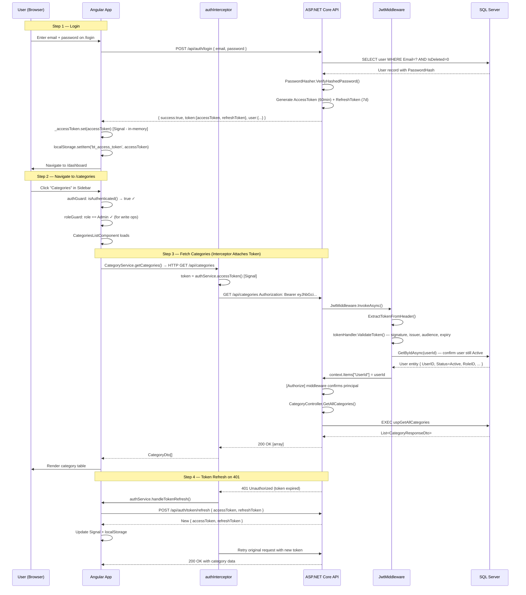
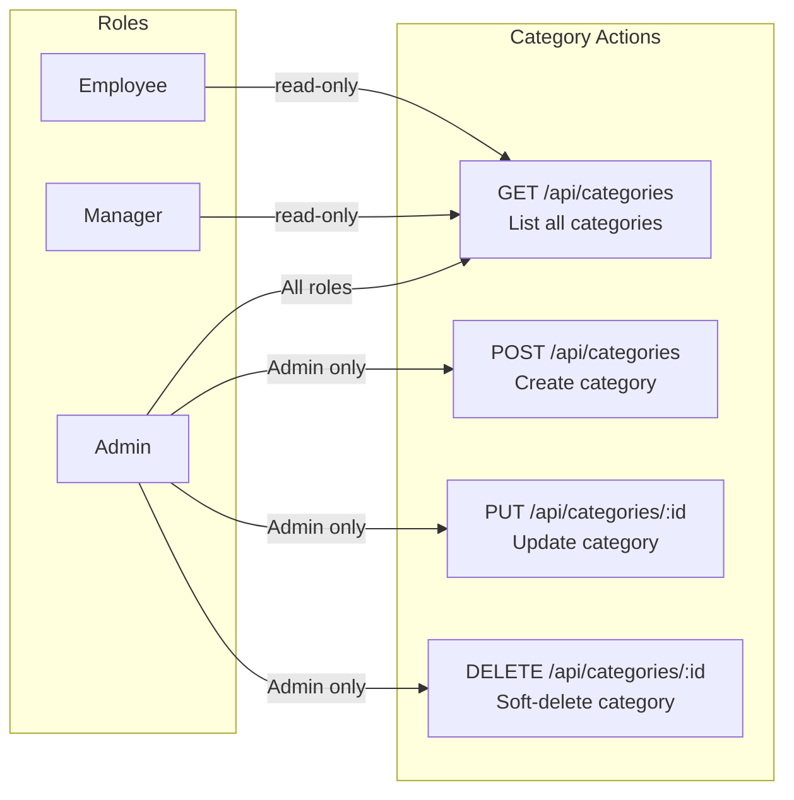
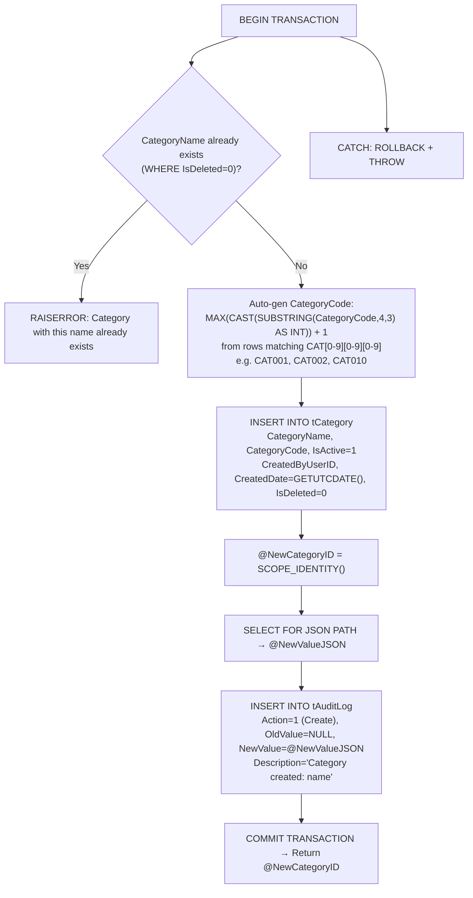
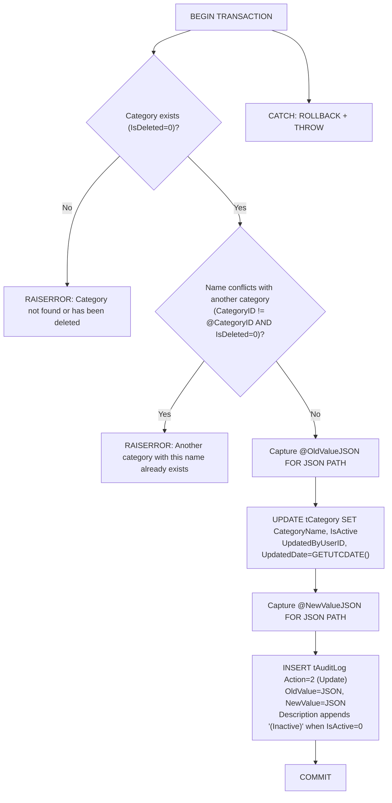
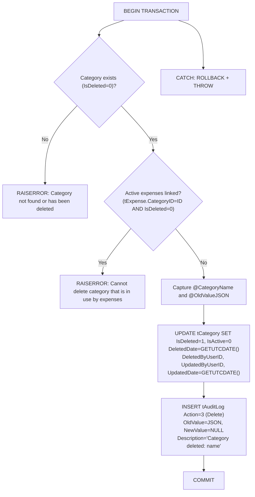
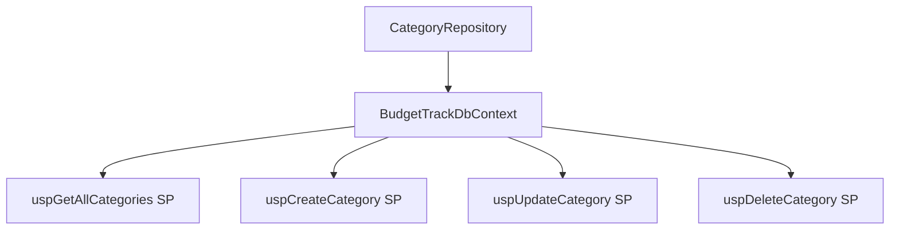
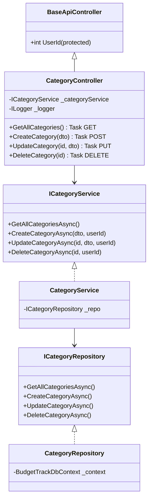
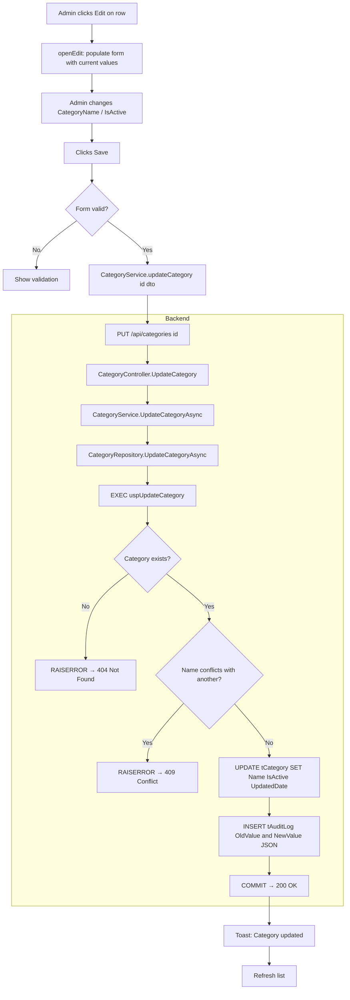
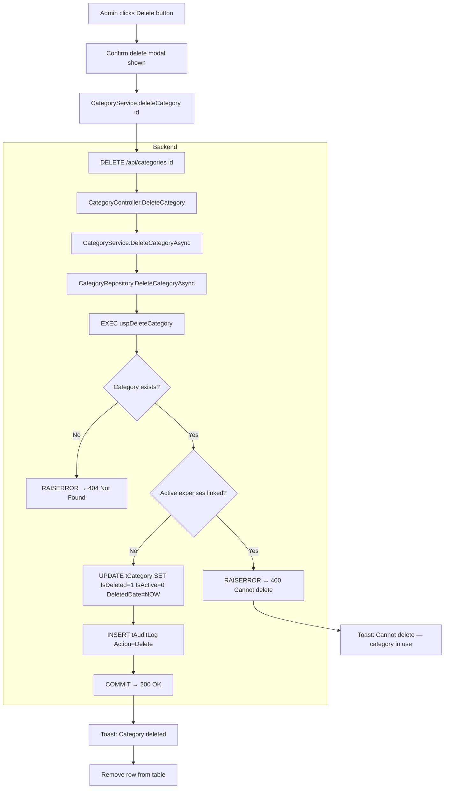
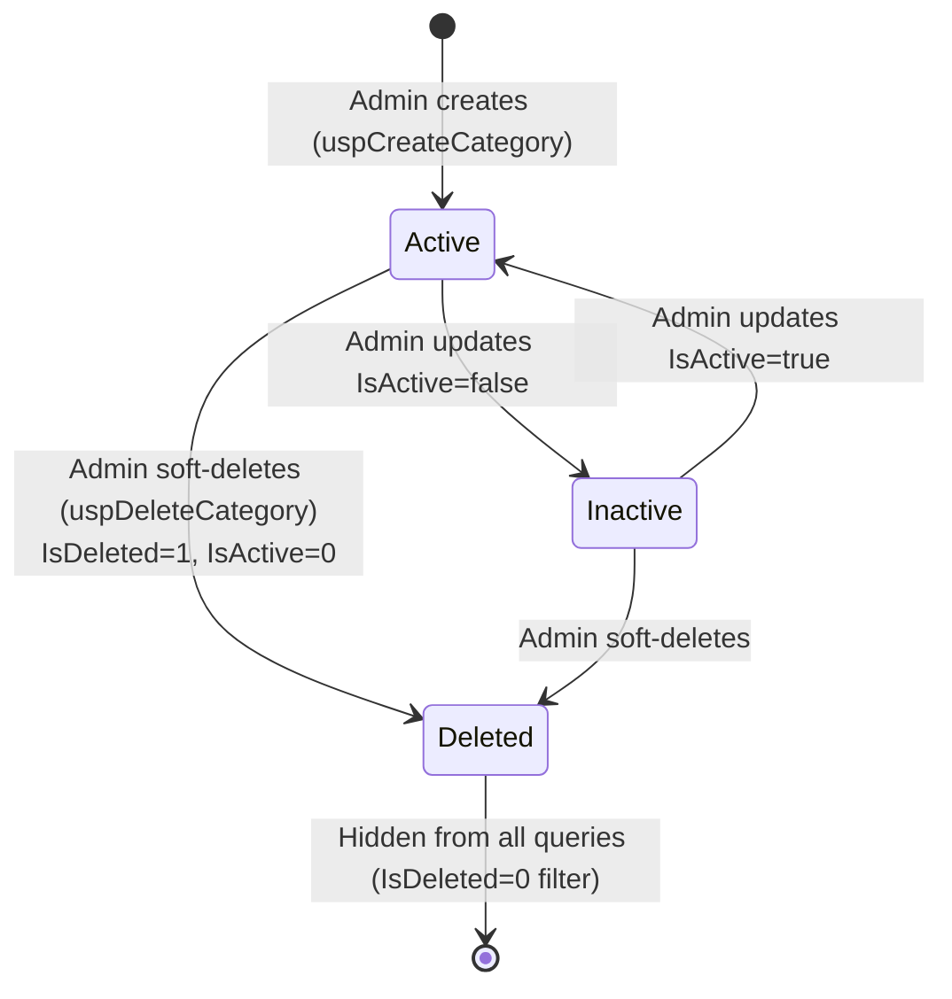

# Category Module — Complete Documentation

> **Stack:** ASP.NET Core 10 · Entity Framework Core 10 · SQL Server Stored Procedures · Angular 21 · Bootstrap 5
> **Base URL:** `http://localhost:5131`
> **Generated:** 2026-03-07

---

## Table of Contents

1. [Module Overview](#1-module-overview)
2. [Authentication & Authorization Flow](#2-authentication--authorization-flow)
3. [Role-Based Access Control](#3-role-based-access-control)
4. [Database Layer — Category.sql](#4-database-layer--categorysql)
5. [Entity & DTOs](#5-entity--dtos)
6. [Repository Layer](#6-repository-layer)
7. [Service Layer](#7-service-layer)
8. [Controller Layer](#8-controller-layer)
9. [Complete API Reference](#9-complete-api-reference)
10. [Angular Frontend](#10-angular-frontend)
11. [End-to-End Data Flow Diagrams](#11-end-to-end-data-flow-diagrams)
12. [Category Lifecycle State Machine](#12-category-lifecycle-state-machine)

---

## 1. Module Overview

The **Category Module** manages expense classification categories used across the system. Categories are system-level lookups — Admin-exclusive to create, update, and delete. All roles can view them (required when submitting expenses).

### What the Category Module Does

| Capability             | Description                                                                  |
| ---------------------- | ---------------------------------------------------------------------------- |
| List Categories        | All authenticated users view active categories for expense selection         |
| Create Category        | Admin creates a new category with unique name; auto-generates `CategoryCode` |
| Update Category        | Admin modifies category name and active status                               |
| Soft Delete            | Admin deletes a category; blocked if any active expenses are linked          |
| Auto-Code Generation   | `CategoryCode` auto-generated as `CAT001`, `CAT002`, ... (3-digit sequence)  |
| Uniqueness Enforcement | `CategoryName` and `CategoryCode` must be globally unique                    |
| Active Flag            | `IsActive` controls visibility in expense submission dropdowns               |
| Audit Logging          | Full JSON snapshots logged to `tAuditLog` on every mutation                  |

---

## 2. Authentication & Authorization Flow

Every API request to the Category module requires a valid JWT Bearer token.



### JWT Token Claims

| Claim Type                  | Example Value | Used For                       |
| --------------------------- | ------------- | ------------------------------ |
| `ClaimTypes.NameIdentifier` | `1`           | `UserId` in BaseApiController  |
| `ClaimTypes.Role`           | `Admin`       | `[Authorize(Roles="Admin")]`   |
| `ClaimTypes.Email`          | `a@co.com`    | Identity                       |
| `EmployeeId`                | `ADM2601`     | Display                        |

### Token Storage Strategy

| Token         | Storage                       | Duration   | Why                                                        |
| ------------- | ----------------------------- | ---------- | ---------------------------------------------------------- |
| Access Token  | Angular Signal + localStorage | 60 minutes | In-memory = XSS-safe; localStorage = survives page refresh |
| Refresh Token | localStorage only             | 7 days     | Persistent for session restore                             |

---

## 3. Role-Based Access Control



### Access Logic in Code

```
GET /api/categories   → [Authorize]          — all roles pass
POST /api/categories  → [Authorize(Roles="Admin")]
PUT /api/categories/:id  → [Authorize(Roles="Admin")]
DELETE /api/categories/:id → [Authorize(Roles="Admin")]
│
├── UserId extracted from JWT (ClaimTypes.NameIdentifier)
└── Passed as CreatedByUserID / UpdatedByUserID / DeletedByUserID to SP
```

---

## 4. Database Layer — Category.sql

The entire Category module database logic is in `Database/Budget-Track/Category.sql`. It contains **4 Stored Procedures**.

---

### 4.1 `uspGetAllCategories` — List All Categories

```sql
CREATE OR ALTER PROCEDURE uspGetAllCategories
AS
BEGIN
    SET NOCOUNT ON;
    SELECT CategoryID, CategoryName, CategoryCode, IsActive
    FROM tCategory
    WHERE IsDeleted = 0
    ORDER BY CategoryName ASC;
END
```

Returns only non-deleted categories, ordered alphabetically. No parameters.

---

### 4.2 `uspCreateCategory` — Create Stored Procedure

**Parameters:**

| Parameter         | Type           | Required | Description                       |
| ----------------- | -------------- | -------- | --------------------------------- |
| `@CategoryName`   | NVARCHAR(100)  | ✅        | Must be unique among non-deleted  |
| `@CreatedByUserID`| INT            | ✅        | Authenticated admin's DB ID       |
| `@NewCategoryID`  | INT OUTPUT     | —        | Returns new CategoryID            |

**Step-by-Step Execution Flow:**



**Auto-Code Logic:**
```sql
SELECT @NextSeq = ISNULL(MAX(CAST(SUBSTRING(CategoryCode, 4, 3) AS INT)), 0) + 1
FROM tCategory WHERE CategoryCode LIKE 'CAT[0-9][0-9][0-9]';
SET @CategoryCode = 'CAT' + RIGHT('000' + CAST(@NextSeq AS VARCHAR(10)), 3);
-- Produces: CAT001, CAT002, ..., CAT010, ...
```

---

### 4.3 `uspUpdateCategory` — Update Stored Procedure

**Parameters:**

| Parameter          | Type           | Required | Description                                       |
| ------------------ | -------------- | -------- | ------------------------------------------------- |
| `@CategoryID`      | INT            | ✅        | Target category                                   |
| `@CategoryName`    | NVARCHAR(100)  | ✅        | New name (must be unique excluding self)          |
| `@IsActive`        | BIT            | ✅        | Active/Inactive toggle                            |
| `@UpdatedByUserID` | INT            | ✅        | Authenticated admin's ID                          |

**Flow:**



---

### 4.4 `uspDeleteCategory` — Soft Delete Stored Procedure

**Parameters:**

| Parameter          | Type | Required | Description           |
| ------------------ | ---- | -------- | --------------------- |
| `@CategoryID`      | INT  | ✅        | Category to delete    |
| `@DeletedByUserID` | INT  | ✅        | Admin performing delete |

**Flow:**



> **Important:** Data is NEVER physically removed. `IsDeleted=1` hides the record from `uspGetAllCategories`. It also becomes invisible in expense dropdowns (`IsActive=0`).

---

### 4.5 Audit Log JSON Examples

**On Create** (`tAuditLog.NewValue`):
```json
{
  "CategoryID": 5,
  "CategoryName": "Software Licenses",
  "CategoryCode": "CAT005",
  "IsActive": true,
  "CreatedByUserID": 1,
  "CreatedDate": "2026-03-07T04:38:00"
}
```

**On Update** (`OldValue` → `NewValue`):
```json
// OldValue
{ "CategoryID": 5, "CategoryName": "Software Licenses", "IsActive": true }
// NewValue
{ "CategoryID": 5, "CategoryName": "Software & Licenses", "IsActive": false, "UpdatedDate": "2026-03-07T05:00:00" }
```

---

## 5. Entity & DTOs

### 5.1 `Category` Entity (`Models/Entities/Category.cs`)

```csharp
[Table("tCategory")]
[Index(nameof(CategoryName), IsUnique = true)]
[Index(nameof(CategoryCode), IsUnique = true)]
public class Category
{
    [Key] public int CategoryID { get; set; }
    [Required][MaxLength(100)] public required string CategoryName { get; set; }
    [MaxLength(50)] public string? CategoryCode { get; set; }
    [Required] public required bool IsActive { get; set; } = true;
    [Required] public required DateTime CreatedDate { get; set; } = DateTime.UtcNow;
    public int? CreatedByUserID { get; set; }
    public DateTime? UpdatedDate { get; set; }
    public int? UpdatedByUserID { get; set; }
    public bool IsDeleted { get; set; } = false;
    public DateTime? DeletedDate { get; set; }
    public int? DeletedByUserID { get; set; }
    // Navigation Properties
    public virtual ICollection<Expense> Expenses { get; set; } = new List<Expense>();
}
```

**Unique Indexes:** `IX_tCategory_CategoryName`, `IX_tCategory_CategoryCode` — enforced at DB level.

**Global Query Filter:** `WHERE IsDeleted = 0` via EF Core (`HasQueryFilter`).

---

### 5.2 DTOs

**`CategoryResponseDto`** — List/read response:

| Field          | Type   | Source       |
| -------------- | ------ | ------------ |
| `CategoryID`   | int    | DB column    |
| `CategoryName` | string | DB column    |
| `CategoryCode` | string | DB column    |
| `IsActive`     | bool   | DB column    |

**`CreateCategoryDto`** — Create request:

| Field          | Type   | Required | Validation                             |
| -------------- | ------ | -------- | -------------------------------------- |
| `CategoryName` | string | ✅        | Required, max 100 chars, globally unique |

> `CategoryCode` is **auto-generated** by the stored procedure — not supplied by the client.

**`UpdateCategoryDto`** — Update request:

| Field          | Type   | Required | Validation                                         |
| -------------- | ------ | -------- | -------------------------------------------------- |
| `CategoryName` | string | ✅        | Required, max 100 chars, unique (excluding self)   |
| `IsActive`     | bool   | ✅        | Active/Inactive toggle                             |

---

## 6. Repository Layer

**Interface:** `ICategoryRepository`
```csharp
Task<List<CategoryResponseDto>> GetAllCategoriesAsync();
Task<int> CreateCategoryAsync(CreateCategoryDto dto, int createdByUserID);
Task<bool> UpdateCategoryAsync(int categoryID, UpdateCategoryDto dto, int updatedByUserID);
Task<bool> DeleteCategoryAsync(int categoryID, int deletedByUserID);
```

**Implementation: `CategoryRepository`**



| Method                  | Mechanism                            | Description                                                               |
| ----------------------- | ------------------------------------ | ------------------------------------------------------------------------- |
| `GetAllCategoriesAsync` | SP `uspGetAllCategories` or EF LINQ | Returns non-deleted, ordered by CategoryName ASC                          |
| `CreateCategoryAsync`   | SP `uspCreateCategory`               | Unique check, auto-gen `CATnnn` code, INSERT, audit; returns CategoryID  |
| `UpdateCategoryAsync`   | SP `uspUpdateCategory`               | Unique check (excl. self), capture old/new JSON, UPDATE, audit            |
| `DeleteCategoryAsync`   | SP `uspDeleteCategory`               | Checks no active expenses linked before soft-deleting                     |

```csharp
// CREATE — calls uspCreateCategory, outputs new CategoryID
var catIDParam = new SqlParameter { ParameterName = "@NewCategoryID", Direction = ParameterDirection.Output };
await _context.Database.ExecuteSqlRawAsync(
    "EXEC dbo.uspCreateCategory @CategoryName, @CreatedByUserID, @NewCategoryID OUTPUT",
    params...
);
return (int)catIDParam.Value;

// UPDATE — calls uspUpdateCategory
await _context.Database.ExecuteSqlRawAsync(
    "EXEC dbo.uspUpdateCategory @CategoryID, @CategoryName, @IsActive, @UpdatedByUserID",
    params...
);

// DELETE — calls uspDeleteCategory
await _context.Database.ExecuteSqlRawAsync(
    "EXEC dbo.uspDeleteCategory @CategoryID, @DeletedByUserID",
    params...
);
```

---

## 7. Service Layer

**Interface:** `ICategoryService`

```csharp
Task<List<CategoryResponseDto>> GetAllCategoriesAsync();
Task<int> CreateCategoryAsync(CreateCategoryDto dto, int createdByUserID);
Task<bool> UpdateCategoryAsync(int categoryID, UpdateCategoryDto dto, int updatedByUserID);
Task<bool> DeleteCategoryAsync(int categoryID, int deletedByUserID);
```

**Business Rules in `CategoryService`:**

| Method                | Validation                        | Handled By         |
| --------------------- | --------------------------------- | ------------------ |
| `CreateCategoryAsync` | Unique name enforced              | SP `RAISERROR`     |
| `UpdateCategoryAsync` | Category must exist (non-deleted) | SP `RAISERROR`     |
| `UpdateCategoryAsync` | Unique name excl. self            | SP `RAISERROR`     |
| `DeleteCategoryAsync` | No active expenses linked         | SP `RAISERROR`     |

`CategoryService` is a thin pass-through — all constraints are enforced atomically within stored procedures' `BEGIN TRANSACTION` blocks.

**Dependency Injection:**
```csharp
// Program.cs
builder.Services.AddScoped<ICategoryService, CategoryService>();
builder.Services.AddScoped<ICategoryRepository, CategoryRepository>();
```

---

## 8. Controller Layer

**`CategoryController`** extends `BaseApiController` which provides:
```csharp
protected int UserId => int.Parse(User.FindFirst(ClaimTypes.NameIdentifier)!.Value);
```

All endpoints decorated with `[Route("api/categories")]`.



**Error Handling in Controller:**

| Exception Pattern                               | HTTP Response             |
| ----------------------------------------------- | ------------------------- |
| `"already exists"` / `"duplicate"`              | 409 Conflict              |
| `"not found"` / `"has been deleted"`            | 404 Not Found             |
| `"in use by expenses"` (delete blocked)         | 400 Bad Request           |
| Unhandled                                       | 500 Internal Server Error |

---

## 9. Complete API Reference

> **Auth Header required on all endpoints:** `Authorization: Bearer <accessToken>`

---

### `GET /api/categories`

**Roles:** Admin, Manager, Employee (all authenticated)

**No query parameters.** Returns all non-deleted categories.

**Response `200 OK`:**
```json
[
  { "categoryID": 1, "categoryName": "Cloud Infrastructure", "categoryCode": "CAT001", "isActive": true },
  { "categoryID": 2, "categoryName": "Software Licenses",    "categoryCode": "CAT002", "isActive": true },
  { "categoryID": 3, "categoryName": "Travel & Accommodation","categoryCode": "CAT003", "isActive": false }
]
```

**Status Codes:**

| Code  | When              |
| ----- | ----------------- |
| `200` | Success           |
| `401` | No/invalid token  |
| `500` | Server error      |

---

### `POST /api/categories`

**Roles:** Admin only

**Request Body:**
```json
{ "categoryName": "Software Licenses" }
```

**Responses:**

`201 Created`:
```json
{ "categoryId": 11, "message": "Category is created" }
```

`400 Bad Request` (validation):
```json
{
  "type": "https://tools.ietf.org/html/rfc9110#section-15.5.1",
  "title": "One or more validation errors occurred.",
  "status": 400,
  "errors": { "CategoryName": ["The CategoryName field is required."] }
}
```

`409 Conflict` (duplicate name):
```json
{ "success": false, "message": "Category name already exists" }
```

**Status Codes:**

| Code  | When                          |
| ----- | ----------------------------- |
| `201` | Category created successfully |
| `400` | Validation errors             |
| `401` | Not authenticated             |
| `403` | Not Admin                     |
| `409` | Duplicate name                |
| `500` | Server error                  |

---

### `PUT /api/categories/{categoryID}`

**Roles:** Admin only

**Route Param:** `categoryID` (int)

**Request Body:**
```json
{
  "categoryName": "Cloud & Infrastructure",
  "isActive": true
}
```

**Responses:**

`200 OK`:
```json
{ "success": true, "message": "Category is updated" }
```

`404 Not Found`:
```json
{ "success": false, "message": "Category not found" }
```

`409 Conflict` (duplicate name):
```json
{ "success": false, "message": "Another category with this name already exists" }
```

**Status Codes:**

| Code  | When                 |
| ----- | -------------------- |
| `200` | Updated successfully |
| `400` | Validation errors    |
| `401` | Not authenticated    |
| `403` | Not Admin            |
| `404` | Category not found   |
| `409` | Duplicate name       |
| `500` | Server error         |

---

### `DELETE /api/categories/{categoryID}`

**Roles:** Admin only

**Route Param:** `categoryID` (int)

**Effect:** Soft delete — sets `IsDeleted=1`, `IsActive=0`, `DeletedDate=NOW()`.

> **Note:** Deletion is **blocked** by SP if any active expenses (`IsDeleted=0`) are linked. You must re-categorize or delete those expenses first.

**Responses:**

`200 OK`:
```json
{ "success": true, "message": "Category is deleted" }
```

`400 Bad Request` (in-use protection):
```json
{ "success": false, "message": "Cannot delete category that is in use by expenses" }
```

`404 Not Found`:
```json
{ "success": false, "message": "Category not found or has been deleted" }
```

**Status Codes:**

| Code  | When                                  |
| ----- | ------------------------------------- |
| `200` | Soft-deleted successfully             |
| `400` | Category in use by active expenses    |
| `401` | Not authenticated                     |
| `403` | Not Admin                             |
| `404` | Category not found or already deleted |
| `500` | Server error                          |

---

## 10. Angular Frontend

### Component: `CategoriesListComponent`

**File:** `Frontend/Budget-Track/src/app/features/categories/categories-list/categories-list.component.ts`

#### Injected Dependencies

| Dependency        | Purpose                                               |
| ----------------- | ----------------------------------------------------- |
| `CategoryService` | CRUD HTTP calls to `/api/categories`                  |
| `AuthService`     | Reads `isAdmin()` to show/hide Create/Edit/Delete UI  |
| `ToastService`    | Shows success/error toast notifications               |

#### Angular Signals Used

```typescript
loading = signal(true);                                // Spinner while fetching
saving  = signal(false);                               // Disable Save btn during call
formError = signal('');                                // Inline form error message
editMode = signal(false);                              // Create vs Edit modal mode
selectedCategory = signal<CategoryDto | null>(null);   // Row selected for edit/delete
categories = signal<CategoryDto[]>([]);                // Full category list

// Computed: only active categories (for expense dropdowns)
activeCategories = computed(() => this.categories().filter(c => c.isActive));
```

#### Filter Strategy

| Filter     | Where Applied             | Detail                               |
| ---------- | ------------------------- | ------------------------------------ |
| Search     | Client-side (in-memory)   | Filters `categoryName` on the list   |
| IsActive   | Client-side toggle        | `categories().filter(c => c.isActive)` |

> Categories list is small — all returned in one call; **no server-side pagination** needed.

#### SSG Compatibility

```typescript
ngOnInit() {
  if (!isPlatformBrowser(this.platformId)) return; // Skip during SSG prerender
  this.loadCategories();
}
```

---

### Angular Service: `CategoryService`

**File:** `Frontend/Budget-Track/src/services/category.service.ts`

```typescript
@Injectable({ providedIn: 'root' })
export class CategoryService {
    private http = inject(HttpClient);
    private apiUrl = environment.apiUrl;  // http://localhost:5131

    getCategories(): Observable<CategoryDto[]>
        → GET /api/categories

    createCategory(dto: CreateCategoryDto): Observable<{ categoryId: number; message: string }>
        → POST /api/categories

    updateCategory(categoryId: number, dto: UpdateCategoryDto): Observable<ApiResponse>
        → PUT /api/categories/{categoryId}

    deleteCategory(categoryId: number): Observable<ApiResponse>
        → DELETE /api/categories/{categoryId}
}
```

---

### TypeScript Models (`category.models.ts`)

```typescript
export interface CategoryDto {
    categoryID: number;
    categoryName: string;
    categoryCode: string;
    isActive: boolean;
}

export interface CreateCategoryDto {
    categoryName: string;
}

export interface UpdateCategoryDto {
    categoryName: string;
    isActive: boolean;
}
```

---

### Bootstrap UI Components Used

| Component                            | Usage                                              |
| ------------------------------------ | -------------------------------------------------- |
| `table table-hover table-responsive` | Category data grid                                 |
| `modal` (via `bootstrap.Modal`)      | Create/Edit and Delete confirmation dialogs        |
| `badge bg-success / bg-secondary`    | Active / Inactive status badge                     |
| `form-control`                       | CategoryName input                                 |
| `form-check form-switch`             | IsActive toggle on Update form                     |
| `invalid-feedback`                   | Inline validation messages                         |
| `btn btn-primary btn-danger`         | Create, Edit, Delete buttons                       |
| `spinner-border`                     | Loading state while fetching                       |

---

## 11. End-to-End Data Flow Diagrams

### Admin Creates a Category

```mermaid
flowchart TD
    U[Admin clicks New Category] --> F[Opens Bootstrap Modal]
    F --> V[Types CategoryName]
    V --> S[Clicks Save]
    S --> VL{Form valid?}
    VL -->|No: Name empty| ERR1[Show inline validation]
    VL -->|Yes| SVC[CategoryService.createCategory dto]
    SVC --> INT[authInterceptor adds Bearer token]
    INT --> API[POST /api/categories]

    subgraph Backend
        API --> CTRL[CategoryController.CreateCategory dto]
        CTRL --> MW{JwtMiddleware valid?}
        MW -->|No| U401[401 Unauthorized]
        MW -->|Yes| AUTH{Role == Admin?}
        AUTH -->|No| U403[403 Forbidden]
        AUTH -->|Yes| SRVC[CategoryService.CreateCategoryAsync]
        SRVC --> REPO[CategoryRepository.CreateCategoryAsync]
        REPO --> SP[EXEC uspCreateCategory]
        SP --> UNIQ{Name unique?}
        UNIQ -->|No| RAISE[RAISERROR → 409 Conflict]
        UNIQ -->|Yes| CODE[Auto-generate CAT001 code]
        CODE --> INS[INSERT INTO tCategory]
        INS --> AUDIT[INSERT INTO tAuditLog Action=Create]
        AUDIT --> COMMIT[COMMIT → Return CategoryID]
    end

    COMMIT --> ANG[201 Created { categoryId, message }]
    ANG --> TOAST[ToastService: Category created]
    TOAST --> CLOSE[Hide modal]
    CLOSE --> RELOAD[loadCategories refresh table]

    RAISE --> ANG409[409 Conflict shown as formError]
    U401 --> AERR[formError shown]
    U403 --> AERR
```

### Admin Updates a Category



### Admin Deletes a Category



---

## 12. Category Lifecycle State Machine



**Status Values Reference:**

| State      | Stored In           | Meaning                                        |
| ---------- | ------------------- | ---------------------------------------------- |
| `IsActive=true`  | `tCategory.IsActive` | Visible in expense submission dropdowns      |
| `IsActive=false` | `tCategory.IsActive` | Hidden from dropdowns (still in system)      |
| `IsDeleted=true` | `tCategory.IsDeleted` | Soft-deleted — excluded from all queries    |

> **Block rule:** Category cannot be deleted if any non-deleted expense (`tExpense.IsDeleted=0`) references it. Admin must resolve linked expenses first.

---

*Category Module Documentation — BudgetTrack v1.0 | Generated 2026-03-07*
