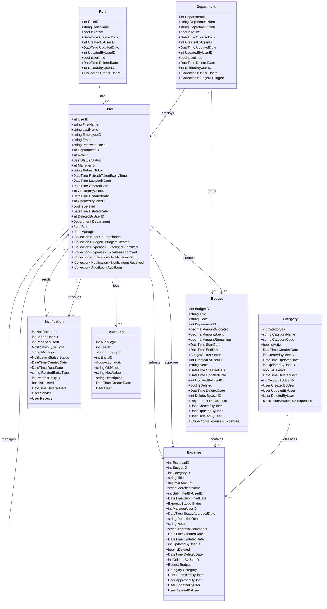
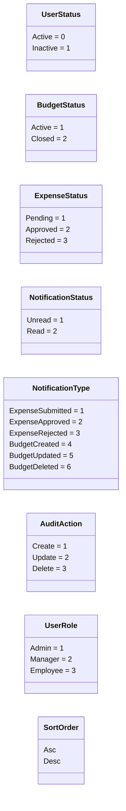
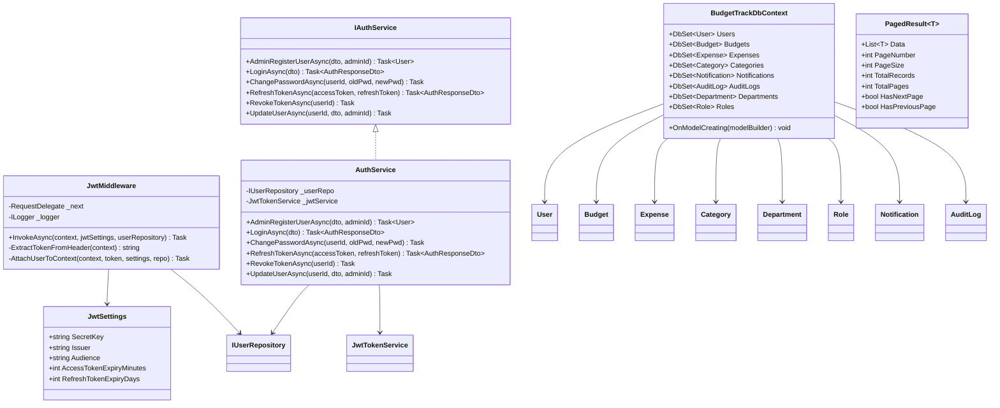
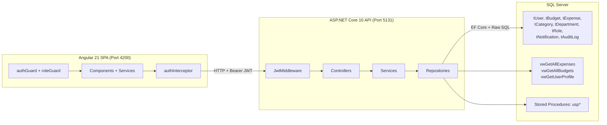

# BudgetTrack — Backend Class Diagram

> **Stack:** ASP.NET Core 10 · Entity Framework Core 10 · SQL Server
> **Generated:** 2026-03-07

---

## Table of Contents

1. [Domain Entities](#1-domain-entities)
2. [Enumerations](#2-enumerations)
3. [Repository Layer](#3-repository-layer)
4. [Service Layer](#4-service-layer)
5. [Controller Layer](#5-controller-layer)
6. [Infrastructure](#6-infrastructure)
7. [Full Architecture Overview](#7-full-architecture-overview)
8. [Role-Based Access Summary](#8-role-based-access-summary)

---

## 1. Domain Entities

---

## 2. Enumerations

---

## 3. Repository Layer

```mermaid
classDiagram
    direction TB

    class IUserRepository {
        +GetByIdAsync(id) Task~User~
        +GetByEmailAsync(email) Task~User~
        +GetUserForLoginAsync(email) Task~User~
        +ValidateRefreshTokenAsync(userId, token) Task~User~
        +GetByEmployeeIdAsync(employeeId) Task~User~
        +GetAllManagersAsync() Task~IEnumerable~User~~
        +GetEmployeesByManagerIdAsync(managerId) Task~IEnumerable~User~~
        +EmailExistsAsync(email) Task~bool~
        +GenerateEmployeeIdAsync(roleId) Task~string~
        +AddAsync(user) Task
        +UpdateAsync(user) Task
        +DeleteAsync(id, deletedByUserId) Task
        +SaveChangesAsync() Task
        +GetUserProfileByIdAsync(userId) Task~UserProfileResponseDto~
        +GetUsersListAsync(filters) Task~List~UserListResponseDto~~
    }

    class IBudgetRepository {
        +CreateBudgetAsync(dto, userId) Task~int~
        +UpdateBudgetAsync(budgetID, dto, userId) Task
        +DeleteBudgetAsync(budgetID, userId) Task
        +GetBudgetByIdAsync(budgetID) Task~BudgetDto~
        +GetAllBudgetsAsync(filters) Task~PagedResult~BudgetDto~~
        +GetBudgetsByCreatedByUserIdWithPaginationAsync(userId, filters) Task~PagedResult~BudgetDto~~
    }

    class IExpenseRepository {
        +GetAllExpensesAsync(filters) Task~PagedResult~AllExpenseDto~~
        +GetExpensesByBudgetIDAsync(budgetID, filters) Task~PagedResult~AllExpenseDto~~
        +GetManagedExpensesAsync(filters) Task~PagedResult~AllExpenseDto~~
        +CreateExpenseAsync(dto, userId) Task~int~
        +UpdateExpenseStatusAsync(id, status, userId, comments, reason) Task~bool~
        +GetExpenseStatisticsAsync(filters) Task~ExpenseStatisticsDto~
    }

    class ICategoryRepository {
        +GetAllCategoriesAsync() Task~List~CategoryResponseDto~~
        +CreateCategoryAsync(dto, userId) Task~int~
        +UpdateCategoryAsync(id, dto, userId) Task~bool~
        +DeleteCategoryAsync(id, userId) Task~bool~
    }

    class IDepartmentRepository {
        +GetAllDepartmentsAsync() Task~List~DepartmentResponseDto~~
        +CreateDepartmentAsync(dto, userId) Task~int~
        +UpdateDepartmentAsync(id, dto, userId) Task~bool~
        +DeleteDepartmentAsync(id, userId) Task~bool~
    }

    class INotificationRepository {
        +GetNotificationsByReceiverUserIdAsync(userId, msg, status, sort, page, size) Task~PagedResult~GetNotificationDto~~
        +MarkNotificationAsReadAsync(id, userId) Task~bool~
        +MarkAllNotificationsAsReadAsync(userId) Task~int~
        +DeleteNotificationAsync(id, userId) Task~bool~
        +DeleteAllNotificationsAsync(userId) Task~int~
    }

    class IAuditRepository {
        +GetAllAuditLogsAsync() Task~List~AuditLogDto~~
        +GetAllAuditLogsPaginatedAsync(page, size, search, action, entityType) Task~PagedResult~AuditLogDto~~
        +GetAuditLogsByUserIdAsync(userId) Task~List~AuditLogDto~~
    }

    class IReportRepository {
        +GetPeriodReportAsync(startDate, endDate) Task~PeriodReportDto~
        +GetDepartmentReportAsync(departmentName) Task~DepartmentReportDto~
        +GetBudgetReportAsync(budgetCode) Task~BudgetReportDto~
    }

    class UserRepository {
        -BudgetTrackDbContext _context
        +GetByIdAsync(id) Task~User~
        +GetByEmailAsync(email) Task~User~
        +AddAsync(user) Task
        +UpdateAsync(user) Task
        +DeleteAsync(id, deletedByUserId) Task
    }

    class BudgetRepository {
        -BudgetTrackDbContext _context
        +CreateBudgetAsync(dto, userId) Task~int~
        +UpdateBudgetAsync(budgetID, dto, userId) Task
        +DeleteBudgetAsync(budgetID, userId) Task
        +GetAllBudgetsAsync(filters) Task~PagedResult~BudgetDto~~
    }

    class ExpenseRepository {
        -BudgetTrackDbContext _context
        +GetAllExpensesAsync(filters) Task~PagedResult~AllExpenseDto~~
        +CreateExpenseAsync(dto, userId) Task~int~
        +UpdateExpenseStatusAsync(id, status, userId, comments, reason) Task~bool~
        +GetExpenseStatisticsAsync(filters) Task~ExpenseStatisticsDto~
    }

    class CategoryRepository {
        -BudgetTrackDbContext _context
        +GetAllCategoriesAsync() Task~List~CategoryResponseDto~~
        +CreateCategoryAsync(dto, userId) Task~int~
        +UpdateCategoryAsync(id, dto, userId) Task~bool~
        +DeleteCategoryAsync(id, userId) Task~bool~
    }

    class DepartmentRepository {
        -BudgetTrackDbContext _context
        +GetAllDepartmentsAsync() Task~List~DepartmentResponseDto~~
        +CreateDepartmentAsync(dto, userId) Task~int~
        +UpdateDepartmentAsync(id, dto, userId) Task~bool~
        +DeleteDepartmentAsync(id, userId) Task~bool~
    }

    class NotificationRepository {
        -BudgetTrackDbContext _context
        +GetNotificationsByReceiverUserIdAsync() Task~PagedResult~GetNotificationDto~~
        +MarkNotificationAsReadAsync(id, userId) Task~bool~
        +MarkAllNotificationsAsReadAsync(userId) Task~int~
        +DeleteNotificationAsync(id, userId) Task~bool~
        +DeleteAllNotificationsAsync(userId) Task~int~
    }

    class AuditRepository {
        -BudgetTrackDbContext _context
        +GetAllAuditLogsAsync() Task~List~AuditLogDto~~
        +GetAllAuditLogsPaginatedAsync() Task~PagedResult~AuditLogDto~~
        +GetAuditLogsByUserIdAsync(userId) Task~List~AuditLogDto~~
    }

    class ReportRepository {
        -BudgetTrackDbContext _context
        +GetPeriodReportAsync(startDate, endDate) Task~PeriodReportDto~
        +GetDepartmentReportAsync(departmentName) Task~DepartmentReportDto~
        +GetBudgetReportAsync(budgetCode) Task~BudgetReportDto~
    }

    IUserRepository <|.. UserRepository
    IBudgetRepository <|.. BudgetRepository
    IExpenseRepository <|.. ExpenseRepository
    ICategoryRepository <|.. CategoryRepository
    IDepartmentRepository <|.. DepartmentRepository
    INotificationRepository <|.. NotificationRepository
    IAuditRepository <|.. AuditRepository
    IReportRepository <|.. ReportRepository
```

---

## 4. Service Layer

```mermaid
classDiagram
    direction TB

    class IBudgetService {
        +CreateBudgetAsync(dto, userId) Task~int~
        +UpdateBudgetAsync(budgetID, dto, userId) Task
        +DeleteBudgetAsync(budgetID, userId) Task
        +GetAllBudgetsAsync(filters) Task~PagedResult~BudgetDto~~
        +GetBudgetsByCreatedByUserIdWithPaginationAsync(userId, filters) Task~PagedResult~BudgetDto~~
    }

    class IExpenseService {
        +GetAllExpensesAsync(filters) Task~PagedResult~AllExpenseDto~~
        +GetExpensesByBudgetIDAsync(budgetID, filters) Task~PagedResult~AllExpenseDto~~
        +GetManagedExpensesAsync(filters) Task~PagedResult~AllExpenseDto~~
        +CreateExpenseAsync(dto, userId) Task~int~
        +UpdateExpenseStatusAsync(id, status, userId, comments, reason) Task~bool~
        +GetExpenseStatisticsAsync(filters) Task~ExpenseStatisticsDto~
    }

    class ICategoryService {
        +GetAllCategoriesAsync() Task~List~CategoryResponseDto~~
        +CreateCategoryAsync(dto, userId) Task~int~
        +UpdateCategoryAsync(id, dto, userId) Task~bool~
        +DeleteCategoryAsync(id, userId) Task~bool~
    }

    class IDepartmentService {
        +GetAllDepartmentsAsync() Task~List~DepartmentResponseDto~~
        +CreateDepartmentAsync(dto, userId) Task~int~
        +UpdateDepartmentAsync(id, dto, userId) Task~bool~
        +DeleteDepartmentAsync(id, userId) Task~bool~
    }

    class INotificationService {
        +GetNotificationsByReceiverUserIdAsync(userId, msg, status, sort, page, size) Task~PagedResult~GetNotificationDto~~
        +MarkNotificationAsReadAsync(id, userId) Task~bool~
        +MarkAllNotificationsAsReadAsync(userId) Task~int~
        +DeleteNotificationAsync(id, userId) Task~bool~
        +DeleteAllNotificationsAsync(userId) Task~int~
    }

    class IAuditService {
        +GetAllAuditLogsAsync() Task~List~AuditLogDto~~
        +GetAllAuditLogsPaginatedAsync(page, size, search, action, entityType) Task~PagedResult~AuditLogDto~~
        +GetAuditLogsByUserIdAsync(userId) Task~List~AuditLogDto~~
    }

    class IReportService {
        +GetPeriodReportAsync(startDate, endDate) Task~PeriodReportDto~
        +GetDepartmentReportAsync(departmentName) Task~DepartmentReportDto~
        +GetBudgetReportAsync(budgetCode) Task~BudgetReportDto~
    }

    class BudgetService {
        -IBudgetRepository _repo
        +CreateBudgetAsync(dto, userId) Task~int~
        +UpdateBudgetAsync(budgetID, dto, userId) Task
        +DeleteBudgetAsync(budgetID, userId) Task
        +GetAllBudgetsAsync(filters) Task~PagedResult~BudgetDto~~
        +GetBudgetsByCreatedByUserIdWithPaginationAsync(userId, filters) Task~PagedResult~BudgetDto~~
    }

    class ExpenseService {
        -IExpenseRepository _repo
        +GetAllExpensesAsync(filters) Task~PagedResult~AllExpenseDto~~
        +GetManagedExpensesAsync(filters) Task~PagedResult~AllExpenseDto~~
        +CreateExpenseAsync(dto, userId) Task~int~
        +UpdateExpenseStatusAsync(id, status, userId, comments, reason) Task~bool~
        +GetExpenseStatisticsAsync(filters) Task~ExpenseStatisticsDto~
    }

    class CategoryService {
        -ICategoryRepository _repo
        +GetAllCategoriesAsync() Task~List~CategoryResponseDto~~
        +CreateCategoryAsync(dto, userId) Task~int~
        +UpdateCategoryAsync(id, dto, userId) Task~bool~
        +DeleteCategoryAsync(id, userId) Task~bool~
    }

    class DepartmentService {
        -IDepartmentRepository _repo
        +GetAllDepartmentsAsync() Task~List~DepartmentResponseDto~~
        +CreateDepartmentAsync(dto, userId) Task~int~
        +UpdateDepartmentAsync(id, dto, userId) Task~bool~
        +DeleteDepartmentAsync(id, userId) Task~bool~
    }

    class NotificationService {
        -INotificationRepository _repo
        +GetNotificationsByReceiverUserIdAsync() Task~PagedResult~GetNotificationDto~~
        +MarkNotificationAsReadAsync(id, userId) Task~bool~
        +MarkAllNotificationsAsReadAsync(userId) Task~int~
        +DeleteNotificationAsync(id, userId) Task~bool~
        +DeleteAllNotificationsAsync(userId) Task~int~
    }

    class AuditService {
        -IAuditRepository _repo
        +GetAllAuditLogsAsync() Task~List~AuditLogDto~~
        +GetAllAuditLogsPaginatedAsync() Task~PagedResult~AuditLogDto~~
        +GetAuditLogsByUserIdAsync(userId) Task~List~AuditLogDto~~
    }

    class ReportService {
        -IReportRepository _repo
        +GetPeriodReportAsync(startDate, endDate) Task~PeriodReportDto~
        +GetDepartmentReportAsync(departmentName) Task~DepartmentReportDto~
        +GetBudgetReportAsync(budgetCode) Task~BudgetReportDto~
    }

    class JwtTokenService {
        -JwtSettings _jwtSettings
        +GenerateAccessToken(user) string
        +GenerateRefreshToken() string
        +GetPrincipalFromExpiredToken(token) ClaimsPrincipal
    }

    IBudgetService <|.. BudgetService
    IExpenseService <|.. ExpenseService
    ICategoryService <|.. CategoryService
    IDepartmentService <|.. DepartmentService
    INotificationService <|.. NotificationService
    IAuditService <|.. AuditService
    IReportService <|.. ReportService

    BudgetService --> IBudgetRepository
    ExpenseService --> IExpenseRepository
    CategoryService --> ICategoryRepository
    DepartmentService --> IDepartmentRepository
    NotificationService --> INotificationRepository
    AuditService --> IAuditRepository
    ReportService --> IReportRepository
```

---

## 5. Controller Layer

```mermaid
classDiagram
    direction TB

    class ControllerBase {
        ASP.NET Core Base
    }

    class BaseApiController {
        int UserId
        +GetUserId() int
    }

    class AuthController {
        -IAuthService _authService
        -IUserRepository _userRepository
        +AdminRegister(dto) Task
        +Login(dto) Task
        +ChangePassword(dto) Task
        +RefreshToken(dto) Task
        +Logout() Task
        +Verify() IActionResult
        +GetUserProfile() Task
        +GetUsers(filters) Task
        +UpdateUser(userId, dto) Task
    }

    class BudgetController {
        -IBudgetService _budgetService
        +GetAllBudgets(filters) Task
        +GetBudgetsByUserWithPagination(filters) Task
        +CreateBudget(dto) Task
        +UpdateBudget(budgetID, dto) Task
        +DeleteBudget(budgetID) Task
        +GetExpensesByBudgetID(budgetID, filters) Task
    }

    class ExpenseController {
        -IExpenseService _service
        +GetExpenseStatistics(filters) Task
        +GetAllExpenses(filters) Task
        +GetManagedExpenses(filters) Task
        +CreateExpense(dto) Task
        +UpdateExpenseStatus(expenseID, dto) Task
    }

    class CategoryController {
        -ICategoryService _service
        +GetAllCategories() Task
        +CreateCategory(dto) Task
        +UpdateCategory(categoryID, dto) Task
        +DeleteCategory(categoryID) Task
    }

    class DepartmentController {
        -IDepartmentService _service
        +GetAllDepartments() Task
        +CreateDepartment(dto) Task
        +UpdateDepartment(departmentID, dto) Task
        +DeleteDepartment(departmentID) Task
    }

    class UserController {
        -IUserRepository _repo
        +GetUserStats() Task
        +GetManagers() Task
        +GetEmployeesByManagerId(managerId) Task
        +SoftDeleteUser(userId) Task
    }

    class NotificationController {
        -INotificationService _service
        +GetNotifications(filters) Task
        +GetUnreadCount() Task
        +MarkAsRead(notificationID) Task
        +MarkAllAsRead() Task
        +DeleteNotification(notificationID) Task
        +DeleteAllNotifications() Task
    }

    class AuditController {
        -IAuditService _service
        +GetAllAuditLogs(filters) Task
        +GetAuditLogsByUserId(userId) Task
    }

    class ReportController {
        -IReportService _service
        +GetPeriodReport(startDate, endDate) Task
        +GetDepartmentReport(departmentName) Task
        +GetBudgetReport(budgetCode) Task
    }

    ControllerBase <|-- BaseApiController
    BaseApiController <|-- BudgetController
    BaseApiController <|-- ExpenseController
    BaseApiController <|-- CategoryController
    BaseApiController <|-- DepartmentController
    BaseApiController <|-- UserController
    BaseApiController <|-- NotificationController
    BaseApiController <|-- ReportController
    BaseApiController <|-- AuthController
    ControllerBase <|-- AuditController

    BudgetController --> IBudgetService
    ExpenseController --> IExpenseService
    CategoryController --> ICategoryService
    DepartmentController --> IDepartmentService
    NotificationController --> INotificationService
    AuditController --> IAuditService
    ReportController --> IReportService
    AuthController --> IAuthService
    UserController --> IUserRepository
```

---

## 6. Infrastructure

---

## 7. Full Architecture Overview

---

## 8. Role-Based Access Summary

| Controller               | Endpoint                           | Roles             |
| ------------------------ | ---------------------------------- | ----------------- |
| `AuthController`         | POST `/api/auth/createuser`        | Admin             |
| `AuthController`         | POST `/api/auth/login`             | Public            |
| `AuthController`         | POST `/api/auth/token/refresh`     | Public            |
| `AuthController`         | GET `/api/users`                   | Admin, Manager    |
| `AuthController`         | PUT `/api/users/{id}`              | Admin             |
| `BudgetController`       | GET `/api/budgets/admin`           | Admin             |
| `BudgetController`       | GET `/api/budgets`                 | All authenticated |
| `BudgetController`       | POST `/api/budgets`                | Admin, Manager    |
| `BudgetController`       | PUT `/api/budgets/{id}`            | Admin, Manager    |
| `BudgetController`       | DELETE `/api/budgets/{id}`         | Admin, Manager    |
| `BudgetController`       | GET `/api/budgets/{id}/expenses`   | All authenticated |
| `ExpenseController`      | GET `/api/expenses/stats`          | All authenticated |
| `ExpenseController`      | GET `/api/expenses`                | Admin             |
| `ExpenseController`      | GET `/api/expenses/managed`        | Manager, Employee |
| `ExpenseController`      | POST `/api/expenses`               | Manager, Employee |
| `ExpenseController`      | PUT `/api/expenses/status/{id}`    | Manager           |
| `CategoryController`     | GET `/api/categories`              | All authenticated |
| `CategoryController`     | POST `/api/categories`             | Admin, Manager    |
| `CategoryController`     | PUT `/api/categories/{id}`         | Admin, Manager    |
| `CategoryController`     | DELETE `/api/categories/{id}`      | Admin, Manager    |
| `DepartmentController`   | GET `/api/departments`             | All authenticated |
| `DepartmentController`   | POST/PUT/DELETE `/api/departments` | Admin             |
| `NotificationController` | GET `/api/notifications/unread-count` | Manager, Employee |
| `NotificationController` | All other endpoints                | Manager, Employee |
| `UserController`         | GET `/api/users/stats`             | Admin             |
| `UserController`         | GET `/api/users/managers`          | All authenticated |
| `UserController`         | GET `/api/users/{id}/employees`    | All authenticated |
| `UserController`         | DELETE `/api/users/{id}`           | Admin             |
| `AuditController`        | All endpoints                      | Admin             |
| `ReportController`       | GET `/api/reports/period`          | Admin             |
| `ReportController`       | GET `/api/reports/department`      | Admin             |
| `ReportController`       | GET `/api/reports/budget`          | Admin, Manager    |

---

*BudgetTrack Class Diagram — Generated 2026-03-07*
