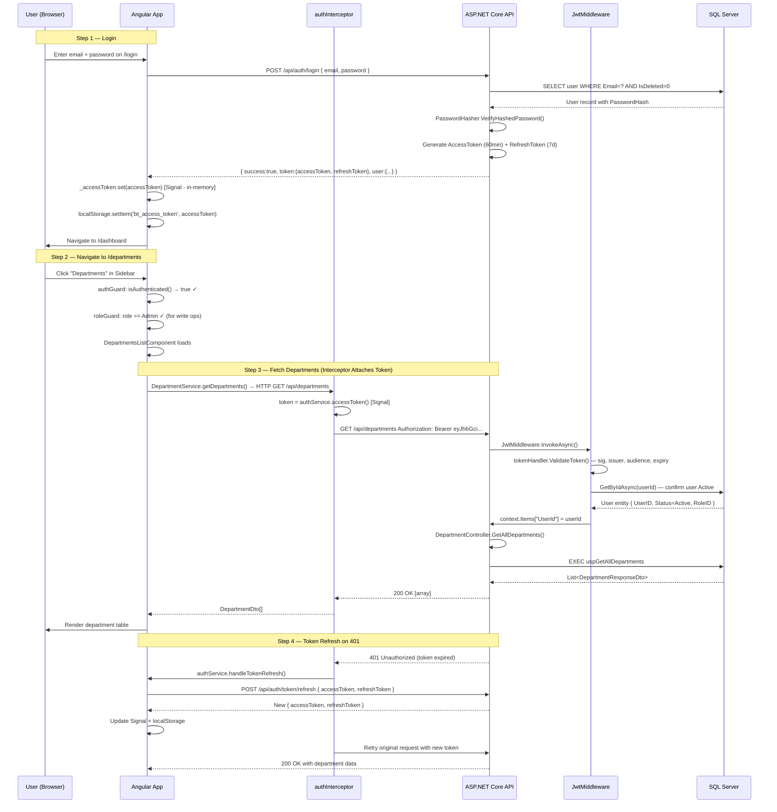
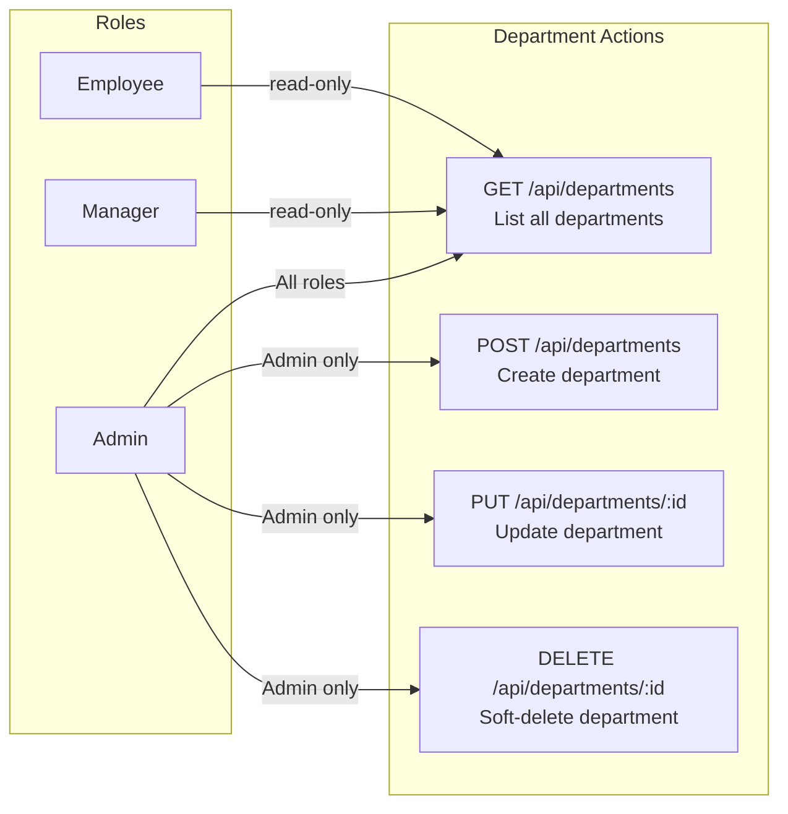
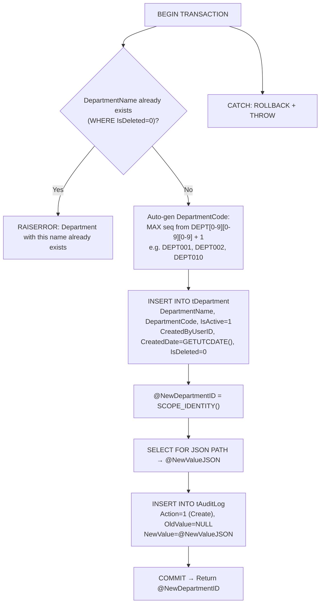
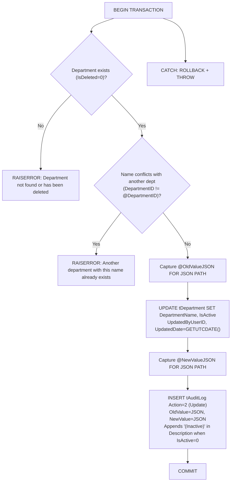
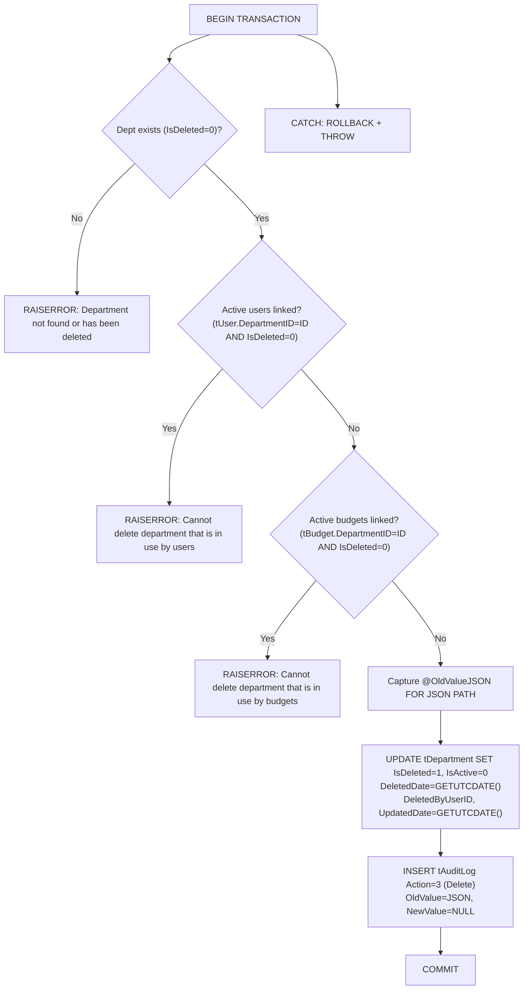
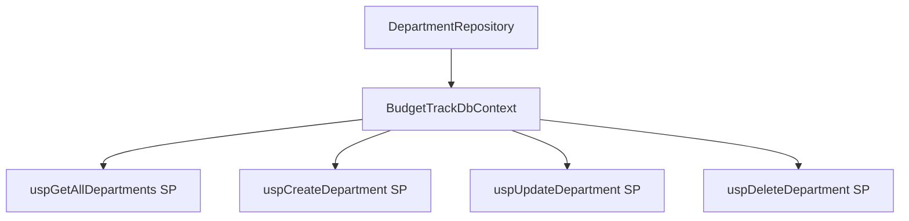
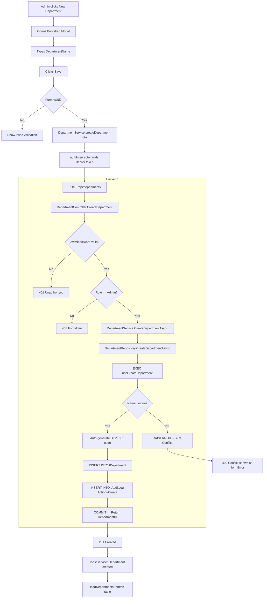
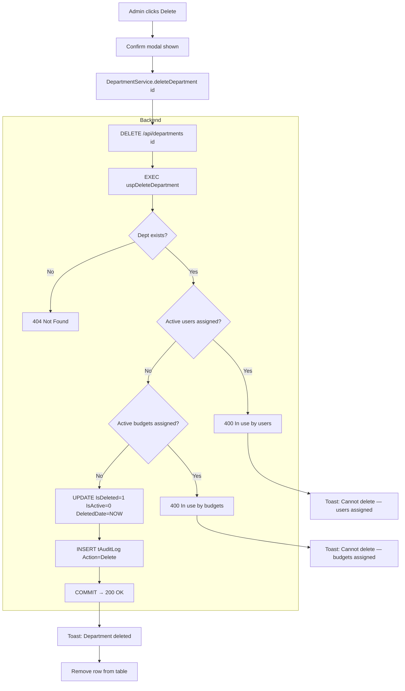
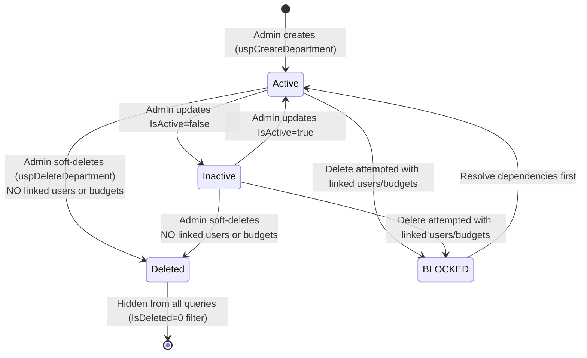

# Department Module — Complete Documentation

> **Stack:** ASP.NET Core 10 · Entity Framework Core 10 · SQL Server Stored Procedures · Angular 21 · Bootstrap 5
> **Base URL:** `http://localhost:5131`
> **Generated:** 2026-03-07

---

## Table of Contents

1. [Module Overview](#1-module-overview)
2. [Authentication & Authorization Flow](#2-authentication--authorization-flow)
3. [Role-Based Access Control](#3-role-based-access-control)
4. [Database Layer — Department.sql](#4-database-layer--departmentsql)
5. [Entity & DTOs](#5-entity--dtos)
6. [Repository Layer](#6-repository-layer)
7. [Service Layer](#7-service-layer)
8. [Controller Layer](#8-controller-layer)
9. [Complete API Reference](#9-complete-api-reference)
10. [Angular Frontend](#10-angular-frontend)
11. [End-to-End Data Flow Diagrams](#11-end-to-end-data-flow-diagrams)
12. [Department Lifecycle State Machine](#12-department-lifecycle-state-machine)

---

## 1. Module Overview

The **Department Module** manages organizational units that group Users and Budgets. Only Admins can create, update, and delete — all roles can read (required for dropdown population in forms).

### What the Department Module Does

| Capability        | Description                                                            |
| ----------------- | ---------------------------------------------------------------------- |
| List Departments  | All authenticated users view for dropdown selection                    |
| Create Department | Admin creates; `DepartmentCode` auto-generated (`DEPT001`, `DEPT002`)  |
| Update Department | Admin modifies name and active status                                  |
| Soft Delete       | Admin deletes; **blocked** if users or budgets are still linked        |
| Auto-Code         | `DepartmentCode` auto-generated as `DEPT` + 3-digit seq (e.g. `DEPT001`) |
| Uniqueness        | `DepartmentName` and `DepartmentCode` must be globally unique          |
| Audit Logging     | All mutations logged to `tAuditLog` with JSON snapshots                |

---

## 2. Authentication & Authorization Flow

Every request to the Department module requires a valid JWT Bearer token.



### JWT Token Claims Used

| Claim Type                  | Example Value | Used For                             |
| --------------------------- | ------------- | ------------------------------------ |
| `ClaimTypes.NameIdentifier` | `1`           | `UserId` passed as `CreatedByUserID` |
| `ClaimTypes.Role`           | `Admin`       | `[Authorize(Roles="Admin")]`         |
| `ClaimTypes.Email`          | `a@co.com`    | Identity                             |
| `EmployeeId`                | `ADM2601`     | Display / audit description          |

### Token Storage Strategy

| Token         | Storage                       | Duration   |
| ------------- | ----------------------------- | ---------- |
| Access Token  | Angular Signal + localStorage | 60 minutes |
| Refresh Token | localStorage only             | 7 days     |

---

## 3. Role-Based Access Control



### Access Logic in Code

```
GET /api/departments      → [Authorize]               — all roles pass
POST /api/departments     → [Authorize(Roles="Admin")]
PUT /api/departments/:id  → [Authorize(Roles="Admin")]
DELETE /api/departments/:id → [Authorize(Roles="Admin")]
│
├── UserId extracted from JWT (ClaimTypes.NameIdentifier)
└── Passed as CreatedByUserID / UpdatedByUserID / DeletedByUserID to SP
```

---

## 4. Database Layer — Department.sql

Located at `Database/Budget-Track/Department.sql`. Contains **4 Stored Procedures**.

---

### 4.1 `uspGetAllDepartments` — List All Departments

```sql
CREATE OR ALTER PROCEDURE uspGetAllDepartments
AS
BEGIN
    SET NOCOUNT ON;
    SELECT DepartmentID, DepartmentName, DepartmentCode, IsActive
    FROM tDepartment
    WHERE IsDeleted = 0
    ORDER BY DepartmentName ASC;
END
```

Returns only non-deleted departments, ordered alphabetically.

---

### 4.2 `uspCreateDepartment` — Create Stored Procedure

**Parameters:**

| Parameter           | Type           | Required | Description                      |
| ------------------- | -------------- | -------- | -------------------------------- |
| `@DepartmentName`   | NVARCHAR(100)  | ✅        | Must be unique among non-deleted |
| `@CreatedByUserID`  | INT            | ✅        | Admin's UserID                   |
| `@NewDepartmentID`  | INT OUTPUT     | —        | Returns new DepartmentID         |

**Step-by-Step Execution Flow:**



**Auto-Code Logic:**
```sql
SELECT @NextSeq = ISNULL(MAX(CAST(SUBSTRING(DepartmentCode, 5, 3) AS INT)), 0) + 1
FROM tDepartment WHERE DepartmentCode LIKE 'DEPT[0-9][0-9][0-9]';
SET @DepartmentCode = 'DEPT' + RIGHT('000' + CAST(@NextSeq AS VARCHAR(10)), 3);
-- Produces: DEPT001, DEPT002, ..., DEPT010, ...
```

---

### 4.3 `uspUpdateDepartment` — Update Stored Procedure

**Parameters:**

| Parameter           | Type           | Required | Description                          |
| ------------------- | -------------- | -------- | ------------------------------------ |
| `@DepartmentID`     | INT            | ✅        | Target department                    |
| `@DepartmentName`   | NVARCHAR(100)  | ✅        | New name (unique excluding self)     |
| `@IsActive`         | BIT            | ✅        | Active/Inactive toggle               |
| `@UpdatedByUserID`  | INT            | ✅        | Admin's UserID                       |

**Flow:**



---

### 4.4 `uspDeleteDepartment` — Soft Delete Stored Procedure

**Parameters:**

| Parameter           | Type | Required | Description             |
| ------------------- | ---- | -------- | ----------------------- |
| `@DepartmentID`     | INT  | ✅        | Department to delete    |
| `@DeletedByUserID`  | INT  | ✅        | Admin's UserID          |

**Flow:**



> **Delete Protection Logic:** Two sequential checks — first checks active users, then if passed, checks active budgets. Both must be zero for the delete to proceed.

---

### 4.5 Audit Log JSON Examples

**On Create** (`tAuditLog.NewValue`):
```json
{
  "DepartmentID": 3,
  "DepartmentName": "Marketing",
  "DepartmentCode": "DEPT003",
  "IsActive": true,
  "CreatedByUserID": 1,
  "CreatedDate": "2026-03-07T04:38:00"
}
```

**On Delete** (`OldValue` stored, `NewValue=NULL`):
```json
{
  "DepartmentID": 3,
  "DepartmentName": "Marketing",
  "DepartmentCode": "DEPT003",
  "IsActive": true
}
```

---

## 5. Entity & DTOs

### 5.1 `Department` Entity (`Models/Entities/Department.cs`)

```csharp
[Table("tDepartment")]
[Index(nameof(DepartmentName), IsUnique = true)]
[Index(nameof(DepartmentCode), IsUnique = true)]
public class Department
{
    [Key] public int DepartmentID { get; set; }
    [Required][MaxLength(100)] public required string DepartmentName { get; set; }
    [MaxLength(50)] public string? DepartmentCode { get; set; }
    public bool IsActive { get; set; } = true;
    [Required] public required DateTime CreatedDate { get; set; } = DateTime.UtcNow;
    public int? CreatedByUserID { get; set; }
    public DateTime? UpdatedDate { get; set; }
    public int? UpdatedByUserID { get; set; }
    public bool IsDeleted { get; set; } = false;
    public DateTime? DeletedDate { get; set; }
    public int? DeletedByUserID { get; set; }
    // Navigation
    public virtual ICollection<User> Users { get; set; } = new List<User>();
    public virtual ICollection<Budget> Budgets { get; set; } = new List<Budget>();
}
```

**Global Query Filter:** `WHERE IsDeleted = 0` via EF Core (`HasQueryFilter`).

---

### 5.2 DTOs

**`DepartmentResponseDto`** — List/read response:

| Field            | Type   | Description      |
| ---------------- | ------ | ---------------- |
| `DepartmentID`   | int    | Department PK    |
| `DepartmentName` | string | Department name  |
| `DepartmentCode` | string | Auto-gen code    |
| `IsActive`       | bool   | Active flag      |

**`CreateDepartmentDto`** — Create request:

| Field            | Type   | Required | Validation                               |
| ---------------- | ------ | -------- | ---------------------------------------- |
| `DepartmentName` | string | ✅        | Required, max 100 chars, globally unique |

> `DepartmentCode` is **auto-generated** by the stored procedure — not supplied by the client.

**`UpdateDepartmentDto`** — Update request:

| Field            | Type   | Required | Validation                                |
| ---------------- | ------ | -------- | ----------------------------------------- |
| `DepartmentName` | string | ✅        | Required, max 100 chars, unique excl. self |
| `IsActive`       | bool   | ✅        | Active/Inactive toggle                    |

---

## 6. Repository Layer

**Interface:** `IDepartmentRepository`

```csharp
Task<List<DepartmentResponseDto>> GetAllDepartmentsAsync();
Task<int> CreateDepartmentAsync(CreateDepartmentDto dto, int createdByUserID);
Task<bool> UpdateDepartmentAsync(int departmentID, UpdateDepartmentDto dto, int updatedByUserID);
Task<bool> DeleteDepartmentAsync(int departmentID, int deletedByUserID);
```

**Implementation: `DepartmentRepository`**



| Method                     | Mechanism               | Description                                                                 |
| -------------------------- | ----------------------- | --------------------------------------------------------------------------- |
| `GetAllDepartmentsAsync`   | SP / EF Core LINQ       | All non-deleted departments, ordered by DepartmentName ASC                  |
| `CreateDepartmentAsync`    | `uspCreateDepartment`   | Unique name check, auto-gen `DEPTnnn` code, INSERT, audit; returns new ID   |
| `UpdateDepartmentAsync`    | `uspUpdateDepartment`   | Unique check (excl. self), capture old/new JSON, UPDATE, audit              |
| `DeleteDepartmentAsync`    | `uspDeleteDepartment`   | Checks users AND budgets linked before soft-deleting                        |

```csharp
// CREATE — outputs new DepartmentID
var deptIDParam = new SqlParameter { ParameterName = "@NewDepartmentID", Direction = ParameterDirection.Output };
await _context.Database.ExecuteSqlRawAsync(
    "EXEC dbo.uspCreateDepartment @DepartmentName, @CreatedByUserID, @NewDepartmentID OUTPUT",
    params...
);
return (int)deptIDParam.Value;
```

---

## 7. Service Layer

**Interface:** `IDepartmentService`

```csharp
Task<List<DepartmentResponseDto>> GetAllDepartmentsAsync();
Task<int> CreateDepartmentAsync(CreateDepartmentDto dto, int createdByUserID);
Task<bool> UpdateDepartmentAsync(int departmentID, UpdateDepartmentDto dto, int updatedByUserID);
Task<bool> DeleteDepartmentAsync(int departmentID, int deletedByUserID);
```

**Business Rules in `DepartmentService`:**

| Method                  | Validation                                    | Handled By       |
| ----------------------- | --------------------------------------------- | ---------------- |
| `CreateDepartmentAsync` | Duplicate name check                          | SP `RAISERROR`   |
| `UpdateDepartmentAsync` | Dept must exist, name unique excl. self       | SP `RAISERROR`   |
| `DeleteDepartmentAsync` | No active users linked                        | SP `RAISERROR`   |
| `DeleteDepartmentAsync` | No active budgets linked                      | SP `RAISERROR`   |

All constraints are enforced atomically within SP `BEGIN TRANSACTION` blocks. The service re-throws SP exceptions for the controller to map to HTTP responses.

**Dependency Injection:**
```csharp
// Program.cs
builder.Services.AddScoped<IDepartmentService, DepartmentService>();
builder.Services.AddScoped<IDepartmentRepository, DepartmentRepository>();
```

---

## 8. Controller Layer

**`DepartmentController`** extends `BaseApiController`:

```csharp
[ApiController]
[Route("api/departments")]
public class DepartmentController : BaseApiController
{
    private readonly IDepartmentService _departmentService;
    // GET, POST, PUT, DELETE actions
}
```

**Action → SP Mapping:**

| Method | Route                             | Roles | Action                | SP Called               |
| ------ | --------------------------------- | ----- | --------------------- | ----------------------- |
| GET    | `/api/departments`                | All   | `GetAllDepartments`   | `uspGetAllDepartments`  |
| POST   | `/api/departments`                | Admin | `CreateDepartment`    | `uspCreateDepartment`   |
| PUT    | `/api/departments/{departmentID}` | Admin | `UpdateDepartment`    | `uspUpdateDepartment`   |
| DELETE | `/api/departments/{departmentID}` | Admin | `DeleteDepartment`    | `uspDeleteDepartment`   |

**Error Handling:**

| Exception Pattern                              | HTTP Response             |
| ---------------------------------------------- | ------------------------- |
| `"already exists"` / `"duplicate"`             | 409 Conflict              |
| `"not found"` / `"has been deleted"`           | 404 Not Found             |
| `"in use by users"` / `"in use by budgets"`    | 400 Bad Request           |
| Unhandled                                      | 500 Internal Server Error |

---

## 9. Complete API Reference

> **Auth Header required:** `Authorization: Bearer <accessToken>`

---

### `GET /api/departments`

**Roles:** Admin, Manager, Employee (all authenticated)

**No query parameters.** Returns all non-deleted departments.

**Response `200 OK`:**
```json
[
  { "departmentID": 1, "departmentName": "Engineering",  "departmentCode": "DEPT001", "isActive": true },
  { "departmentID": 2, "departmentName": "Finance",       "departmentCode": "DEPT002", "isActive": true },
  { "departmentID": 3, "departmentName": "Marketing",     "departmentCode": "DEPT003", "isActive": false }
]
```

**Status Codes:**

| Code  | When              |
| ----- | ----------------- |
| `200` | Success           |
| `401` | No/invalid token  |
| `500` | Server error      |

---

### `POST /api/departments`

**Roles:** Admin only

**Request Body:**
```json
{ "departmentName": "Product Design" }
```

**Responses:**

`201 Created`:
```json
{ "departmentId": 4, "message": "Department is created" }
```

`400 Bad Request` (validation):
```json
{
  "type": "https://tools.ietf.org/html/rfc9110#section-15.5.1",
  "title": "One or more validation errors occurred.",
  "errors": { "DepartmentName": ["The DepartmentName field is required."] }
}
```

`409 Conflict` (duplicate name):
```json
{ "success": false, "message": "Department with this name already exists" }
```

**Status Codes:**

| Code  | When                              |
| ----- | --------------------------------- |
| `201` | Department created successfully   |
| `400` | Validation errors                 |
| `401` | Not authenticated                 |
| `403` | Not Admin                         |
| `409` | Duplicate name                    |
| `500` | Server error                      |

---

### `PUT /api/departments/{departmentID}`

**Roles:** Admin only

**Route Param:** `departmentID` (int)

**Request Body:**
```json
{ "departmentName": "Engineering & DevOps", "isActive": true }
```

**Responses:**

`200 OK`:
```json
{ "success": true, "message": "Department is updated" }
```

`404 Not Found`:
```json
{ "success": false, "message": "Department not found or has been deleted" }
```

`409 Conflict`:
```json
{ "success": false, "message": "Another department with this name already exists" }
```

**Status Codes:**

| Code  | When                    |
| ----- | ----------------------- |
| `200` | Updated successfully    |
| `400` | Validation errors       |
| `401` | Not authenticated       |
| `403` | Not Admin               |
| `404` | Department not found    |
| `409` | Duplicate name          |
| `500` | Server error            |

---

### `DELETE /api/departments/{departmentID}`

**Roles:** Admin only

**Route Param:** `departmentID` (int)

**Effect:** Soft delete — sets `IsDeleted=1`, `IsActive=0`, `DeletedDate=NOW()`.

> **Block conditions:** Cannot delete if either active users (`tUser`) or active budgets (`tBudget`) are assigned to this department. Both must be re-assigned or deleted first.

**Responses:**

`200 OK`:
```json
{ "success": true, "message": "Department is deleted" }
```

`400 Bad Request` (in-use):
```json
{ "success": false, "message": "Cannot delete department that is in use by users" }
```
or:
```json
{ "success": false, "message": "Cannot delete department that is in use by budgets" }
```

`404 Not Found`:
```json
{ "success": false, "message": "Department not found or has been deleted" }
```

**Status Codes:**

| Code  | When                                    |
| ----- | --------------------------------------- |
| `200` | Soft-deleted successfully               |
| `400` | Linked users or budgets exist           |
| `401` | Not authenticated                       |
| `403` | Not Admin                               |
| `404` | Department not found or already deleted |
| `500` | Server error                            |

---

## 10. Angular Frontend

### Component: `DepartmentsListComponent`

**File:** `Frontend/Budget-Track/src/app/features/departments/departments-list/departments-list.component.ts`

#### Injected Dependencies

| Dependency          | Purpose                                               |
| ------------------- | ----------------------------------------------------- |
| `DepartmentService` | CRUD HTTP calls to `/api/departments`                 |
| `AuthService`       | Reads `isAdmin()` to show/hide Create/Edit/Delete UI  |
| `ToastService`      | Shows success/error toast notifications               |

#### Angular Signals Used

```typescript
loading    = signal(true);                                  // Spinner while fetching
saving     = signal(false);                                 // Disable Save during request
formError  = signal('');                                    // Inline form error message
editMode   = signal(false);                                 // Create vs Edit modal mode
selectedDept = signal<DepartmentDto | null>(null);          // Row selected for edit/delete
departments  = signal<DepartmentDto[]>([]);                 // Full department list

// Computed: only active departments (for Budget/User form dropdowns)
activeDepartments = computed(() => this.departments().filter(d => d.isActive));
```

#### Filter Strategy

| Filter     | Where Applied           | Detail                              |
| ---------- | ----------------------- | ----------------------------------- |
| Search     | Client-side (in-memory) | Filters `departmentName`            |
| IsActive   | Client-side toggle      | `departments().filter(d => d.isActive)` |

> Department list is small — all returned in one call; no server-side pagination needed.

#### SSG Compatibility

```typescript
ngOnInit() {
    if (!isPlatformBrowser(this.platformId)) return; // Skip during SSG prerender
    this.loadDepartments();
}
```

---

### Angular Service: `DepartmentService`

**File:** `Frontend/Budget-Track/src/services/department.service.ts`

```typescript
@Injectable({ providedIn: 'root' })
export class DepartmentService {
    private http = inject(HttpClient);
    private apiUrl = environment.apiUrl;  // http://localhost:5131

    getDepartments(): Observable<DepartmentDto[]>
        → GET /api/departments

    createDepartment(dto: CreateDepartmentDto): Observable<{ departmentId: number; message: string }>
        → POST /api/departments

    updateDepartment(departmentId: number, dto: UpdateDepartmentDto): Observable<ApiResponse>
        → PUT /api/departments/{departmentId}

    deleteDepartment(departmentId: number): Observable<ApiResponse>
        → DELETE /api/departments/{departmentId}
}
```

---

### TypeScript Models (`department.models.ts`)

```typescript
export interface DepartmentDto {
    departmentID: number;
    departmentName: string;
    departmentCode: string;
    isActive: boolean;
}

export interface CreateDepartmentDto {
    departmentName: string;
}

export interface UpdateDepartmentDto {
    departmentName: string;
    isActive: boolean;
}
```

---

### Bootstrap UI Components Used

| Component                            | Usage                                              |
| ------------------------------------ | -------------------------------------------------- |
| `table table-hover table-responsive` | Department data grid                               |
| `modal` (via `bootstrap.Modal`)      | Create/Edit and Delete confirmation dialogs        |
| `badge bg-success / bg-secondary`    | Active / Inactive status badge                     |
| `form-control`                       | DepartmentName input                               |
| `form-check form-switch`             | IsActive toggle on Update form                     |
| `invalid-feedback`                   | Inline validation messages                         |
| `btn btn-primary btn-danger`         | Create, Edit, Delete buttons                       |
| `spinner-border`                     | Loading indicator                                  |

---

## 11. End-to-End Data Flow Diagrams

### Admin Creates a Department



### Admin Attempts to Delete a Department (Protected)



---

## 12. Department Lifecycle State Machine



**Status Values Reference:**

| State             | Stored In               | Meaning                                           |
| ----------------- | ----------------------- | ------------------------------------------------- |
| `IsActive=true`   | `tDepartment.IsActive`  | Visible in User/Budget creation dropdowns         |
| `IsActive=false`  | `tDepartment.IsActive`  | Hidden from new-record dropdowns; still in system |
| `IsDeleted=true`  | `tDepartment.IsDeleted` | Soft-deleted — excluded from all queries          |

> **Delete protection:** SP checks `tUser.DepartmentID` (any active user), then `tBudget.DepartmentID` (any active budget). **Both** must be zero for soft-delete to proceed.

---

*Department Module Documentation — BudgetTrack v1.0 | Generated 2026-03-07*
