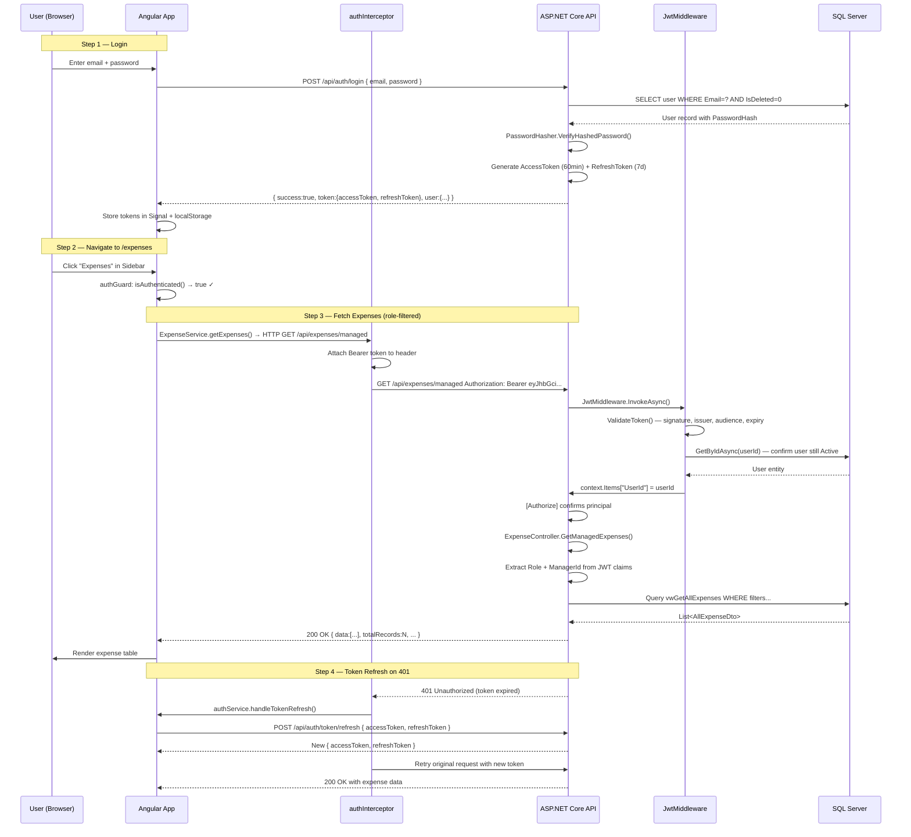
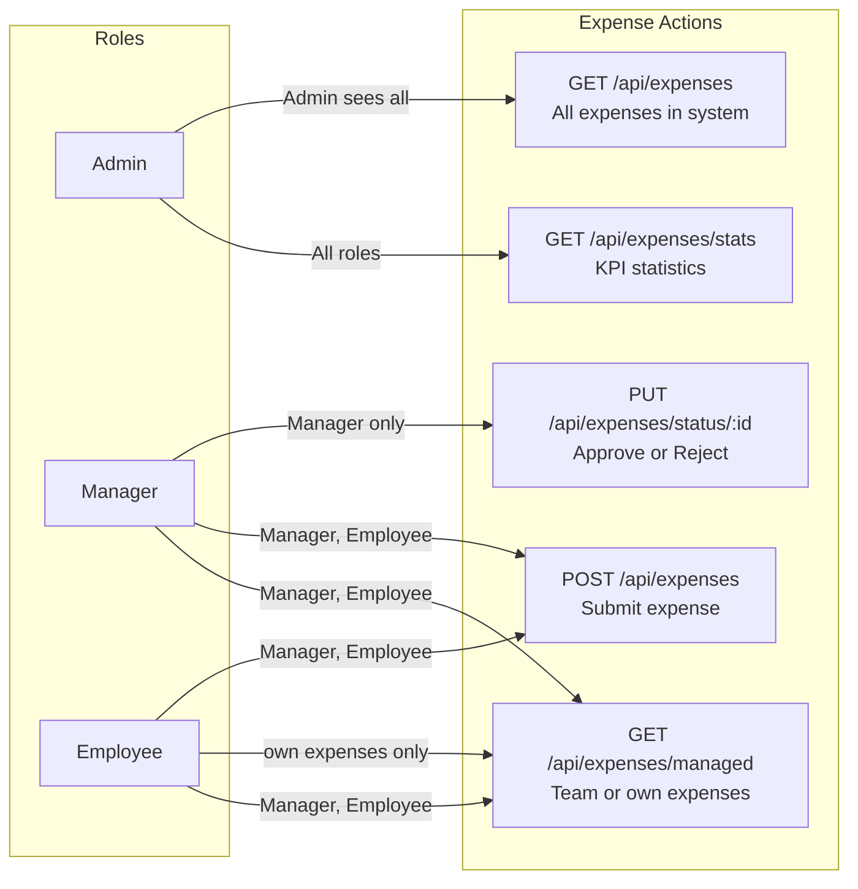
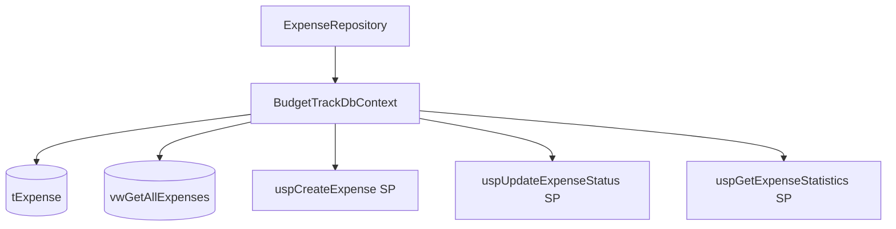
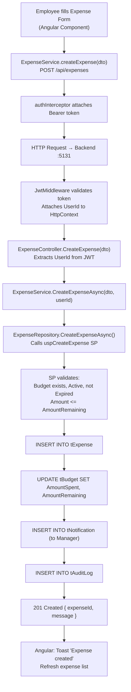
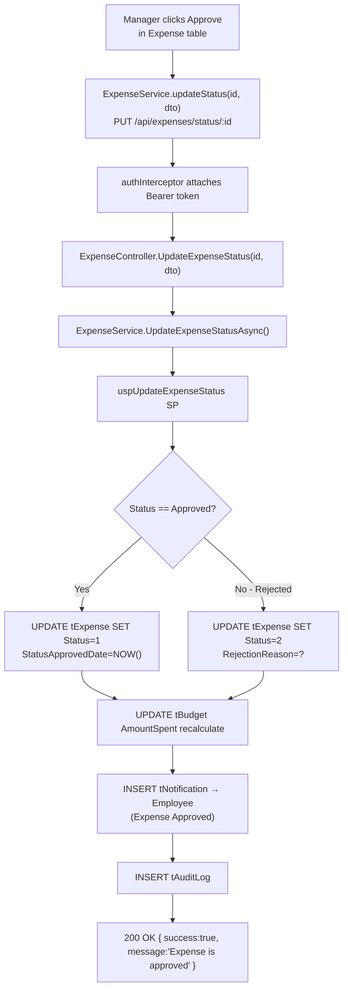
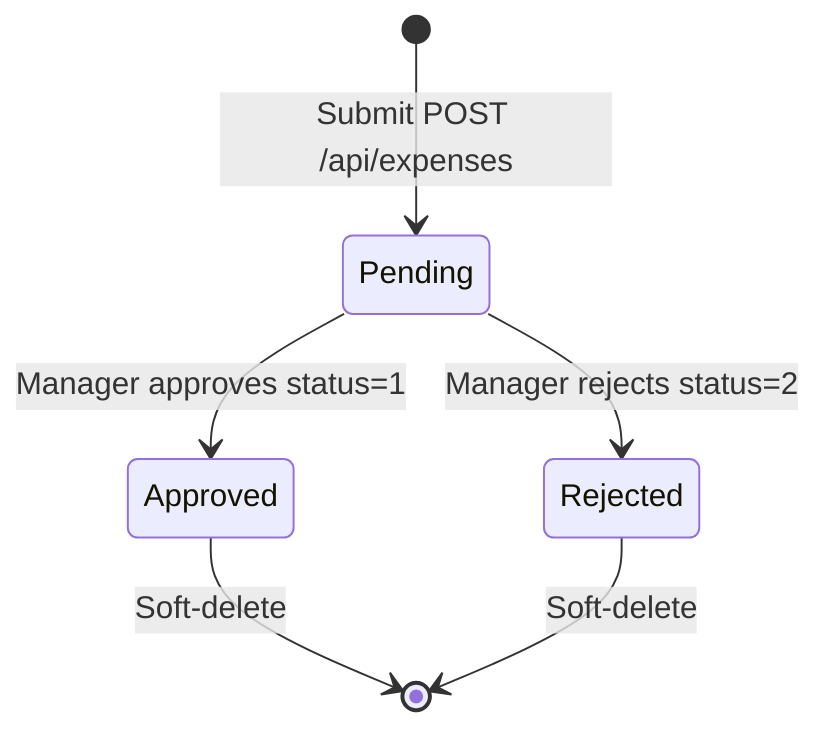

# Expense Module — Complete Documentation

> **Stack:** ASP.NET Core 10 · Entity Framework Core 10 · SQL Server Stored Procedures · Angular 21 · Bootstrap 5
> **Base URL:** `http://localhost:5131`
> **Generated:** 2026-03-07

---

## Table of Contents

1. [Module Overview](#1-module-overview)
2. [Authentication & Authorization Flow](#2-authentication--authorization-flow)
3. [Role-Based Access Control in Expense Module](#3-role-based-access-control-in-expense-module)
4. [Entity & DTOs](#4-entity--dtos)
5. [Repository Layer](#5-repository-layer)
6. [Service Layer](#6-service-layer)
7. [Controller Layer](#7-controller-layer)
8. [Complete API Reference](#8-complete-api-reference)
9. [End-to-End Data Flow Diagrams](#9-end-to-end-data-flow-diagrams)
10. [Expense Lifecycle State Machine](#10-expense-lifecycle-state-machine)

---

## 1. Module Overview

The **Expense Module** handles submission, review, and approval of expenses against allocated budgets. Employees submit expenses, Managers approve or reject them, and the system recalculates budget utilization automatically.

### What the Expense Module Does

| Capability           | Description                                                                          |
| -------------------- | ------------------------------------------------------------------------------------ |
| Submit Expense       | Manager/Employee submits an expense against an active, non-expired budget            |
| Budget Validation    | Validates budget exists, is active, not expired, and has sufficient remaining funds  |
| Approval Workflow    | Manager approves or rejects pending expenses with optional comments/reason           |
| Role-Filtered Lists  | Admin: all expenses; Manager: own team's; Employee: own only                         |
| KPI Statistics       | Real-time counts and amounts for Pending/Approved/Rejected, matching current filters |
| Notifications        | Manager notified on new expense; Employee notified on approve/reject                 |
| Audit Logging        | Full JSON snapshots of old/new state logged to `tAuditLog`                           |
| Budget Recalculation | `AmountSpent` and `AmountRemaining` updated on approval/rejection                    |

---

## 2. Authentication & Authorization Flow

Every API request to the Expense module requires a valid JWT Bearer token.



### JWT Token Claims

| Claim Type                  | Example Value | Used For                                    |
| --------------------------- | ------------- | ------------------------------------------- |
| `ClaimTypes.NameIdentifier` | `7`           | `UserId` in controller                      |
| `ClaimTypes.Role`           | `Employee`    | Role filtering                              |
| `EmployeeId`                | `EMP2601`     | Display                                     |
| `ManagerId`                 | `2`           | Employee sees only their manager's expenses |

---

## 3. Role-Based Access Control in Expense Module



### Access Logic in Code

```
GET /api/expenses/managed  (ExpenseController)
│
├── Extract role from JWT: ClaimTypes.Role
├── Extract ManagerId from JWT claim "ManagerId"
│
├── IF role == "Employee"
│    ├── managerId = JWT.ManagerId (their manager)
│    └── Filter: SubmittedByUserID = UserId (own expenses only)
│
├── IF role == "Manager"
│    ├── managerId = UserId (their own team)
│    └── Sees all expenses submitted by their employees
│
└── Calls GetManagedExpensesAsync(ManagedExpenseFilterDto)
```

---

## 4. Entity & DTOs

### Entity: `Expense` (table: `tExpense`)

| Property             | Type          | Constraints                    | Description                       |
| -------------------- | ------------- | ------------------------------ | --------------------------------- |
| `ExpenseID`          | int           | PK, Identity                   | Auto-generated primary key        |
| `BudgetID`           | int           | FK → tBudget, Required         | Associated budget                 |
| `CategoryID`         | int           | FK → tCategory, Required       | Expense category                  |
| `Title`              | string        | Required, Max 500              | Expense title                     |
| `Amount`             | decimal(18,2) | Required                       | Expense amount                    |
| `MerchantName`       | string?       | Max 200                        | Optional merchant                 |
| `SubmittedByUserID`  | int           | FK → tUser, Required           | Who submitted                     |
| `SubmittedDate`      | DateTime      | Required, default GETUTCDATE() | Submission timestamp              |
| `Status`             | ExpenseStatus | Required, default Pending      | 0=Pending, 1=Approved, 2=Rejected |
| `ManagerUserID`      | int?          | FK → tUser                     | Manager who approved/rejected     |
| `StatusApprovedDate` | DateTime?     | —                              | When status was set               |
| `RejectionReason`    | string?       | Max 500                        | Reason if rejected                |
| `Notes`              | string?       | Max 1000                       | Additional notes                  |
| `ApprovalComments`   | string?       | Max 1000                       | Manager's comments on approval    |
| `CreatedDate`        | DateTime      | Required, default GETUTCDATE() | Record creation time              |
| `UpdatedDate`        | DateTime?     | —                              | Last update time                  |
| `UpdatedByUserID`    | int?          | FK → tUser                     | Who last updated                  |
| `IsDeleted`          | bool          | default false                  | Soft-delete flag                  |
| `DeletedDate`        | DateTime?     | —                              | Soft-delete timestamp             |
| `DeletedByUserID`    | int?          | FK → tUser                     | Who deleted                       |

### DTO: `CreateExpenseDTO`

| Field          | Type    | Required | Validation                                |
| -------------- | ------- | -------- | ----------------------------------------- |
| `BudgetId`     | int     | ✅        | Must be valid, active, non-expired budget |
| `CategoryId`   | int     | ✅        | Must be a valid, active category          |
| `Title`        | string  | ✅        | Max 500 chars                             |
| `Amount`       | decimal | ✅        | Must be > 0 (Range: 0.01 – MaxValue)      |
| `MerchantName` | string? | ❌        | Max 200 chars                             |

### DTO: `AllExpenseDto`

| Field                   | Type      | Description                       |
| ----------------------- | --------- | --------------------------------- |
| `ExpenseID`             | int       | Expense identifier                |
| `BudgetID`              | int       | Budget reference                  |
| `BudgetTitle`           | string    | Budget title                      |
| `BudgetCode`            | string?   | Budget code (e.g. BT26001)        |
| `CategoryID`            | int       | Category reference                |
| `CategoryName`          | string    | Category name                     |
| `Title`                 | string    | Expense title                     |
| `Amount`                | decimal   | Expense amount                    |
| `MerchantName`          | string?   | Optional merchant                 |
| `Status`                | int       | 0=Pending, 1=Approved, 2=Rejected |
| `StatusName`            | string    | Human-readable status             |
| `SubmittedDate`         | DateTime  | When submitted                    |
| `SubmittedByUserID`     | int       | Submitter user ID                 |
| `SubmittedByUserName`   | string    | Submitter name                    |
| `SubmittedByEmployeeID` | string    | Submitter employee ID             |
| `DepartmentName`        | string    | Department of submitter           |
| `ManagerUserID`         | int?      | Manager who processed             |
| `ApprovedByUserName`    | string?   | Manager name                      |
| `StatusApprovedDate`    | DateTime? | When approved/rejected            |
| `ApprovalComments`      | string?   | Manager comments                  |
| `RejectionReason`       | string?   | Rejection reason                  |
| `Notes`                 | string?   | Additional notes                  |
| `CreatedDate`           | DateTime  | Record created                    |
| `UpdatedDate`           | DateTime? | Last updated                      |

### DTO: `UpdateExpenseStatusDto`

| Field      | Type          | Required | Description                                   |
| ---------- | ------------- | -------- | --------------------------------------------- |
| `Status`   | ExpenseStatus | ✅        | `Approved` (1) or `Rejected` (2)              |
| `Comments` | string?       | ❌        | Approval comments (used when Status=Approved) |
| `Reason`   | string?       | ❌        | Rejection reason (used when Status=Rejected)  |

### DTO: `ExpenseStatisticsDto`

| Field            | Description                     |
| ---------------- | ------------------------------- |
| `TotalExpenses`  | Total count matching filters    |
| `PendingCount`   | Count of pending expenses       |
| `ApprovedCount`  | Count of approved expenses      |
| `RejectedCount`  | Count of rejected expenses      |
| `TotalAmount`    | Sum of all expense amounts      |
| `PendingAmount`  | Sum of pending expense amounts  |
| `ApprovedAmount` | Sum of approved expense amounts |
| `RejectedAmount` | Sum of rejected expense amounts |

---

## 5. Repository Layer

### Interface: `IExpenseRepository`

```csharp
public interface IExpenseRepository
{
    Task<PagedResult<AllExpenseDto>> GetAllExpensesAsync(ExpenseFilterDto filters);
    Task<PagedResult<AllExpenseDto>> GetExpensesByBudgetIDAsync(int budgetID, ExpenseFilterDto filters);
    Task<PagedResult<AllExpenseDto>> GetManagedExpensesAsync(ManagedExpenseFilterDto filters);
    Task<int> CreateExpenseAsync(CreateExpenseDTO dto, int submittedByUserID);
    Task<bool> UpdateExpenseStatusAsync(int expenseID, int status, int approvedByUserID,
        string? approvalComments = null, string? rejectionReason = null);
    Task<ExpenseStatisticsDto> GetExpenseStatisticsAsync(ManagedExpenseFilterDto filters);
}
```

### Implementation: `ExpenseRepository`



| Method                       | Mechanism                                  | Description                                                    |
| ---------------------------- | ------------------------------------------ | -------------------------------------------------------------- |
| `GetAllExpensesAsync`        | EF Core View `vwGetAllExpenses`            | All expenses with joins, paginated                             |
| `GetExpensesByBudgetIDAsync` | EF Core View, filtered by BudgetID         | Expenses under a specific budget                               |
| `GetManagedExpensesAsync`    | EF Core View, role-filtered                | Team/own expenses based on role                                |
| `CreateExpenseAsync`         | Stored Procedure `uspCreateExpense`        | Validates budget, creates expense, recalculates budget amounts |
| `UpdateExpenseStatusAsync`   | Stored Procedure `uspUpdateExpenseStatus`  | Approve/reject, update budget amounts, send notification       |
| `GetExpenseStatisticsAsync`  | Stored Procedure `uspGetExpenseStatistics` | Aggregated KPI counts and amounts                              |

---

## 6. Service Layer

### Interface: `IExpenseService`

```csharp
public interface IExpenseService
{
    Task<PagedResult<AllExpenseDto>> GetAllExpensesAsync(ExpenseFilterDto filters);
    Task<PagedResult<AllExpenseDto>> GetExpensesByBudgetIDAsync(int budgetID, ExpenseFilterDto filters);
    Task<PagedResult<AllExpenseDto>> GetManagedExpensesAsync(ManagedExpenseFilterDto filters);
    Task<int> CreateExpenseAsync(CreateExpenseDTO dto, int submittedByUserID);
    Task<bool> UpdateExpenseStatusAsync(int expenseID, int status, int approvedByUserID,
        string? approvalComments = null, string? rejectionReason = null);
    Task<ExpenseStatisticsDto> GetExpenseStatisticsAsync(ManagedExpenseFilterDto filters);
}
```

### Implementation: `ExpenseService`

`ExpenseService` is a thin pass-through to the repository. Key validation happens in the stored procedures:

- **Budget validation** — checks budget exists, is active (`Status = 1`), not expired (`EndDate >= NOW()`), and has sufficient remaining funds
- **Duplicate prevention** — prevents re-approving or re-rejecting an already-processed expense
- **Budget recalculation** — `uspUpdateExpenseStatus` updates `AmountSpent` / `AmountRemaining` on the parent budget on approval or rejection
- **Over-budget protection** — when approving, `AmountRemaining` is set to `0` (never negative) if `(AmountSpent + @Amount) > AmountAllocated`; the stored `AmountRemaining` is always `≥ 0`

---

## 7. Controller Layer

### `ExpenseController`

```
Route: api/expenses
Base: BaseApiController (extracts UserId from JWT)
```

| Method | Route                              | Roles             | Handler                |
| ------ | ---------------------------------- | ----------------- | ---------------------- |
| GET    | `/api/expenses/stats`              | All               | `GetExpenseStatistics` |
| GET    | `/api/expenses`                    | All               | `GetAllExpenses`       |
| GET    | `/api/expenses/managed`            | Manager, Employee | `GetManagedExpenses`   |
| POST   | `/api/expenses`                    | Manager, Employee | `CreateExpense`        |
| PUT    | `/api/expenses/status/{expenseID}` | Manager           | `UpdateExpenseStatus`  |

**Error Handling:**

| Exception                                   | HTTP Response             |
| ------------------------------------------- | ------------------------- |
| `"not found"` / `"does not exist"`          | 404 Not Found             |
| `"insufficient"` / `"exceeds"`              | 400 Bad Request           |
| `"No changes detected"`                     | 400 Bad Request           |
| `"already"` / `"cannot"` / `"Only pending"` | 400 Bad Request           |
| Unhandled                                   | 500 Internal Server Error |

---

## 8. Complete API Reference

### `GET /api/expenses/stats`

**Roles:** Admin, Manager, Employee

**Query Parameters:**

| Parameter               | Type    | Description                                  |
| ----------------------- | ------- | -------------------------------------------- |
| `budgetID`              | int?    | Filter by budget                             |
| `title`                 | string? | Filter by expense title                      |
| `budgetTitle`           | string? | Filter by budget title                       |
| `status`                | string? | Filter by status (Pending/Approved/Rejected) |
| `categoryName`          | string? | Filter by category                           |
| `submittedUserName`     | string? | Filter by submitter name                     |
| `submittedByEmployeeID` | string? | Filter by employee ID                        |
| `departmentName`        | string? | Filter by department                         |
| `myExpensesOnly`        | bool    | `true` = only current user's expenses        |

**Response `200 OK`:**
```json
{
  "totalExpenses": 45,
  "pendingCount": 12,
  "approvedCount": 28,
  "rejectedCount": 5,
  "totalAmount": 550000.00,
  "pendingAmount": 120000.00,
  "approvedAmount": 390000.00,
  "rejectedAmount": 40000.00
}
```

**Status Codes:**

| Code  | When              |
| ----- | ----------------- |
| `200` | Success           |
| `401` | Not authenticated |
| `403` | Wrong role        |
| `500` | Server error      |

---

### `GET /api/expenses`

**Roles:** Admin, Manager, Employee

**Query Parameters:**

| Parameter               | Type    | Default         | Description                       |
| ----------------------- | ------- | --------------- | --------------------------------- |
| `title`                 | string? | —               | Expense title filter              |
| `budgetTitle`           | string? | —               | Budget title filter               |
| `status`                | string? | —               | `Pending`, `Approved`, `Rejected` |
| `categoryName`          | string? | —               | Category filter                   |
| `submittedUserName`     | string? | —               | Submitter name filter             |
| `submittedByEmployeeID` | string? | —               | Employee ID filter                |
| `departmentName`        | string? | —               | Department filter                 |
| `sortBy`                | string? | `SubmittedDate` | Sort field                        |
| `sortOrder`             | string? | `desc`          | `asc` or `desc`                   |
| `pageNumber`            | int     | `1`             | Page index                        |
| `pageSize`              | int     | `10`            | Max 100                           |

**Response `200 OK`:**
```json
{
  "data": [{
    "expenseID": 1,
    "budgetID": 1,
    "budgetTitle": "Engineering Operations",
    "budgetCode": "BT2601",
    "categoryID": 4,
    "categoryName": "Cloud Infrastructure",
    "title": "Monthly Cloud Hosting",
    "amount": 109913.00,
    "merchantName": "HashiCorp Inc",
    "status": 1,
    "statusName": "Pending",
    "submittedDate": "2026-01-28T03:56:07",
    "submittedByUserID": 7,
    "submittedByUserName": "Shivali Sharma",
    "submittedByEmployeeID": "EMP2601",
    "departmentName": "Engineering",
    "managerUserID": 2,
    "approvedByUserName": null,
    "statusApprovedDate": null,
    "approvalComments": null,
    "rejectionReason": null,
    "notes": null,
    "createdDate": "2026-01-28T03:56:07",
    "updatedDate": null
  }],
  "pageNumber": 1,
  "pageSize": 10,
  "totalRecords": 45,
  "totalPages": 5,
  "hasNextPage": true,
  "hasPreviousPage": false
}
```

---

### `GET /api/expenses/managed`

**Roles:** Manager, Employee

**Query Parameters:** Same as `/api/expenses` plus:

| Parameter        | Type | Default | Description                      |
| ---------------- | ---- | ------- | -------------------------------- |
| `myExpensesOnly` | bool | `false` | Employee: show only own expenses |

**Role Behavior:**

| Role     | Data Returned                                     |
| -------- | ------------------------------------------------- |
| Manager  | All expenses submitted by their employees         |
| Employee | Own expenses; or team's if `myExpensesOnly=false` |

**Status Codes:**

| Code  | When                                       |
| ----- | ------------------------------------------ |
| `200` | Success                                    |
| `401` | Not authenticated                          |
| `403` | Admin tries to access (role not permitted) |
| `500` | Server error                               |

---

### `POST /api/expenses`

**Roles:** Manager, Employee

**Request Body:**
```json
{
  "budgetId": 1,
  "categoryId": 4,
  "title": "Monthly Cloud Hosting",
  "amount": 109913.00,
  "merchantName": "HashiCorp Inc"
}
```

**Field Validations:**

| Field          | Rule                                                |
| -------------- | --------------------------------------------------- |
| `budgetId`     | Required, budget must exist, be Active, not expired |
| `categoryId`   | Required, category must exist and be active         |
| `title`        | Required, max 500 chars                             |
| `amount`       | Required, must be > 0                               |
| `merchantName` | Optional, max 200 chars                             |

**Responses:**

`201 Created`:
```json
{ "expenseId": 42, "message": "Expense is created" }
```

`400 Bad Request` (budget insufficient funds):
```json
{ "success": false, "message": "Expense amount exceeds budget remaining amount" }
```

`404 Not Found` (budget/category not found):
```json
{ "success": false, "message": "Budget not found or not active" }
```

---

### `PUT /api/expenses/status/{expenseID}`

**Roles:** Manager only

**Route Param:** `expenseID` (int)

**Request Body:**
```json
{
  "status": 1,
  "comments": "Approved as per Q1 budget plan",
  "reason": null
}
```

| Field      | Status=Approved | Status=Rejected |
| ---------- | --------------- | --------------- |
| `status`   | `1`             | `2`             |
| `comments` | Used            | Ignored         |
| `reason`   | Ignored         | Used            |

**Responses:**

`200 OK` (approved):
```json
{ "success": true, "message": "Expense is approved" }
```

`200 OK` (rejected):
```json
{ "success": true, "message": "Expense is rejected" }
```

`400 Bad Request` (already processed):
```json
{ "success": false, "message": "Only pending expenses can be approved or rejected" }
```

`404 Not Found`:
```json
{ "success": false, "message": "Expense not found" }
```

---

## 9. End-to-End Data Flow Diagrams

### Employee Submits an Expense



### Manager Approves an Expense



---

## 10. Expense Lifecycle State Machine


