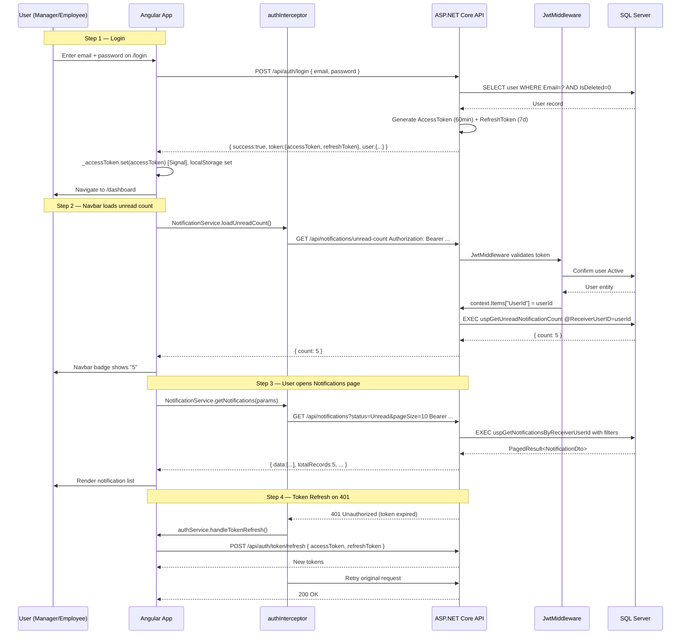
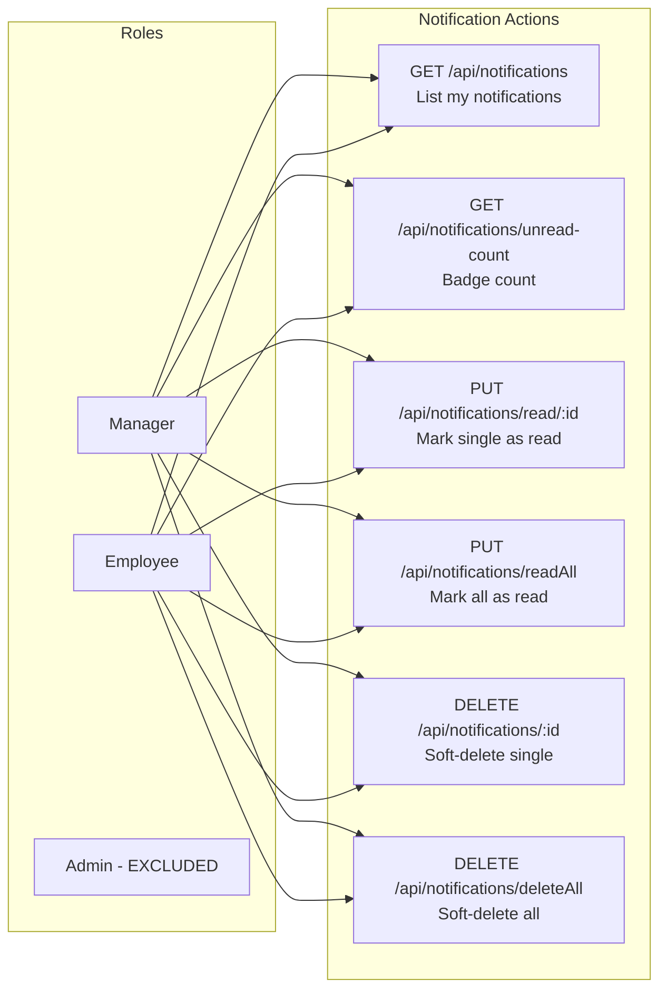
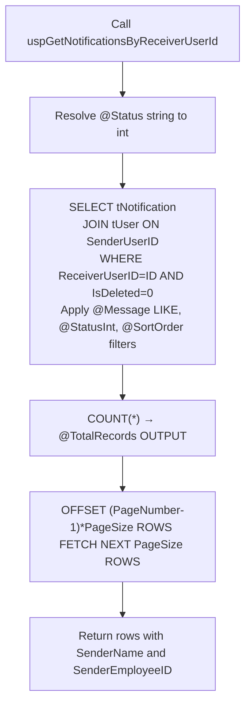
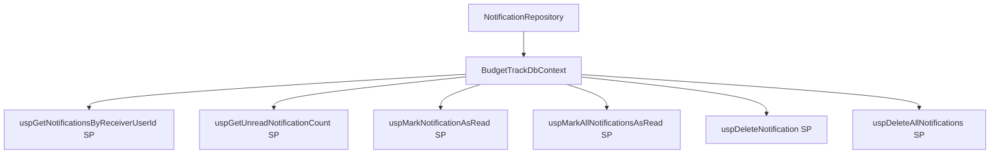
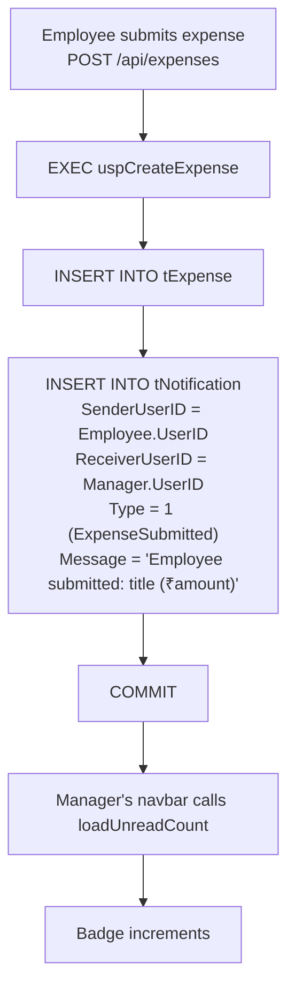
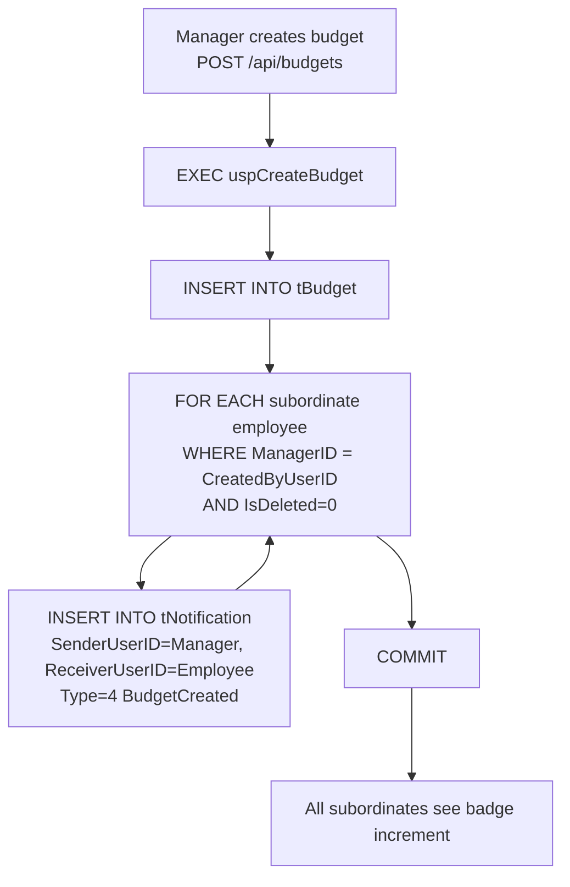
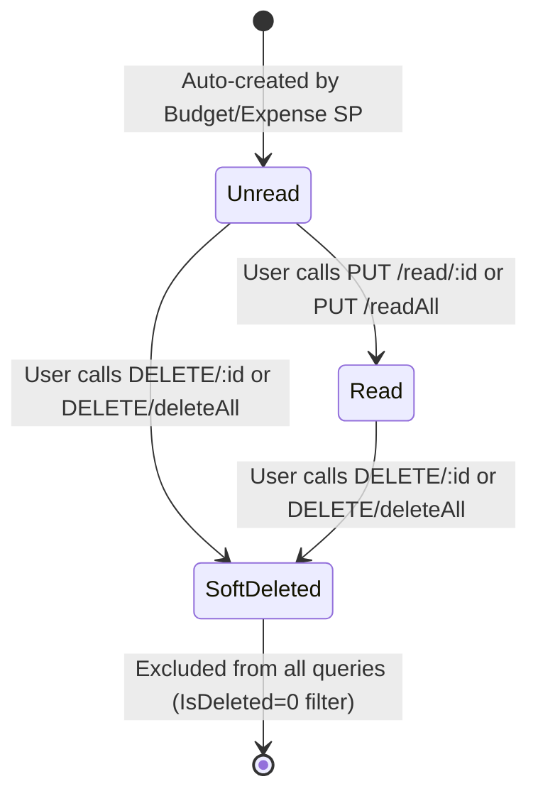

# Notification Module — Complete Documentation

> **Stack:** ASP.NET Core 10 · Entity Framework Core 10 · SQL Server Stored Procedures · Angular 21 · Bootstrap 5
> **Base URL:** `http://localhost:5131`
> **Generated:** 2026-03-07

---

## Table of Contents

1. [Module Overview](#1-module-overview)
2. [Authentication & Authorization Flow](#2-authentication--authorization-flow)
3. [Role-Based Access Control](#3-role-based-access-control)
4. [Database Layer — Notification.sql](#4-database-layer--notificationsql)
5. [Entity & DTOs](#5-entity--dtos)
6. [Repository Layer](#6-repository-layer)
7. [Service Layer](#7-service-layer)
8. [Controller Layer](#8-controller-layer)
9. [Complete API Reference](#9-complete-api-reference)
10. [Angular Frontend](#10-angular-frontend)
11. [End-to-End Data Flow Diagrams](#11-end-to-end-data-flow-diagrams)
12. [Notification Lifecycle State Machine](#12-notification-lifecycle-state-machine)

---

## 1. Module Overview

The **Notification Module** delivers real-time in-app notifications to Managers and Employees when key events occur (expense submitted, approved, rejected; budget created, updated, deleted). Admins do not receive notifications.

### What the Notification Module Does

| Capability               | Description                                                                 |
| ------------------------ | --------------------------------------------------------------------------- |
| Receive Notifications    | Manager/Employee views their notifications (paginated, filterable)          |
| Unread Count             | Get badge count of unread notifications via dedicated endpoint              |
| Mark Single as Read      | Mark one notification as Read; validates receiver ownership                 |
| Mark All as Read         | Bulk-mark all Unread notifications as Read in one call                      |
| Soft Delete Single       | Soft-delete one owned notification                                          |
| Soft Delete All          | Soft-delete all notifications for the user                                  |
| Auto-Generated           | Notifications created automatically by Budget/Expense stored procedures     |
| Ownership Enforcement    | Users can only read/mark/delete their own notifications                     |

### Notification Trigger Events

| Event                    | Sender     | Receiver     | Type               |
| ------------------------ | ---------- | ------------ | ------------------ |
| Employee submits expense | Employee   | Manager      | `ExpenseSubmitted` |
| Manager approves expense | Manager    | Employee     | `ExpenseApproved`  |
| Manager rejects expense  | Manager    | Employee     | `ExpenseRejected`  |
| Manager creates budget   | Manager    | Subordinates | `BudgetCreated`    |
| Manager updates budget   | Manager    | Subordinates | `BudgetUpdated`    |
| Manager deletes budget   | Manager    | Subordinates | `BudgetDeleted`    |

---

## 2. Authentication & Authorization Flow

Every request to the Notification module requires a valid JWT Bearer token. The ReceiverUserID is extracted from the JWT — users never pass their own ID; it is always derived from the token.



### JWT Token Claims Used

| Claim Type                  | Example Value | Used For                                     |
| --------------------------- | ------------- | -------------------------------------------- |
| `ClaimTypes.NameIdentifier` | `7`           | `ReceiverUserID` — prevents unauthorized access |
| `ClaimTypes.Role`           | `Employee`    | `[Authorize(Roles="Manager,Employee")]`      |

### Token Storage

| Token         | Storage                       | Duration   |
| ------------- | ----------------------------- | ---------- |
| Access Token  | Angular Signal + localStorage | 60 minutes |
| Refresh Token | localStorage only             | 7 days     |

---

## 3. Role-Based Access Control



### Access Logic in Code

```
All   → [Authorize(Roles = "Manager,Employee")] — class-level
│
├── ReceiverUserID = JWT ClaimTypes.NameIdentifier (int)
└── All SP calls pass @ReceiverUserID — data scoped to caller's notifications only
     Ownership: SP validates ReceiverUserID matches tNotification.ReceiverUserID
```

> **Admin is fully excluded** — Admins manage system data; they interact with the Audit Log module instead.

---

## 4. Database Layer — Notification.sql

Located at `Database/Budget-Track/Notification.sql`. Contains **6 Stored Procedures** used by the notification API (notifications are *created* by Budget/Expense SPs — not this file).

---

### 4.1 `uspGetNotificationsByReceiverUserId` — Paginated Notification List

**Parameters:**

| Parameter         | Type           | Required | Default | Description                         |
| ----------------- | -------------- | -------- | ------- | ----------------------------------- |
| `@ReceiverUserID` | INT            | ✅        | —       | Logged-in user's ID from JWT        |
| `@Message`        | NVARCHAR(500)? | ❌        | NULL    | LIKE `%?%` filter on message text   |
| `@Status`         | VARCHAR(20)?   | ❌        | NULL    | `'Unread'` → 1, `'Read'` → 2       |
| `@SortOrder`      | VARCHAR(4)     | ❌        | `desc`  | `asc` or `desc` by CreatedDate      |
| `@PageNumber`     | INT            | ❌        | 1       | Page index                          |
| `@PageSize`       | INT            | ❌        | 10      | Max 100                             |
| `@TotalRecords`   | INT OUTPUT     | —        | —       | Total matching records              |

**Status Resolution in SP:**
```sql
SET @StatusInt = CASE
    WHEN LOWER(@Status) = 'unread' THEN 1
    WHEN LOWER(@Status) = 'read'   THEN 2
    ELSE NULL
END;
-- WHERE clause:
WHERE ReceiverUserID = @ReceiverUserID
  AND IsDeleted = 0
  AND (@StatusInt IS NULL
       OR n.Status = @StatusInt
       OR (@StatusInt = 1 AND n.Status = 0))  -- defensive: Status=0 treated as Unread
```

**Flow:**



---

### 4.2 `uspGetUnreadNotificationCount` — Unread Badge Count

**Parameters:** `@ReceiverUserID INT`, `@UnreadCount INT OUTPUT`

```sql
SELECT @UnreadCount = COUNT(*)
FROM tNotification
WHERE ReceiverUserID = @ReceiverUserID
  AND IsDeleted = 0
  AND Status IN (0, 1);   -- Status 0 defensive + 1 = Unread
```

> Used by the Angular navbar to display the unread badge. Called on page load and after mark-as-read actions.

---

### 4.3 `uspMarkNotificationAsRead`

```sql
UPDATE tNotification
SET Status = 2, ReadDate = GETUTCDATE()
WHERE NotificationID = @NotificationID
  AND ReceiverUserID = @ReceiverUserID   -- Ownership check
  AND IsDeleted = 0
  AND Status IN (0, 1);
```

> Returns 0 rows affected if already read or not owned → service returns `false` → controller returns 404.

---

### 4.4 `uspMarkAllNotificationsAsRead`

```sql
UPDATE tNotification
SET Status = 2, ReadDate = GETUTCDATE()
WHERE ReceiverUserID = @ReceiverUserID
  AND IsDeleted = 0
  AND Status IN (0, 1);

SET @UpdatedCount = @@ROWCOUNT;
```

---

### 4.5 `uspDeleteNotification` — Soft Delete Single

```sql
-- Ownership check first
IF NOT EXISTS (SELECT 1 FROM tNotification WHERE NotificationID=@NotificationID AND ReceiverUserID=@ReceiverUserID AND IsDeleted=0)
    RAISERROR('Notification not found or does not belong to this user', 16, 1);

UPDATE tNotification
SET IsDeleted=1, DeletedDate=GETUTCDATE()
WHERE NotificationID=@NotificationID AND ReceiverUserID=@ReceiverUserID;
```

> **Soft delete** — data is preserved in DB. Excluded from queries by `IsDeleted=0` filter.

---

### 4.6 `uspDeleteAllNotifications` — Soft Delete All

```sql
UPDATE tNotification
SET IsDeleted=1, DeletedDate=GETUTCDATE()
WHERE ReceiverUserID=@ReceiverUserID AND IsDeleted=0;

SET @DeletedCount = @@ROWCOUNT;
```

---

### How Notifications Are Created (by Other Modules' SPs)

Notifications are **never created via the Notification API** — they are auto-inserted by other SPs:

| SP That Inserts Notification     | Event           | Receiver            |
| -------------------------------- | --------------- | ------------------- |
| `uspCreateExpense`               | Expense submit  | Employee's Manager  |
| `uspUpdateExpenseStatus`         | Approve/Reject  | Expense submitter   |
| `uspCreateBudget`                | Budget created  | Manager's employees |
| `uspUpdateBudget`                | Budget updated  | Manager's employees |
| `uspDeleteBudget`                | Budget deleted  | Manager's employees |

---

## 5. Entity & DTOs

### 5.1 `Notification` Entity (`Models/Entities/Notification.cs`)

```csharp
[Table("tNotification")]
[Index(nameof(ReceiverUserID))]
public class Notification
{
    [Key] public int NotificationID { get; set; }
    [Required] public int SenderUserID { get; set; }
    [Required] public int ReceiverUserID { get; set; }
    [Required] public NotificationType Type { get; set; }
    [Required][MaxLength(500)] public required string Message { get; set; }
    public NotificationStatus Status { get; set; } = NotificationStatus.Unread;
    public DateTime CreatedDate { get; set; } = DateTime.UtcNow;
    public DateTime? ReadDate { get; set; }
    [MaxLength(50)] public string? RelatedEntityType { get; set; }
    public int? RelatedEntityID { get; set; }
    public bool IsDeleted { get; set; } = false;
    public DateTime? DeletedDate { get; set; }
    // Navigation
    public virtual User Sender { get; set; } = null!;
    public virtual User Receiver { get; set; } = null!;
}
```

**Global Query Filter:** `WHERE IsDeleted = 0` via EF Core.

---

### 5.2 Enums

**`NotificationType`**:

| Value | Name               | Trigger                       |
| ----- | ------------------ | ----------------------------- |
| 1     | `ExpenseSubmitted` | Employee submits expense      |
| 2     | `ExpenseApproved`  | Manager approves expense      |
| 3     | `ExpenseRejected`  | Manager rejects expense       |
| 4     | `BudgetCreated`    | Manager creates budget        |
| 5     | `BudgetUpdated`    | Manager updates budget        |
| 6     | `BudgetDeleted`    | Manager deletes budget        |

**`NotificationStatus`**:

| Value | Name     | Notes                                         |
| ----- | -------- | --------------------------------------------- |
| 0     | (Legacy) | Treated as Unread defensively by SP           |
| 1     | `Unread` | Default on creation                           |
| 2     | `Read`   | Set by mark-as-read SPs                       |

---

### 5.3 DTOs

**`GetNotificationDto`** — Read response:

| Field               | Type             | Description                                   |
| ------------------- | ---------------- | --------------------------------------------- |
| `NotificationID`    | int              | Notification PK                               |
| `Type`              | NotificationType | Enum 1–6                                      |
| `Message`           | string           | Human-readable notification text              |
| `CreatedDate`       | DateTime         | When notification was created                 |
| `SenderEmployeeID`  | string           | Sender's employee ID (e.g. `MGR2601`)         |
| `SenderName`        | string           | Sender's full name                            |
| `Status`            | int              | 1=Unread, 2=Read                              |
| `IsRead`            | bool             | Computed: `Status == 2`                       |

---

## 6. Repository Layer

**Interface:** `INotificationRepository`

```csharp
Task<PagedResult<GetNotificationDto>> GetNotificationsByReceiverUserIdAsync(
    int receiverUserID, string? message, string? status,
    string sortOrder, int pageNumber, int pageSize);
Task<bool> MarkNotificationAsReadAsync(int notificationID, int receiverUserID);
Task<int> MarkAllNotificationsAsReadAsync(int receiverUserID);
Task<bool> DeleteNotificationAsync(int notificationID, int receiverUserID);
Task<int> DeleteAllNotificationsAsync(int receiverUserID);
```

**Implementation: `NotificationRepository`**



| Method                                   | SP Called                                   | Description                                                          |
| ---------------------------------------- | ------------------------------------------- | -------------------------------------------------------------------- |
| `GetNotificationsByReceiverUserIdAsync`  | `uspGetNotificationsByReceiverUserId`        | Paginated, filtered; joins tUser for SenderName/SenderEmployeeID    |
| `MarkNotificationAsReadAsync`            | `uspMarkNotificationAsRead`                  | Sets Status=2, ReadDate=NOW(); returns `false` if not found/owned   |
| `MarkAllNotificationsAsReadAsync`        | `uspMarkAllNotificationsAsRead`              | Bulk-marks Status IN (0,1) → 2; returns count updated               |
| `DeleteNotificationAsync`                | `uspDeleteNotification`                      | Ownership check then soft-delete (IsDeleted=1)                      |
| `DeleteAllNotificationsAsync`            | `uspDeleteAllNotifications`                  | Bulk soft-delete all for user; returns count                         |

---

## 7. Service Layer

**Interface:** `INotificationService`

```csharp
Task<PagedResult<GetNotificationDto>> GetNotificationsByReceiverUserIdAsync(
    int receiverUserID, string? message, string? status,
    string sortOrder, int pageNumber, int pageSize);
Task<bool> MarkNotificationAsReadAsync(int notificationID, int receiverUserID);
Task<int> MarkAllNotificationsAsReadAsync(int receiverUserID);
Task<bool> DeleteNotificationAsync(int notificationID, int receiverUserID);
Task<int> DeleteAllNotificationsAsync(int receiverUserID);
```

**Business Rules in `NotificationService`:**

| Operation               | Validation / Business Rule                                      | Enforced By    |
| ----------------------- | --------------------------------------------------------------- | -------------- |
| Get Notifications       | `ReceiverUserID` from JWT — user only sees own notifications    | SP WHERE clause |
| Mark as Read            | Notification must exist AND belong to calling user              | SP ownership check |
| Mark All as Read        | Only affects Status IN (0,1) — already-read ones ignored        | SP WHERE clause |
| Delete Single           | Ownership validated before soft-delete                          | SP RAISERROR   |
| Delete All              | Only affects this user's non-deleted notifications              | SP WHERE clause |

`NotificationService` is a thin pass-through — ownership and all rules are enforced within the SPs.

**Dependency Injection:**
```csharp
// Program.cs
builder.Services.AddScoped<INotificationService, NotificationService>();
builder.Services.AddScoped<INotificationRepository, NotificationRepository>();
```

---

## 8. Controller Layer

**`NotificationController`** extends `BaseApiController`:

```csharp
[ApiController]
[Route("api/notifications")]
[Authorize(Roles = "Manager,Employee")]  // class-level
public class NotificationController : BaseApiController
{
    private readonly INotificationService _notificationService;
}
```

**Action → Role → SP Mapping:**

| Method | Route                                    | Roles             | Action                    |
| ------ | ---------------------------------------- | ----------------- | ------------------------- |
| GET    | `/api/notifications`                     | Manager, Employee | `GetNotifications`        |
| GET    | `/api/notifications/unread-count`        | Manager, Employee | `GetUnreadCount`          |
| PUT    | `/api/notifications/read/{notificationID}` | Manager, Employee | `MarkAsRead`              |
| PUT    | `/api/notifications/readAll`             | Manager, Employee | `MarkAllAsRead`           |
| DELETE | `/api/notifications/{notificationID}`    | Manager, Employee | `DeleteNotification`      |
| DELETE | `/api/notifications/deleteAll`           | Manager, Employee | `DeleteAllNotifications`  |

**Error Handling:**

| Exception Pattern                        | HTTP Response             |
| ---------------------------------------- | ------------------------- |
| `"not found"` / `"already been deleted"` | 404 Not Found             |
| `"Unauthorized"` / `"does not belong"`   | 401 Unauthorized          |
| Unhandled                                | 500 Internal Server Error |

---

## 9. Complete API Reference

> **Auth Header required:** `Authorization: Bearer <accessToken>`  
> **Role restriction:** Manager and Employee only. Admin receives 403.

---

### `GET /api/notifications`

**Roles:** Manager, Employee

**Query Parameters:**

| Parameter    | Type    | Default | Description                              |
| ------------ | ------- | ------- | ---------------------------------------- |
| `message`    | string? | —       | Search by message text                   |
| `status`     | string? | —       | `Unread` or `Read` (`all` = no filter)   |
| `sortOrder`  | string  | `desc`  | `asc` or `desc` by CreatedDate           |
| `pageNumber` | int     | `1`     | Page index                               |
| `pageSize`   | int     | `10`    | Records per page (max 100)               |

**Response `200 OK`:**
```json
{
  "data": [{
    "notificationID": 12,
    "type": 1,
    "message": "Shivali Sharma submitted an expense: Monthly Cloud Hosting (₹109,913)",
    "createdDate": "2026-01-28T03:56:07",
    "senderEmployeeID": "EMP2601",
    "senderName": "Shivali Sharma",
    "status": 1,
    "isRead": false
  }],
  "pageNumber": 1,
  "pageSize": 10,
  "totalRecords": 5,
  "totalPages": 1,
  "hasNextPage": false,
  "hasPreviousPage": false
}
```

---

### `GET /api/notifications/unread-count`

**Roles:** Manager, Employee

**Response `200 OK`:**
```json
{ "count": 5 }
```

> Returns `{ "count": 0 }` if no unread notifications. Used by Angular navbar badge.

---

### `PUT /api/notifications/read/{notificationID}`

**Roles:** Manager, Employee

**Route Param:** `notificationID` (int)

**Responses:**

`200 OK`:
```json
{ "success": true, "message": "Notification is read" }
```

`404 Not Found` (not found or not owned):
```json
{ "success": false, "message": "Notification not found" }
```

`401 Unauthorized` (not owned):
```json
{ "success": false, "message": "Notification does not belong to you" }
```

---

### `PUT /api/notifications/readAll`

**Roles:** Manager, Employee

**Response `200 OK`:**
```json
{ "count": 5, "message": "5 notifications are read" }
```

---

### `DELETE /api/notifications/{notificationID}`

**Roles:** Manager, Employee

**Route Param:** `notificationID` (int)

**Effect:** Soft delete — sets `IsDeleted=1`, `DeletedDate=NOW()`.

**Responses:**

`200 OK`:
```json
{ "success": true, "message": "Notification deleted" }
```

`404 Not Found`:
```json
{ "success": false, "message": "Notification not found or already been deleted" }
```

`401 Unauthorized`:
```json
{ "success": false, "message": "Notification does not belong to user" }
```

---

### `DELETE /api/notifications/deleteAll`

**Roles:** Manager, Employee

**Response `200 OK`:**
```json
{ "count": 8, "message": "8 notifications deleted" }
```

---

## 10. Angular Frontend

### Component: `NotificationsComponent`

**File:** `Frontend/Budget-Track/src/app/features/notifications/notifications/notifications.component.ts`

#### Injected Dependencies

| Dependency            | Purpose                                                       |
| --------------------- | ------------------------------------------------------------- |
| `NotificationService` | All HTTP calls to `/api/notifications`                        |
| `AuthService`         | Reads `currentUser()` to display receiver name               |
| `ToastService`        | Shows success/error toast notifications                       |

#### Angular Signals Used

```typescript
loading       = signal(true);                                     // Spinner while fetching
notifications = signal<PagedResult<NotificationDto>>({ data:[], ... }); // Notification list
unreadCount   = signal(0);                                        // Used for navbar badge
selectedStatus = signal<'all' | 'Unread' | 'Read'>('all');       // Filter state
sortOrder      = signal<'asc' | 'desc'>('desc');                  // Sort toggle
```

#### Filter Strategy

| Filter     | Where Applied | API Param              |
| ---------- | ------------- | ---------------------- |
| Status     | Backend SP    | `status=Unread/Read`   |
| Search     | Backend SP    | `message=...`          |
| Sort Order | Backend SP    | `sortOrder=asc/desc`   |
| Pagination | Backend SP    | `pageNumber`, `pageSize` |

#### Unread Count Badge (Navbar)

The `NotificationService` exposes a `BehaviorSubject` for reactive badge updates:

```typescript
private unreadCountSubject = new BehaviorSubject<number>(0);
unreadCount$ = this.unreadCountSubject.asObservable();

loadUnreadCount(): void {
    this.http.get<{ count: number }>(`${this.apiUrl}/api/notifications/unread-count`)
        .subscribe({ next: res => this.unreadCountSubject.next(res.count) });
}
```

Angular Navbar subscribes to `unreadCount$` to display the live badge:
```html
<span class="badge bg-danger" *ngIf="unreadCount$ | async as count">{{ count }}</span>
```

#### Refresh Event Bus

```typescript
private refreshSubject = new Subject<void>();
refresh$ = this.refreshSubject.asObservable();

notifyRefresh(): void {
    this.refreshSubject.next();
    this.loadUnreadCount();  // Decrement badge
}
```

After `markAsRead` or `deleteNotification`, `notifyRefresh()` is called to propagate state changes to the navbar.

#### SSG Compatibility

```typescript
ngOnInit() {
    if (!isPlatformBrowser(this.platformId)) return;
    this.loadNotifications();
    this.loadUnreadCount();
}
```

---

### Angular Service: `NotificationService`

**File:** `Frontend/Budget-Track/src/services/notification.service.ts`

```typescript
@Injectable({ providedIn: 'root' })
export class NotificationService {
    private http = inject(HttpClient);
    private apiUrl = environment.apiUrl;
    private refreshSubject = new Subject<void>();
    refresh$ = this.refreshSubject.asObservable();
    private unreadCountSubject = new BehaviorSubject<number>(0);
    unreadCount$ = this.unreadCountSubject.asObservable();

    loadUnreadCount(): void
        → GET /api/notifications/unread-count

    getNotifications(params: NotificationListParams): Observable<PagedResult<NotificationDto>>
        → GET /api/notifications  (with query params)

    markAsRead(notificationId: number): Observable<ApiResponse>
        → PUT /api/notifications/read/{notificationId}

    markAllAsRead(): Observable<MarkAllReadResponse>
        → PUT /api/notifications/readAll

    deleteNotification(notificationId: number): Observable<ApiResponse>
        → DELETE /api/notifications/{notificationId}

    deleteAllNotifications(): Observable<{ count: number; message: string }>
        → DELETE /api/notifications/deleteAll

    notifyRefresh(): void
        → refreshSubject.next() + loadUnreadCount()
}
```

---

### TypeScript Models (`notification.models.ts`)

```typescript
export interface NotificationDto {
    notificationID: number;
    type: number;
    message: string;
    createdDate: string;
    senderEmployeeID: string;
    senderName: string;
    status: number;
    isRead: boolean;
}

export interface NotificationListParams {
    message?: string;
    status?: 'all' | 'Unread' | 'Read';
    sortOrder?: 'asc' | 'desc';
    pageNumber?: number;
    pageSize?: number;
}

export interface MarkAllReadResponse {
    count: number;
    message: string;
}
```

---

### Bootstrap UI Components Used

| Component                            | Usage                                                 |
| ------------------------------------ | ----------------------------------------------------- |
| `list-group list-group-flush`        | Notification list rendering                           |
| `badge bg-danger rounded-pill`       | Unread count badge on navbar icon                     |
| `badge bg-primary / bg-secondary`    | Unread / Read status badge per notification row       |
| `btn-group`                          | Status filter tabs (All / Unread / Read)              |
| `dropdown-menu`                      | Sort order toggle (Newest / Oldest)                   |
| `spinner-border`                     | Loading indicator                                     |
| `btn btn-sm btn-outline-danger`      | Delete single notification button                     |
| `pagination`                         | Page navigation                                       |
| `toast` (via `ToastService`)         | Success/error feedback after mark-as-read or delete   |

---

## 11. End-to-End Data Flow Diagrams

### Notification Creation (via Expense Submission)



### Manager Marks a Notification as Read

```mermaid
flowchart TD
    U[Manager clicks notification row] --> SVC[NotificationService.markAsRead notificationId]
    SVC --> INT[authInterceptor adds Bearer token]
    INT --> API[PUT /api/notifications/read/12]

    subgraph Backend
        API --> CTRL[NotificationController.MarkAsRead]
        CTRL --> MW{JwtMiddleware valid?}
        MW -->|No| U401[401 Unauthorized]
        MW -->|Yes| SRVC[NotificationService.MarkNotificationAsReadAsync]
        SRVC --> REPO[NotificationRepository]
        REPO --> SP[EXEC uspMarkNotificationAsRead]
        SP --> OWN{ReceiverUserID matches?}
        OWN -->|No| E401[401 does not belong to you]
        OWN -->|Already Read| E404[404 Not Found]
        OWN -->|Yes and Unread| UPD[UPDATE Status=2 ReadDate=NOW]
        UPD --> RET[200 OK success=true]
    end

    RET --> ANG[{ success:true, message:'Notification is read' }]
    ANG --> REFRESH[NotificationService.notifyRefresh]
    REFRESH --> BADGE[Badge decrements]
    REFRESH --> LIST[Notification list refreshes]
```

### Manager Marks All as Read

```mermaid
flowchart TD
    U[Manager clicks Mark All as Read] --> SVC[NotificationService.markAllAsRead]
    SVC --> API[PUT /api/notifications/readAll]
    API --> SP[EXEC uspMarkAllNotificationsAsRead]
    SP --> BULK[UPDATE all Status IN 0 1 to Status=2<br/>for this ReceiverUserID]
    BULK --> OUT[Return @UpdatedCount]
    OUT --> ANG[200 OK { count: 5, message: '5 notifications are read' }]
    ANG --> BADGE[Badge resets to 0]
    ANG --> LIST[Notification list refreshes - all show Read]
```

### How Budget Notifications Work (Multi-Subordinate)



---

## 12. Notification Lifecycle State Machine



**Status Values Reference:**

| State          | Field                      | Meaning                                          |
| -------------- | -------------------------- | ------------------------------------------------ |
| `Status=0`     | `tNotification.Status`     | Legacy Unread — treated same as 1 by SPs         |
| `Status=1`     | `tNotification.Status`     | Unread — default on creation                     |
| `Status=2`     | `tNotification.Status`     | Read — set by mark-as-read SP                    |
| `IsDeleted=1`  | `tNotification.IsDeleted`  | Soft-deleted — hidden from all queries           |

**Key Behaviors:**
- Notifications can go from `Unread→Read` or `Unread→Deleted` or `Read→Deleted`
- Cannot un-read a notification once marked read
- Cannot un-delete a soft-deleted notification
- Deleted notifications are retained in DB (soft delete only)

---

*Notification Module Documentation — BudgetTrack v1.0 | Generated 2026-03-07*
