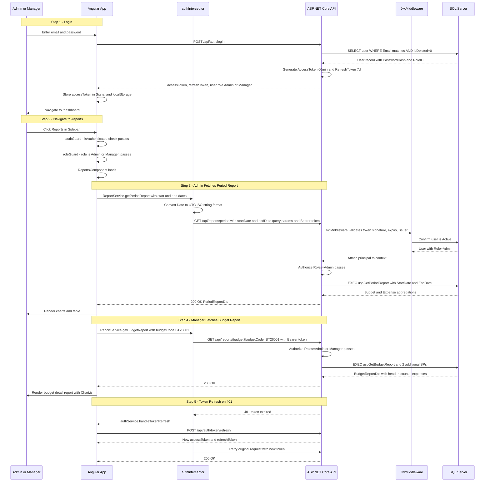
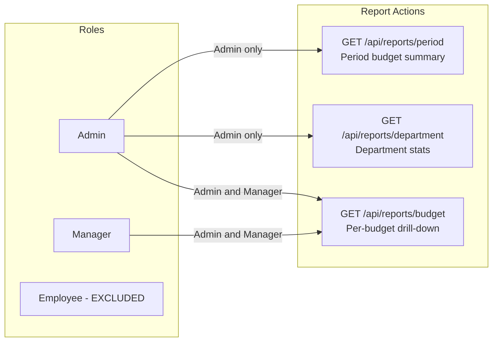
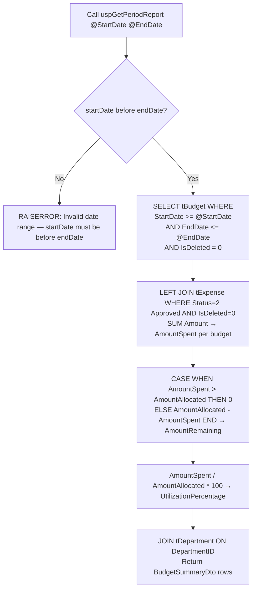
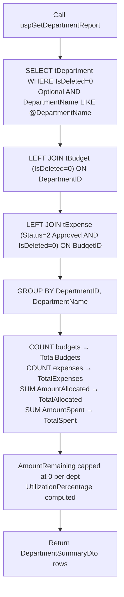
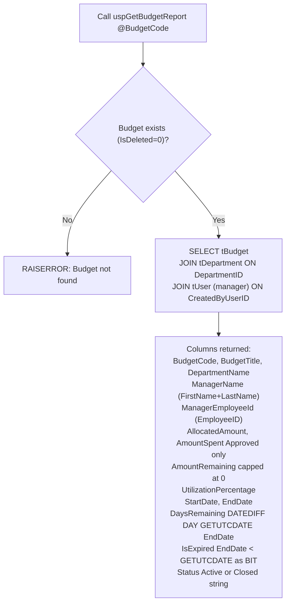
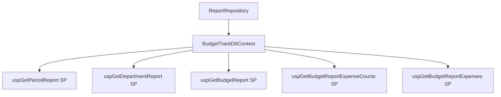
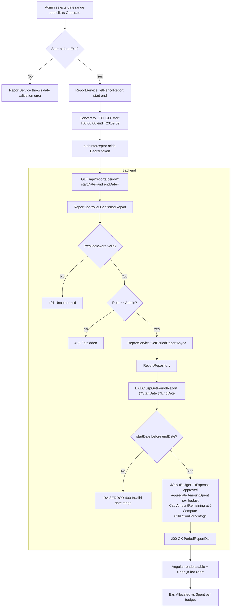
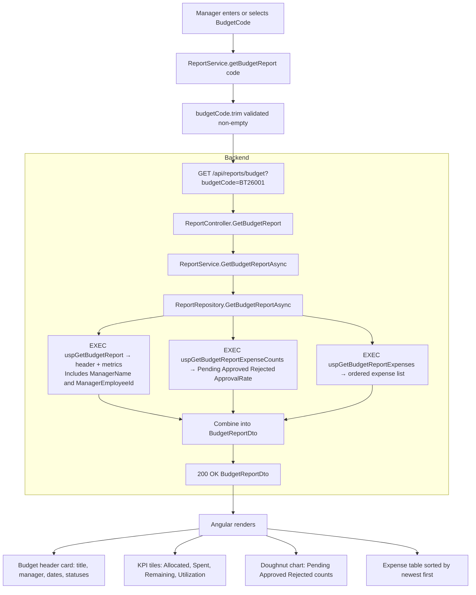

# Report Module — Complete Documentation

> **Stack:** ASP.NET Core 10 · Entity Framework Core 10 · SQL Server Stored Procedures · Angular 21 · Bootstrap 5 · Chart.js
> **Base URL:** `http://localhost:5131`
> **Generated:** 2026-03-07

---

## Table of Contents

1. [Module Overview](#1-module-overview)
2. [Authentication & Authorization Flow](#2-authentication--authorization-flow)
3. [Role-Based Access Control](#3-role-based-access-control)
4. [Database Layer — Report.sql](#4-database-layer--reportsql)
5. [DTOs](#5-dtos)
6. [Repository Layer](#6-repository-layer)
7. [Service Layer](#7-service-layer)
8. [Controller Layer](#8-controller-layer)
9. [Complete API Reference](#9-complete-api-reference)
10. [Angular Frontend](#10-angular-frontend)
11. [End-to-End Data Flow Diagrams](#11-end-to-end-data-flow-diagrams)
12. [Report Scope & Metric Reference](#12-report-scope--metric-reference)

---

## 1. Module Overview

The **Report Module** provides aggregated financial analytics across three scopes: time-period, department, and per-budget. All reporting is **read-only** and powered entirely by SQL Server stored procedures with complex JOINs and aggregations.

### What the Report Module Does

| Capability               | Description                                                                                           |
| ------------------------ | ----------------------------------------------------------------------------------------------------- |
| Period Report            | Budget summary for a custom date range — Admin only                                                   |
| Department Report        | Budget and expense stats grouped by department — Admin only                                           |
| Budget Report            | Full drill-down of a specific budget with all expenses — Admin and Manager                            |
| Stored Procedure Powered | All three reports use dedicated SPs for complex JOIN aggregations — no EF LINQ queries                |
| AmountRemaining Cap      | `AmountRemaining` is capped at `0` (never negative) by the SPs — over-budget budgets show `0`        |
| Utilization Metrics      | `UtilizationPercentage = AmountSpent / AmountAllocated × 100` computed in SP                         |
| Expense Counts           | Per-budget: Pending, Approved, Rejected counts + `ApprovalRate`                                      |
| Chart-Ready Data         | Angular uses Chart.js to render utilization charts, bar charts, and pie charts from the response data |

---

## 2. Authentication & Authorization Flow

Every request to the Report module requires a valid JWT Bearer token. Role determines which endpoints are accessible.



### JWT Token Claims Used

| Claim Type                  | Example Value | Used For                                      |
| --------------------------- | ------------- | --------------------------------------------- |
| `ClaimTypes.NameIdentifier` | `5`           | Identifies requesting Admin/Manager           |
| `ClaimTypes.Role`           | `Admin`       | `[Authorize(Roles="Admin")]` for period/dept  |
| `ClaimTypes.Role`           | `Manager`     | `[Authorize(Roles="Admin,Manager")]` for budget |

### Token Storage

| Token         | Storage                       | Duration   |
| ------------- | ----------------------------- | ---------- |
| Access Token  | Angular Signal + localStorage | 60 minutes |
| Refresh Token | localStorage only             | 7 days     |

---

## 3. Role-Based Access Control



### Access Logic in Code

```
GET /api/reports/period     → [Authorize(Roles="Admin")]
GET /api/reports/department → [Authorize(Roles="Admin")]
GET /api/reports/budget     → [Authorize(Roles="Admin,Manager")]
│
├── Class-level: [Authorize(Roles = "Manager,Admin,Employee")]
└── Each endpoint overrides with a stricter role attribute
```

> Employees cannot access any report endpoints. They receive `403 Forbidden`.

---

## 4. Database Layer — Report.sql

Located at `Database/Budget-Track/Report.sql`. Contains **5 Stored Procedures** — three primary report SPs and two supporting SPs for the budget drill-down.

---

### 4.1 `uspGetPeriodReport` — Budget Summary by Date Range

**Parameters:**

| Parameter    | Type           | Required | Description                             |
| ------------ | -------------- | -------- | --------------------------------------- |
| `@StartDate` | DATETIME       | ✅        | Period start (inclusive)                |
| `@EndDate`   | DATETIME       | ✅        | Period end (inclusive)                  |

**Execution Flow:**



> **AmountRemaining capped:** Each budget row's `AmountRemaining` is capped at `0` in the SP. The app sums SP results — **not** `TotalAllocated - TotalSpent` — so the total remaining is also naturally capped.

---

### 4.2 `uspGetDepartmentReport` — Stats by Department

**Parameters:**

| Parameter         | Type           | Required | Description                              |
| ----------------- | -------------- | -------- | ---------------------------------------- |
| `@DepartmentName` | NVARCHAR(100)? | ❌        | Optional filter for a specific department |

**Execution Flow:**



---

### 4.3 `uspGetBudgetReport` — Budget Header + Metrics

**Parameters:**

| Parameter     | Type          | Required | Description                        |
| ------------- | ------------- | -------- | ---------------------------------- |
| `@BudgetCode` | NVARCHAR(50)  | ✅        | Budget code (e.g. `BT26001`)        |

**Returns:**



---

### 4.4 `uspGetBudgetReportExpenseCounts` — Expense Counts for Budget

**Parameters:** `@BudgetCode NVARCHAR(50)`

```sql
SELECT
    COUNT(*) AS TotalExpenses,
    SUM(CASE WHEN e.Status = 1 THEN 1 ELSE 0 END) AS PendingCount,
    SUM(CASE WHEN e.Status = 2 THEN 1 ELSE 0 END) AS ApprovedCount,
    SUM(CASE WHEN e.Status = 3 THEN 1 ELSE 0 END) AS RejectedCount,
    CASE WHEN COUNT(*) = 0 THEN 0
         ELSE CAST(SUM(CASE WHEN e.Status = 2 THEN 1 ELSE 0 END) AS DECIMAL)
              / COUNT(*) * 100
    END AS ApprovalRate
FROM tExpense e
JOIN tBudget b ON e.BudgetID = b.BudgetID
WHERE b.Code = @BudgetCode AND e.IsDeleted = 0;
```

**Expense Status Values (in this SP):** 1=Pending, 2=Approved, 3=Rejected.

---

### 4.5 `uspGetBudgetReportExpenses` — All Expenses for Budget

**Parameters:** `@BudgetCode NVARCHAR(50)`

Returns all non-deleted expenses for a budget with submitter name, category, status string, and submission date — ordered by `SubmittedDate DESC` (newest first).

```sql
SELECT e.ExpenseID, e.Title, e.Amount, e.MerchantName,
    c.CategoryName,
    CASE e.Status WHEN 1 THEN 'Pending' WHEN 2 THEN 'Approved'
                  WHEN 3 THEN 'Rejected' ELSE 'Cancelled' END AS StatusName,
    u.FirstName + ' ' + u.LastName AS SubmittedByUserName,
    u.EmployeeID AS SubmittedByEmployeeID,
    e.SubmittedDate
FROM tExpense e
JOIN tBudget b ON e.BudgetID = b.BudgetID
JOIN tCategory c ON e.CategoryID = c.CategoryID
JOIN tUser u ON e.SubmittedByUserID = u.UserID
WHERE b.Code = @BudgetCode AND e.IsDeleted = 0
ORDER BY e.SubmittedDate DESC;
```

---

## 5. DTOs

### `PeriodReportDto`

| Field                   | Type                    | Description                               |
| ----------------------- | ----------------------- | ----------------------------------------- |
| `StartDate`             | DateTime                | Report start date                         |
| `EndDate`               | DateTime                | Report end date                           |
| `TotalBudgets`          | int                     | Budget count in period                    |
| `TotalAllocated`        | decimal                 | Sum of AmountAllocated                    |
| `TotalSpent`            | decimal                 | Sum of approved expense amounts           |
| `TotalRemaining`        | decimal                 | Sum of per-budget AmountRemaining (capped at 0) |
| `UtilizationPercentage` | decimal                 | TotalSpent / TotalAllocated × 100         |
| `Summaries`             | List\<BudgetSummaryDto\>| Per-budget breakdown                      |

### `BudgetSummaryDto`

| Field                   | Type     | Description                              |
| ----------------------- | -------- | ---------------------------------------- |
| `BudgetID`              | int      | Budget PK                                |
| `Title`                 | string   | Budget title                             |
| `Code`                  | string   | Budget code                              |
| `DepartmentName`        | string   | Department                               |
| `AmountAllocated`       | decimal  | Allocated amount                         |
| `AmountSpent`           | decimal  | Spent (approved expenses only)           |
| `AmountRemaining`       | decimal  | Remaining capped at 0 by SP              |
| `UtilizationPercentage` | decimal  | Utilization %                            |
| `Status`                | string   | `Active` / `Closed`                      |
| `StartDate`             | DateTime | Budget start                             |
| `EndDate`               | DateTime | Budget end                               |

### `DepartmentReportDto`

| Field     | Type                         | Description          |
| --------- | ---------------------------- | -------------------- |
| `Summary` | List\<DepartmentSummaryDto\> | Per-department stats |

### `DepartmentSummaryDto`

| Field                   | Type    | Description                              |
| ----------------------- | ------- | ---------------------------------------- |
| `DepartmentID`          | int     | Department PK                            |
| `DepartmentName`        | string  | Department name                          |
| `TotalBudgets`          | int     | Budget count                             |
| `TotalExpenses`         | int     | Expense count                            |
| `TotalAllocated`        | decimal | Total allocated amount                   |
| `TotalSpent`            | decimal | Total approved spend                     |
| `TotalRemaining`        | decimal | Total remaining capped at 0              |
| `UtilizationPercentage` | decimal | Utilization %                            |

### `BudgetReportDto`

| Field                   | Type                      | Description                                    |
| ----------------------- | ------------------------- | ---------------------------------------------- |
| `BudgetCode`            | string                    | Budget code (e.g. `BT26001`)                   |
| `BudgetTitle`           | string                    | Budget title                                   |
| `DepartmentName`        | string                    | Department name                                |
| `ManagerName`           | string                    | Full name of budget creator (manager)          |
| `ManagerEmployeeId`     | string                    | Employee ID of budget creator                  |
| `AllocatedAmount`       | decimal                   | Allocated budget amount                        |
| `AmountSpent`           | decimal                   | Sum of approved expense amounts                |
| `AmountRemaining`       | decimal                   | Remaining capped at 0 by SP                    |
| `UtilizationPercentage` | decimal                   | Spent / Allocated × 100                        |
| `StartDate`             | DateTime                  | Budget start date                              |
| `EndDate`               | DateTime                  | Budget end date                                |
| `DaysRemaining`         | int                       | `DATEDIFF(DAY, GETUTCDATE(), EndDate)`         |
| `IsExpired`             | bool                      | `EndDate < GETUTCDATE()`                       |
| `Status`                | string                    | `Active` / `Closed`                            |
| `ExpenseCounts`         | ExpenseCountDto           | Pending/Approved/Rejected counts + rate        |
| `Expenses`              | List\<ExpenseSummaryDto\> | All associated expenses (newest first)         |

### `ExpenseCountDto`

| Field           | Type    | Description                             |
| --------------- | ------- | --------------------------------------- |
| `TotalExpenses` | int     | Total expense count                     |
| `PendingCount`  | int     | Status=1 count                          |
| `ApprovedCount` | int     | Status=2 count                          |
| `RejectedCount` | int     | Status=3 count                          |
| `ApprovalRate`  | decimal | ApprovedCount / TotalExpenses × 100     |

---

## 6. Repository Layer

**Interface:** `IReportRepository`

```csharp
Task<PeriodReportDto>     GetPeriodReportAsync(DateTime startDate, DateTime endDate);
Task<DepartmentReportDto> GetDepartmentReportAsync(string? departmentName);
Task<BudgetReportDto>     GetBudgetReportAsync(string budgetCode);
```

**Implementation: `ReportRepository`**



| Method                     | SP(s) Called                          | Description                                                                  |
| -------------------------- | ------------------------------------- | ---------------------------------------------------------------------------- |
| `GetPeriodReportAsync`     | `uspGetPeriodReport`                  | Single SP call; validates date range; returns budget summaries with metrics  |
| `GetDepartmentReportAsync` | `uspGetDepartmentReport`              | Single SP call; optional dept filter; returns dept-grouped aggregations      |
| `GetBudgetReportAsync`     | 3 SPs (see below)                     | Three sequential calls combined into single `BudgetReportDto`                |

**`GetBudgetReportAsync` — 3-SP Pattern:**

```csharp
// Call 1: Budget header + manager info + metrics
var header = await _context.Database
    .SqlQueryRaw<BudgetReportRaw>("EXEC uspGetBudgetReport @BudgetCode", ...)
    .FirstOrDefaultAsync();
if (header == null) throw new KeyNotFoundException("Budget not found");

// Call 2: Expense counts breakdown
var counts = await _context.Database
    .SqlQueryRaw<ExpenseCountDto>("EXEC uspGetBudgetReportExpenseCounts @BudgetCode", ...)
    .FirstOrDefaultAsync();

// Call 3: Full expense list
var expenses = await _context.Database
    .SqlQueryRaw<ExpenseSummaryDto>("EXEC uspGetBudgetReportExpenses @BudgetCode", ...)
    .ToListAsync();

return new BudgetReportDto { ...header, ExpenseCounts = counts, Expenses = expenses };
```

---

## 7. Service Layer

**Interface:** `IReportService`

```csharp
Task<PeriodReportDto>     GetPeriodReportAsync(DateTime startDate, DateTime endDate);
Task<DepartmentReportDto> GetDepartmentReportAsync(string? departmentName);
Task<BudgetReportDto>     GetBudgetReportAsync(string budgetCode);
```

**Business Validation in `ReportService`:**

| Method                   | Validation                               | Error Thrown                 |
| ------------------------ | ---------------------------------------- | ---------------------------- |
| `GetPeriodReportAsync`   | startDate must be strictly before endDate | SP `RAISERROR` → 400        |
| `GetDepartmentReportAsync` | No validation needed               | —                            |
| `GetBudgetReportAsync`   | BudgetCode must exist (non-deleted)      | SP `RAISERROR` → 404        |

`ReportService` delegates directly to `ReportRepository`. All computation is in stored procedures.

**Dependency Injection:**
```csharp
// Program.cs
builder.Services.AddScoped<IReportService, ReportService>();
builder.Services.AddScoped<IReportRepository, ReportRepository>();
```

---

## 8. Controller Layer

**`ReportController`** extends `BaseApiController`:

```csharp
[ApiController]
[Route("api/reports")]
[Authorize(Roles = "Manager,Admin,Employee")]  // class-level (overridden per endpoint)
public class ReportController : BaseApiController
{
    private readonly IReportService _reportService;
}
```

**Action Mapping:**

| Method | Route                     | Roles              | Action                | SP Chain                |
| ------ | ------------------------- | ------------------ | --------------------- | ----------------------- |
| GET    | `/api/reports/period`     | Admin only         | `GetPeriodReport`     | `uspGetPeriodReport`    |
| GET    | `/api/reports/department` | Admin only         | `GetDepartmentReport` | `uspGetDepartmentReport`|
| GET    | `/api/reports/budget`     | Admin, Manager     | `GetBudgetReport`     | 3 SPs                  |

**Error Handling:**

| Exception Pattern                  | HTTP Response             |
| ---------------------------------- | ------------------------- |
| `"Invalid"` / `"must be before"`   | 400 Bad Request           |
| `"not found"` / `"does not exist"` | 404 Not Found             |
| Unhandled                          | 500 Internal Server Error |

---

## 9. Complete API Reference

> **Auth Header required:** `Authorization: Bearer <accessToken>`

---

### `GET /api/reports/period`

**Roles:** Admin only

**Query Parameters:**

| Parameter   | Type     | Required | Description                             |
| ----------- | -------- | -------- | --------------------------------------- |
| `startDate` | DateTime | ✅        | ISO 8601 (`2026-01-01T00:00:00`)        |
| `endDate`   | DateTime | ✅        | ISO 8601 (`2026-03-31T23:59:59`)        |

> Angular `ReportService` converts local dates to UTC ISO (`YYYY-MM-DDTHH:mm:ss`). Start date uses `00:00:00`, end date uses `23:59:59`.

**Response `200 OK`:**
```json
{
  "startDate": "2026-01-01T00:00:00",
  "endDate": "2026-03-31T00:00:00",
  "totalBudgets": 5,
  "totalAllocated": 25000000.00,
  "totalSpent": 5340000.00,
  "totalRemaining": 19660000.00,
  "utilizationPercentage": 21.36,
  "summaries": [
    {
      "budgetID": 1,
      "title": "Engineering Operations",
      "code": "BT26001",
      "departmentName": "Engineering",
      "amountAllocated": 5000000.00,
      "amountSpent": 1068348.00,
      "amountRemaining": 3931652.00,
      "utilizationPercentage": 21.37,
      "status": "Active",
      "startDate": "2026-02-25T01:24:20",
      "endDate": "2027-02-25T01:24:20"
    }
  ]
}
```

**Status Codes:**

| Code  | When                                      |
| ----- | ----------------------------------------- |
| `200` | Success                                   |
| `400` | Invalid date range (startDate >= endDate) |
| `401` | Not authenticated                         |
| `403` | Not Admin                                 |
| `500` | Server error                              |

---

### `GET /api/reports/department`

**Roles:** Admin only

**Query Parameters:**

| Parameter        | Type    | Required | Description                             |
| ---------------- | ------- | -------- | --------------------------------------- |
| `departmentName` | string? | ❌        | Optional filter for specific department |

**Response `200 OK`:**
```json
{
  "summary": [
    {
      "departmentID": 1,
      "departmentName": "Engineering",
      "totalBudgets": 3,
      "totalExpenses": 45,
      "totalAllocated": 15000000.00,
      "totalSpent": 3200000.00,
      "totalRemaining": 11800000.00,
      "utilizationPercentage": 21.33
    },
    {
      "departmentID": 2,
      "departmentName": "Finance",
      "totalBudgets": 2,
      "totalExpenses": 20,
      "totalAllocated": 10000000.00,
      "totalSpent": 2140000.00,
      "totalRemaining": 7860000.00,
      "utilizationPercentage": 21.40
    }
  ]
}
```

**Status Codes:**

| Code  | When              |
| ----- | ----------------- |
| `200` | Success           |
| `401` | Not authenticated |
| `403` | Not Admin         |
| `500` | Server error      |

---

### `GET /api/reports/budget`

**Roles:** Admin, Manager

**Query Parameters:**

| Parameter    | Type   | Required | Description                   |
| ------------ | ------ | -------- | ----------------------------- |
| `budgetCode` | string | ✅        | Budget code (e.g. `BT26001`) |

**Response `200 OK`:**
```json
{
  "budgetCode": "BT26001",
  "budgetTitle": "Engineering Operations",
  "departmentName": "Engineering",
  "managerName": "Sanika Anil",
  "managerEmployeeId": "MGR2601",
  "allocatedAmount": 5000000.00,
  "amountSpent": 1068348.00,
  "amountRemaining": 3931652.00,
  "utilizationPercentage": 21.37,
  "startDate": "2026-02-25T01:24:20",
  "endDate": "2027-02-25T01:24:20",
  "daysRemaining": 365,
  "isExpired": false,
  "status": "Active",
  "expenseCounts": {
    "totalExpenses": 45,
    "pendingCount": 12,
    "approvedCount": 28,
    "rejectedCount": 5,
    "approvalRate": 84.85
  },
  "expenses": [
    {
      "expenseID": 1,
      "title": "Monthly Cloud Hosting",
      "amount": 109913.00,
      "merchantName": "HashiCorp Inc",
      "categoryName": "Cloud Infrastructure",
      "statusName": "Approved",
      "submittedDate": "2026-01-28T03:56:07",
      "submittedByUserName": "Shivali Sharma",
      "submittedByEmployeeID": "EMP2601"
    }
  ]
}
```

**Status Codes:**

| Code  | When                         |
| ----- | ---------------------------- |
| `200` | Success                      |
| `401` | Not authenticated            |
| `403` | Not Admin or Manager         |
| `404` | Budget code not found        |
| `500` | Server error                 |

---

## 10. Angular Frontend

### Component: `ReportsComponent`

**File:** `Frontend/Budget-Track/src/app/features/reports/reports.component.ts`

> This is a single-component report page (no sub-directories) — the largest component in the app at ~51 KB with all three report types handled inline.

#### Injected Dependencies

| Dependency      | Purpose                                                      |
| --------------- | ------------------------------------------------------------ |
| `ReportService` | HTTP calls to all three `/api/reports/*` endpoints           |
| `AuthService`   | `isAdmin()` controls visibility of Period + Dept report tabs |
| `ToastService`  | Error toasts on failed fetch                                 |

#### Angular Signals Used

```typescript
loading           = signal(false);                             // Spinner per report tab
activeTab         = signal<'period' | 'department' | 'budget'>('period');

// Period Report
periodReport      = signal<PeriodReportDto | null>(null);
startDate         = signal('');
endDate           = signal('');

// Department Report
deptReport        = signal<DepartmentReportDto | null>(null);
deptFilter        = signal('');

// Budget Report
budgetReport      = signal<BudgetReportDto | null>(null);
budgetCode        = signal('');                                // Typed or selected from list
budgetError       = signal('');                               // 404 message display

// Chart.js signals
periodChartReady  = signal(false);
deptChartReady    = signal(false);
budgetChartReady  = signal(false);
```

#### Tab Navigation

```typescript
// Admin sees all 3 tabs; Manager sees only Budget Report tab
tabs = computed(() => {
    const t = ['budget'];
    if (this.authService.isAdmin()) t.unshift('period', 'department');
    return t;
});
```

#### Date Handling in Period Report

`ReportService.getPeriodReport()` converts Angular date strings to UTC ISO before sending:
```typescript
private toUtcIsoString(date: Date, isEndDate: boolean): string {
    const time = isEndDate ? '23:59:59' : '00:00:00';
    return `${year}-${month}-${day}T${time}`;
}
// End date always gets 23:59:59 to include the full day
```

#### Chart.js Integration

```typescript
ngAfterViewInit() {
    if (isPlatformBrowser(this.platformId)) {
        this.renderPeriodChart();   // Bar chart: Allocated vs Spent per budget
        this.renderDeptChart();     // Horizontal bar: utilization by department
        this.renderBudgetChart();   // Doughnut: Approved/Pending/Rejected counts
    }
}
```

#### SSG Compatibility

```typescript
ngOnInit() {
    if (!isPlatformBrowser(this.platformId)) return;
    if (this.authService.isAdmin()) this.loadPeriodReport();
    else this.activeTab.set('budget');
}
```

---

### Angular Service: `ReportService`

**File:** `Frontend/Budget-Track/src/services/report.service.ts`

```typescript
@Injectable({ providedIn: 'root' })
export class ReportService {
    private http = inject(HttpClient);
    private apiUrl = environment.apiUrl;

    getPeriodReport(startDate: Date | string, endDate: Date | string): Observable<PeriodReportDto>
        → Validates dates → Convert to UTC ISO → GET /api/reports/period?startDate=...&endDate=...
        → .pipe(catchError(this.handleError))

    getDepartmentReport(): Observable<DepartmentReportDto>
        → GET /api/reports/department
        → .pipe(catchError(this.handleError))

    getBudgetReport(budgetCode: string): Observable<BudgetReportDto>
        → Validates budgetCode non-empty → GET /api/reports/budget?budgetCode=...
        → .pipe(catchError(this.handleError))

    // Global error handler maps HTTP errors to readable messages
    private handleError(error: HttpErrorResponse): Observable<never>
        → 401: 'Session expired. Please log in again.'
        → 403: 'You do not have permission...'
        → 404: 'The requested resource was not found.'
        → 400: error.error?.message ?? 'Invalid request parameters.'
        → 500: error.error?.message ?? 'A server error occurred.'
}
```

---

### TypeScript Models (`report.models.ts`)

```typescript
export interface PeriodReportDto {
    startDate: string; endDate: string;
    totalBudgets: number;
    totalAllocated: number; totalSpent: number; totalRemaining: number;
    utilizationPercentage: number;
    summaries: BudgetSummaryDto[];
}

export interface BudgetSummaryDto {
    budgetID: number; title: string; code: string; departmentName: string;
    amountAllocated: number; amountSpent: number; amountRemaining: number;
    utilizationPercentage: number; status: string;
    startDate: string; endDate: string;
}

export interface DepartmentReportDto { summary: DepartmentSummaryDto[]; }

export interface DepartmentSummaryDto {
    departmentID: number; departmentName: string;
    totalBudgets: number; totalExpenses: number;
    totalAllocated: number; totalSpent: number;
    totalRemaining: number; utilizationPercentage: number;
}

export interface BudgetReportDto {
    budgetCode: string; budgetTitle: string;
    departmentName: string; managerName: string; managerEmployeeId: string;
    allocatedAmount: number; amountSpent: number; amountRemaining: number;
    utilizationPercentage: number;
    startDate: string; endDate: string;
    daysRemaining: number; isExpired: boolean; status: string;
    expenseCounts: ExpenseCountDto;
    expenses: ExpenseSummaryDto[];
}
```

---

### Bootstrap & Chart.js UI Components Used

| Component                            | Usage                                                          |
| ------------------------------------ | -------------------------------------------------------------- |
| `nav-tabs` / `tab-pane`              | Period / Department / Budget report tab switching              |
| `table table-hover table-responsive` | Budget summaries, department rows, expense list                |
| `card card-body`                     | KPI summary tiles (Total Budgets, Allocated, Spent, Remaining) |
| `progress-bar`                       | Utilization percentage bar with color coding                   |
| `badge`                              | Status badge (Active/Closed/Expired)                           |
| `form-control`                       | Date pickers for period report, budget code input              |
| `spinner-border`                     | Loading indicator per report section                           |
| `Chart.js Bar`                       | Allocated vs Spent per budget in period report                 |
| `Chart.js HorizontalBar`             | Utilization % by department                                    |
| `Chart.js Doughnut`                  | Expense counts (Pending / Approved / Rejected) in budget report |

---

## 11. End-to-End Data Flow Diagrams

### Admin Generates Period Report



### Manager Generates Budget Report



---

## 12. Report Scope & Metric Reference

### AmountRemaining Capping Logic

All three report SPs share the same pattern for capping `AmountRemaining` at `0`:

```sql
CASE WHEN AmountSpent > AmountAllocated THEN 0
     ELSE AmountAllocated - AmountSpent
END AS AmountRemaining
```

> This prevents confusing negative values. A budget that is over-budget shows `AmountRemaining = 0`, not a negative number. The sum in `PeriodReportDto.TotalRemaining` also naturally respects this cap because it sums the SP-returned values per budget, not `TotalAllocated - TotalSpent`.

---

### Utilization Percentage Logic

```sql
CASE WHEN AmountAllocated = 0 THEN 0
     ELSE CAST(AmountSpent AS DECIMAL(18,2)) / AmountAllocated * 100
END AS UtilizationPercentage
```

| Percentage Range | Frontend Color  | Meaning              |
| ---------------- | --------------- | -------------------- |
| 0 – 49%          | Green (success) | Healthy spend        |
| 50 – 79%         | Orange (warning)| Approaching limit    |
| 80 – 99%         | Red (danger)    | High utilization     |
| ≥ 100%           | Dark Red        | Over budget          |

---

### Expense Status Values Used in Report SPs

| Status Value | String Representation  | Used In                      |
| ------------ | ---------------------- | ---------------------------- |
| `1`          | `Pending`              | `uspGetBudgetReportExpenseCounts`, `uspGetBudgetReportExpenses` |
| `2`          | `Approved`             | All SPs (only approved → amountSpent) |
| `3`          | `Rejected`             | `uspGetBudgetReportExpenseCounts`, `uspGetBudgetReportExpenses` |
| Others       | `Cancelled`            | `uspGetBudgetReportExpenses` |

---

### What Each Report Answers

| Report     | Business Question                                                           |
| ---------- | --------------------------------------------------------------------------- |
| Period     | "How did we perform financially from X to Y? Which budgets were active?"    |
| Department | "Which department is spending most relative to allocation?"                 |
| Budget     | "What is the full picture of budget BT26001 — all expenses, approval rate?" |

---

*Report Module Documentation — BudgetTrack v1.0 | Generated 2026-03-07*
