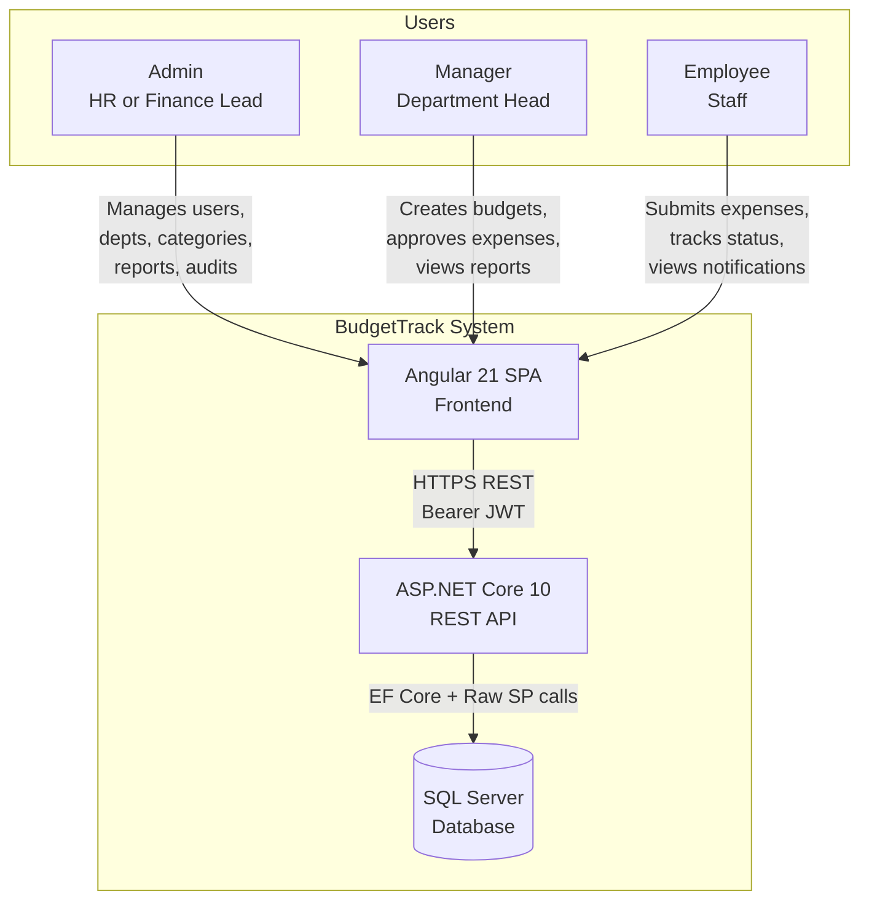
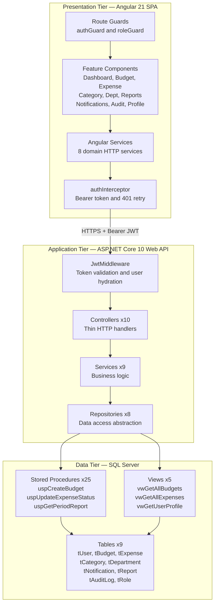
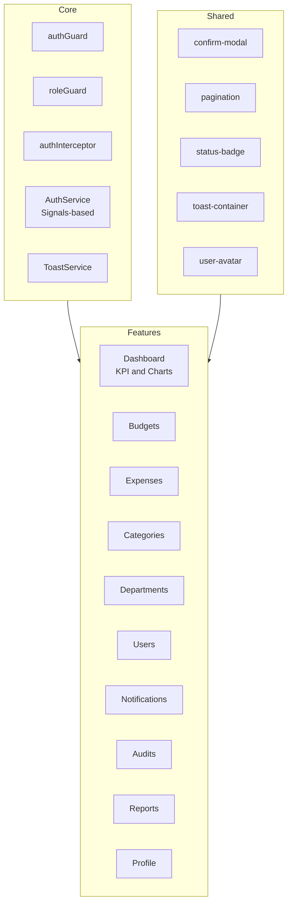
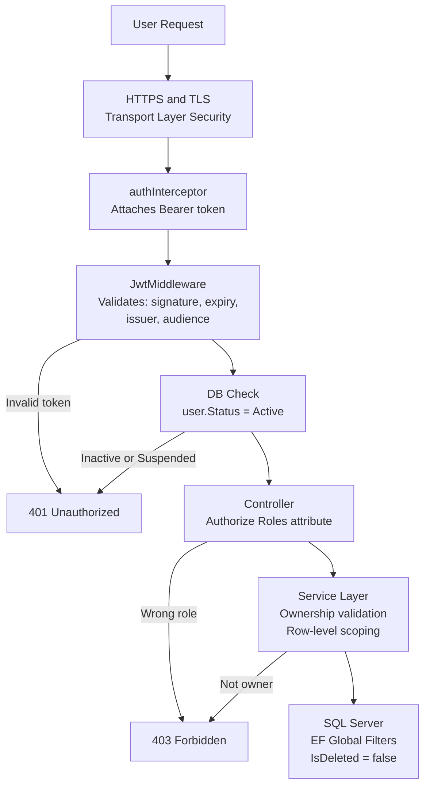
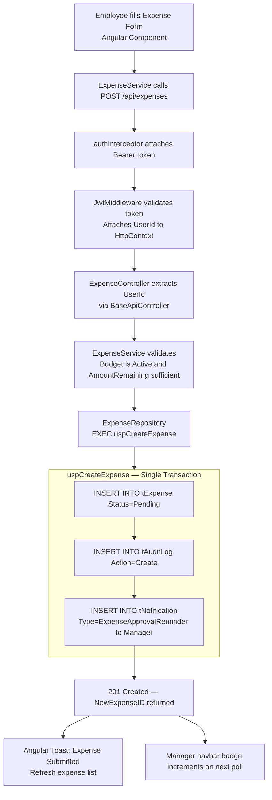
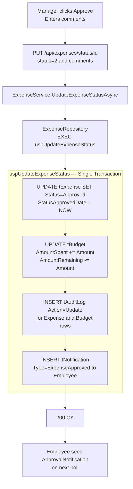
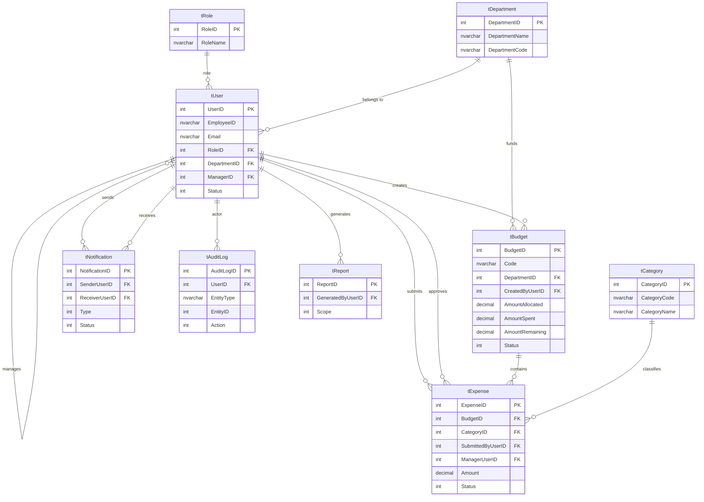
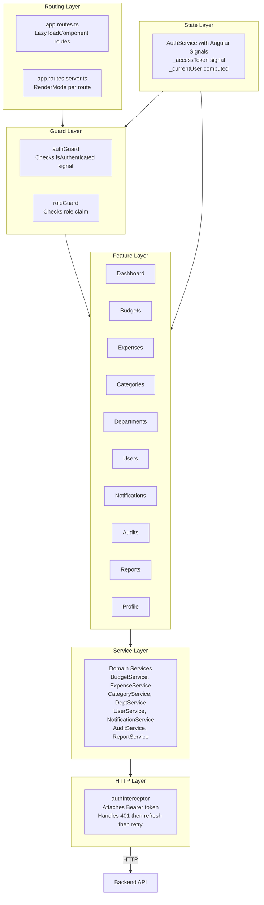
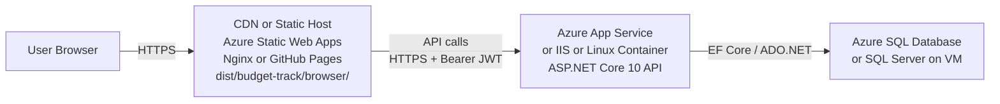

# BudgetTrack — High-Level Design (HLD)

> **Stack:** Angular 21 · ASP.NET Core 10 · Entity Framework Core 10 · SQL Server
> **Version:** 1.0 · **Last Updated:** 2026-03-07

---

## Table of Contents

1. [System Overview](#1-system-overview)
2. [System Context Diagram](#2-system-context-diagram)
3. [High-Level Architecture](#3-high-level-architecture)
4. [Component Overview](#4-component-overview)
5. [Module Responsibilities](#5-module-responsibilities)
6. [Technology Decisions](#6-technology-decisions)
7. [Security Architecture](#7-security-architecture)
8. [Data Flow Overview](#8-data-flow-overview)
9. [Database Architecture](#9-database-architecture)
10. [API Design Conventions](#10-api-design-conventions)
11. [Frontend Architecture](#11-frontend-architecture)
12. [Non-Functional Requirements](#12-non-functional-requirements)
13. [Deployment Architecture](#13-deployment-architecture)
14. [Key Design Decisions](#14-key-design-decisions)
15. [System Constraints & Assumptions](#15-system-constraints--assumptions)

---

## 1. System Overview

### Purpose

**BudgetTrack** is an enterprise-grade internal budget planning and expense management system. It digitizes the manual, spreadsheet-driven process of departmental budget allocation, employee expense submission, and manager approval into a structured, auditable, role-aware digital workflow.

### Business Goals

| Goal | How BudgetTrack Achieves It |
|---|---|
| Replace manual expense tracking | Structured digital submission with category tagging |
| Real-time budget visibility | Live `AmountSpent` / `AmountRemaining` per budget |
| Enforce approval governance | Manager-gated approval/rejection with mandatory comments |
| Compliance and auditability | Immutable `tAuditLog` with old/new JSON snapshots |
| Role-based visibility | Three-tier RBAC: Admin / Manager / Employee |
| On-demand financial reporting | Period, Department, and Budget-level reports with charts |

### Scope

| In Scope | Out of Scope |
|---|---|
| Budget creation and lifecycle management | External ERP/accounting system integration |
| Employee expense submission and approval | File/receipt attachment uploads |
| In-app notifications | Email / SMS notification delivery |
| Audit logging for all mutations | Real-time collaboration / websockets |
| Role-based reports with Chart.js | Multi-currency support |
| JWT authentication with token rotation | OAuth2 / SSO (third-party identity provider) |

---

## 2. System Context Diagram



---

## 3. High-Level Architecture

BudgetTrack follows a **3-Tier Architecture** with a single-page application frontend, a RESTful API backend, and a relational database.



### Tier Responsibilities

| Tier | Technology | Responsibility |
|---|---|---|
| **Presentation** | Angular 21 | UI rendering, client-side routing, JWT storage, HTTP calls, SSG prerendering |
| **Application** | ASP.NET Core 10 | REST endpoints, JWT validation, RBAC enforcement, business logic, data orchestration |
| **Data** | SQL Server | Data persistence, complex query views, atomic transactional stored procedures |

---

## 4. Component Overview

### Backend Components

```mermaid
flowchart LR
    subgraph Pipeline["HTTP Pipeline"]
        MW_JWT["JwtMiddleware\nValidates token\nAttaches UserId to HttpContext"]
    end

    subgraph Controllers["Controllers — HTTP Layer"]
        C1["AuthController"]
        C2["UserController"]
        C3["BudgetController"]
        C4["ExpenseController"]
        C5["CategoryController"]
        C6["DepartmentController"]
        C7["NotificationController"]
        C8["AuditController"]
        C9["ReportController"]
        C10["BaseApiController\nextracts UserId"]
    end

    subgraph Services["Services — Business Logic Layer"]
        S1["AuthService and JwtTokenService"]
        S2["BudgetService"]
        S3["ExpenseService"]
        S4["CategoryService"]
        S5["DepartmentService"]
        S6["NotificationService"]
        S7["AuditService"]
        S8["ReportService"]
    end

    subgraph Repositories["Repositories — Data Access Layer"]
        R1["UserRepository"]
        R2["BudgetRepository"]
        R3["ExpenseRepository"]
        R4["CategoryRepository"]
        R5["DepartmentRepository"]
        R6["NotificationRepository"]
        R7["AuditRepository"]
        R8["ReportRepository"]
    end

    MW_JWT --> Controllers
    Controllers --> Services
    Services --> Repositories
```



### Frontend Components



---

## 5. Module Responsibilities

| Module | Owner Role | Core Operations | Key SP or View |
|---|---|---|---|
| **Auth** | All roles | Login, logout, token refresh, change password | `vwGetUserProfile` |
| **User** | Admin | Register users, update, soft-delete, stats | `uspGetUsersList`, `uspGetUserProfile` |
| **Budget** | Manager | Create, update, delete budgets; track spend | `uspCreateBudget`, `vwGetAllBudgets` |
| **Expense** | Employee / Manager | Submit expenses; approve or reject | `uspCreateExpense`, `uspUpdateExpenseStatus` |
| **Category** | Admin | CRUD expense categories with auto-code | `uspCreateCategory`, `uspUpdateCategory` |
| **Department** | Admin | CRUD organizational departments with auto-code | `uspCreateDepartment`, `uspUpdateDepartment` |
| **Notification** | Manager / Employee | In-app alerts, mark read, delete | `uspGetNotificationsByReceiverUserId` |
| **Audit** | Admin | Immutable change log with old/new JSON snapshots | `tAuditLog` direct EF query |
| **Report** | Admin / Manager | Period, Department, Budget-scoped analytics | `uspGetPeriodReport`, `uspGetDepartmentReport` |

### Cross-Cutting Concerns

| Concern | Implementation |
|---|---|
| **Authentication** | JWT Bearer tokens validated by `JwtMiddleware` on every request |
| **Authorization** | `[Authorize(Roles=...)]` attribute per controller action |
| **Audit Logging** | Service layer writes to `tAuditLog` or embedded inside SP transactions |
| **Notifications** | Fanout `INSERT INTO tNotification` statements embedded inside mutation SPs |
| **Soft Delete** | EF Core global query filters `IsDeleted == false` applied at `DbContext` level |
| **Pagination** | `PagedResult<T>` returned by all list endpoints; SP-based or EF-based |
| **Error Handling** | `RAISERROR` inside SPs mapped to HTTP 400/404/409; try/catch in service layer |

---

## 6. Technology Decisions

### Why ASP.NET Core 10?

| Reason | Detail |
|---|---|
| Performance | One of the fastest HTTP frameworks benchmarked |
| Mature RBAC | Built-in `[Authorize(Roles=...)]` with policy support |
| EF Core integration | First-class ORM with migrations, global query filters, DI |
| JWT support | `Microsoft.AspNetCore.Authentication.JwtBearer` out of the box |

### Why Angular 21 Standalone?

| Reason | Detail |
|---|---|
| No NgModules overhead | Simpler component registration with `standalone: true` |
| Angular Signals | Reactive state without `BehaviorSubject` boilerplate |
| Lazy loading | `loadComponent()` for route-level code splitting |
| SSG support | `outputMode: "static"` prerender for CDN/static hosting |

### Why SQL Server Stored Procedures?

| Reason | Detail |
|---|---|
| Atomicity | Notifications + audit logs + balance updates in one transaction |
| Auto-code generation | Budget codes, Employee IDs generated safely inside SP |
| Business logic isolation | Uniqueness checks, no-change detection inside the DB layer |
| Security | Parameterized calls from EF prevent SQL injection |

### Why Soft Delete?

Permanent deletion breaks audit trails, notification history, and report accuracy. All entities use `IsDeleted` + `DeletedDate` + `DeletedByUserID` with EF global query filters to transparently exclude them.

---

## 7. Security Architecture



### Security Layers Summary

| Layer | Mechanism | What It Prevents |
|---|---|---|
| **Transport** | HTTPS and TLS | Eavesdropping, MITM |
| **Authentication** | JWT Bearer HMAC-SHA256 | Unauthenticated access |
| **Token Validation** | `JwtMiddleware` — sig + expiry + issuer + audience | Tampered or expired tokens |
| **User Status** | DB check `Status == Active` on every request | Soft-deleted or suspended users |
| **Role Authorization** | `[Authorize(Roles=...)]` on controller actions | Privilege escalation |
| **Ownership Scoping** | Service layer filters by `CreatedByUserID` or `ManagerId` | Cross-tenant data leakage |
| **Global Query Filters** | EF `IsDeleted == false` at `DbContext` level | Soft-deleted record exposure |
| **Password Hashing** | `PasswordHasher<User>` PBKDF2 + salt | Credential theft |
| **Refresh Token Rotation** | New refresh token issued on every `token/refresh` call | Refresh token replay attacks |

### JWT Token Anatomy

| Claim | Example Value | Purpose |
|---|---|---|
| `ClaimTypes.NameIdentifier` | `5` | UserID as int |
| `ClaimTypes.Email` | `mgr@company.com` | Display and lookup |
| `ClaimTypes.Role` | `Manager` | RBAC enforcement |
| `EmployeeId` | `MGR005` | Display only |
| `ManagerId` | `3` | Employee tokens only — budget scoping |

**Expiry:** AccessToken = 60 minutes · RefreshToken = 7 days (stored in `tUser.RefreshToken`)

---

## 8. Data Flow Overview

### Primary Flow — Employee Submits an Expense



### Approval Flow — Manager Approves an Expense



---

## 9. Database Architecture

### Entity Relationship Overview



### Database Design Principles

| Principle | Implementation |
|---|---|
| **Soft Delete** | `IsDeleted`, `DeletedDate`, `DeletedByUserID` on all mutable entities |
| **Audit Columns** | `CreatedDate`, `CreatedByUserID`, `UpdatedDate`, `UpdatedByUserID` everywhere |
| **Prefix Convention** | All tables prefixed with `t` — `tUser`, `tBudget`, etc. |
| **Auto-Code Generation** | Budget codes `BT<YY><seq>`, Employee IDs `EMP<seq>`, Category codes `CAT<seq>` via SP |
| **Denormalized Balances** | `AmountSpent` and `AmountRemaining` on `tBudget` updated atomically inside SPs |
| **Views for Reads** | 5 enriched views join entities with display names for list queries |
| **SPs for Writes** | All create/update/delete use SPs for atomicity and audit embedding |
| **Self-Referential User** | `tUser.ManagerID` references `tUser.UserID` for the Manager-Employee hierarchy |

---

## 10. API Design Conventions

### URL Structure

```
/api/{resource}              Collection — GET list, POST create
/api/{resource}/{id}         Single resource — PUT update, DELETE soft-delete
/api/{resource}/{id}/{sub}   Sub-resource — GET /api/budgets/5/expenses
/api/{resource}/action       Non-CRUD action — PUT /api/notifications/readAll
```

### HTTP Method Semantics

| Method | Semantic | Response |
|---|---|---|
| `GET` | Read — never mutates | `200 OK` with data |
| `POST` | Create new resource | `201 Created` with new resource ID |
| `PUT` | Full or partial update | `200 OK` with success message |
| `DELETE` | Soft-delete — sets `IsDeleted=1` | `200 OK` with success message |

### Standard Response Shapes

**Paginated List:**
```json
{
  "data": [],
  "pageNumber": 1,
  "pageSize": 10,
  "totalRecords": 45,
  "totalPages": 5,
  "hasNextPage": true,
  "hasPreviousPage": false
}
```

**Error:**
```json
{ "success": false, "message": "Descriptive error message" }
```

### Common Query Parameters

| Parameter | Type | Default | Description |
|---|---|---|---|
| `pageNumber` | int | 1 | Page index (1-based) |
| `pageSize` | int | 10 | Items per page |
| `sortBy` | string | `CreatedDate` | Sort field |
| `sortOrder` | string | `desc` | `asc` or `desc` |
| `search` | string | — | Full-text filter |
| `isDeleted` | bool | false | Include soft-deleted (Admin only) |

---

## 11. Frontend Architecture

### Application Layers



### SSG Rendering Strategy

| Route | Mode | Reason |
|---|---|---|
| `/login`, `/` | Prerender | Public — no API calls |
| `/dashboard` to `/profile` | Prerender | `ngOnInit` skips API via `isPlatformBrowser()` |
| `/budgets/:id/expenses` | Client-side | Dynamic `:id` unknown at build time |
| `**` | Client-side | Catch-all redirect |

### Session Restore on Page Refresh

```
Page Refresh
    │
    ▼
authGuard.tryRestoreSession()
    │
    ├── Read bt_user_profile from localStorage
    │       Decode JWT claims locally — no API call needed if token valid
    │
    └── If token expired → POST /api/auth/token/refresh
            → New tokens issued → Decode new JWT
            → Backend downtime has zero effect on staying logged in
```

---

## 12. Non-Functional Requirements

### Performance

| Requirement | Target | Implementation |
|---|---|---|
| API response time | Less than 500 ms at p95 | SP-based reads, indexed FK columns, async/await throughout |
| Page initial load | Less than 2 seconds | SSG prerendering, lazy-loaded routes, code splitting |
| List queries | Paginated, max 500 items | Server-side pagination via SP PageNumber and PageSize params |
| Dashboard load | Less than 1 second | Parallel HTTP calls for budget and expense stats |

### Scalability

| Concern | Approach |
|---|---|
| Stateless API | JWT Bearer — no server-side session; horizontally scalable |
| DB connection management | EF Core `AddScoped<DbContext>` — one connection per request |
| Frontend static hosting | SSG output deployable to CDN — no server required |
| Reference data caching | Categories and departments are infrequently mutated — candidates for `Cache-Control` headers |

### Reliability

| Concern | Approach |
|---|---|
| Atomic writes | SPs wrap multiple INSERTs/UPDATEs in a single transaction |
| Data integrity | EF Core global query filters + FK constraints + DB-level uniqueness |
| Soft delete | No record permanently lost; history always queryable |
| Audit trail | Every mutation creates an immutable `tAuditLog` row — survives user deletion |

### Security

| Requirement | Control |
|---|---|
| Authentication | JWT Bearer HMAC-SHA256, 60-minute expiry |
| Authorization | Role-based on every endpoint, ownership scoping in service layer |
| Password storage | PBKDF2 with salt via `PasswordHasher<User>` |
| Token rotation | Refresh token replaced on every renewal call |
| Inactive user rejection | `JwtMiddleware` checks `Status == Active` on every request |

### Maintainability

| Requirement | Approach |
|---|---|
| Layer separation | Controller → Service → Repository — clear boundaries |
| Interface-based DI | All services and repositories registered by interface — swappable, testable |
| DTO isolation | Entities never exposed directly; all API shapes use typed DTOs |
| Consistent documentation | All 8 domain modules follow the same 12-section documentation template |

---

## 13. Deployment Architecture

### Development

```
Developer Machine
├── Backend  →  dotnet run          →  http://localhost:5131
│               auto-migrate + seed on first run
└── Frontend →  npm start           →  http://localhost:4200
                proxied to :5131 via environment.ts
```

### Production (Recommended)



### Build Commands

**Backend:**
```powershell
dotnet publish -c Release -o ./publish
# Deploy ./publish to Azure App Service or container
```

**Frontend (SSG):**
```powershell
ng build --configuration production
# Deploy dist/budget-track/browser/ to CDN or static host
```

### Environment Configuration

| Setting | Development | Production |
|---|---|---|
| API Base URL | `http://localhost:5131` | `https://api.yourdomain.com` |
| CORS Policy | Allow all origins | Restrict to frontend origin only |
| JWT Secret | `appsettings.json` dev secrets | Azure Key Vault or environment variable |
| DB Connection | LocalDB | Azure SQL or managed SQL Server |
| Swagger UI | Enabled | Disabled — move inside `IsDevelopment()` |
| HTTPS | Optional | Required with HSTS |

---

## 14. Key Design Decisions

### Decision 1 — Stored Procedures for Writes

**Context:** Budget creation, expense approval, and department creation each require multiple INSERT/UPDATE operations that must succeed or fail atomically.

**Decision:** Use SQL Server Stored Procedures for all complex write operations.

**Rationale:**
- Single database transaction — notification + audit + balance update are atomic
- Auto-code generation (`BT<YY><seq>`) safely sequenced inside the SP
- No-change detection logic skips UPDATE if nothing changed
- Called from repository via EF `ExecuteSqlRawAsync()`

---

### Decision 2 — JWT over Session Cookies

**Context:** Angular SPA needs stateless auth across API calls.

**Decision:** JWT Bearer tokens stored in `localStorage` and Angular Signal.

**Rationale:**
- Stateless API — horizontally scalable, no sticky sessions needed
- `ManagerId` embedded in Employee JWT eliminates extra DB lookup per request
- `tryRestoreSession()` decodes JWT locally on page refresh without any API call
- **Trade-off:** `localStorage` is XSS-accessible; mitigated by short access token expiry and `HttpOnly` cookie migration recommended for production

---

### Decision 3 — Angular Signals over BehaviorSubject

**Context:** Auth state needs reactive sharing across all components.

**Decision:** Use Angular Signals (`signal()`, `computed()`).

**Rationale:**
- No `.subscribe()` or `.unsubscribe()` lifecycle management required
- `computed()` for derived values — `isAuthenticated`, `userRole`
- Zone-less change detection compatible
- Simpler than RxJS `BehaviorSubject` with equivalent reactivity

---

### Decision 4 — SSG Prerendering

**Context:** Angular app should be deployable to a static hosting environment without a Node.js server.

**Decision:** `outputMode: "static"` with `RenderMode.Prerender` for all known routes.

**Rationale:**
- All named routes prerendered to HTML at build time — no server required at runtime
- Guards use `isPlatformBrowser()` to skip API calls during prerender
- Dynamic routes remain `RenderMode.Client`
- Deployable to Azure Static Web Apps, Nginx, or any CDN

---

### Decision 5 — Soft Delete with EF Global Query Filters

**Context:** Data must never be permanently deleted to preserve audit trail and report accuracy.

**Decision:** `IsDeleted` flag on all entities + EF Core `HasQueryFilter(e => !e.IsDeleted)`.

**Rationale:**
- All LINQ queries automatically exclude deleted records — no developer error possible
- Audit logs reference deleted users via `SetNull` FK — trail never broken
- Deleted user email and EmployeeID scrambled to free unique index constraints for reuse

---

## 15. System Constraints & Assumptions

### Constraints

| Constraint | Detail |
|---|---|
| Single tenant | BudgetTrack is deployed per organization — no multi-tenant data isolation |
| No file attachments | Expense receipts cannot be uploaded — out of scope |
| No email notifications | In-app notifications only — no SMTP or push integration |
| English only | UI and data are English-only — no i18n |
| Single currency | All amounts in the same currency — no conversion logic |
| Manual user provisioning | Admin creates all user accounts — no self-registration |

### Assumptions

| Assumption | Detail |
|---|---|
| Internal network | App deployed on corporate intranet or VPN-accessible cloud |
| Single SQL Server instance | No sharding or read replicas |
| Flat manager hierarchy | One level: Manager to Employees — no multi-level reporting chain |
| Budget ownership equals creator | The Manager who creates a budget is its sole owner |
| Active budget required for expenses | Expenses can only be submitted against `Status=Active` budgets |
| Global categories | Categories are shared across all departments — not department-specific |

---

*BudgetTrack HLD — v1.0 · Generated 2026-03-07*
