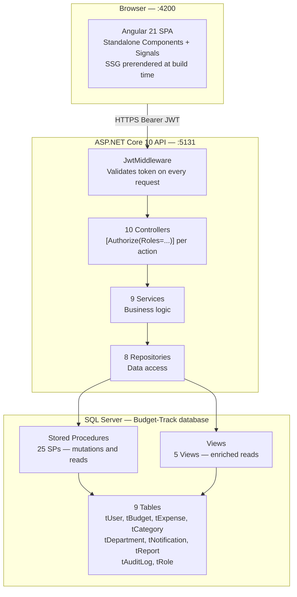
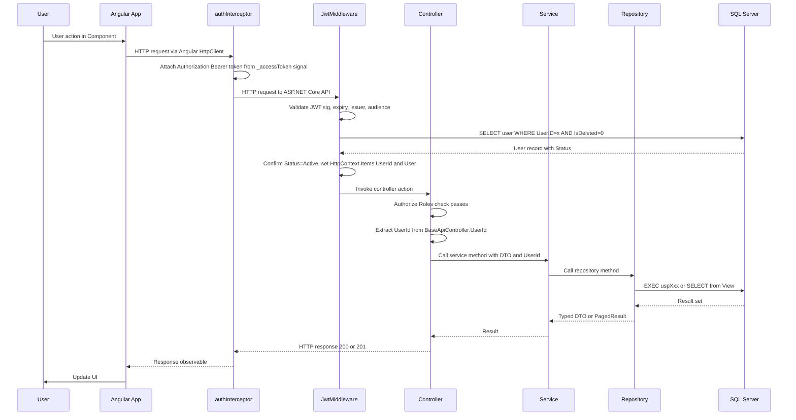
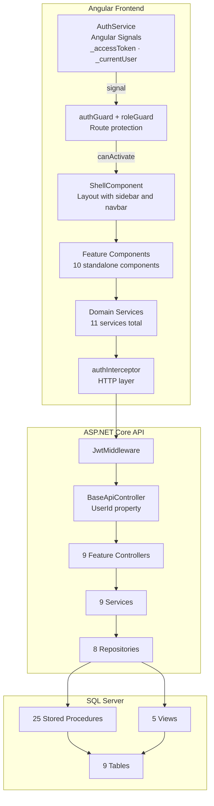

# BudgetTrack — High-Level Design (HLD)

> **Source:** Extracted directly from the codebase — `Backend/`, `Frontend/`, `Database/`
> **Last Updated:** 2026-03-07

---

## Table of Contents

1. [System Overview](#1-system-overview)
2. [Architecture Overview](#2-architecture-overview)
3. [Technology Stack](#3-technology-stack)
4. [Backend Structure](#4-backend-structure)
5. [Frontend Structure](#5-frontend-structure)
6. [Database Structure](#6-database-structure)
7. [API Endpoints](#7-api-endpoints)
8. [Authentication and Authorization Flow](#8-authentication-and-authorization-flow)
9. [Request Lifecycle](#9-request-lifecycle)
10. [Role-Based Access Matrix](#10-role-based-access-matrix)
11. [Component Interaction Diagram](#11-component-interaction-diagram)
12. [Middleware Pipeline](#12-middleware-pipeline)
13. [Frontend Routing and Rendering](#13-frontend-routing-and-rendering)
14. [Dependency Injection Registration](#14-dependency-injection-registration)

---

## 1. System Overview

**BudgetTrack** is a role-based internal budget planning and expense management system consisting of three parts:

- An **Angular 21 Single-Page Application** (Frontend) compiled with Static Site Generation (`outputMode: "static"`)
- An **ASP.NET Core 10 REST API** (Backend) running on `http://localhost:5131`
- A **SQL Server database** (`Budget-Track`) managed via EF Core migrations

The system enforces three roles — **Admin**, **Manager**, and **Employee** — each with distinct access to features and API endpoints. All data mutations are handled via SQL Server **Stored Procedures**. All reads use either **Views** or direct EF Core queries.

---

## 2. Architecture Overview



---

## 3. Technology Stack

### Backend — `Backend/Budget-Track/`

| Component | Technology | Version |
|---|---|---|
| Web framework | ASP.NET Core Web API | .NET 10.0 |
| ORM | Entity Framework Core SqlServer | 10.0.2 |
| Authentication | `Microsoft.AspNetCore.Authentication.JwtBearer` | 10.0.2 |
| Password hashing | `Microsoft.AspNetCore.Identity.PasswordHasher<User>` | Built-in |
| API documentation | Swashbuckle.AspNetCore (Swagger) | 6.5.0 |
| Database | SQL Server (LocalDB in dev) | — |

### Frontend — `Frontend/Budget-Track/`

| Component | Technology | Version |
|---|---|---|
| Framework | Angular Standalone Components | ^21.1.0 |
| SSR/SSG | `@angular/ssr` | ^21.2.0 |
| CSS framework | Bootstrap | ^5.3.8 |
| Charts | Chart.js | ^4.5.1 |
| Icons | `@fortawesome/fontawesome-free` | ^7.2.0 |
| Reactive programming | RxJS | ~7.8.0 |
| Excel export | xlsx | ^0.18.5 |
| State management | Angular Signals (built-in) | — |

---

## 4. Backend Structure

### Folder Layout

```
Backend/Budget-Track/
├── Controllers/
│   ├── BaseApiController.cs        ← extracts UserId from HttpContext.Items["UserId"]
│   ├── AuthController.cs           ← api/auth
│   ├── UserController.cs           ← api/users
│   ├── BudgetController.cs         ← api/budgets
│   ├── ExpenseController.cs        ← api/expenses
│   ├── CategoryController.cs       ← api/categories
│   ├── DepartmentController.cs     ← api/departments
│   ├── NotificationController.cs   ← api/notifications
│   ├── AuditController.cs          ← api/audits
│   └── ReportController.cs         ← api/reports
├── Services/
│   ├── Interfaces/                 ← IAuthService · IBudgetService · IExpenseService ...
│   └── Implementation/             ← AuthService · BudgetService · JwtTokenService ...
├── Repositories/
│   ├── Interfaces/                 ← IUserRepository · IBudgetRepository ...
│   └── Implementation/             ← UserRepository · BudgetRepository ...
├── Models/
│   ├── Entities/                   ← User · Budget · Expense · Category · Department
│   │                                  Notification · AuditLog · Report · Role
│   ├── DTOs/                       ← Per-module request and response DTOs
│   └── Enums/                      ← UserRole · UserStatus · BudgetStatus · ExpenseStatus
│                                      NotificationStatus · NotificationType · AuditAction
│                                      ReportScopeType · SortOrder
├── Middleware/
│   ├── JwtMiddleware.cs            ← validates JWT, attaches UserId + User to HttpContext.Items
│   └── JwtSettings.cs             ← SecretKey, Issuer, Audience, ExpirationMinutes, RefreshTokenExpirationDays
├── Data/
│   ├── BudgetTrackDbContext.cs     ← DbContext with 9 DbSets, global query filters, FK config
│   └── DataSeeder.cs              ← seeds Roles, one Department, one Admin user on startup
├── Migrations/                     ← EF Core auto-generated migration (20260303131858_BudgetTrack)
├── appsettings.json                ← Jwt config, ConnectionStrings.DefaultConnection
└── Program.cs                      ← DI registration, middleware pipeline, CORS, Swagger
```

### BaseApiController

All feature controllers inherit `BaseApiController`, which exposes:

```csharp
protected int UserId => (int)HttpContext.Items["UserId"]!;
```

`UserId` is populated by `JwtMiddleware` before every controller action executes.

### Enumerations (from source)

| Enum | Values |
|---|---|
| `UserRole` | Employee=1, Manager=2, Admin=3 |
| `UserStatus` | Active=1, Inactive=2, Suspended=3 |
| `BudgetStatus` | Active=1, Closed=2 |
| `ExpenseStatus` | Pending=1, Approved=2, Rejected=3, Cancelled=4 |
| `NotificationStatus` | Unread=1, Read=2 |
| `NotificationType` | ExpenseApprovalReminder=1, ExpenseApproved=2, ExpenseRejected=3, BudgetCreated=4, BudgetUpdated=5, BudgetDeleted=6 |
| `AuditAction` | Create=1, Update=2, Delete=3 |
| `ReportScopeType` | Department=1, Budget=2, Period=3 |
| `SortOrder` | asc=1, desc=2 |

### NuGet Packages (from `.csproj`)

```xml
Microsoft.AspNetCore.Authentication.JwtBearer  10.0.2
Microsoft.EntityFrameworkCore.Design           10.0.2
Microsoft.EntityFrameworkCore.SqlServer        10.0.2
Microsoft.EntityFrameworkCore.Tools            10.0.2
Swashbuckle.AspNetCore                         6.5.0
```

---

## 5. Frontend Structure

### Folder Layout

```
Frontend/Budget-Track/src/app/
├── auth/
│   └── login/                      ← LoginComponent (public, SSG prerendered)
├── layout/
│   └── shell/                      ← ShellComponent (authenticated wrapper with sidebar + navbar)
├── features/
│   ├── dashboard/                  ← DashboardComponent
│   ├── budgets/budgets-list/       ← BudgetsListComponent
│   ├── expenses/expenses-list/     ← ExpensesListComponent
│   ├── categories/categories-list/ ← CategoriesListComponent
│   ├── departments/departments-list/← DepartmentsListComponent
│   ├── reports/                    ← ReportsComponent
│   ├── users/users-list/           ← UsersListComponent
│   ├── audits/audit-logs/          ← AuditLogsComponent
│   ├── notifications/notifications/ ← NotificationsComponent
│   └── profile/                    ← ProfileComponent
├── core/
│   ├── guards/
│   │   ├── auth.guard.ts           ← checks isAuthenticated() signal; skips check server-side
│   │   └── role.guard.ts           ← checks role claim against allowed roles
│   └── interceptors/
│       └── auth.interceptor.ts     ← attaches Bearer token; handles 401 → token refresh → retry
└── services/
    ├── auth.service.ts             ← Angular Signals: _accessToken, _currentUser; login/logout/refresh
    ├── refresh.service.ts          ← manages token refresh queue to prevent concurrent refresh calls
    ├── toast.service.ts            ← global toast notifications
    ├── audit.service.ts
    ├── budget.service.ts
    ├── category.service.ts
    ├── department.service.ts
    ├── expense.service.ts
    ├── notification.service.ts
    ├── report.service.ts
    └── user.service.ts
```

### Angular Services Count

| Type | Count | Names |
|---|---|---|
| Domain HTTP services | 8 | `BudgetService`, `ExpenseService`, `CategoryService`, `DepartmentService`, `NotificationService`, `AuditService`, `ReportService`, `UserService` |
| Auth services | 2 | `AuthService`, `RefreshService` |
| Utility services | 1 | `ToastService` |
| Guards | 2 | `authGuard`, `roleGuard` |
| Interceptors | 1 | `authInterceptor` |

---

## 6. Database Structure

### Tables (9 total — from EF Core DbContext)

| Table | Purpose | Key Fields |
|---|---|---|
| `tRole` | Lookup table for roles | `RoleID`, `RoleName`, `IsActive` |
| `tDepartment` | Organizational departments | `DepartmentID`, `DepartmentName`, `DepartmentCode` |
| `tUser` | All system users | `UserID`, `EmployeeID`, `Email`, `PasswordHash`, `RoleID`, `DepartmentID`, `ManagerID`, `Status`, `RefreshToken`, `RefreshTokenExpiryTime` |
| `tBudget` | Budget records | `BudgetID`, `Code`, `Title`, `DepartmentID`, `CreatedByUserID`, `AmountAllocated`, `AmountSpent`, `AmountRemaining`, `StartDate`, `EndDate`, `Status` |
| `tCategory` | Expense categories | `CategoryID`, `CategoryCode`, `CategoryName`, `IsActive` |
| `tExpense` | Expense submissions | `ExpenseID`, `BudgetID`, `CategoryID`, `SubmittedByUserID`, `ManagerUserID`, `Amount`, `Status`, `ApprovalComments`, `RejectionReason`, `StatusApprovedDate` |
| `tNotification` | In-app notifications | `NotificationID`, `SenderUserID`, `ReceiverUserID`, `Type`, `Status`, `Message`, `ReadDate` |
| `tAuditLog` | Immutable audit trail | `AuditLogID`, `UserID`, `EntityType`, `EntityID`, `Action`, `OldValue`, `NewValue`, `Description` |
| `tReport` | Report records | `ReportID`, `GeneratedByUserID`, `Scope`, `Metrics`, `GeneratedDate` |

All tables include: `CreatedDate`, `CreatedByUserID`, `UpdatedDate`, `UpdatedByUserID`, `IsDeleted`, `DeletedDate`, `DeletedByUserID`.

### EF Core Global Query Filters

`BudgetTrackDbContext` applies `HasQueryFilter(e => !e.IsDeleted)` on all entities that have an `IsDeleted` property. Soft-deleted records are transparently excluded from all LINQ queries.

### Views (5 total — from SQL files)

| View | Source File | Purpose |
|---|---|---|
| `vwGetAllBudgetsAdmin` | `Budget.sql` | All budgets with utilization data — Admin only |
| `vwGetAllBudgets` | `Budget.sql` | Active budgets scoped by creator — Manager and Employee |
| `vwGetAllExpenses` | `Expense.sql` | All expenses with category, budget, user names |
| `vwGetExpensesByBudgetID` | `Expense.sql` | Expenses filtered by budget |
| `vwGetUserProfile` | `User.sql` | Enriched user profile with role and department names |

### Stored Procedures (25 total — from SQL files)

| SP | Source File | Operation |
|---|---|---|
| `uspCreateBudget` | `Budget.sql` | INSERT budget, auto-generate code, audit log, notify employees |
| `uspUpdateBudget` | `Budget.sql` | UPDATE budget, no-change detection, audit log, notify team |
| `uspDeleteBudget` | `Budget.sql` | Soft-delete budget, audit log |
| `uspGetAllCategories` | `Category.sql` | SELECT all active categories |
| `uspCreateCategory` | `Category.sql` | INSERT category, auto-generate `CAT<seq>` code, audit log |
| `uspUpdateCategory` | `Category.sql` | UPDATE category, uniqueness check, audit log |
| `uspDeleteCategory` | `Category.sql` | Soft-delete category, block if expenses linked |
| `uspGetAllDepartments` | `Department.sql` | SELECT all active departments |
| `uspCreateDepartment` | `Department.sql` | INSERT department, auto-generate `DEPT<seq>` code, audit log |
| `uspUpdateDepartment` | `Department.sql` | UPDATE department, audit log |
| `uspDeleteDepartment` | `Department.sql` | Soft-delete department |
| `uspCreateExpense` | `Expense.sql` | INSERT expense, validate budget active, notify manager, audit log |
| `uspUpdateExpenseStatus` | `Expense.sql` | UPDATE expense status, recalculate budget balances, notify submitter, audit log |
| `uspGetNotificationsByReceiverUserId` | `Notification.sql` | SELECT notifications for a user, paginated |
| `uspGetUnreadNotificationCount` | `Notification.sql` | SELECT unread count for navbar badge |
| `uspMarkNotificationAsRead` | `Notification.sql` | UPDATE single notification status to Read |
| `uspMarkAllNotificationsAsRead` | `Notification.sql` | UPDATE all notifications for user to Read |
| `uspDeleteNotification` | `Notification.sql` | Soft-delete single notification |
| `uspDeleteAllNotifications` | `Notification.sql` | Soft-delete all notifications for user |
| `uspGetPeriodReport` | `Report.sql` | Aggregated report for a date range |
| `uspGetDepartmentReport` | `Report.sql` | Aggregated report for a department |
| `uspGetBudgetReport` | `Report.sql` | Budget header summary |
| `uspGetBudgetReportExpenseCounts` | `Report.sql` | Expense counts by status for a budget |
| `uspGetBudgetReportExpenses` | `Report.sql` | Full expense list for a budget |
| `uspGetUserProfile` | `User.sql` | Single user profile |
| `uspGetUsersList` | `User.sql` | Paginated user list |

---

## 7. API Endpoints

> **Base URL:** `http://localhost:5131`
> All endpoints require `Authorization: Bearer <token>` unless stated otherwise.

### Auth — `api/auth`

| Method | Path | Role | Description |
|---|---|---|---|
| `POST` | `/api/auth/login` | Public | Login — returns `accessToken`, `refreshToken`, user info |
| `POST` | `/api/auth/createuser` | Admin | Register a new user |
| `POST` | `/api/auth/changepassword` | All | Change own password |
| `POST` | `/api/auth/token/refresh` | Public (token) | Refresh access token using refresh token |
| `POST` | `/api/auth/logout` | All | Logout — clears refresh token in DB |
| `GET` | `/api/auth/verify` | All | Verify JWT is valid |
| `GET` | `/api/users/profile` | All | Get own profile (declared in AuthController) |

### Users — `api/users`

| Method | Path | Role | Description |
|---|---|---|---|
| `GET` | `/api/users/stats` | Admin, Manager | User statistics |
| `GET` | `/api/users/managers` | Admin | All managers list |
| `GET` | `/api/users/{managerUserId}/employees` | Admin | Employees under a manager |
| `DELETE` | `/api/users/{userId}` | Admin | Soft-delete a user |

### Budgets — `api/budgets`

| Method | Path | Role | Description |
|---|---|---|---|
| `GET` | `/api/budgets/admin` | Admin | All budgets — paginated with filters |
| `GET` | `/api/budgets` | Admin, Manager, Employee | Budgets scoped to caller (Employee sees manager's budgets via `ManagerId` JWT claim) |
| `POST` | `/api/budgets` | Manager | Create a budget |
| `PUT` | `/api/budgets/{budgetID}` | Manager | Update a budget |
| `DELETE` | `/api/budgets/{budgetID}` | Manager | Soft-delete a budget |
| `GET` | `/api/budgets/{budgetID}/expenses` | Admin, Manager, Employee | Expenses under a specific budget (ownership enforced) |

### Expenses — `api/expenses`

| Method | Path | Role | Description |
|---|---|---|---|
| `GET` | `/api/expenses/stats` | Admin, Manager, Employee | Expense statistics — role-scoped |
| `GET` | `/api/expenses` | Admin, Manager, Employee | All expenses (Admin sees all; Manager/Employee sees role-scoped) |
| `GET` | `/api/expenses/managed` | Manager, Employee | Managed or submitted expenses |
| `POST` | `/api/expenses` | Employee | Submit a new expense |
| `PUT` | `/api/expenses/status/{expenseID}` | Manager | Approve or reject an expense |

### Categories — `api/categories`

| Method | Path | Role | Description |
|---|---|---|---|
| `GET` | `/api/categories` | All | List all categories |
| `POST` | `/api/categories` | Admin | Create category |
| `PUT` | `/api/categories/{id}` | Admin | Update category |
| `DELETE` | `/api/categories/{id}` | Admin | Soft-delete category |

### Departments — `api/departments`

| Method | Path | Role | Description |
|---|---|---|---|
| `GET` | `/api/departments` | All | List all departments |
| `POST` | `/api/departments` | Admin | Create department |
| `PUT` | `/api/departments/{id}` | Admin | Update department |
| `DELETE` | `/api/departments/{id}` | Admin | Soft-delete department |

### Notifications — `api/notifications`

| Method | Path | Role | Description |
|---|---|---|---|
| `GET` | `/api/notifications` | Manager, Employee | List notifications for caller |
| `GET` | `/api/notifications/unread-count` | Manager, Employee | Unread count for navbar badge |
| `PUT` | `/api/notifications/read/{notificationID}` | Manager, Employee | Mark single as read |
| `PUT` | `/api/notifications/readAll` | Manager, Employee | Mark all as read |
| `DELETE` | `/api/notifications/{notificationID}` | Manager, Employee | Delete single notification |
| `DELETE` | `/api/notifications/deleteAll` | Manager, Employee | Delete all notifications |

### Audit Logs — `api/audits`

| Method | Path | Role | Description |
|---|---|---|---|
| `GET` | `/api/audits` | Admin | Paginated audit log with filters |
| `GET` | `/api/audits/{userId}` | Admin | Audit logs for a specific user |

### Reports — `api/reports`

| Method | Path | Role | Description |
|---|---|---|---|
| `GET` | `/api/reports/period` | Admin | Period report — date range aggregation |
| `GET` | `/api/reports/department` | Admin, Manager | Department report |
| `GET` | `/api/reports/budget` | Admin, Manager | Budget report — 3 SP calls combined |

---

## 8. Authentication and Authorization Flow

### JWT Configuration (from `appsettings.json` and `Program.cs`)

| Setting | Value |
|---|---|
| Issuer | `BudgetTrack` |
| Audience | `BudgetTrackUsers` |
| ExpirationMinutes | `60` |
| RefreshTokenExpirationDays | `7` |
| Algorithm | HMAC-SHA256 (symmetric key) |
| ClockSkew | `TimeSpan.Zero` (no tolerance) |

### JWT Claims (embedded in token at login)

| Claim | Content |
|---|---|
| `ClaimTypes.NameIdentifier` | `UserID` (int) |
| `ClaimTypes.Email` | User email |
| `ClaimTypes.Role` | `Admin`, `Manager`, or `Employee` |
| `EmployeeId` | Employee/Manager ID string |
| `ManagerId` | Manager's `UserID` — **Employee tokens only** |

### JwtMiddleware Behavior (from `JwtMiddleware.cs`)

1. Reads `Authorization: Bearer <token>` header
2. Validates token: signature, expiry, issuer, audience
3. Extracts `UserID` from `ClaimTypes.NameIdentifier`
4. Queries DB to confirm `User.Status == Active`
5. Sets `HttpContext.Items["UserId"]` and `HttpContext.Items["User"]`
6. Calls `next(context)` — continues pipeline
7. On failure: logs error, skips setting context items (controller returns 401 from `[Authorize]`)

### Token Refresh (from `authInterceptor` and `RefreshService`)

```
Request fails with 401
    │
    ▼
authInterceptor intercepts 401
    │
    ├── Is /token/refresh request? → re-throw (avoid infinite loop)
    │
    └── RefreshService.refreshToken()
            └── POST /api/auth/token/refresh
                    ├── Success → update _accessToken signal + localStorage
                    │       → clone + retry original request with new token
                    └── Failure → authService.logout() → redirect /login
```

---

## 9. Request Lifecycle

A full end-to-end request flow for any authenticated action:



---

## 10. Role-Based Access Matrix

Extracted directly from `[Authorize(Roles=...)]` attributes in controllers and `canActivate: [roleGuard(...)]` in `app.routes.ts`:

| Feature / Route | Admin | Manager | Employee |
|---|---|---|---|
| `/login` | ✅ | ✅ | ✅ |
| `/dashboard` | ✅ | ✅ | ✅ |
| `/budgets` — view own/manager budgets | ✅ | ✅ | ✅ |
| `/budgets` — create / update / delete | ✅ (API only) | ✅ | ❌ |
| `/budgets/admin` — view all budgets | ✅ | ❌ | ❌ |
| `/budgets/:id/expenses` | ✅ | ✅ (own budgets) | ✅ (manager's budgets) |
| `/expenses` — submit expense | ❌ | ❌ | ✅ |
| `/expenses` — approve / reject | ❌ | ✅ | ❌ |
| `/expenses` — view all | ✅ | ✅ | ✅ |
| `/categories` — view | ✅ | ✅ | ✅ |
| `/categories` — create / update / delete | ✅ | ❌ | ❌ |
| `/departments` — view | ✅ | ✅ | ✅ |
| `/departments` — create / update / delete | ✅ | ❌ | ❌ |
| `/users` — create user | ✅ | ❌ | ❌ |
| `/users` — view list (route guard) | ✅ | ✅ | ❌ |
| `/reports` | ✅ | ✅ | ❌ |
| `/reports/period` (API) | ✅ | ❌ | ❌ |
| `/reports/department` and `/budget` (API) | ✅ | ✅ | ❌ |
| `/audits` | ✅ | ❌ | ❌ |
| `/notifications` | ❌ | ✅ | ✅ |
| `/profile` | ✅ | ✅ | ✅ |

---

## 11. Component Interaction Diagram



---

## 12. Middleware Pipeline

Registered in `Program.cs` in this exact order:

```
1. app.UseSwagger()             ← Swagger JSON always available
2. app.UseSwaggerUI()           ← Swagger UI always available (not gated by IsDevelopment)
3. app.UseMiddleware<JwtMiddleware>()  ← custom JWT validation + user hydration
4. app.UseHttpsRedirection()    ← redirect HTTP to HTTPS
5. app.UseCors("AllowAll")      ← AllowAnyOrigin + AllowAnyMethod + AllowAnyHeader
6. app.UseAuthentication()      ← ASP.NET Core JWT Bearer scheme
7. app.UseAuthorization()       ← [Authorize] attributes evaluated
8. app.MapControllers()         ← route to controllers
```

### Startup Actions (from `Program.cs`)

On application start:
1. `context.Database.Migrate()` — runs any pending EF Core migrations
2. `DataSeeder.SeedData(context)` — seeds `tRole` (Admin/Manager/Employee), one default `tDepartment`, and one default Admin user if they do not already exist

---

## 13. Frontend Routing and Rendering

### Route Definitions (from `app.routes.ts`)

| Path | Component | Guard | Notes |
|---|---|---|---|
| `''` | `LoginComponent` | None | Public, SSG prerendered |
| `'login'` | `LoginComponent` | None | Public, SSG prerendered |
| `'dashboard'` | `DashboardComponent` | `authGuard` | Inside `ShellComponent` |
| `'budgets'` | `BudgetsListComponent` | `authGuard` | |
| `'budgets/:id/expenses'` | `ExpensesListComponent` | `authGuard` | Dynamic — Client render |
| `'expenses'` | `ExpensesListComponent` | `authGuard` | |
| `'categories'` | `CategoriesListComponent` | `roleGuard('Admin','Manager')` | |
| `'departments'` | `DepartmentsListComponent` | `roleGuard('Admin','Manager')` | |
| `'reports'` | `ReportsComponent` | `roleGuard('Admin','Manager')` | |
| `'users'` | `UsersListComponent` | `roleGuard('Admin','Manager')` | |
| `'audits'` | `AuditLogsComponent` | `roleGuard('Admin')` | |
| `'notifications'` | `NotificationsComponent` | `roleGuard('Manager','Employee')` | |
| `'profile'` | `ProfileComponent` | `authGuard` | |
| `'**'` | Redirect to `/login` | None | Catch-all |

### SSG Rendering Strategy (from `app.routes.server.ts` and `angular.json`)

`angular.json` sets `"outputMode": "static"`.

| Path | Render Mode |
|---|---|
| `''`, `'login'` | `RenderMode.Prerender` |
| `'dashboard'` through `'profile'` (all named routes) | `RenderMode.Prerender` |
| `'budgets/:id/expenses'` | `RenderMode.Client` |
| `'**'` | `RenderMode.Client` |

Guards return `true` server-side (`isPlatformBrowser()` is `false` during prerender). Feature components use `isPlatformBrowser()` to skip API calls during prerender. Session is restored on page load via localStorage + local JWT decoding without an extra API round-trip.

---

## 14. Dependency Injection Registration

All registrations from `Program.cs` — all scoped (one instance per HTTP request):

### Repositories

```csharp
AddScoped<IExpenseRepository,      ExpenseRepository>()
AddScoped<IUserRepository,         UserRepository>()
AddScoped<ICategoryRepository,     CategoryRepository>()
AddScoped<IBudgetRepository,       BudgetRepository>()
AddScoped<IReportRepository,       ReportRepository>()
AddScoped<IAuditRepository,        AuditRepository>()
AddScoped<INotificationRepository, NotificationRepository>()
AddScoped<IDepartmentRepository,   DepartmentRepository>()
```

### Services

```csharp
AddScoped<IBudgetService,       BudgetService>()
AddScoped<IExpenseService,      ExpenseService>()
AddScoped<IJwtTokenService,     JwtTokenService>()
AddScoped<IAuthService,         AuthService>()
AddScoped<ICategoryService,     CategoryService>()
AddScoped<IReportService,       ReportService>()
AddScoped<IAuditService,        AuditService>()
AddScoped<INotificationService, NotificationService>()
AddScoped<IDepartmentService,   DepartmentService>()
```

### Singletons and Other

```csharp
AddSingleton(jwtSettings)                          // JwtSettings config object
AddScoped<IPasswordHasher<User>, PasswordHasher<User>>()
AddDbContext<BudgetTrackDbContext>(UseSqlServer)   // Scoped by default
```

---

*BudgetTrack HLD — Extracted from source · v1.0 · 2026-03-07*
