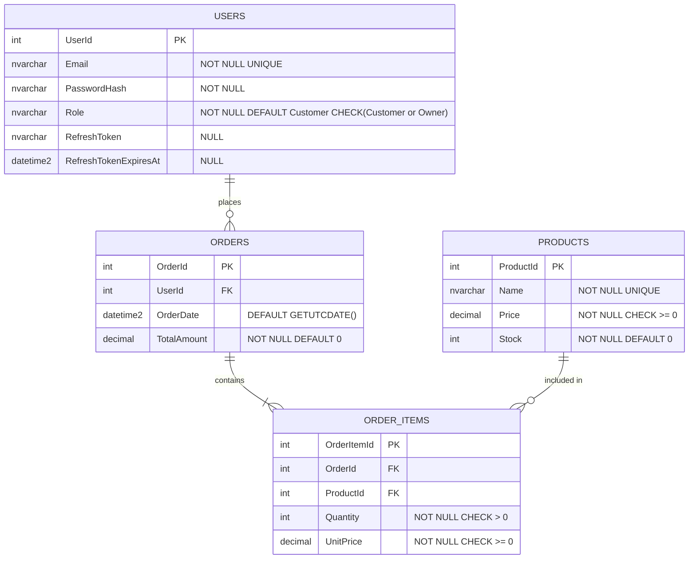
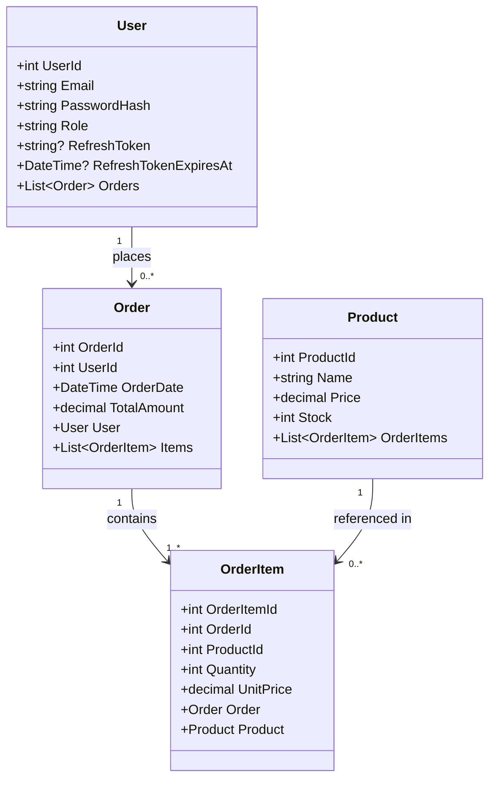
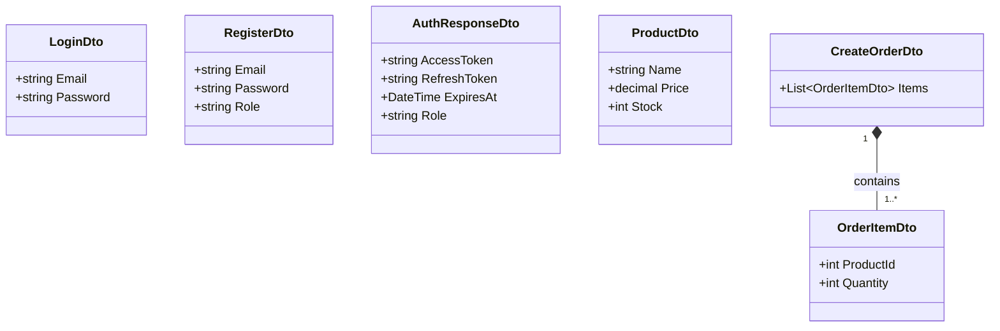
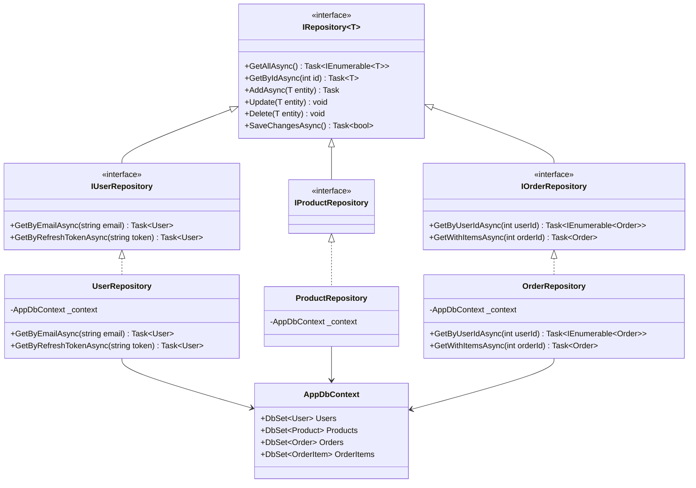
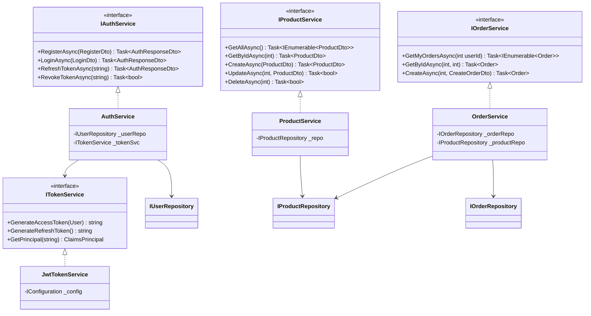
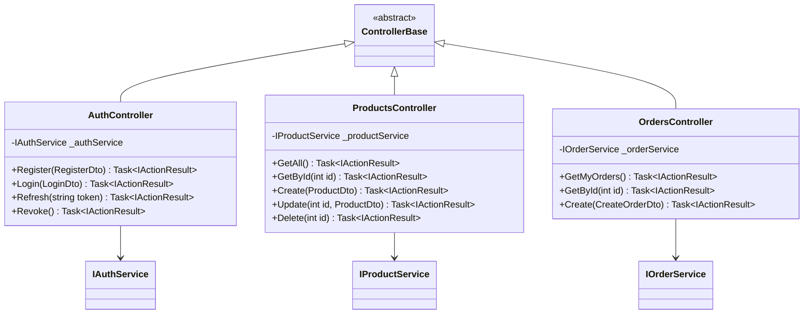
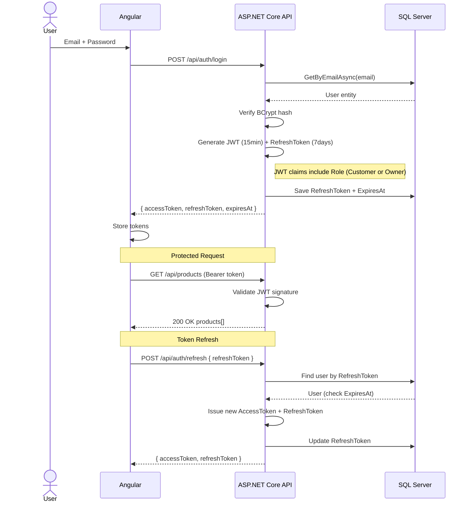

# 🧠 LLD Interview Guide
## ASP.NET Core Web API · SQL Server · Angular 21

---

# PART 1 — ER Diagram



---

# PART 2 — Class Diagram

## 2.1 Entities



---

## 2.2 DTOs



---

## 2.3 Repositories



---

## 2.4 Services



---

## 2.5 Controllers



---

## 2.6 Angular 21 — Services & Components

```mermaid
classDiagram

    class AuthService {
        -HttpClient http
        +login(LoginDto) Observable~AuthResponseDto~
        +register(RegisterDto) Observable~AuthResponseDto~
        +logout() void
        +isLoggedIn() boolean
        +getToken() string
        +getRole() string
    }

    class ProductService {
        -HttpClient http
        +getAll() Observable~ProductDto[]~
        +getById(int) Observable~ProductDto~
        +create(ProductDto) Observable~ProductDto~
        +update(int, ProductDto) Observable~ProductDto~
        +delete(int) Observable~void~
    }

    class OrderService {
        -HttpClient http
        +getMyOrders() Observable~Order[]~
        +create(CreateOrderDto) Observable~Order~
    }

    class AuthGuard {
        -AuthService authService
        -Router router
        +canActivate() boolean
    }

    class OwnerGuard {
        -AuthService authService
        -Router router
        +canActivate() boolean
    }

    class AuthInterceptor {
        -AuthService authService
        +intercept(req, next) Observable~HttpEvent~
    }

    class LoginComponent {
        -AuthService authService
        +loginForm FormGroup
        +onSubmit() void
    }

    class RegisterComponent {
        -AuthService authService
        +registerForm FormGroup
        +onSubmit() void
    }

    class ProductListComponent {
        -ProductService productService
        +products ProductDto[]
        +ngOnInit() void
    }

    class ProductFormComponent {
        -ProductService productService
        +form FormGroup
        +onSubmit() void
    }

    class OrderListComponent {
        -OrderService orderService
        +orders Order[]
        +ngOnInit() void
    }

    LoginComponent       --> AuthService
    RegisterComponent    --> AuthService
    ProductListComponent --> ProductService
    ProductFormComponent --> ProductService
    OrderListComponent   --> OrderService
    AuthGuard            --> AuthService
    OwnerGuard           --> AuthService
    AuthInterceptor      --> AuthService
```



---

# PART 3 — Folder Structure

## ASP.NET Core Web API

```
MyApp.API/
├── Controllers/
│   ├── AuthController.cs
│   ├── ProductsController.cs
│   └── OrdersController.cs
│
├── DTOs/
│   ├── Auth/
│   │   ├── LoginDto.cs
│   │   ├── RegisterDto.cs
│   │   └── AuthResponseDto.cs
│   ├── Products/
│   │   └── ProductDto.cs
│   └── Orders/
│       ├── CreateOrderDto.cs
│       └── OrderItemDto.cs
│
├── Entities/
│   ├── User.cs
│   ├── Product.cs
│   ├── Order.cs
│   └── OrderItem.cs
│
├── Interfaces/
│   ├── Repositories/
│   │   ├── IRepository.cs
│   │   ├── IUserRepository.cs
│   │   ├── IProductRepository.cs
│   │   └── IOrderRepository.cs
│   └── Services/
│       ├── IAuthService.cs
│       ├── ITokenService.cs
│       ├── IProductService.cs
│       └── IOrderService.cs
│
├── Repositories/
│   ├── UserRepository.cs
│   ├── ProductRepository.cs
│   └── OrderRepository.cs
│
├── Services/
│   ├── AuthService.cs
│   ├── JwtTokenService.cs
│   ├── ProductService.cs
│   └── OrderService.cs
│
├── Data/
│   └── AppDbContext.cs
│
├── appsettings.json
└── Program.cs
```

## Angular 21

```
src/app/
├── core/
│   ├── guards/
│   │   ├── auth.guard.ts        ← any logged-in user
│   │   └── owner.guard.ts       ← Owner role only
│   ├── interceptors/
│   │   └── auth.interceptor.ts
│   └── services/
│       ├── auth.service.ts
│       ├── product.service.ts
│       └── order.service.ts
│
├── features/
│   ├── auth/
│   │   ├── login/
│   │   │   └── login.component.ts
│   │   ├── register/
│   │   │   └── register.component.ts
│   │   └── auth.routes.ts
│   │
│   ├── products/
│   │   ├── product-list/
│   │   │   └── product-list.component.ts
│   │   ├── product-form/
│   │   │   └── product-form.component.ts
│   │   └── products.routes.ts
│   │
│   └── orders/
│       ├── order-list/
│       │   └── order-list.component.ts
│       └── orders.routes.ts
│
├── models/
│   ├── user.model.ts
│   ├── product.model.ts
│   └── order.model.ts
│
├── app.config.ts
└── app.routes.ts
```

---

# PART 4 — JWT Auth Flow



---

# PART 5 — Role Reference

## SQL — Users Table with Role

```sql
CREATE TABLE Users (
    UserId                INT           IDENTITY(1,1) PRIMARY KEY,
    Email                 NVARCHAR(200) NOT NULL CONSTRAINT UQ_Users_Email UNIQUE,
    PasswordHash          NVARCHAR(500) NOT NULL,
    Role                  NVARCHAR(20)  NOT NULL DEFAULT 'Customer'
        CONSTRAINT CHK_Users_Role CHECK (Role IN ('Customer', 'Owner')),
    RefreshToken          NVARCHAR(500) NULL,
    RefreshTokenExpiresAt DATETIME2     NULL
);
```

## ASP.NET Core — Role in JWT + Controller

```csharp
// JwtTokenService.cs — include Role as a claim
var claims = new[]
{
    new Claim(JwtRegisteredClaimNames.Sub,   user.UserId.ToString()),
    new Claim(JwtRegisteredClaimNames.Email, user.Email),
    new Claim(ClaimTypes.Role,               user.Role)   // "Customer" or "Owner"
};

// ProductsController.cs — Owner only can create/update/delete
[HttpPost]
[Authorize(Roles = "Owner")]
public async Task<IActionResult> Create(ProductDto dto) { ... }

[HttpGet]
[Authorize]                          // Both Customer and Owner can browse
public async Task<IActionResult> GetAll() { ... }

// OrdersController.cs — Customer only can place orders
[HttpPost]
[Authorize(Roles = "Customer")]
public async Task<IActionResult> Create(CreateOrderDto dto) { ... }
```

## Angular 21 — Guards

```typescript
// auth.guard.ts — any logged-in user
export const authGuard: CanActivateFn = () => {
    const auth   = inject(AuthService);
    const router = inject(Router);
    return auth.isLoggedIn()
        ? true
        : router.createUrlTree(['/auth/login']);
};

// owner.guard.ts — Owner role only
export const ownerGuard: CanActivateFn = () => {
    const auth   = inject(AuthService);
    const router = inject(Router);
    return auth.getRole() === 'Owner'
        ? true
        : router.createUrlTree(['/403']);
};

// app.routes.ts
{ path: 'products/create',
  loadComponent: () => import('./features/products/product-form/product-form.component')
      .then(m => m.ProductFormComponent),
  canActivate: [ownerGuard] },   // only Owner

{ path: 'orders',
  loadChildren: () => import('./features/orders/orders.routes')
      .then(m => m.ORDER_ROUTES),
  canActivate: [authGuard] },    // Customer + Owner
```

## Role Permissions Summary

```
┌─────────────────────────┬──────────┬───────┐
│ Action                  │ Customer │ Owner │
├─────────────────────────┼──────────┼───────┤
│ Browse products         │    ✅    │  ✅   │
│ Place an order          │    ✅    │  ❌   │
│ View own orders         │    ✅    │  ❌   │
│ Create / edit products  │    ❌    │  ✅   │
│ Delete products         │    ❌    │  ✅   │
│ View all orders (admin) │    ❌    │  ✅   │
└─────────────────────────┴──────────┴───────┘
```

---

# PART 6 — Full SQL Script (DDL)

```sql
-- ============================================================
-- CREATE TABLES
-- ============================================================

CREATE TABLE Users (
    UserId                INT           IDENTITY(1,1) PRIMARY KEY,
    Email                 NVARCHAR(200) NOT NULL
        CONSTRAINT UQ_Users_Email         UNIQUE,
    PasswordHash          NVARCHAR(500) NOT NULL,
    Role                  NVARCHAR(20)  NOT NULL DEFAULT 'Customer'
        CONSTRAINT CHK_Users_Role         CHECK (Role IN ('Customer', 'Owner')),
    RefreshToken          NVARCHAR(500) NULL,
    RefreshTokenExpiresAt DATETIME2     NULL
);

CREATE TABLE Products (
    ProductId INT           IDENTITY(1,1) PRIMARY KEY,
    Name      NVARCHAR(200) NOT NULL
        CONSTRAINT UQ_Products_Name       UNIQUE,
    Price     DECIMAL(18,2) NOT NULL
        CONSTRAINT CHK_Products_Price     CHECK (Price >= 0),
    Stock     INT           NOT NULL DEFAULT 0
        CONSTRAINT CHK_Products_Stock     CHECK (Stock >= 0)
);

CREATE TABLE Orders (
    OrderId     INT           IDENTITY(1,1) PRIMARY KEY,
    UserId      INT           NOT NULL
        CONSTRAINT FK_Orders_Users        REFERENCES Users(UserId)
        ON DELETE NO ACTION,
    OrderDate   DATETIME2     NOT NULL    DEFAULT GETUTCDATE(),
    TotalAmount DECIMAL(18,2) NOT NULL    DEFAULT 0
        CONSTRAINT CHK_Orders_Amount      CHECK (TotalAmount >= 0)
);

CREATE TABLE OrderItems (
    OrderItemId INT           IDENTITY(1,1) PRIMARY KEY,
    OrderId     INT           NOT NULL
        CONSTRAINT FK_OrderItems_Orders   REFERENCES Orders(OrderId)
        ON DELETE CASCADE,
    ProductId   INT           NOT NULL
        CONSTRAINT FK_OrderItems_Products REFERENCES Products(ProductId)
        ON DELETE NO ACTION,
    Quantity    INT           NOT NULL
        CONSTRAINT CHK_OI_Quantity        CHECK (Quantity > 0),
    UnitPrice   DECIMAL(18,2) NOT NULL
        CONSTRAINT CHK_OI_UnitPrice       CHECK (UnitPrice >= 0),
    CONSTRAINT UQ_OrderItems_OrderProduct UNIQUE (OrderId, ProductId)
);

-- ============================================================
-- INDEXES  (always index FK columns)
-- ============================================================

CREATE INDEX IX_Orders_UserId          ON Orders(UserId);
CREATE INDEX IX_OrderItems_OrderId     ON OrderItems(OrderId);
CREATE INDEX IX_OrderItems_ProductId   ON OrderItems(ProductId);
```

---

# PART 7 — Relationship Details

## 7.1 Relationship Summary Table

```
┌──────────────┬──────────────┬──────┬─────────────────────────────────────────────────────┐
│ Parent Table │ Child Table  │ Type │ Details                                             │
├──────────────┼──────────────┼──────┼─────────────────────────────────────────────────────┤
│ Users        │ Orders       │ 1:N  │ One user places many orders.                        │
│              │              │      │ FK: Orders.UserId → Users.UserId                    │
│              │              │      │ ON DELETE NO ACTION (order history preserved)        │
├──────────────┼──────────────┼──────┼─────────────────────────────────────────────────────┤
│ Orders       │ OrderItems   │ 1:N  │ One order contains one or more order items.         │
│              │              │      │ FK: OrderItems.OrderId → Orders.OrderId             │
│              │              │      │ ON DELETE CASCADE (items deleted with order)         │
├──────────────┼──────────────┼──────┼─────────────────────────────────────────────────────┤
│ Products     │ OrderItems   │ 1:N  │ One product can appear in many order items.         │
│              │              │      │ FK: OrderItems.ProductId → Products.ProductId       │
│              │              │      │ ON DELETE NO ACTION (product record preserved)       │
│              │              │      │ UnitPrice is snapshot of price at time of purchase  │
├──────────────┼──────────────┼──────┼─────────────────────────────────────────────────────┤
│ Orders       │ OrderItems   │ M:N  │ Products ↔ Orders is Many-to-Many via OrderItems.   │
│ Products     │ (junction)   │      │ One order has many products; one product in many    │
│              │              │      │ orders. OrderItems is the junction/bridge table.    │
└──────────────┴──────────────┴──────┴─────────────────────────────────────────────────────┘
```

## 7.2 Relationship Diagram (ASCII)

```
Users
  │  UserId (PK)
  │  Email
  │  PasswordHash
  │  Role ('Customer' | 'Owner')
  │  RefreshToken
  │  RefreshTokenExpiresAt
  │
  │  1
  │  │ ← a user places many orders
  │  N
  ▼
Orders
  │  OrderId (PK)
  │  UserId  (FK → Users.UserId)   ON DELETE NO ACTION
  │  OrderDate
  │  TotalAmount
  │
  │  1
  │  │ ← an order contains many order items
  │  N
  ▼
OrderItems ◄──────────────────────── Products
  OrderItemId (PK)                     ProductId (PK)
  OrderId     (FK → Orders)            Name
  ProductId   (FK → Products)          Price
  Quantity                             Stock
  UnitPrice  ← price snapshot

  N                                    1
  │ ← one product referenced in many order items
  └────────────────────────────────────┘
```

## 7.3 ON DELETE Behaviour Explained

```
┌──────────────────┬──────────────────────────────────────────────────────────┐
│ Behaviour        │ What happens when parent row is deleted                  │
├──────────────────┼──────────────────────────────────────────────────────────┤
│ CASCADE          │ Child rows are automatically deleted too.                │
│                  │ Used: Orders → OrderItems                                │
│                  │ Reason: no order = no need for its items                 │
├──────────────────┼──────────────────────────────────────────────────────────┤
│ NO ACTION        │ DELETE fails if child rows exist (raises FK error).      │
│                  │ Used: Users → Orders                                     │
│                  │ Reason: preserve order history even if user is removed   │
│                  │ Used: Products → OrderItems                              │
│                  │ Reason: preserve order history even if product removed   │
├──────────────────┼──────────────────────────────────────────────────────────┤
│ SET NULL         │ FK column in child is set to NULL (not used here).       │
│ SET DEFAULT      │ FK column set to its default value (not used here).      │
└──────────────────┴──────────────────────────────────────────────────────────┘
```

## 7.4 Constraints Reference

```
┌─────────────────┬───────────────────────────────────────────────────────────┐
│ Constraint      │ Applied on                                                │
├─────────────────┼───────────────────────────────────────────────────────────┤
│ PRIMARY KEY     │ Users.UserId, Products.ProductId,                         │
│                 │ Orders.OrderId, OrderItems.OrderItemId                    │
├─────────────────┼───────────────────────────────────────────────────────────┤
│ FOREIGN KEY     │ Orders.UserId → Users                                     │
│                 │ OrderItems.OrderId → Orders                               │
│                 │ OrderItems.ProductId → Products                           │
├─────────────────┼───────────────────────────────────────────────────────────┤
│ UNIQUE          │ Users.Email (no two accounts with same email)             │
│                 │ Products.Name (no duplicate product names)                │
│                 │ OrderItems(OrderId, ProductId) composite unique           │
│                 │   → same product cannot appear twice in same order        │
├─────────────────┼───────────────────────────────────────────────────────────┤
│ CHECK           │ Users.Role IN ('Customer','Owner')                        │
│                 │ Products.Price >= 0                                       │
│                 │ Products.Stock >= 0                                       │
│                 │ Orders.TotalAmount >= 0                                   │
│                 │ OrderItems.Quantity > 0                                   │
│                 │ OrderItems.UnitPrice >= 0                                 │
├─────────────────┼───────────────────────────────────────────────────────────┤
│ DEFAULT         │ Users.Role = 'Customer'                                   │
│                 │ Products.Stock = 0                                        │
│                 │ Orders.TotalAmount = 0                                    │
│                 │ Orders.OrderDate = GETUTCDATE()                           │
│                 │ Orders.TotalAmount = 0                                    │
└─────────────────┴───────────────────────────────────────────────────────────┘
```

---

# PART 8 — Dummy Data (INSERT Statements)

> All passwords are BCrypt hashes of `Password123!`  
> `$2a$11$HASH` is a placeholder — replace with real BCrypt output in production.  
> Insert order: **Users → Products → Orders → OrderItems** (respects FK constraints)

---

## 8.1 Users — 52 records (2 Owners + 50 Customers)

```sql
-- UserId 1–52
INSERT INTO Users (Email, PasswordHash, Role) VALUES
('owner1@shop.com',      '$2a$11$HASHowner1XXXXXXXXXXXXXXXXXXXXXXXXXXXXXXXXXXXXXXXXXX', 'Owner'),
('owner2@shop.com',      '$2a$11$HASHowner2XXXXXXXXXXXXXXXXXXXXXXXXXXXXXXXXXXXXXXXXXX', 'Owner'),
('alice@mail.com',       '$2a$11$HASHaliceXXXXXXXXXXXXXXXXXXXXXXXXXXXXXXXXXXXXXXXX', 'Customer'),
('bob@mail.com',         '$2a$11$HASHbobXXXXXXXXXXXXXXXXXXXXXXXXXXXXXXXXXXXXXXXXXX', 'Customer'),
('charlie@mail.com',     '$2a$11$HASHcharlieXXXXXXXXXXXXXXXXXXXXXXXXXXXXXXXXXXXXXX', 'Customer'),
('diana@mail.com',       '$2a$11$HASHdianaXXXXXXXXXXXXXXXXXXXXXXXXXXXXXXXXXXXXXXXX', 'Customer'),
('ethan@mail.com',       '$2a$11$HASHethanXXXXXXXXXXXXXXXXXXXXXXXXXXXXXXXXXXXXXXXX', 'Customer'),
('fiona@mail.com',       '$2a$11$HASHfionaXXXXXXXXXXXXXXXXXXXXXXXXXXXXXXXXXXXXXXXX', 'Customer'),
('george@mail.com',      '$2a$11$HASHgeorgeXXXXXXXXXXXXXXXXXXXXXXXXXXXXXXXXXXXXXXX', 'Customer'),
('hannah@mail.com',      '$2a$11$HASHhannahXXXXXXXXXXXXXXXXXXXXXXXXXXXXXXXXXXXXXXX', 'Customer'),
('ivan@mail.com',        '$2a$11$HASHivanXXXXXXXXXXXXXXXXXXXXXXXXXXXXXXXXXXXXXXXXX', 'Customer'),
('julia@mail.com',       '$2a$11$HASHjuliaXXXXXXXXXXXXXXXXXXXXXXXXXXXXXXXXXXXXXXXX', 'Customer'),
('kevin@mail.com',       '$2a$11$HASHkevinXXXXXXXXXXXXXXXXXXXXXXXXXXXXXXXXXXXXXXXX', 'Customer'),
('laura@mail.com',       '$2a$11$HASHlauraXXXXXXXXXXXXXXXXXXXXXXXXXXXXXXXXXXXXXXXX', 'Customer'),
('mike@mail.com',        '$2a$11$HASHmikeXXXXXXXXXXXXXXXXXXXXXXXXXXXXXXXXXXXXXXXXX', 'Customer'),
('nina@mail.com',        '$2a$11$HASHninaXXXXXXXXXXXXXXXXXXXXXXXXXXXXXXXXXXXXXXXXX', 'Customer'),
('oscar@mail.com',       '$2a$11$HASHoscarXXXXXXXXXXXXXXXXXXXXXXXXXXXXXXXXXXXXXXXX', 'Customer'),
('penny@mail.com',       '$2a$11$HASHpennyXXXXXXXXXXXXXXXXXXXXXXXXXXXXXXXXXXXXXXXX', 'Customer'),
('quinn@mail.com',       '$2a$11$HASHquinnXXXXXXXXXXXXXXXXXXXXXXXXXXXXXXXXXXXXXXXX', 'Customer'),
('rachel@mail.com',      '$2a$11$HASHrachelXXXXXXXXXXXXXXXXXXXXXXXXXXXXXXXXXXXXXXX', 'Customer'),
('sam@mail.com',         '$2a$11$HASHsamXXXXXXXXXXXXXXXXXXXXXXXXXXXXXXXXXXXXXXXXXX', 'Customer'),
('tina@mail.com',        '$2a$11$HASHtinaXXXXXXXXXXXXXXXXXXXXXXXXXXXXXXXXXXXXXXXXX', 'Customer'),
('uma@mail.com',         '$2a$11$HASHumaXXXXXXXXXXXXXXXXXXXXXXXXXXXXXXXXXXXXXXXXXX', 'Customer'),
('victor@mail.com',      '$2a$11$HASHvictorXXXXXXXXXXXXXXXXXXXXXXXXXXXXXXXXXXXXXXX', 'Customer'),
('wendy@mail.com',       '$2a$11$HASHwendyXXXXXXXXXXXXXXXXXXXXXXXXXXXXXXXXXXXXXXXX', 'Customer'),
('xander@mail.com',      '$2a$11$HASHxanderXXXXXXXXXXXXXXXXXXXXXXXXXXXXXXXXXXXXXXX', 'Customer'),
('yara@mail.com',        '$2a$11$HASHyaraXXXXXXXXXXXXXXXXXXXXXXXXXXXXXXXXXXXXXXXXX', 'Customer'),
('zack@mail.com',        '$2a$11$HASHzackXXXXXXXXXXXXXXXXXXXXXXXXXXXXXXXXXXXXXXXXX', 'Customer'),
('aaron@mail.com',       '$2a$11$HASHaaronXXXXXXXXXXXXXXXXXXXXXXXXXXXXXXXXXXXXXXXX', 'Customer'),
('bella@mail.com',       '$2a$11$HASHbellaXXXXXXXXXXXXXXXXXXXXXXXXXXXXXXXXXXXXXXXX', 'Customer'),
('carl@mail.com',        '$2a$11$HASHcarlXXXXXXXXXXXXXXXXXXXXXXXXXXXXXXXXXXXXXXXXX', 'Customer'),
('daisy@mail.com',       '$2a$11$HASHdaisyXXXXXXXXXXXXXXXXXXXXXXXXXXXXXXXXXXXXXXXX', 'Customer'),
('eli@mail.com',         '$2a$11$HASHeliXXXXXXXXXXXXXXXXXXXXXXXXXXXXXXXXXXXXXXXXXX', 'Customer'),
('freya@mail.com',       '$2a$11$HASHfreyaXXXXXXXXXXXXXXXXXXXXXXXXXXXXXXXXXXXXXXXX', 'Customer'),
('glen@mail.com',        '$2a$11$HASHglenXXXXXXXXXXXXXXXXXXXXXXXXXXXXXXXXXXXXXXXXX', 'Customer'),
('holly@mail.com',       '$2a$11$HASHhollyXXXXXXXXXXXXXXXXXXXXXXXXXXXXXXXXXXXXXXXX', 'Customer'),
('ian@mail.com',         '$2a$11$HASHianXXXXXXXXXXXXXXXXXXXXXXXXXXXXXXXXXXXXXXXXXX', 'Customer'),
('jade@mail.com',        '$2a$11$HASHjadeXXXXXXXXXXXXXXXXXXXXXXXXXXXXXXXXXXXXXXXXX', 'Customer'),
('kyle@mail.com',        '$2a$11$HASHkyleXXXXXXXXXXXXXXXXXXXXXXXXXXXXXXXXXXXXXXXXX', 'Customer'),
('lily@mail.com',        '$2a$11$HASHlilyXXXXXXXXXXXXXXXXXXXXXXXXXXXXXXXXXXXXXXXXX', 'Customer'),
('mason@mail.com',       '$2a$11$HASHmasonXXXXXXXXXXXXXXXXXXXXXXXXXXXXXXXXXXXXXXXX', 'Customer'),
('nora@mail.com',        '$2a$11$HASHnoraXXXXXXXXXXXXXXXXXXXXXXXXXXXXXXXXXXXXXXXXX', 'Customer'),
('oliver@mail.com',      '$2a$11$HASHoliverXXXXXXXXXXXXXXXXXXXXXXXXXXXXXXXXXXXXXXX', 'Customer'),
('paige@mail.com',       '$2a$11$HASHpaigeXXXXXXXXXXXXXXXXXXXXXXXXXXXXXXXXXXXXXXXX', 'Customer'),
('rory@mail.com',        '$2a$11$HASHroryXXXXXXXXXXXXXXXXXXXXXXXXXXXXXXXXXXXXXXXXX', 'Customer'),
('stella@mail.com',      '$2a$11$HASHstellaXXXXXXXXXXXXXXXXXXXXXXXXXXXXXXXXXXXXXXX', 'Customer'),
('theo@mail.com',        '$2a$11$HASHtheoXXXXXXXXXXXXXXXXXXXXXXXXXXXXXXXXXXXXXXXXX', 'Customer'),
('ursula@mail.com',      '$2a$11$HASHursulaXXXXXXXXXXXXXXXXXXXXXXXXXXXXXXXXXXXXXXX', 'Customer'),
('vince@mail.com',       '$2a$11$HASHvinceXXXXXXXXXXXXXXXXXXXXXXXXXXXXXXXXXXXXXXXX', 'Customer'),
('willa@mail.com',       '$2a$11$HASHwillaXXXXXXXXXXXXXXXXXXXXXXXXXXXXXXXXXXXXXXXX', 'Customer'),
('xerxes@mail.com',      '$2a$11$HASHxerxesXXXXXXXXXXXXXXXXXXXXXXXXXXXXXXXXXXXXXXX', 'Customer'),
('yasmin@mail.com',      '$2a$11$HASHyasminXXXXXXXXXXXXXXXXXXXXXXXXXXXXXXXXXXXXXXX', 'Customer');
-- UserId: Owners=1,2 | Customers=3..52
```

---

## 8.2 Products — 50 records

```sql
-- ProductId 1–50
INSERT INTO Products (Name, Price, Stock) VALUES
('Wireless Mouse',            29.99, 150),
('Mechanical Keyboard',       89.99,  75),
('USB-C Hub',                 45.00, 200),
('27" Monitor',              299.99,  30),
('Laptop Stand',              35.50, 120),
('Webcam HD 1080p',           59.99,  60),
('Noise Cancelling Headset', 149.99,  45),
('Gaming Mouse Pad XL',       19.99, 300),
('HDMI Cable 2m',              9.99, 500),
('USB-A to USB-C Cable',       8.99, 400),
('Laptop Backpack',           55.00,  90),
('Portable SSD 1TB',         109.99,  55),
('External Hard Drive 2TB',   79.99,  40),
('Wireless Charger Pad',      25.00, 180),
('Bluetooth Speaker',         49.99,  70),
('Smart LED Desk Lamp',       39.99, 100),
('4K Webcam',                 99.99,  35),
('Ergonomic Office Chair',   249.99,  20),
('Standing Desk',            399.99,  15),
('Monitor Arm',               65.00,  50),
('Cable Management Kit',      14.99, 250),
('Desk Organiser',            22.50, 175),
('USB Numeric Keypad',        18.99, 130),
('Fingerprint USB Key',       34.99,  80),
('Screen Cleaning Kit',        7.99, 600),
('Anti-Glare Screen Filter',  24.99,  95),
('Trackball Mouse',           59.99,  42),
('Compact Bluetooth Keyboard',49.99,  65),
('Wireless Presenter Remote', 29.99, 110),
('Laptop Cooling Pad',        32.00,  85),
('Surge Protector 6-Port',    35.00, 160),
('Power Bank 20000mAh',       49.00,  90),
('USB Wall Charger 65W',      27.99, 200),
('Cat6 Ethernet Cable 5m',    11.99, 350),
('Network Switch 8-Port',     45.00,  55),
('Wi-Fi Range Extender',      39.99,  72),
('Smart Plug x4 Pack',        34.99, 115),
('Raspberry Pi 4 Kit',       129.99,  25),
('Arduino Starter Kit',       59.99,  38),
('Soldering Iron Kit',        44.99,  48),
('Digital Multimeter',        32.99,  60),
('Label Maker',               29.99,  80),
('Whiteboard A3',             19.99, 140),
('Dry Erase Markers x10',      6.99, 500),
('Sticky Notes Bulk Pack',     9.49, 400),
('A4 Printer Paper 500 Sheets',8.99, 700),
('Ballpoint Pens x20',         4.99, 800),
('Stapler Heavy Duty',        14.99, 220),
('Paper Shredder',            69.99,  30),
('Desk Fan USB',              21.99, 145);
-- ProductId 1..50
```

---

## 8.3 Orders — 50 records
> Customers UserId 3–52 (all 50 customers have at least 1 order)

```sql
-- OrderId 1–50
INSERT INTO Orders (UserId, OrderDate, TotalAmount) VALUES
( 3, '2025-01-02 08:10:00',  119.98),
( 4, '2025-01-03 09:20:00',  299.99),
( 5, '2025-01-04 10:05:00',   29.99),
( 6, '2025-01-05 11:30:00',  149.99),
( 7, '2025-01-06 12:15:00',   89.99),
( 8, '2025-01-07 13:00:00',   45.00),
( 9, '2025-01-08 14:20:00',   59.99),
(10, '2025-01-09 15:10:00',   79.99),
(11, '2025-01-10 16:00:00',  399.99),
(12, '2025-01-11 08:45:00',   49.99),
(13, '2025-01-12 09:30:00',  109.99),
(14, '2025-01-13 10:55:00',   35.50),
(15, '2025-01-14 11:40:00',   65.00),
(16, '2025-01-15 12:30:00',   24.99),
(17, '2025-01-16 13:50:00',   99.99),
(18, '2025-01-17 14:35:00',   32.00),
(19, '2025-01-18 15:20:00',   19.99),
(20, '2025-01-19 16:05:00',   55.00),
(21, '2025-01-20 08:00:00',   39.99),
(22, '2025-01-21 09:10:00',   14.99),
(23, '2025-01-22 10:25:00',  249.99),
(24, '2025-01-23 11:15:00',   25.00),
(25, '2025-01-24 12:40:00',   59.99),
(26, '2025-01-25 13:25:00',   29.99),
(27, '2025-01-26 14:10:00',   49.00),
(28, '2025-01-27 15:55:00',   89.99),
(29, '2025-01-28 16:40:00',   34.99),
(30, '2025-01-29 08:30:00',   45.00),
(31, '2025-01-30 09:15:00',   69.99),
(32, '2025-01-31 10:00:00',   11.99),
(33, '2025-02-01 11:45:00',  129.99),
(34, '2025-02-02 12:30:00',   19.99),
(35, '2025-02-03 13:15:00',   35.00),
(36, '2025-02-04 14:00:00',   22.50),
(37, '2025-02-05 15:45:00',   44.99),
(38, '2025-02-06 16:30:00',   27.99),
(39, '2025-02-07 08:20:00',   59.99),
(40, '2025-02-08 09:05:00',   32.99),
(41, '2025-02-09 10:50:00',   21.99),
(42, '2025-02-10 11:35:00',   49.99),
(43, '2025-02-11 12:20:00',   39.99),
(44, '2025-02-12 13:05:00',   79.99),
(45, '2025-02-13 14:50:00',   29.99),
(46, '2025-02-14 15:35:00',  149.99),
(47, '2025-02-15 16:20:00',   55.00),
(48, '2025-02-16 08:10:00',   65.00),
(49, '2025-02-17 09:55:00',   45.00),
(50, '2025-02-18 10:40:00',   99.99),
(51, '2025-02-19 11:25:00',   34.99),
(52, '2025-02-20 12:10:00',   49.99);
-- OrderId 1..50
```

---

## 8.4 OrderItems — 50+ records
> Each order has at least 1 item. Some orders have 2 items.  
> UnitPrice matches product price at time of purchase (snapshot).  
> No duplicate ProductId per OrderId (composite UNIQUE constraint).

```sql
INSERT INTO OrderItems (OrderId, ProductId, Quantity, UnitPrice) VALUES
-- Order 1  (Alice)      → Mouse + Keyboard
( 1,  1, 1,  29.99),
( 1,  2, 1,  89.99),
-- Order 2  (Bob)        → Monitor
( 2,  4, 1, 299.99),
-- Order 3  (Charlie)    → Wireless Mouse
( 3,  1, 1,  29.99),
-- Order 4  (Diana)      → Headset
( 4,  7, 1, 149.99),
-- Order 5  (Ethan)      → Keyboard
( 5,  2, 1,  89.99),
-- Order 6  (Fiona)      → USB-C Hub
( 6,  3, 1,  45.00),
-- Order 7  (George)     → Webcam
( 7,  6, 1,  59.99),
-- Order 8  (Hannah)     → External HDD
( 8, 13, 1,  79.99),
-- Order 9  (Ivan)       → Standing Desk
( 9, 19, 1, 399.99),
-- Order 10 (Julia)      → Bluetooth Speaker
(10, 15, 1,  49.99),
-- Order 11 (Kevin)      → Portable SSD
(11, 12, 1, 109.99),
-- Order 12 (Laura)      → Laptop Stand
(12,  5, 1,  35.50),
-- Order 13 (Mike)       → Monitor Arm
(13, 20, 1,  65.00),
-- Order 14 (Nina)       → Anti-Glare Filter
(14, 26, 1,  24.99),
-- Order 15 (Oscar)      → 4K Webcam
(15, 17, 1,  99.99),
-- Order 16 (Penny)      → Cooling Pad
(16, 30, 1,  32.00),
-- Order 17 (Quinn)      → Gaming Mouse Pad
(17,  8, 1,  19.99),
-- Order 18 (Rachel)     → Backpack
(18, 11, 1,  55.00),
-- Order 19 (Sam)        → Desk Lamp
(19, 16, 1,  39.99),
-- Order 20 (Tina)       → Cable Kit
(20, 21, 1,  14.99),
-- Order 21 (Uma)        → Ergonomic Chair
(21, 18, 1, 249.99),
-- Order 22 (Victor)     → Wireless Charger
(22, 14, 1,  25.00),
-- Order 23 (Wendy)      → Compact BT Keyboard
(23, 28, 1,  49.99),  -- note: same price as stock
-- Order 24 (Xander)     → Wireless Presenter
(24, 29, 1,  29.99),
-- Order 25 (Yara)       → Power Bank
(25, 32, 1,  49.00),
-- Order 26 (Zack)       → Keyboard + Mouse Pad
(26,  2, 1,  89.99),
-- Order 27 (Aaron)      → Fingerprint Key
(27, 24, 1,  34.99),
-- Order 28 (Bella)      → USB-C Hub
(28,  3, 1,  45.00),
-- Order 29 (Carl)       → Paper Shredder
(29, 49, 1,  69.99),
-- Order 30 (Daisy)      → Ethernet Cable
(30, 34, 1,  11.99),
-- Order 31 (Eli)        → Raspberry Pi Kit
(31, 38, 1, 129.99),
-- Order 32 (Freya)      → Mouse Pad
(32,  8, 1,  19.99),
-- Order 33 (Glen)       → Surge Protector
(33, 31, 1,  35.00),
-- Order 34 (Holly)      → Desk Organiser
(34, 22, 1,  22.50),
-- Order 35 (Ian)        → Soldering Iron
(35, 40, 1,  44.99),
-- Order 36 (Jade)       → USB Charger
(36, 33, 1,  27.99),
-- Order 37 (Kyle)       → Webcam
(37,  6, 1,  59.99),
-- Order 38 (Lily)       → Digital Multimeter
(38, 41, 1,  32.99),
-- Order 39 (Mason)      → USB Desk Fan
(39, 50, 1,  21.99),
-- Order 40 (Nora)       → Bluetooth Speaker
(40, 15, 1,  49.99),
-- Order 41 (Oliver)     → Wi-Fi Extender
(41, 36, 1,  39.99),
-- Order 42 (Paige)      → External HDD
(42, 13, 1,  79.99),
-- Order 43 (Rory)       → Wireless Mouse
(43,  1, 1,  29.99),
-- Order 44 (Stella)     → Headset
(44,  7, 1, 149.99),
-- Order 45 (Theo)       → Backpack
(45, 11, 1,  55.00),
-- Order 46 (Ursula)     → Monitor Arm
(46, 20, 1,  65.00),
-- Order 47 (Vince)      → USB-C Hub
(47,  3, 1,  45.00),
-- Order 48 (Willa)      → 4K Webcam
(48, 17, 1,  99.99),
-- Order 49 (Xerxes)     → Fingerprint Key
(49, 24, 1,  34.99),
-- Order 50 (Yasmin)     → Bluetooth Speaker
(50, 15, 1,  49.99),
-- Bonus 2-item orders (Orders 1 already has 2; add 2nd items to orders 2, 5, 9, 11, 21)
( 2,  5, 1,  35.50),   -- Bob also bought Laptop Stand
( 5,  8, 2,  19.99),   -- Ethan also bought 2x Mouse Pads
( 9, 16, 1,  39.99),   -- Ivan also bought Desk Lamp
(11, 26, 1,  24.99),   -- Kevin also bought Anti-Glare Filter
(21, 14, 1,  25.00);   -- Uma also bought Wireless Charger
```

---

## 8.5 Sample Queries on Dummy Data

```sql
-- 1. All orders with customer + product details
SELECT
    u.Email,
    o.OrderId,
    CAST(o.OrderDate AS DATE)      AS OrderDate,
    p.Name                         AS Product,
    oi.Quantity,
    oi.UnitPrice,
    oi.Quantity * oi.UnitPrice     AS LineTotal,
    o.TotalAmount
FROM Orders o
INNER JOIN Users      u  ON o.UserId     = u.UserId
INNER JOIN OrderItems oi ON o.OrderId    = oi.OrderId
INNER JOIN Products   p  ON oi.ProductId = p.ProductId
ORDER BY o.OrderDate, o.OrderId;

-- 2. Total spend per customer (top 10)
SELECT TOP 10
    u.Email,
    COUNT(DISTINCT o.OrderId)   AS TotalOrders,
    SUM(o.TotalAmount)          AS TotalSpent
FROM Users u
INNER JOIN Orders o ON u.UserId = o.UserId
WHERE u.Role = 'Customer'
GROUP BY u.Email
ORDER BY TotalSpent DESC;

-- 3. Most ordered products by units sold
SELECT
    p.Name,
    SUM(oi.Quantity)                   AS UnitsSold,
    SUM(oi.Quantity * oi.UnitPrice)    AS Revenue
FROM Products p
INNER JOIN OrderItems oi ON p.ProductId = oi.ProductId
GROUP BY p.Name
ORDER BY UnitsSold DESC;

-- 4. Products never ordered (stock sitting idle)
SELECT p.Name, p.Price, p.Stock
FROM Products p
LEFT JOIN OrderItems oi ON p.ProductId = oi.ProductId
WHERE oi.ProductId IS NULL;

-- 5. Monthly revenue
SELECT
    YEAR(o.OrderDate)  AS [Year],
    MONTH(o.OrderDate) AS [Month],
    COUNT(*)           AS OrderCount,
    SUM(o.TotalAmount) AS MonthlyRevenue
FROM Orders o
GROUP BY YEAR(o.OrderDate), MONTH(o.OrderDate)
ORDER BY [Year], [Month];

-- 6. Customers who have never ordered (LEFT JOIN anti-pattern)
SELECT u.Email
FROM Users u
LEFT JOIN Orders o ON u.UserId = o.UserId
WHERE o.OrderId IS NULL AND u.Role = 'Customer';

-- 7. Average order value per customer
SELECT
    u.Email,
    AVG(o.TotalAmount) AS AvgOrderValue
FROM Users u
INNER JOIN Orders o ON u.UserId = o.UserId
GROUP BY u.Email
ORDER BY AvgOrderValue DESC;

-- 8. Window function — rank customers by spend
SELECT
    u.Email,
    SUM(o.TotalAmount)                               AS TotalSpent,
    RANK() OVER (ORDER BY SUM(o.TotalAmount) DESC)   AS SpendRank,
    DENSE_RANK() OVER (ORDER BY SUM(o.TotalAmount) DESC) AS DenseRank
FROM Users u
INNER JOIN Orders o ON u.UserId = o.UserId
GROUP BY u.Email;
```

---

*Good luck! 🚀*
