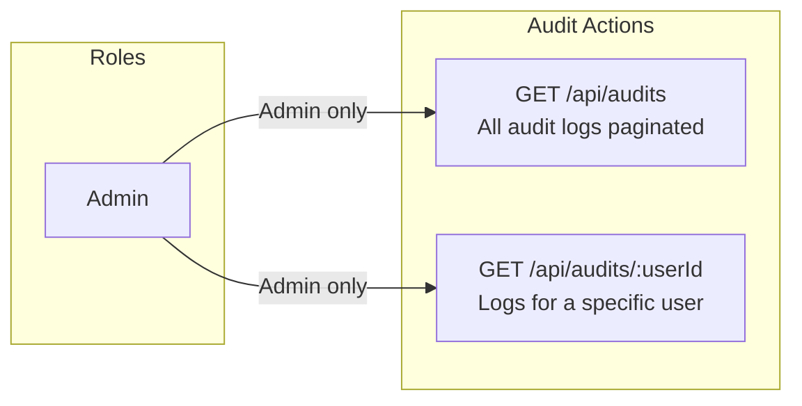
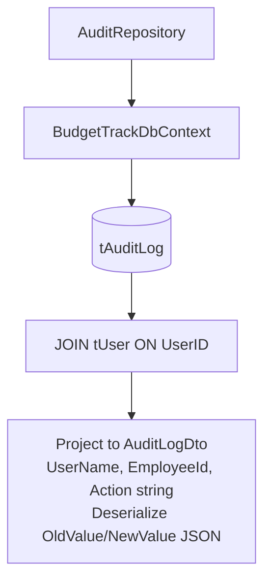
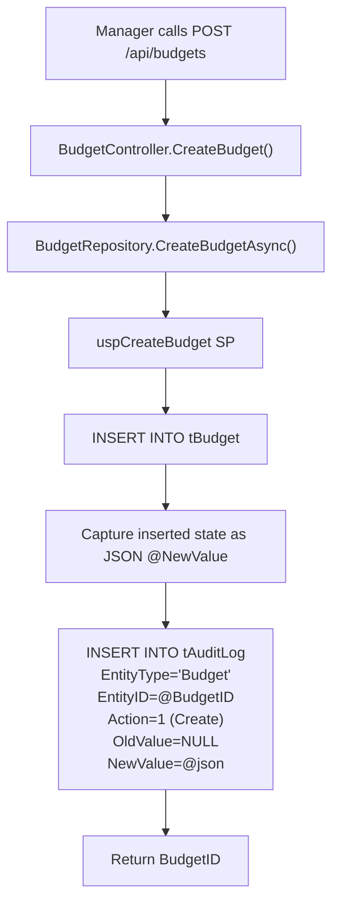
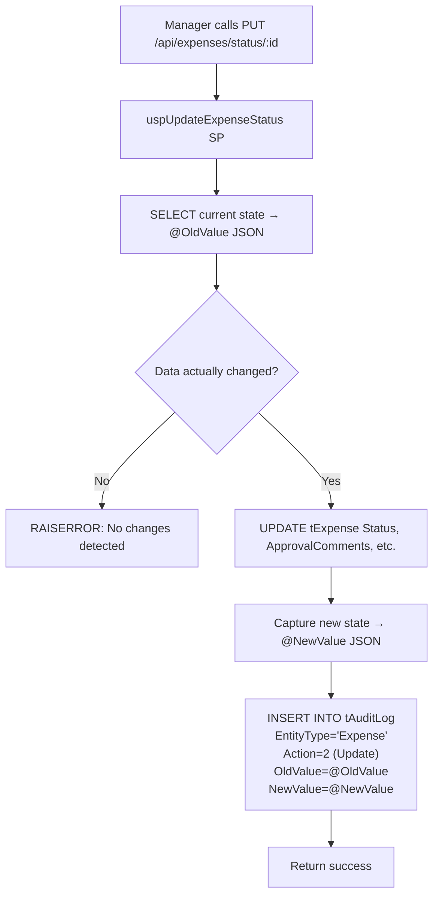

# Audit Module — Complete Documentation

> **Stack:** ASP.NET Core 10 · Entity Framework Core 10 · SQL Server · Angular 21 · Bootstrap 5
> **Base URL:** `http://localhost:5131`
> **Generated:** 2026-03-06

---

## Table of Contents

1. [Module Overview](#1-module-overview)
2. [Role-Based Access Control](#2-role-based-access-control)
3. [Entity & DTOs](#3-entity--dtos)
4. [Repository Layer](#4-repository-layer)
5. [Service Layer](#5-service-layer)
6. [Controller Layer](#6-controller-layer)
7. [Complete API Reference](#7-complete-api-reference)
8. [Audit Log Creation Flow](#8-audit-log-creation-flow)

---

## 1. Module Overview

The **Audit Module** provides a complete, immutable record of all data mutations across the system. Audit logs are written automatically inside stored procedures — no manual API calls are needed to create them. The module exposes read-only endpoints for Admins.

| Capability          | Description                                                         |
| ------------------- | ------------------------------------------------------------------- |
| View All Audit Logs | Admin retrieves paginated audit trail with search and filters       |
| View by User        | Admin retrieves all audit entries for a specific user               |
| Auto-generated      | Created inside Budget/Expense/Category/Department stored procedures |
| JSON Snapshots      | Full before (`OldValue`) and after (`NewValue`) JSON stored         |
| Change Detection    | SP only writes audit log if actual data changed                     |
| Immutable           | No update or delete endpoints — audit data is permanent             |

### What Gets Audited

| Entity     | Actions                                  |
| ---------- | ---------------------------------------- |
| Budget     | Create, Update, Delete                   |
| Expense    | Create (Submit), Update (Approve/Reject) |
| Category   | Create, Update, Delete                   |
| Department | Create, Update, Delete                   |
| User       | Create, Update, Delete                   |

---

## 2. Role-Based Access Control



> **Only Admins have access** to audit logs. Managers and Employees cannot see audit trails.

---

## 3. Entity & DTOs

### Entity: `AuditLog` (table: `tAuditLog`)

| Property      | Type        | Constraints                    | Description                                        |
| ------------- | ----------- | ------------------------------ | -------------------------------------------------- |
| `AuditLogID`  | int         | PK, Identity                   | Auto key                                           |
| `UserID`      | int?        | FK → tUser, Nullable, Indexed  | Who performed action (nullable: SetNull on delete) |
| `EntityType`  | string      | Required, Max 50, Indexed      | e.g. `"Budget"`, `"Expense"`                       |
| `EntityID`    | int         | Required                       | ID of the affected record                          |
| `Action`      | AuditAction | Required                       | 1=Create, 2=Update, 3=Delete                       |
| `OldValue`    | string?     | nvarchar(max)                  | JSON of state before change                        |
| `NewValue`    | string?     | nvarchar(max)                  | JSON of state after change                         |
| `Description` | string?     | Max 500                        | Human-readable summary                             |
| `CreatedDate` | DateTime    | Required, default GETUTCDATE() | Timestamp                                          |

**Key Design Decisions:**
- `UserID` uses `OnDelete(DeleteBehavior.SetNull)` — if a user is soft-deleted, audit rows are preserved but `UserID` becomes NULL
- `OldValue` / `NewValue` are full JSON snapshots, not field-level diffs
- No soft-delete flag — audit records are permanent

### Enum: `AuditAction`

| Value | Name     | Trigger                  |
| ----- | -------- | ------------------------ |
| 1     | `Create` | New record inserted      |
| 2     | `Update` | Existing record modified |
| 3     | `Delete` | Soft-delete performed    |

### DTO: `AuditLogDto`

| Field        | Type     | Description                        |
| ------------ | -------- | ---------------------------------- |
| `AuditLogID` | int      | Log entry identifier               |
| `UserID`     | int?     | User who acted (null if deleted)   |
| `UserName`   | string?  | Full name of acting user           |
| `EmployeeId` | string?  | Employee ID of acting user         |
| `EntityType` | string   | Entity that was changed            |
| `EntityID`   | int      | ID of changed record               |
| `Action`     | string   | `"Create"`, `"Update"`, `"Delete"` |
| `OldValue`   | object?  | Deserialized JSON of old state     |
| `NewValue`   | object?  | Deserialized JSON of new state     |
| `Timestamp`  | DateTime | When the action occurred           |
| `Notes`      | string?  | Human-readable description         |

---

## 4. Repository Layer

### Interface: `IAuditRepository`

```csharp
public interface IAuditRepository
{
    Task<List<AuditLogDto>> GetAllAuditLogsAsync();
    Task<PagedResult<AuditLogDto>> GetAllAuditLogsPaginatedAsync(
        int pageNumber,
        int pageSize,
        string? search = null,
        string? action = null,
        string? entityType = null
    );
    Task<List<AuditLogDto>> GetAuditLogsByUserIdAsync(int userId);
}
```

### Implementation: `AuditRepository`

| Method                          | Mechanism               | Description                                   |
| ------------------------------- | ----------------------- | --------------------------------------------- |
| `GetAllAuditLogsAsync`          | EF Core LINQ with joins | All audit logs with user info (no pagination) |
| `GetAllAuditLogsPaginatedAsync` | EF Core with filters    | Filtered, paginated audit log list            |
| `GetAuditLogsByUserIdAsync`     | EF Core WHERE UserID=?  | All logs for a specific user                  |



---

## 5. Service Layer

### Interface: `IAuditService`

```csharp
public interface IAuditService
{
    Task<List<AuditLogDto>> GetAllAuditLogsAsync();
    Task<PagedResult<AuditLogDto>> GetAllAuditLogsPaginatedAsync(
        int pageNumber, int pageSize,
        string? search = null,
        string? action = null,
        string? entityType = null
    );
    Task<List<AuditLogDto>> GetAuditLogsByUserIdAsync(int userId);
}
```

`AuditService` is a direct pass-through to `AuditRepository`.

---

## 6. Controller Layer

### `AuditController`

```
Route:  api/audits
Note:   Extends ControllerBase (not BaseApiController)
```

| Method | Route                  | Roles | Handler               |
| ------ | ---------------------- | ----- | --------------------- |
| GET    | `/api/audits`          | Admin | `GetAllAudit`         |
| GET    | `/api/audits/{userId}` | Admin | `GetAllAuditByUserId` |

**Error Handling:**

| Exception           | Response                  |
| ------------------- | ------------------------- |
| `ArgumentException` | 400 Bad Request           |
| Unhandled           | 500 Internal Server Error |

---

## 7. Complete API Reference

### `GET /api/audits`

**Roles:** Admin only

**Query Parameters:**

| Parameter    | Type    | Default | Description                                                     |
| ------------ | ------- | ------- | --------------------------------------------------------------- |
| `pageNumber` | int     | `1`     | Page index                                                      |
| `pageSize`   | int     | `10`    | Records per page                                                |
| `search`     | string? | —       | Search by entity type, entity ID, or user name                  |
| `action`     | string? | —       | Filter by action: `Create`, `Update`, `Delete`                  |
| `entityType` | string? | —       | Filter by entity: `Budget`, `Expense`, `Category`, `Department` |

**Response `200 OK`:**
```json
{
  "data": [
    {
      "auditLogID": 142,
      "userID": 5,
      "userName": "Sanika Anil",
      "employeeId": "MGR2601",
      "entityType": "Budget",
      "entityID": 1,
      "action": "Update",
      "oldValue": {
        "title": "Engineering Operations",
        "amountAllocated": 5000000.00,
        "status": 1
      },
      "newValue": {
        "title": "Engineering Operations",
        "amountAllocated": 6000000.00,
        "status": 1
      },
      "timestamp": "2026-02-25T06:26:11",
      "notes": "Budget updated by MGR2601"
    }
  ],
  "pageNumber": 1,
  "pageSize": 10,
  "totalRecords": 340,
  "totalPages": 34,
  "hasNextPage": true,
  "hasPreviousPage": false
}
```

**Status Codes:**

| Code  | When                    |
| ----- | ----------------------- |
| `200` | Success                 |
| `400` | Invalid filter argument |
| `401` | Not authenticated       |
| `403` | Not Admin               |
| `500` | Server error            |

---

### `GET /api/audits/{userId}`

**Roles:** Admin only

**Route Param:** `userId` (int) — The UserID of the user whose logs to retrieve.

**Response `200 OK`:**
```json
[
  {
    "auditLogID": 88,
    "userID": 7,
    "userName": "Shivali Sharma",
    "employeeId": "EMP2601",
    "entityType": "Expense",
    "entityID": 23,
    "action": "Create",
    "oldValue": null,
    "newValue": { "title": "Monthly Cloud Hosting", "amount": 109913.00 },
    "timestamp": "2026-01-28T03:56:07",
    "notes": "Expense submitted by EMP2601"
  }
]
```

> Returns an empty array `[]` if no audit logs exist for that user (not a 404).

**Status Codes:**

| Code  | When                             |
| ----- | -------------------------------- |
| `200` | Success (or empty array if none) |
| `400` | Invalid userId argument          |
| `401` | Not authenticated                |
| `403` | Not Admin                        |
| `500` | Server error                     |

---

## 8. Audit Log Creation Flow

Audit logs are **never created via the API** — they are always written by stored procedures inside each module's SP.

### How Budget Audit Logs Are Created



### How Expense Update Audit Logs Are Created



### Audit Entry for a Budget Update (Example JSON)

```
OldValue:
{
  "BudgetID": 1,
  "Title": "Engineering Operations",
  "AmountAllocated": 5000000.00,
  "Status": 1,
  "UpdatedDate": "2026-02-24T10:00:00"
}

NewValue:
{
  "BudgetID": 1,
  "Title": "Engineering Operations",
  "AmountAllocated": 6000000.00,
  "Status": 1,
  "UpdatedDate": "2026-02-25T06:26:11"
}
```

This allows admins to reconstruct the exact change at any point in time — a complete immutable audit trail.
