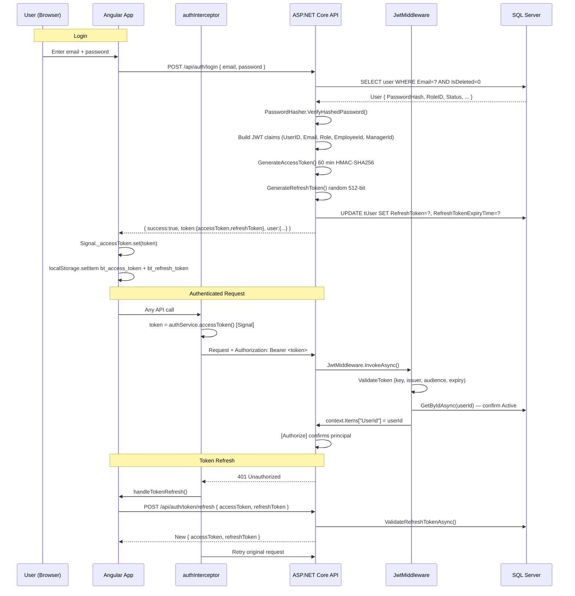
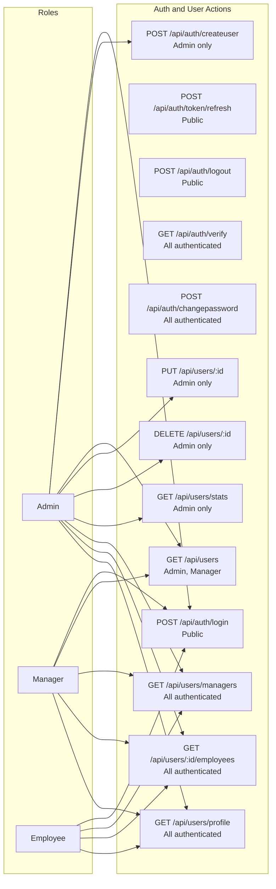
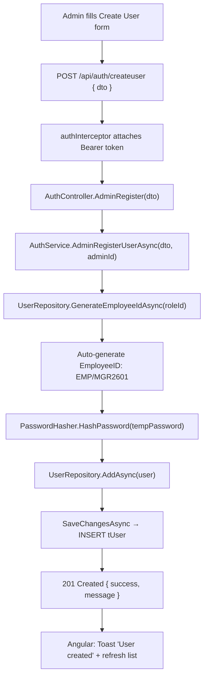
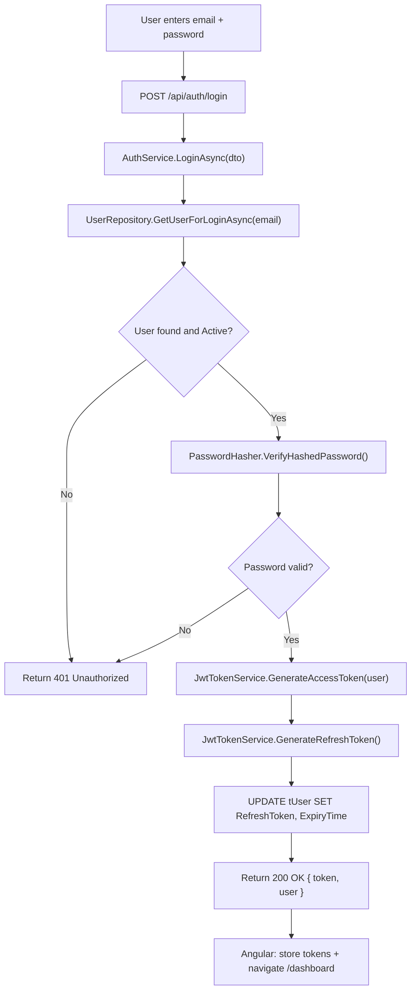
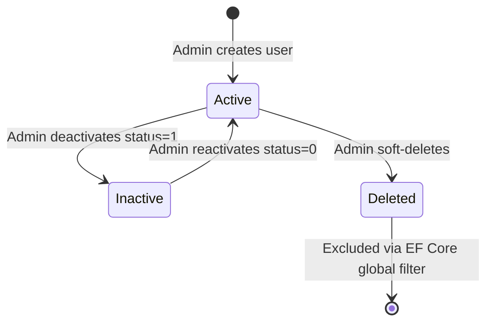

# Auth & User Module — Complete Documentation

> **Stack:** ASP.NET Core 10 · Entity Framework Core 10 · SQL Server · Angular 21 · Bootstrap 5
> **Base URL:** `http://localhost:5131`
> **Generated:** 2026-03-06

---

## Table of Contents

1. [Module Overview](#1-module-overview)
2. [Authentication Flow](#2-authentication-flow)
3. [Role-Based Access Control](#3-role-based-access-control)
4. [Entity & DTOs](#4-entity--dtos)
5. [Repository & Service Layer](#5-repository--service-layer)
6. [Controller Layer](#6-controller-layer)
7. [Complete API Reference](#7-complete-api-reference)
8. [End-to-End Data Flow Diagrams](#8-end-to-end-data-flow-diagrams)
9. [User Lifecycle State Machine](#9-user-lifecycle-state-machine)

---

## 1. Module Overview

The **Auth & User Module** handles identity: login, JWT token issuance, refresh, logout, user registration by Admin, profile access, and user management.

| Capability | Description |
|-----------|-------------|
| Login | Any user can log in via email + password |
| JWT Auth | Access token (60 min) + Refresh token (7 days) issued on login |
| Token Refresh | Silent re-auth using refresh token without re-login |
| Logout | Revokes refresh token server-side |
| Register User | Admin creates users (Employee/Manager); no self-registration |
| Auto Employee ID | `EMP/MGR/ADM + YY + seq` (e.g. `EMP2601`) generated automatically |
| View Profile | Any authenticated user retrieves their own profile |
| List Users | Admin sees all; Manager sees only their direct reports |
| Update User | Admin updates user fields including optional password reset |
| Soft Delete | Admin soft-deletes user; revokes access immediately |
| User Stats | Admin views count breakdown by role, active/inactive |
| List Managers | Any authenticated user can list all managers (for form dropdowns) |
| List Employees | Per-manager employee list, with access scoped by role |

---

## 2. Authentication Flow



### JWT Token Claims

| Claim | Example | Used For |
|-------|---------|----------|
| `ClaimTypes.NameIdentifier` | `5` | `UserId` in controllers |
| `ClaimTypes.Email` | `mgr@co.com` | Identity display |
| `ClaimTypes.Role` | `Manager` | `[Authorize(Roles="...")]` |
| `EmployeeId` | `MGR2601` | Display |
| `ManagerId` | `5` | Employee's manager lookup |

### Token Storage

| Token | Storage | Duration |
|-------|---------|----------|
| Access Token | Angular Signal + localStorage | 60 minutes |
| Refresh Token | localStorage + `tUser.RefreshToken` (DB) | 7 days |

---

## 3. Role-Based Access Control



---

## 4. Entity & DTOs

### Entity: `User` (table: `tUser`)

| Property | Type | Constraints | Description |
|----------|------|-------------|-------------|
| `UserID` | int | PK, Identity | Auto key |
| `FirstName` | string | Required, Max 50 | First name |
| `LastName` | string | Required, Max 50 | Last name |
| `EmployeeID` | string | Required, Max 50, Unique | Auto-generated |
| `Email` | string | Required, Max 100, Unique | Login email |
| `PasswordHash` | string | Required, Max 500 | PBKDF2 hash |
| `DepartmentID` | int | FK → tDepartment | Department |
| `RoleID` | int | FK → tRole | 1=Admin, 2=Manager, 3=Employee |
| `Status` | UserStatus | default Active | 0=Active, 1=Inactive |
| `ManagerID` | int? | FK → tUser (self-ref) | Direct manager |
| `RefreshToken` | string? | Max 500 | Current refresh token |
| `RefreshTokenExpiryTime` | DateTime? | — | Token expiry |
| `LastLoginDate` | DateTime? | — | Last login |
| `IsDeleted` | bool | default false | Soft-delete |

### DTO: `UserLoginDto`

| Field | Type | Required | Validation |
|-------|------|----------|------------|
| `Email` | string | ✅ | Valid email format |
| `Password` | string | ✅ | Min 8, Max 255 chars |

### DTO: `AuthResponseDto`

| Field | Type | Description |
|-------|------|-------------|
| `Success` | bool | Operation result |
| `Message` | string | Status message |
| `User` | UserResponseDto? | User details |
| `Token` | TokenDto? | Access + refresh tokens |

### DTO: `TokenDto`

| Field | Type | Description |
|-------|------|-------------|
| `AccessToken` | string | JWT access token |
| `RefreshToken` | string | Refresh token |
| `ExpiresAt` | DateTime | Access token expiry |
| `ExpiresIn` | int | Seconds until expiry |
| `TokenType` | string | Always `"Bearer"` |

### DTO: `UserProfileResponseDto`

| Field | Type | Description |
|-------|------|-------------|
| `UserId` | int | User ID |
| `FirstName` | string | First name |
| `LastName` | string | Last name |
| `Email` | string | Email |
| `EmployeeId` | string | Employee ID |
| `DepartmentId` | int | Department ID |
| `DepartmentName` | string | Department name |
| `ManagerId` | int? | Manager's user ID |
| `ManagerEmployeeId` | string? | Manager's employee ID |
| `ManagerName` | string? | Manager's full name |
| `RoleId` | int | Role ID |
| `RoleName` | string | Role name |
| `Status` | UserStatus | Active/Inactive |
| `FullName` | string | Computed: FirstName + LastName |

---

## 5. Repository & Service Layer

### `IUserRepository` (key methods)

```csharp
Task<User?> GetByIdAsync(int id);
Task<User?> GetByEmailAsync(string email);
Task<User?> GetUserForLoginAsync(string email);
Task<User?> ValidateRefreshTokenAsync(int userId, string refreshToken);
Task<string> GenerateEmployeeIdAsync(int roleId);
Task AddAsync(User user);
Task UpdateAsync(User user);
Task DeleteAsync(int id, int deletedByUserId);
Task<UserProfileResponseDto?> GetUserProfileByIdAsync(int userId);
Task<(List<UserListResponseDto> Users, int TotalCount)> GetUsersListAsync(...);
```

### `IAuthService` (key methods)

```csharp
Task<AuthResponseDto> LoginAsync(UserLoginDto dto);
Task<AuthResponseDto> AdminRegisterUserAsync(AdminUserRegisterDto dto, int adminId);
Task<AuthResponseDto> ChangePasswordAsync(int userId, string old, string newPwd);
Task<AuthResponseDto> RefreshTokenAsync(string accessToken, string refreshToken);
Task<bool> RevokeTokenAsync(int userId);
Task<AuthResponseDto> UpdateUserAsync(int userId, UpdateUserByAdminDto dto, int adminId);
```

### `JwtTokenService`

| Method | Description |
|--------|-------------|
| `GenerateAccessToken(user)` | Builds JWT with claims: UserID, Email, Role, EmployeeId, ManagerId |
| `GenerateRefreshToken()` | Cryptographically random 512-bit base64 string |
| `GetPrincipalFromExpiredToken(token)` | Extracts claims from expired token for refresh flow |

---

## 6. Controller Layer

### `AuthController` (Route: `api/auth`)

| Method | Route | Auth | Handler |
|--------|-------|------|---------|
| POST | `/api/auth/login` | Public | `Login` |
| POST | `/api/auth/token/refresh` | Public | `RefreshToken` |
| POST | `/api/auth/logout` | Public | `Logout` |
| GET | `/api/auth/verify` | All | `Verify` |
| POST | `/api/auth/changepassword` | All | `ChangePassword` |
| POST | `/api/auth/createuser` | Admin | `AdminRegister` |
| GET | `/api/users/profile` | All | `GetUserProfile` |
| GET | `/api/users` | Admin, Manager | `GetUsers` |
| PUT | `/api/users/{userId}` | Admin | `UpdateUser` |

### `UserController` (Route: `api/users`)

| Method | Route | Auth | Handler |
|--------|-------|------|---------|
| GET | `/api/users/stats` | Admin | `GetUserStats` |
| GET | `/api/users/managers` | All | `GetAllManagers` |
| GET | `/api/users/{id}/employees` | All | `GetEmployeesByManager` |
| DELETE | `/api/users/{userId}` | Admin | `DeleteUser` |

---

## 7. Complete API Reference

### `POST /api/auth/login`

**Access:** Public

**Request Body:**
```json
{ "email": "manager@company.com", "password": "Str0ngPass!" }
```

**Response `200 OK`:**
```json
{
  "success": true,
  "message": "Login successful",
  "user": {
    "id": 5,
    "employeeId": "MGR2601",
    "firstName": "Sanika",
    "lastName": "Anil",
    "email": "manager@company.com",
    "roleID": 2,
    "roleName": "Manager",
    "departmentID": 1,
    "status": 0
  },
  "token": {
    "accessToken": "eyJhbGci...",
    "refreshToken": "dGhpcyBpcyBh...",
    "expiresAt": "2026-03-06T08:00:00Z",
    "expiresIn": 3600,
    "tokenType": "Bearer"
  }
}
```

`401 Unauthorized`:
```json
{ "success": false, "message": "Invalid email or password" }
```

---

### `POST /api/auth/token/refresh`

**Access:** Public

**Request Body:**
```json
{ "accessToken": "eyJhbGci...", "refreshToken": "dGhpcyBpcyBh..." }
```

`200 OK`: Returns same structure as login response.

`401 Unauthorized`:
```json
{ "success": false, "message": "Invalid or expired refresh token" }
```

---

### `POST /api/auth/logout`

**Access:** Public (reads from `HttpContext.Items["UserId"]`)

`200 OK`:
```json
{ "message": "Logged out successfully" }
```

---

### `GET /api/auth/verify`

**Access:** All authenticated

`200 OK`:
```json
{ "message": "Token is valid", "userId": 5 }
```

---

### `POST /api/auth/changepassword`

**Access:** All authenticated

**Request Body:**
```json
{ "oldPassword": "OldPass123!", "newPassword": "NewPass456!" }
```

`200 OK`:
```json
{ "success": true, "message": "Password changed successfully" }
```

`400 Bad Request`:
```json
{ "success": false, "message": "Old password is incorrect" }
```

---

### `POST /api/auth/createuser`

**Access:** Admin only

**Request Body:**
```json
{
  "firstName": "John",
  "lastName": "Doe",
  "email": "john.doe@company.com",
  "password": "TempPass123!",
  "roleId": 3,
  "departmentId": 1,
  "managerId": 5
}
```

`201 Created`:
```json
{ "success": true, "message": "User registered successfully" }
```

`400 Bad Request`:
```json
{ "success": false, "message": "Email is already in use" }
```

---

### `GET /api/users/profile`

**Access:** All authenticated

`200 OK`:
```json
{
  "success": true,
  "data": {
    "userId": 5,
    "firstName": "Sanika",
    "lastName": "Anil",
    "email": "manager@company.com",
    "employeeId": "MGR2601",
    "departmentId": 1,
    "departmentName": "Engineering",
    "managerId": null,
    "managerEmployeeId": null,
    "managerName": null,
    "roleId": 2,
    "roleName": "Manager",
    "status": 0,
    "fullName": "Sanika Anil"
  }
}
```

---

### `GET /api/users`

**Access:** Admin, Manager

**Query Parameters:**

| Parameter | Type | Description |
|-----------|------|-------------|
| `roleId` | int? | Filter by role (1=Admin, 2=Manager, 3=Employee) |
| `search` | string? | Search by name or employee ID |
| `departmentId` | int? | Filter by department |
| `isDeleted` | bool? | Include soft-deleted users |
| `isActive` | bool? | Filter by active status |
| `sortBy` | string | Default: `CreatedDate` |
| `sortOrder` | string | `asc` or `desc` |
| `pageNumber` | int | Default: 1 |
| `pageSize` | int | Default: 10 |

> **Manager restriction:** Managers only see their direct-report employees (roleId forced to 3, managerId = self).

`200 OK`:
```json
{
  "data": [{ "userId": 7, "employeeId": "EMP2601", "firstName": "Shivali", ... }],
  "pageNumber": 1, "pageSize": 10, "totalRecords": 3, "totalPages": 1
}
```

---

### `PUT /api/users/{userId}`

**Access:** Admin only

**Request Body:**
```json
{
  "firstName": "John",
  "lastName": "Doe",
  "email": "john.doe@company.com",
  "roleId": 3,
  "departmentId": 1,
  "managerId": 5,
  "status": 0,
  "newPassword": "ResetPass123!"
}
```

`200 OK`:
```json
{ "success": true, "message": "User updated successfully" }
```

---

### `DELETE /api/users/{userId}`

**Access:** Admin only · **Effect:** Soft delete.

`200 OK`:
```json
{ "success": true, "message": "User deleted successfully" }
```

`404 Not Found`:
```json
{ "message": "User not found" }
```

---

### `GET /api/users/stats`

**Access:** Admin only

`200 OK`:
```json
{
  "totalUsers": 20,
  "admins": 1,
  "managers": 4,
  "employees": 15,
  "activeUsers": 18,
  "inactiveUsers": 2
}
```

---

### `GET /api/users/managers`

**Access:** All authenticated (used in dropdowns)

`200 OK`:
```json
[
  { "employeeId": "MGR2601", "firstName": "Sanika", "lastName": "Anil",
    "email": "sanika@co.com", "fullName": "Sanika Anil", "roleId": 2, "departmentId": 1 }
]
```

---

### `GET /api/users/{managerUserId}/employees`

**Access:** All authenticated (scoped by role)

| Role | Scope |
|------|-------|
| Admin | Any manager's employees |
| Manager | Only own employees |
| Employee | Only own manager's employees |

`200 OK`: Array of `UserResponseDto` for employees in same department.

---

## 8. End-to-End Data Flow Diagrams

### Admin Registers a New User



### Login Flow



---

## 9. User Lifecycle State Machine


