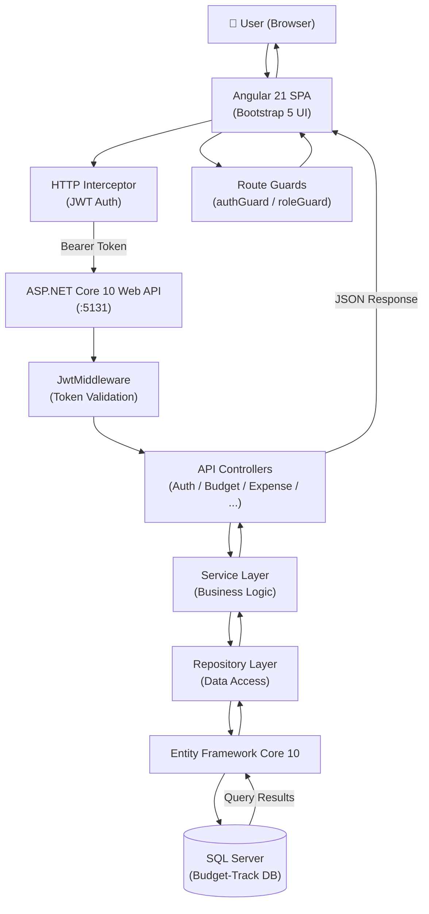
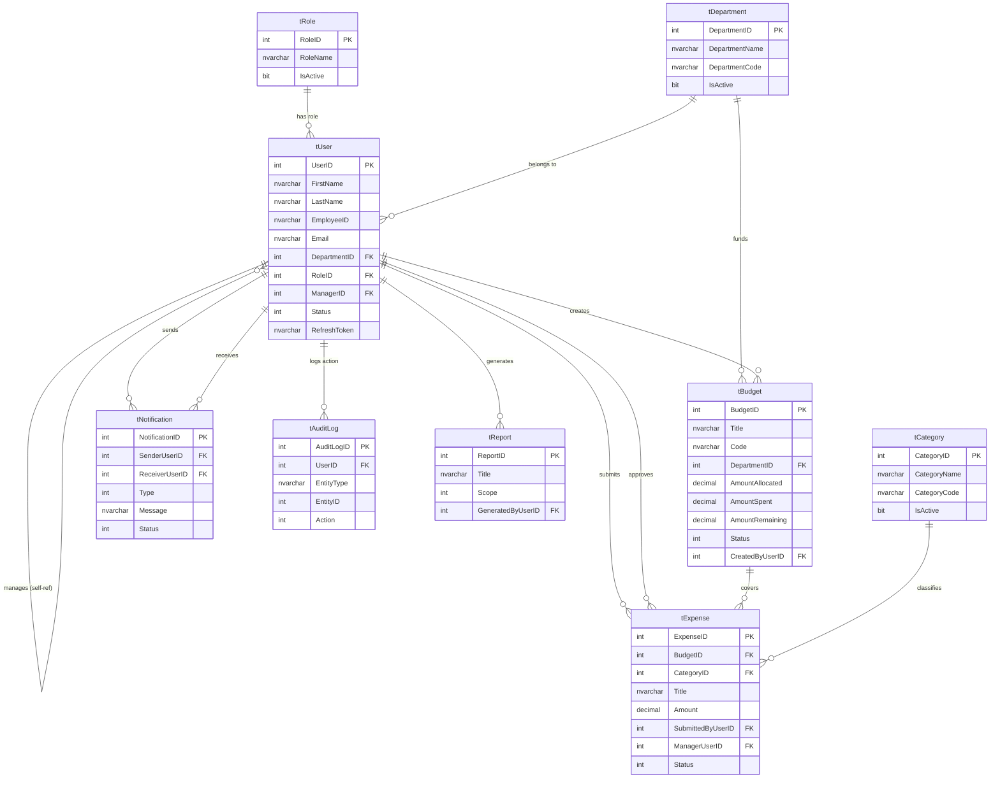
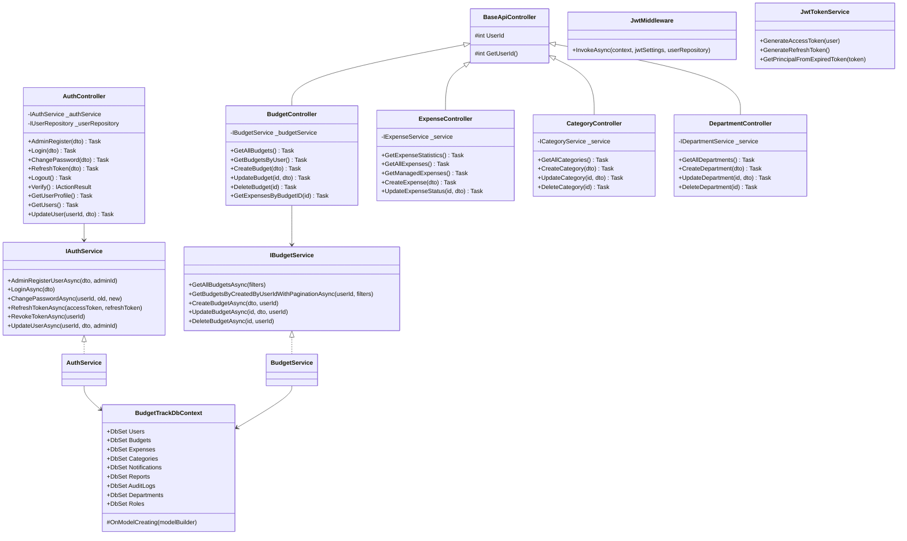
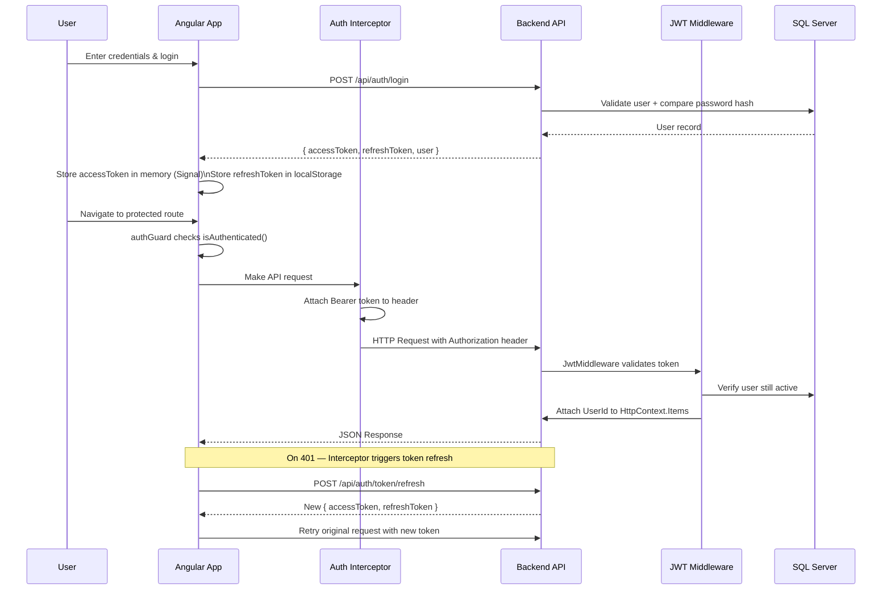
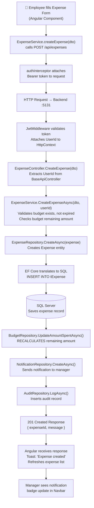

# BudgetTrack — Comprehensive Project Documentation

> **Generated:** 2026-03-05 | **Stack:** ASP.NET Core 10 · Entity Framework Core 10 · Angular 21 · Bootstrap 5 · SQL Server

---

## Table of Contents

1. [Project Overview](#1-project-overview)
2. [System Architecture](#2-system-architecture)
3. [Folder Structure](#3-folder-structure)
4. [Database Schema & ER Diagram](#4-database-schema--er-diagram)
5. [Backend Class Diagram](#5-backend-class-diagram)
6. [API Documentation](#6-api-documentation)
7. [Angular Frontend](#7-angular-frontend)
8. [Authentication & Authorization](#8-authentication--authorization)
9. [Data Flow Diagram](#9-data-flow-diagram)
10. [Dependencies & Libraries](#10-dependencies--libraries)
11. [Build & Run Instructions](#11-build--run-instructions)
12. [Code Quality & Recommendations](#12-code-quality--recommendations)

---

## 1. Project Overview

### Purpose
**BudgetTrack** is an enterprise-grade budget and expense management system that enables organizations to plan, allocate, track, and report on departmental budgets and employee expenses — all through a role-aware web interface.

### Business Problem Solved
Organizations struggle with:
- Manual, error-prone expense claims via spreadsheets or email
- No real-time visibility into budget utilization
- Weak approval workflows causing compliance risks
- Fragmented reporting across departments

BudgetTrack solves this by providing a centralized digital platform where budgets are created by managers, claimed via expense submissions by employees, approved/rejected by managers, and monitored in real-time by administrators.

### Target Users

| Role         | Responsibilities                                                                                   |
| ------------ | -------------------------------------------------------------------------------------------------- |
| **Admin**    | Manage users, departments, roles; view all budgets & audit logs; generate reports                  |
| **Manager**  | Create & manage budgets for their department; approve/reject employee expenses; view notifications |
| **Employee** | Submit expense claims against active budgets; view own expenses & notifications                    |

### Key Features
- 🔐 JWT-based authentication with access + refresh token rotation
- 📊 Role-based dashboards with KPI cards and Chart.js bar/doughnut charts
- 💰 Budget lifecycle management (Active → Expired / Over-Budget)
- 🧾 Expense submission with manager approval workflow
- 🔔 Automatic in-app notifications on expense status changes
- 📋 Audit logging of all create/update/delete actions
- 📈 Period, department, and budget-level reports
- 🗂️ Soft-delete pattern across all major entities
- 📄 Paginated, filterable, sortable data tables on every module

---

## 2. System Architecture



### Communication Protocol
- **Frontend → Backend:** HTTP/HTTPS REST API calls using Angular's `HttpClient`
- **Authentication:** JWT Bearer tokens attached by `authInterceptor` to every non-public request
- **Base URL:** `http://localhost:5131` (development) configured in `environment.ts`
- **CORS:** Backend configured with `AllowAll` policy for development

---

## 3. Folder Structure

### Root Repository Layout

```
BudgetTrack/
├── API/                      # Pre-written API documentation (Markdown files)
│   ├── AuthAPI.md
│   ├── BudgetAPI.md
│   ├── ExpenseAPI.md
│   └── ...
├── Backend/
│   └── Budget-Track/         # ASP.NET Core 10 Web API project
├── Database/
│   └── Budget-Track/         # Raw SQL scripts for tables and stored procedures
├── Frontend/
│   └── Budget-Track/         # Angular 21 SPA
└── BudgetTrack.md            # This documentation file
```

### Backend Folder Structure

```
Backend/Budget-Track/
├── Controllers/              # HTTP endpoint handlers (10 controllers)
│   ├── BaseApiController.cs  # Abstract base — extracts UserId from JWT claims
│   ├── AuthController.cs     # Login, register, token refresh, profile
│   ├── BudgetController.cs   # CRUD for budgets
│   ├── ExpenseController.cs  # CRUD & approval for expenses
│   ├── CategoryController.cs # CRUD for expense categories
│   ├── DepartmentController.cs
│   ├── UserController.cs     # User stats, managers list, employees
│   ├── NotificationController.cs
│   ├── AuditController.cs
│   └── ReportController.cs
├── Data/
│   ├── BudgetTrackDbContext.cs  # EF Core DbContext with all relations & query filters
│   └── DataSeeder.cs            # Seeds default roles, departments, admin user
├── Middleware/
│   ├── JwtMiddleware.cs       # Validates JWT, attaches User & UserId to HttpContext
│   └── JwtSettings.cs         # POCO holding JWT config values
├── Migrations/                # EF Core auto-generated migration files
├── Models/
│   ├── Entities/              # 9 EF Core entity classes (DB tables)
│   ├── DTOs/                  # Request/response data transfer objects (41 files)
│   └── Enums/                 # 9 shared enum types
├── Repositories/
│   ├── Interfaces/            # 8 repository interfaces (IExpenseRepository, etc.)
│   └── Implementation/       # 8 concrete repository classes
├── Services/
│   ├── Interfaces/            # 7 service interfaces
│   └── Implementation/       # 9 service classes incl. JwtTokenService, AuthService
├── Program.cs                 # App bootstrap: DI registration, middleware pipeline
└── appsettings.json           # JWT config + DB connection string
```

**Responsibility Summary:**

| Folder            | Responsibility                                                                |
| ----------------- | ----------------------------------------------------------------------------- |
| `Controllers`     | Handle HTTP requests, extract claims, delegate to services, return responses  |
| `Services`        | Implement business rules; orchestrate multiple repositories                   |
| `Repositories`    | Execute EF Core queries; abstract data access from business logic             |
| `Models/Entities` | EF Core mapped classes — one per database table                               |
| `Models/DTOs`     | Strongly-typed request/response shapes; prevent over-posting                  |
| `Models/Enums`    | Shared enum values stored as integers in the DB                               |
| `Data`            | DbContext, model configuration (relationships, indexes, filters), and seeding |
| `Middleware`      | Cross-cutting JWT concerns applied before the controller pipeline             |

### Frontend Folder Structure

```
Frontend/Budget-Track/src/
├── app/
│   ├── auth/login/            # Login page component
│   ├── layout/
│   │   ├── shell/             # Root layout wrapper (sidebar + router outlet)
│   │   ├── navbar/            # Top navigation bar
│   │   └── sidebar/           # Side navigation menu
│   ├── features/              # Feature modules (one per domain)
│   │   ├── dashboard/         # KPI cards + Chart.js charts
│   │   ├── budgets/           # Budget list, create, edit, delete modals
│   │   ├── expenses/          # Expense list, create, approve/reject modals
│   │   ├── categories/        # Category management
│   │   ├── departments/       # Department management
│   │   ├── users/             # User management (Admin only)
│   │   ├── notifications/     # In-app notification center
│   │   ├── audits/            # Audit log viewer (Admin only)
│   │   ├── reports/           # Period, department & budget reports
│   │   └── profile/           # User profile & password change
│   └── shared/
│       ├── components/        # confirm-modal, pagination, status-badge, toast-container, user-avatar
│       └── pipes/             # Custom Angular pipes
├── core/
│   ├── guards/
│   │   ├── auth.guard.ts      # Blocks unauthenticated users; restores session on refresh
│   │   └── role.guard.ts      # Factory guard — checks user role before activating route
│   ├── interceptors/
│   │   └── auth.interceptor.ts # Attaches Bearer token; handles 401 refresh loop
│   └── services/
│       ├── auth.service.ts    # Login, logout, token management, session restore
│       └── toast.service.ts   # Global toast notification service
├── models/                    # TypeScript interfaces mirroring backend DTOs
├── services/                  # Domain-specific HTTP services (budget, expense, etc.)
├── environments/              # environment.ts with apiUrl
└── styles.css                 # Global CSS (35 KB — custom variables, utility classes)
```

---

## 4. Database Schema & ER Diagram

### Tables Overview

| Table           | Description                                           |
| --------------- | ----------------------------------------------------- |
| `tRole`         | System roles: Admin, Manager, Employee                |
| `tDepartment`   | Organizational departments                            |
| `tUser`         | All system users with role and department assignments |
| `tBudget`       | Budget allocations by department with status tracking |
| `tCategory`     | Expense categories (e.g., Travel, Software, Office)   |
| `tExpense`      | Individual expense claims against a budget            |
| `tNotification` | In-app notifications between users                    |
| `tReport`       | Generated report metadata                             |
| `tAuditLog`     | Immutable log of all user-triggered data changes      |

### Entity Columns Detail

**tRole**

| Column          | Type          | Constraints          |
| --------------- | ------------- | -------------------- |
| RoleID          | int           | PK, Identity         |
| RoleName        | nvarchar(100) | NOT NULL, UNIQUE     |
| IsActive        | bit           | NOT NULL, Default: 1 |
| CreatedDate     | datetime2     | NOT NULL             |
| CreatedByUserID | int           | FK → tUser, Nullable |
| UpdatedDate     | datetime2     | Nullable             |
| UpdatedByUserID | int           | FK → tUser, Nullable |
| IsDeleted       | bit           | Default: 0           |
| DeletedDate     | datetime2     | Nullable             |
| DeletedByUserID | int           | FK → tUser, Nullable |

**tDepartment**

| Column          | Type          | Constraints      |
| --------------- | ------------- | ---------------- |
| DepartmentID    | int           | PK, Identity     |
| DepartmentName  | nvarchar(100) | NOT NULL, UNIQUE |
| DepartmentCode  | nvarchar(50)  | NOT NULL, UNIQUE |
| IsActive        | bit           | NOT NULL         |
| CreatedDate     | datetime2     | NOT NULL         |
| CreatedByUserID | int           | FK → tUser       |
| IsDeleted       | bit           | Default: 0       |

**tUser**

| Column                 | Type          | Constraints                   |
| ---------------------- | ------------- | ----------------------------- |
| UserID                 | int           | PK, Identity                  |
| FirstName              | nvarchar(50)  | NOT NULL                      |
| LastName               | nvarchar(50)  | NOT NULL                      |
| EmployeeID             | nvarchar(50)  | NOT NULL, UNIQUE              |
| Email                  | nvarchar(100) | NOT NULL, UNIQUE              |
| PasswordHash           | nvarchar(500) | NOT NULL                      |
| DepartmentID           | int           | FK → tDepartment              |
| RoleID                 | int           | FK → tRole                    |
| Status                 | int           | Enum: Active=0, Inactive=1    |
| ManagerID              | int           | Self-ref FK → tUser, Nullable |
| RefreshToken           | nvarchar(500) | Nullable                      |
| RefreshTokenExpiryTime | datetime2     | Nullable                      |
| LastLoginDate          | datetime2     | Nullable                      |
| CreatedDate            | datetime2     | NOT NULL                      |
| IsDeleted              | bit           | Default: 0                    |

**tBudget**

| Column          | Type           | Constraints                             |
| --------------- | -------------- | --------------------------------------- |
| BudgetID        | int            | PK, Identity                            |
| Title           | nvarchar(200)  | NOT NULL, UNIQUE                        |
| Code            | nvarchar(50)   | UNIQUE, Nullable                        |
| DepartmentID    | int            | FK → tDepartment                        |
| AmountAllocated | decimal(18,2)  | NOT NULL                                |
| AmountSpent     | decimal(18,2)  | Default: 0                              |
| AmountRemaining | decimal(18,2)  | Default: 0                              |
| StartDate       | datetime2      | NOT NULL                                |
| EndDate         | datetime2      | NOT NULL                                |
| Status          | int            | Enum: Active=0, Expired=1, OverBudget=2 |
| CreatedByUserID | int            | FK → tUser                              |
| Notes           | nvarchar(1000) | Nullable                                |
| CreatedDate     | datetime2      | NOT NULL                                |
| IsDeleted       | bit            | Default: 0                              |

**tCategory**

| Column       | Type          | Constraints      |
| ------------ | ------------- | ---------------- |
| CategoryID   | int           | PK, Identity     |
| CategoryName | nvarchar(100) | NOT NULL, UNIQUE |
| CategoryCode | nvarchar(50)  | NOT NULL, UNIQUE |
| IsActive     | bit           | NOT NULL         |
| CreatedDate  | datetime2     | NOT NULL         |
| IsDeleted    | bit           | Default: 0       |

**tExpense**

| Column             | Type           | Constraints                             |
| ------------------ | -------------- | --------------------------------------- |
| ExpenseID          | int            | PK, Identity                            |
| BudgetID           | int            | FK → tBudget                            |
| CategoryID         | int            | FK → tCategory                          |
| Title              | nvarchar(500)  | NOT NULL                                |
| Amount             | decimal(18,2)  | NOT NULL                                |
| MerchantName       | nvarchar(200)  | Nullable                                |
| SubmittedByUserID  | int            | FK → tUser                              |
| SubmittedDate      | datetime2      | NOT NULL                                |
| Status             | int            | Enum: Pending=0, Approved=1, Rejected=2 |
| ManagerUserID      | int            | FK → tUser (Approver), Nullable         |
| StatusApprovedDate | datetime2      | Nullable                                |
| RejectionReason    | nvarchar(500)  | Nullable                                |
| ApprovalComments   | nvarchar(1000) | Nullable                                |
| CreatedDate        | datetime2      | NOT NULL                                |
| IsDeleted          | bit            | Default: 0                              |

**tNotification**

| Column            | Type          | Constraints                                                                                             |
| ----------------- | ------------- | ------------------------------------------------------------------------------------------------------- |
| NotificationID    | int           | PK, Identity                                                                                            |
| SenderUserID      | int           | FK → tUser                                                                                              |
| ReceiverUserID    | int           | FK → tUser, Indexed                                                                                     |
| Type              | int           | Enum: ExpenseSubmitted, ExpenseApproved, ExpenseRejected, BudgetCreated, BudgetExpired, BudgetOverLimit |
| Message           | nvarchar(500) | NOT NULL                                                                                                |
| Status            | int           | Enum: Unread=0, Read=1                                                                                  |
| CreatedDate       | datetime2     | NOT NULL                                                                                                |
| ReadDate          | datetime2     | Nullable                                                                                                |
| RelatedEntityType | nvarchar(50)  | Nullable                                                                                                |
| RelatedEntityID   | int           | Nullable                                                                                                |
| IsDeleted         | bit           | Default: 0                                                                                              |

**tAuditLog**

| Column      | Type          | Constraints                                 |
| ----------- | ------------- | ------------------------------------------- |
| AuditLogID  | int           | PK, Identity                                |
| UserID      | int           | FK → tUser (SetNull on delete), Nullable    |
| EntityType  | nvarchar(50)  | NOT NULL, Indexed                           |
| EntityID    | int           | NOT NULL                                    |
| Action      | int           | Enum: Create, Update, Delete, Login, Logout |
| OldValue    | nvarchar(max) | Nullable (JSON snapshot)                    |
| NewValue    | nvarchar(max) | Nullable (JSON snapshot)                    |
| Description | nvarchar(500) | Nullable                                    |
| CreatedDate | datetime2     | NOT NULL                                    |

**tReport**

| Column            | Type          | Constraints                      |
| ----------------- | ------------- | -------------------------------- |
| ReportID          | int           | PK, Identity                     |
| Title             | nvarchar(200) | NOT NULL                         |
| Scope             | int           | Enum: Period, Department, Budget |
| Metrics           | nvarchar(max) | Nullable (serialized JSON)       |
| GeneratedDate     | datetime2     | NOT NULL                         |
| GeneratedByUserID | int           | FK → tUser                       |
| IsDeleted         | bit           | Default: 0                       |

### ER Diagram



---

## 5. Backend Class Diagram



---

## 6. API Documentation

> **Base URL:** `http://localhost:5131`  
> **Auth Header:** `Authorization: Bearer <access_token>`

### 6.1 Auth Endpoints

| Method | URL                        | Auth     | Roles | Description           |
| ------ | -------------------------- | -------- | ----- | --------------------- |
| POST   | `/api/auth/login`          | None     | —     | User login            |
| POST   | `/api/auth/createuser`     | Required | Admin | Register new user     |
| POST   | `/api/auth/changepassword` | Required | Any   | Change own password   |
| POST   | `/api/auth/token/refresh`  | None     | —     | Refresh tokens        |
| POST   | `/api/auth/logout`         | None     | —     | Revoke refresh token  |
| GET    | `/api/auth/verify`         | Required | Any   | Verify token validity |

**POST `/api/auth/login`**

Request:
```json
{
  "email": "admin@company.com",
  "password": "Admin@123"
}
```

Response `200 OK`:
```json
{
  "success": true,
  "message": "Login successful",
  "token": {
    "accessToken": "eyJhbGci...",
    "refreshToken": "dGhpcyBpcyBh..."
  },
  "user": {
    "userId": 1,
    "firstName": "Admin",
    "lastName": "User",
    "email": "admin@company.com",
    "roleName": "Admin",
    "departmentName": "IT"
  }
}
```

---

**POST `/api/auth/createuser`** *(Admin only)*

Request:
```json
{
  "firstName": "Jane",
  "lastName": "Doe",
  "employeeID": "EMP002",
  "email": "jane.doe@company.com",
  "departmentID": 2,
  "roleID": 3,
  "managerID": 5
}
```

**POST `/api/auth/token/refresh`**

Request:
```json
{
  "accessToken": "eyJhbGci...",
  "refreshToken": "dGhpcyBpcyBh..."
}
```

---

### 6.2 User Endpoints

| Method | URL                                | Auth     | Roles          | Description             |
| ------ | ---------------------------------- | -------- | -------------- | ----------------------- |
| GET    | `/api/users/profile`               | Required | All            | Get own profile         |
| GET    | `/api/users`                       | Required | Admin, Manager | List users (paginated)  |
| PUT    | `/api/users/{userId}`              | Required | Admin          | Update user             |
| DELETE | `/api/users/{userId}`              | Required | Admin          | Soft-delete user        |
| GET    | `/api/users/stats`                 | Required | Admin          | User statistics         |
| GET    | `/api/users/managers`              | Required | Any            | List all managers       |
| GET    | `/api/users/{managerId}/employees` | Required | All            | Employees under manager |

**GET `/api/users`** Query Parameters:
- `roleId` (int, optional) — filter by role
- `search` (string, optional) — search by name or employee ID
- `departmentId` (int, optional)
- `isDeleted` (bool, optional)
- `isActive` (bool, optional)
- `sortBy` (default: `CreatedDate`)
- `sortOrder` (default: `desc`)
- `pageNumber` (default: 1)
- `pageSize` (default: 10)

Response (Paginated):
```json
{
  "items": [...],
  "pageNumber": 1,
  "pageSize": 10,
  "totalCount": 45,
  "totalPages": 5
}
```

---

### 6.3 Budget Endpoints

| Method | URL                                | Auth     | Roles             | Description                      |
| ------ | ---------------------------------- | -------- | ----------------- | -------------------------------- |
| GET    | `/api/budgets/admin`               | Required | Admin             | All budgets (admin view)         |
| GET    | `/api/budgets`                     | Required | Manager, Employee | Budgets for current user/manager |
| POST   | `/api/budgets`                     | Required | Manager           | Create budget                    |
| PUT    | `/api/budgets/{budgetID}`          | Required | Manager           | Update budget                    |
| DELETE | `/api/budgets/{budgetID}`          | Required | Manager           | Soft-delete budget               |
| GET    | `/api/budgets/{budgetID}/expenses` | Required | All               | Expenses for a budget            |

**POST `/api/budgets`**

Request:
```json
{
  "title": "Q1 Marketing Budget",
  "code": "MKT-Q1-2026",
  "departmentID": 3,
  "amountAllocated": 50000.00,
  "startDate": "2026-01-01T00:00:00Z",
  "endDate": "2026-03-31T00:00:00Z",
  "notes": "For Q1 marketing campaigns"
}
```

Response `201 Created`:
```json
{
  "success": true,
  "message": "Budget is created"
}
```

---

### 6.4 Expense Endpoints

| Method | URL                                | Auth     | Roles             | Description            |
| ------ | ---------------------------------- | -------- | ----------------- | ---------------------- |
| GET    | `/api/expenses/stats`              | Required | All               | KPI statistics         |
| GET    | `/api/expenses`                    | Required | Admin             | All expenses           |
| GET    | `/api/expenses/managed`            | Required | Manager, Employee | My / team expenses     |
| POST   | `/api/expenses`                    | Required | Manager, Employee | Submit expense         |
| PUT    | `/api/expenses/status/{expenseID}` | Required | Manager           | Approve/Reject expense |

**POST `/api/expenses`**

Request:
```json
{
  "budgetID": 5,
  "categoryID": 2,
  "title": "AWS Cloud Services - March",
  "amount": 1250.00,
  "merchantName": "Amazon Web Services",
  "notes": "Monthly cloud infrastructure cost"
}
```

**PUT `/api/expenses/status/{expenseID}`** *(Manager only)*

Request:
```json
{
  "status": 1,
  "comments": "Approved as per Q1 budget",
  "reason": null
}
```

Status values: `0 = Pending`, `1 = Approved`, `2 = Rejected`

---

### 6.5 Category Endpoints

| Method | URL                            | Roles | Description         |
| ------ | ------------------------------ | ----- | ------------------- |
| GET    | `/api/categories`              | All   | List all categories |
| POST   | `/api/categories`              | Admin | Create category     |
| PUT    | `/api/categories/{categoryID}` | Admin | Update category     |
| DELETE | `/api/categories/{categoryID}` | Admin | Delete category     |

---

### 6.6 Department Endpoints

| Method | URL                               | Roles | Description          |
| ------ | --------------------------------- | ----- | -------------------- |
| GET    | `/api/departments`                | All   | List all departments |
| POST   | `/api/departments`                | Admin | Create department    |
| PUT    | `/api/departments/{departmentID}` | Admin | Update department    |
| DELETE | `/api/departments/{departmentID}` | Admin | Delete department    |

---

### 6.7 Notification Endpoints *(Manager, Employee)*

| Method | URL                                        | Description                      |
| ------ | ------------------------------------------ | -------------------------------- |
| GET    | `/api/notifications`                       | Get my notifications (paginated) |
| PUT    | `/api/notifications/read/{notificationID}` | Mark one as read                 |
| PUT    | `/api/notifications/readAll`               | Mark all as read                 |
| DELETE | `/api/notifications/{notificationID}`      | Delete one notification          |
| DELETE | `/api/notifications/deleteAll`             | Delete all notifications         |

---

### 6.8 Audit Endpoints *(Admin only)*

| Method | URL                    | Description                         |
| ------ | ---------------------- | ----------------------------------- |
| GET    | `/api/audits`          | Paginated audit logs (with filters) |
| GET    | `/api/audits/{userId}` | Audit logs for a specific user      |

---

### 6.9 Report Endpoints

| Method | URL                                       | Roles          | Description                      |
| ------ | ----------------------------------------- | -------------- | -------------------------------- |
| GET    | `/api/reports/period?startDate=&endDate=` | Admin          | Period-based budget summary      |
| GET    | `/api/reports/department`                 | Admin          | Stats grouped by department      |
| GET    | `/api/reports/budget?budgetCode=`         | Admin, Manager | Full budget report with expenses |

---

## 7. Angular Frontend

### Application Configuration

The app uses Angular's standalone component architecture (no NgModules). Configuration in `app.config.ts`:
- `provideRouter(routes)` — lazy-loaded routing
- `provideHttpClient(withFetch(), withInterceptors([authInterceptor]))` — HTTP with interceptor
- SSR support via `@angular/ssr`

### Routing Structure

| Path                    | Component                | Guard                                           |
| ----------------------- | ------------------------ | ----------------------------------------------- |
| `/` or `/login`         | LoginComponent           | None (public)                                   |
| `/dashboard`            | DashboardComponent       | `authGuard`                                     |
| `/budgets`              | BudgetsListComponent     | `authGuard`                                     |
| `/budgets/:id/expenses` | ExpensesListComponent    | `authGuard`                                     |
| `/expenses`             | ExpensesListComponent    | `authGuard`                                     |
| `/categories`           | CategoriesListComponent  | `authGuard` + `roleGuard('Admin','Manager')`    |
| `/departments`          | DepartmentsListComponent | `authGuard` + `roleGuard('Admin','Manager')`    |
| `/reports`              | ReportsComponent         | `authGuard` + `roleGuard('Admin','Manager')`    |
| `/users`                | UsersListComponent       | `authGuard` + `roleGuard('Admin','Manager')`    |
| `/audits`               | AuditLogsComponent       | `authGuard` + `roleGuard('Admin')`              |
| `/notifications`        | NotificationsComponent   | `authGuard` + `roleGuard('Manager','Employee')` |
| `/profile`              | ProfileComponent         | `authGuard`                                     |
| `**`                    | —                        | Redirect to `/login`                            |

### Angular Services

| Service               | File                               | Responsibility                                |
| --------------------- | ---------------------------------- | --------------------------------------------- |
| `AuthService`         | `core/services/auth.service.ts`    | Login, logout, token signals, session restore |
| `ToastService`        | `core/services/toast.service.ts`   | Global success/error toast notifications      |
| `BudgetService`       | `services/budget.service.ts`       | Budget CRUD API calls                         |
| `ExpenseService`      | `services/expense.service.ts`      | Expense CRUD + stats API calls                |
| `CategoryService`     | `services/category.service.ts`     | Category CRUD                                 |
| `DepartmentService`   | `services/department.service.ts`   | Department CRUD                               |
| `UserService`         | `services/user.service.ts`         | User management API calls                     |
| `NotificationService` | `services/notification.service.ts` | Notification read/delete                      |
| `AuditService`        | `services/audit.service.ts`        | Audit log fetching                            |
| `ReportService`       | `services/report.service.ts`       | Period/department/budget reports              |

### Shared Components

| Component         | Purpose                                                        |
| ----------------- | -------------------------------------------------------------- |
| `confirm-modal`   | Reusable Bootstrap modal for delete/action confirmations       |
| `pagination`      | Generic pagination control bound to PagedResult responses      |
| `status-badge`    | Color-coded badge for Pending/Approved/Rejected/Active/Expired |
| `toast-container` | Renders stacked toast notifications from `ToastService`        |
| `user-avatar`     | Renders initials-based avatar circle                           |

### Rendering Strategy (SSG)

All known static routes are **prerendered at build time** (`outputMode: "static"` in `angular.json`). Every feature component guards its `ngOnInit` with `isPlatformBrowser(this.platformId)` — no API calls are made server-side during prerender. Guards and the interceptor apply the same guard.

| Route                     | Render Mode      | Notes                                                            |
| ------------------------- | ---------------- | ---------------------------------------------------------------- |
| `/` · `/login`            | Prerender (SSG)  | Public — no API calls                                            |
| `/dashboard` … `/profile` | Prerender (SSG)  | `ngOnInit` skips API calls server-side via `isPlatformBrowser()` |
| `/budgets/:id/expenses`   | Client-side only | Dynamic `:id` — path unknown at build time                       |
| `**`                      | Client-side only | Catch-all                                                        |

### Bootstrap 5 Usage

- **Layout:** `container-fluid`, `row`, `col-*` responsive grid for all pages
- **Sidebar:** custom CSS + Bootstrap flex utilities for collapsible navigation
- **Tables:** `table table-hover table-striped table-responsive` for all data grids
- **Forms:** `form-control`, `form-select`, `form-label`, `invalid-feedback` for validation display
- **Modals:** Bootstrap JS modals (accessed via `data-bs-toggle`) for create/edit/delete dialogs
- **Cards:** `card`, `card-body` for KPI summary tiles on Dashboard
- **Badges:** `badge bg-success/danger/warning` for status display
- **Buttons:** `btn btn-primary/danger/secondary/outline-*` with icon prefixes from Font Awesome 7
- **Responsive:** `d-none d-md-block` toggles to hide/show elements by breakpoint

---

## 8. Authentication & Authorization

### Flow



### Backend JWT Configuration

| Setting              | Value                                                      |
| -------------------- | ---------------------------------------------------------- |
| Algorithm            | HMAC SHA-256 (symmetric)                                   |
| Issuer               | `BudgetTrack`                                              |
| Audience             | `BudgetTrackUsers`                                         |
| Access Token Expiry  | 60 minutes                                                 |
| Refresh Token Expiry | 7 days                                                     |
| Storage              | Refresh token in DB; access token in-memory + localStorage |

### Claims in JWT Token

| Claim                       | Value                                          |
| --------------------------- | ---------------------------------------------- |
| `ClaimTypes.NameIdentifier` | Numeric `UserID`                               |
| `ClaimTypes.Email`          | User email                                     |
| `ClaimTypes.Role`           | Role name (Admin/Manager/Employee)             |
| `EmployeeId`                | Alphanumeric employee ID                       |
| `ManagerId`                 | Manager's numeric UserID (for Employee tokens) |

### Role-Based Authorization (Backend)

```csharp
[Authorize(Roles = "Admin")]                    // Admin-only routes
[Authorize(Roles = "Admin,Manager")]            // Admin or Manager
[Authorize(Roles = "Manager")]                  // Manager only
[Authorize(Roles = "Manager,Employee")]         // Manager or Employee
[Authorize(Roles = "Admin,Manager,Employee")]   // All authenticated users
```

### Route Guards (Frontend)

- **`authGuard`** — Checks `AuthService.isAuthenticated()`. On page refresh, calls `tryRestoreSession()` which restores the session entirely from localStorage (no API call): first tries a cached `bt_user_profile`, then decodes user claims directly from the JWT payload. Only if the token is expired does it call `/api/auth/token/refresh` and decode the new JWT. Injects `PLATFORM_ID` and uses `isPlatformBrowser()` to skip the check during SSG prerendering.
- **`roleGuard(...roles)`** — Factory function. Redirects to `/dashboard` if authenticated but wrong role; to `/login` if not authenticated. Also uses `isPlatformBrowser()` to skip server-side.

### Security Notes

- Passwords hashed using ASP.NET Identity's `PasswordHasher<User>` (PBKDF2 with HMAC-SHA256)
- Access token stored in-memory as Angular Signal (XSS-resistant) **and** in `localStorage` (`bt_access_token`) for session restore
- Refresh token stored in `localStorage` as `bt_refresh_token` (persistent across page refreshes)
- User profile stored in `localStorage` as `bt_user_profile` (JSON) — enables instant session restore without any API call on refresh
- `JwtMiddleware` validates token and confirms user is still `Active` in DB on every request
- `authInterceptor` skips server-side via `isPlatformBrowser()` — prevents token refresh errors during SSG build
- Soft-delete pattern ensures deleted users cannot log in (global query filter excludes them)

---

## 9. Data Flow Diagram

Full request lifecycle — Employee submits an expense:



---

## 10. Dependencies & Libraries

### Backend NuGet Packages

| Package                                         | Version    | Purpose                                     |
| ----------------------------------------------- | ---------- | ------------------------------------------- |
| `Microsoft.AspNetCore.Authentication.JwtBearer` | 10.0.2     | JWT Bearer token validation middleware      |
| `Microsoft.EntityFrameworkCore.SqlServer`       | 10.0.2     | EF Core provider for SQL Server             |
| `Microsoft.EntityFrameworkCore.Design`          | 10.0.2     | EF Core design-time tools (migrations)      |
| `Microsoft.EntityFrameworkCore.Tools`           | 10.0.2     | CLI tools: `dotnet ef migrations add`       |
| `Swashbuckle.AspNetCore`                        | 6.5.0      | Swagger/OpenAPI UI at `/swagger`            |
| `Microsoft.AspNetCore.Identity`                 | (built-in) | `PasswordHasher<User>` for password hashing |

**Target Framework:** `.NET 10.0`  
**Key Features Used:** Nullable reference types, primary constructors, pattern matching exceptions

### Frontend npm Dependencies

| Package                         | Version | Purpose                                             |
| ------------------------------- | ------- | --------------------------------------------------- |
| `@angular/core`                 | ^21.1.0 | Angular core framework                              |
| `@angular/router`               | ^21.1.0 | SPA routing with lazy loading                       |
| `@angular/forms`                | ^21.1.0 | Template-driven & reactive forms                    |
| `@angular/ssr`                  | ^21.2.0 | Server-side rendering support                       |
| `@angular/common`               | ^21.1.0 | CommonModule, HTTP client                           |
| `bootstrap`                     | ^5.3.8  | CSS framework for UI layout                         |
| `chart.js`                      | ^4.5.1  | Canvas-based charts (bar, doughnut)                 |
| `@fortawesome/fontawesome-free` | ^7.2.0  | Icon library                                        |
| `rxjs`                          | ~7.8.0  | Reactive programming (Observables, BehaviorSubject) |
| `typescript`                    | ~5.9.2  | Strongly typed JavaScript                           |

**Angular Architecture Features Used:**
- Standalone components (no NgModule)
- Angular Signals (`signal`, `computed`) for reactive state
- Functional route guards (`CanActivateFn`)
- HTTP functional interceptors (`HttpInterceptorFn`)
- `@if` control flow syntax (modern Angular template syntax)
- Lazy-loaded routes with `loadComponent()`

---

## 11. Build & Run Instructions

### Prerequisites

| Tool        | Version                             |
| ----------- | ----------------------------------- |
| .NET SDK    | 10.0+                               |
| Node.js     | 20+                                 |
| npm         | 11+                                 |
| SQL Server  | LocalDB or full SQL Server          |
| Angular CLI | 21+ (`npm install -g @angular/cli`) |

### Backend Setup

```powershell
# 1. Navigate to backend project
cd Backend\Budget-Track

# 2. Restore NuGet packages
dotnet restore

# 3. Update appsettings.json with your connection string
# Default uses LocalDB — no changes needed for local development
# File: Backend/Budget-Track/appsettings.json

# 4. Build the project
dotnet build

# 5. Run the API (auto-migrates DB and seeds data on startup)
dotnet run

# API available at: http://localhost:5131
# Swagger UI at:    http://localhost:5131/swagger
```

> **Note:** On first run, `Program.cs` automatically calls `context.Database.Migrate()` and `DataSeeder.SeedData(context)` which creates all tables and seeds default Admin user, roles, and departments.

### Frontend Setup

```powershell
# 1. Navigate to frontend project
cd Frontend\Budget-Track

# 2. Install dependencies
npm install

# 3. Start Angular dev server
npm start
# OR
ng serve

# App available at: http://localhost:4200
```

### Default Login Credentials (after seeding)

| Role  | Email                   | Password                   |
| ----- | ----------------------- | -------------------------- |
| Admin | `admin@budgettrack.com` | `Admin@123` (or as seeded) |

### Production Build

```powershell
# Backend - publish
cd Backend\Budget-Track
dotnet publish -c Release -o ./publish

# Frontend - production build
cd Frontend\Budget-Track
ng build --configuration production
# Output: dist/budget-track/browser/
```

### Environment Configuration

**Backend** (`appsettings.json`):
```json
{
  "Jwt": {
    "SecretKey": "your-super-secret-key-min-32-chars",
    "Issuer": "BudgetTrack",
    "Audience": "BudgetTrackUsers",
    "ExpirationMinutes": 60,
    "RefreshTokenExpirationDays": 7
  },
  "ConnectionStrings": {
    "DefaultConnection": "Server=(localdb)\\MSSQLLocalDB;Database=Budget-Track;Trusted_Connection=True;"
  }
}
```

**Frontend** (`src/environments/environment.ts`):
```typescript
export const environment = {
  production: false,
  apiUrl: 'http://localhost:5131'
};
```

---

## 12. Code Quality & Recommendations

### Design Patterns Used

| Pattern                     | Where Applied                                                                 |
| --------------------------- | ----------------------------------------------------------------------------- |
| **Repository Pattern**      | `Repositories/` — abstracts data access behind interfaces                     |
| **Service Layer Pattern**   | `Services/` — encapsulates business logic separate from controllers           |
| **DTO Pattern**             | `Models/DTOs/` — separate request/response contracts from entities            |
| **Middleware Pattern**      | `JwtMiddleware` — cross-cutting JWT concern in pipeline                       |
| **Factory Pattern**         | `roleGuard(...roles)` — Angular guard factory function                        |
| **Observer Pattern**        | RxJS `BehaviorSubject` for token refresh queuing                              |
| **Soft Delete Pattern**     | `IsDeleted` flag + EF Core global query filters on all entities               |
| **Audit Trail Pattern**     | `tAuditLog` records every create/update/delete with old/new values            |
| **Signal-based Reactivity** | Angular Signals (`signal`, `computed`) replace BehaviorSubject for auth state |

### Code Quality Observations

✅ **Strengths:**
- Strong separation of concerns (Controller → Service → Repository → EF)
- Consistent interface-based DI across all layers
- Global query filters for soft-delete applied uniformly in DbContext
- Nullable reference types enabled (`#nullable enable`) across all entities
- Self-referential User hierarchy (Manager → Employees) handled cleanly
- Proper `DeleteBehavior.Restrict` on most FK relations prevents accidental cascades
- `AuditLog.UserID` uses `SetNull` delete behavior — audit trails survive user deletions
- Functional Angular interceptors and guards (modern, tree-shakable)
- Lazy-loaded routes reduce initial bundle size

⚠️ **Areas for Improvement:**

1. **JWT Secret in Config** — The JWT secret in `appsettings.json` is hardcoded. Use `dotnet user-secrets` in development and environment variables / Azure Key Vault in production.

2. **CORS Policy** — `AllowAnyOrigin().AllowAnyMethod().AllowAnyHeader()` is too permissive for production. Lock down to specific Angular origin(s).

3. **Refresh Token in localStorage** — More secure to use `HttpOnly` cookie for refresh token storage to mitigate XSS attack surface.

4. **No Unit Tests** — The project lacks unit/integration tests. Recommend adding xUnit tests for service layer and Jasmine/Karma or Vitest for Angular services.

5. **Direct DbContext in UserController** — `UserController` directly injects `BudgetTrackDbContext` for stats queries. This bypasses the repository layer; move to `IUserRepository`.

6. **Error Handling Consistency** — Some controllers check for specific exception messages as strings (fragile). Consider a custom exception hierarchy (`BudgetNotFoundException`, `UnauthorizedException`) for cleaner catch blocks.

7. **Budget Amount Update** — `AmountSpent` and `AmountRemaining` are denormalized computed columns stored in the budget table. These must be kept in sync on every expense create/approve/reject. Consider using a database trigger or computed column for reliability.

8. **Pagination Response Wrapper** — `PagedResult<T>` is used inconsistently; some endpoints return raw lists. Standardize all list endpoints to return paginated responses.

9. **Environment Production Flag** — `environment.production = false` needs updating for production deployments along with the `apiUrl`.

10. **Swagger in Production** — `app.UseSwagger()` is called outside the `if (app.Environment.IsDevelopment())` block (lines 188-189 in Program.cs), exposing API documentation in production. Move inside the development check.

### Performance Recommendations

1. **Add Database Indexes** — Ensure composite indexes on frequently filtered columns like `(BudgetID, Status)` in `tExpense`.
2. **Async Everywhere** — Both backend (already async) and service methods use proper `async/await`. Maintain this pattern.
3. **Bundle Size** — Tree-shaking with standalone components is already employed. Consider `@angular/build` with build optimizer for further reduction.
4. **HTTP Caching** — Add `Cache-Control` headers for reference data endpoints (categories, departments) which change infrequently.
5. **Chart.js Lazy Loading** — `chart.js` (large library) is loaded everywhere. Use dynamic imports in the dashboard component only.

### Security Recommendations

1. Rotate JWT secret key and store in secure vault (not in `appsettings.json`)
2. Enable HTTPS and HSTS in production (`UseHttpsRedirection` is already present)
3. Implement rate limiting on login endpoint (`/api/auth/login`) to prevent brute force
4. Add input sanitization on text fields stored in AuditLog JSON blobs
5. Consider adding Content Security Policy (CSP) headers

---

*This document was auto-generated by analysis of the BudgetTrack repository on 2026-03-05.*
