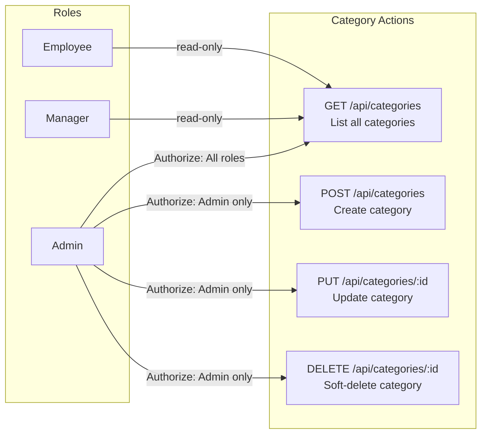
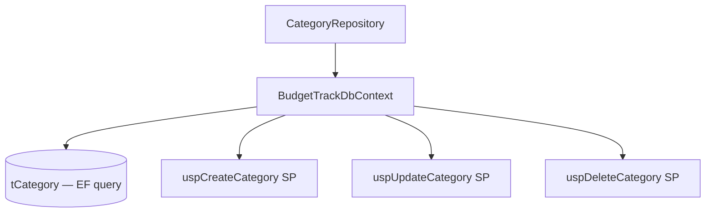
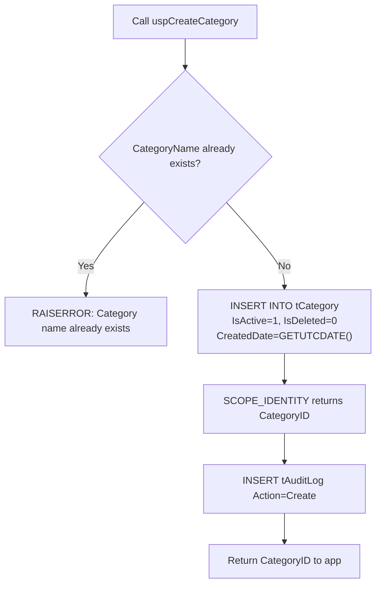
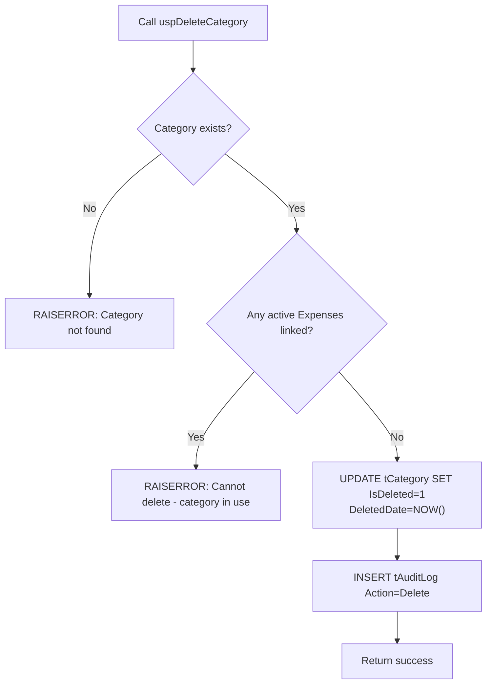
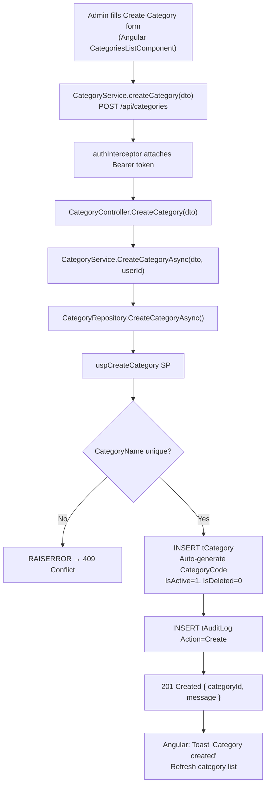
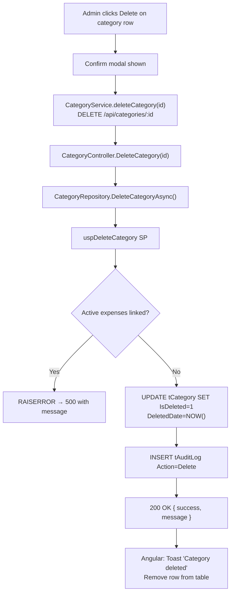

# Category Module — Complete Documentation

> **Stack:** ASP.NET Core 10 · Entity Framework Core 10 · SQL Server Stored Procedures · Angular 21 · Bootstrap 5
> **Base URL:** `http://localhost:5131`
> **Generated:** 2026-03-06

---

## Table of Contents

1. [Module Overview](#1-module-overview)
2. [Role-Based Access Control in Category Module](#2-role-based-access-control-in-category-module)
3. [Entity & DTOs](#3-entity--dtos)
4. [Repository Layer](#4-repository-layer)
5. [Service Layer](#5-service-layer)
6. [Controller Layer](#6-controller-layer)
7. [Complete API Reference](#7-complete-api-reference)
8. [End-to-End Data Flow Diagrams](#8-end-to-end-data-flow-diagrams)

---

## 1. Module Overview

The **Category Module** manages expense classification categories used across the system. Categories are system-level lookups — Admin-exclusive to create, update, and delete. All roles can view them (required when submitting expenses).

### What the Category Module Does

| Capability             | Description                                                                  |
| ---------------------- | ---------------------------------------------------------------------------- |
| List Categories        | All authenticated users view active categories for expense selection         |
| Create Category        | Admin creates a new category with unique name; auto-generates `CategoryCode` |
| Update Category        | Admin modifies category name and description                                 |
| Soft Delete            | Admin deletes a category; prevents deletion if expenses are linked           |
| Uniqueness Enforcement | Both `CategoryName` and `CategoryCode` must be globally unique               |
| Active Flag            | `IsActive` controls visibility in expense submission dropdowns               |
| Audit Logging          | Full JSON snapshots logged to `tAuditLog` on every mutation                  |

---

## 2. Role-Based Access Control in Category Module



### Access Logic

```
POST/PUT/DELETE /api/categories  (CategoryController)
│
├── [Authorize(Roles = "Admin")] — only Admin passes
├── UserId extracted from JWT (CreatedByUserID / UpdatedByUserID / DeletedByUserID)
└── Calls CategoryService → CategoryRepository → Stored Procedure
```

---

## 3. Entity & DTOs

### Entity: `Category` (table: `tCategory`)

| Property          | Type      | Constraints                    | Description                          |
| ----------------- | --------- | ------------------------------ | ------------------------------------ |
| `CategoryID`      | int       | PK, Identity                   | Auto-generated primary key           |
| `CategoryName`    | string    | Required, Max 100, Unique      | Human-readable name                  |
| `CategoryCode`    | string    | Required, Max 50, Unique       | Auto-generated code (e.g. `CAT2611`) |
| `IsActive`        | bool      | Required, default true         | Controls visibility                  |
| `CreatedDate`     | DateTime  | Required, default GETUTCDATE() | Record creation time                 |
| `CreatedByUserID` | int?      | FK → tUser                     | Who created                          |
| `UpdatedDate`     | DateTime? | —                              | Last update time                     |
| `UpdatedByUserID` | int?      | FK → tUser                     | Who last updated                     |
| `IsDeleted`       | bool      | default false                  | Soft-delete flag                     |
| `DeletedDate`     | DateTime? | —                              | Soft-delete timestamp                |
| `DeletedByUserID` | int?      | FK → tUser                     | Who soft-deleted                     |

**Indexes:** `CategoryName (Unique)`, `CategoryCode (Unique)`

**Global Query Filter:** `WHERE IsDeleted = 0` applied automatically by EF Core.

### DTO: `CategoryResponseDto`

| Field          | Type   | Description         |
| -------------- | ------ | ------------------- |
| `CategoryID`   | int    | Category identifier |
| `CategoryName` | string | Category name       |
| `CategoryCode` | string | Auto-generated code |
| `IsActive`     | bool   | Whether active      |

### DTO: `CreateCategoryDto`

| Field          | Type   | Required | Validation                                       |
| -------------- | ------ | -------- | ------------------------------------------------ |
| `CategoryName` | string | ✅        | Required, max 100 chars, must be globally unique |

### DTO: `UpdateCategoryDto`

| Field          | Type   | Required | Validation                                               |
| -------------- | ------ | -------- | -------------------------------------------------------- |
| `CategoryName` | string | ✅        | Required, max 100 chars, must be unique (excluding self) |
| `IsActive`     | bool   | ✅        | Active/Inactive toggle                                   |

---

## 4. Repository Layer

### Interface: `ICategoryRepository`

```csharp
public interface ICategoryRepository
{
    Task<List<CategoryResponseDto>> GetAllCategoriesAsync();
    Task<int> CreateCategoryAsync(CreateCategoryDto dto, int createdByUserID);
    Task<bool> UpdateCategoryAsync(int categoryID, UpdateCategoryDto dto, int updatedByUserID);
    Task<bool> DeleteCategoryAsync(int categoryID, int deletedByUserID);
}
```

### Implementation: `CategoryRepository`



| Method                  | Mechanism                            | Description                                                                                                         |
| ----------------------- | ------------------------------------ | ------------------------------------------------------------------------------------------------------------------- |
| `GetAllCategoriesAsync` | EF Core LINQ on `tCategory`          | Returns all non-deleted categories                                                                                  |
| `CreateCategoryAsync`   | Stored Procedure `uspCreateCategory` | Checks unique name, inserts, returns CategoryID                                                                     |
| `UpdateCategoryAsync`   | Stored Procedure `uspUpdateCategory` | Checks unique name (excluding self), updates record; audit `Description` appends `(Inactive)` when `IsActive=false` |
| `DeleteCategoryAsync`   | Stored Procedure `uspDeleteCategory` | Checks no active expenses linked, then soft-deletes                                                                 |

### `uspCreateCategory` Execution Flow



### `uspDeleteCategory` Execution Flow



---

## 5. Service Layer

### Interface: `ICategoryService`

```csharp
public interface ICategoryService
{
    Task<List<CategoryResponseDto>> GetAllCategoriesAsync();
    Task<int> CreateCategoryAsync(CreateCategoryDto dto, int createdByUserID);
    Task<bool> UpdateCategoryAsync(int categoryID, UpdateCategoryDto dto, int updatedByUserID);
    Task<bool> DeleteCategoryAsync(int categoryID, int deletedByUserID);
}
```

### Implementation: `CategoryService`

`CategoryService` is a thin pass-through to the repository. Business rules (uniqueness, delete protection) are enforced in the stored procedures.

**Dependency Injection:**
```csharp
// Program.cs
builder.Services.AddScoped<ICategoryService, CategoryService>();
builder.Services.AddScoped<ICategoryRepository, CategoryRepository>();
```

---

## 6. Controller Layer

### `CategoryController`

```
Route:  api/categories
Base:   BaseApiController (extracts UserId from JWT)
```

| Method | Route                          | Roles                    | Handler            |
| ------ | ------------------------------ | ------------------------ | ------------------ |
| GET    | `/api/categories`              | Admin, Manager, Employee | `GetAllCategories` |
| POST   | `/api/categories`              | Admin                    | `CreateCategory`   |
| PUT    | `/api/categories/{categoryID}` | Admin                    | `UpdateCategory`   |
| DELETE | `/api/categories/{categoryID}` | Admin                    | `DeleteCategory`   |

**Error Handling per Endpoint:**

| Exception Pattern                           | HTTP Response                |
| ------------------------------------------- | ---------------------------- |
| `"already exists"` / `"duplicate"`          | 409 Conflict                 |
| `"Category not found"` / `"does not exist"` | 404 Not Found                |
| `"in use"` (delete blocked)                 | 500 with specific SP message |
| Unhandled                                   | 500 Internal Server Error    |

---

## 7. Complete API Reference

### `GET /api/categories`

**Roles:** Admin, Manager, Employee

**No query parameters.** Returns all non-deleted categories.

**Response `200 OK`:**
```json
[
  {
    "categoryID": 1,
    "categoryName": "Travel",
    "categoryCode": "CAT2601",
    "isActive": true
  },
  {
    "categoryID": 2,
    "categoryName": "Cloud Infrastructure",
    "categoryCode": "CAT2602",
    "isActive": true
  }
]
```

**Status Codes:**

| Code  | When             |
| ----- | ---------------- |
| `200` | Success          |
| `401` | No/invalid token |
| `500` | Server error     |

---

### `POST /api/categories`

**Roles:** Admin only

**Request Body:**
```json
{
  "categoryName": "Software Licenses"
}
```

**Responses:**

`201 Created`:
```json
{ "categoryId": 11, "message": "Category is created" }
```

`400 Bad Request` (validation):
```json
{
  "type": "https://tools.ietf.org/html/rfc9110#section-15.5.1",
  "title": "One or more validation errors occurred.",
  "status": 400,
  "errors": { "CategoryName": ["The CategoryName field is required."] }
}
```

`409 Conflict` (duplicate name):
```json
{ "success": false, "message": "Category name already exists" }
```

**Status Codes:**

| Code  | When                          |
| ----- | ----------------------------- |
| `201` | Category created successfully |
| `400` | Validation errors             |
| `401` | Not authenticated             |
| `403` | Not Admin                     |
| `409` | Duplicate name                |
| `500` | Server error                  |

---

### `PUT /api/categories/{categoryID}`

**Roles:** Admin only

**Route Param:** `categoryID` (int)

**Request Body:**
```json
{
  "categoryName": "Cloud & Infrastructure",
  "isActive": true
}
```

**Responses:**

`200 OK`:
```json
{ "success": true, "message": "Category is updated" }
```

`404 Not Found`:
```json
{ "success": false, "message": "Category not found" }
```

**Status Codes:**

| Code  | When                 |
| ----- | -------------------- |
| `200` | Updated successfully |
| `400` | Validation errors    |
| `401` | Not authenticated    |
| `403` | Not Admin            |
| `404` | Category not found   |
| `500` | Server error         |

---

### `DELETE /api/categories/{categoryID}`

**Roles:** Admin only

**Route Param:** `categoryID` (int)

**Effect:** Soft delete — sets `IsDeleted=1`, `DeletedDate=NOW()`.

> **Note:** Deletion is blocked by the stored procedure if any active expenses (`IsDeleted=0`) are linked to this category.

**Responses:**

`200 OK`:
```json
{ "success": true, "message": "Category is deleted" }
```

`404 Not Found`:
```json
{ "success": false, "message": "Category not found" }
```

`500` (in-use protection from SP):
```json
{ "success": false, "message": "Cannot delete category: it is currently in use by active expenses" }
```

**Status Codes:**

| Code  | When                                  |
| ----- | ------------------------------------- |
| `200` | Soft-deleted successfully             |
| `401` | Not authenticated                     |
| `403` | Not Admin                             |
| `404` | Category not found or already deleted |
| `500` | Category in use / server error        |

---

## 8. End-to-End Data Flow Diagrams

### Admin Creates a Category



### Admin Deletes a Category


