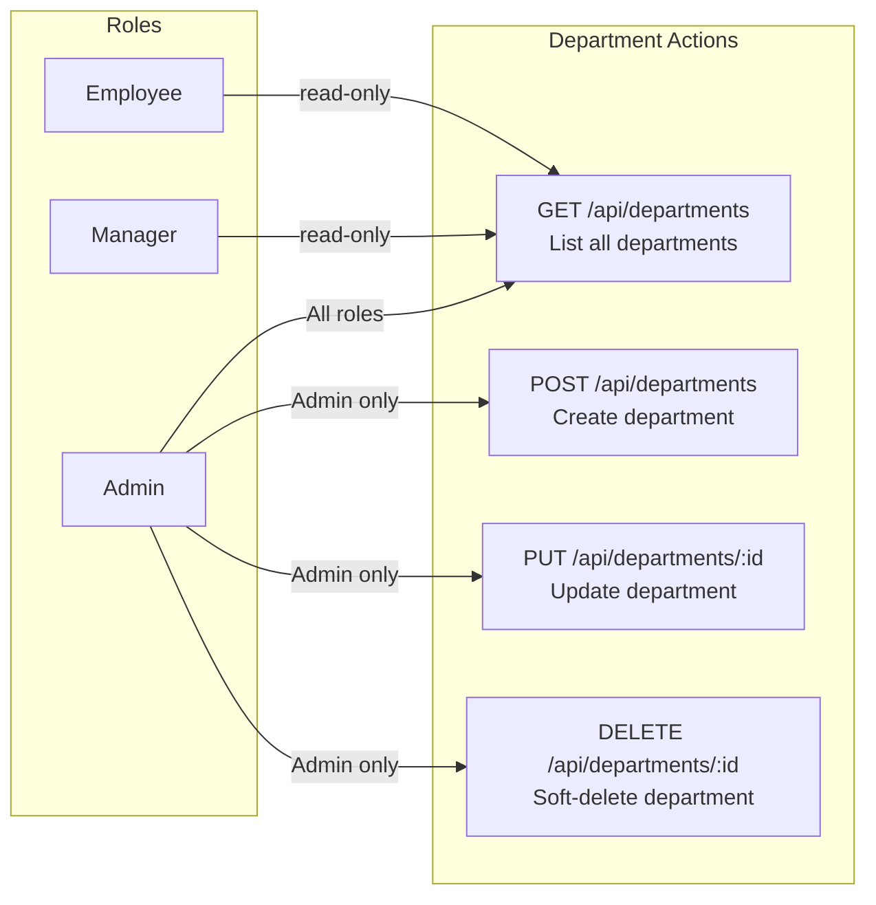
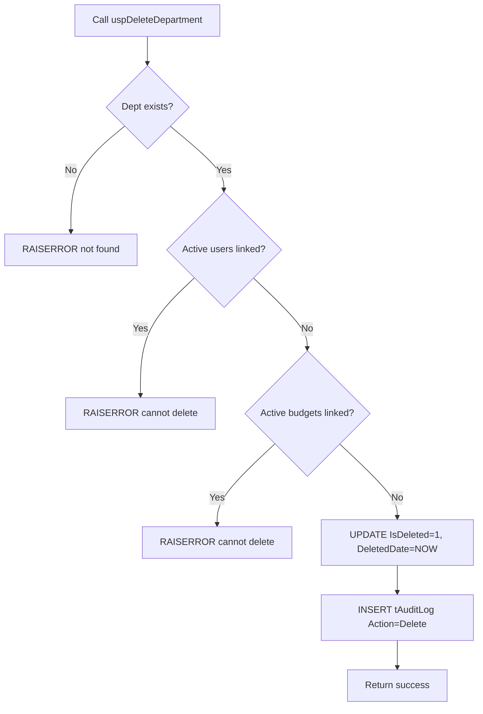
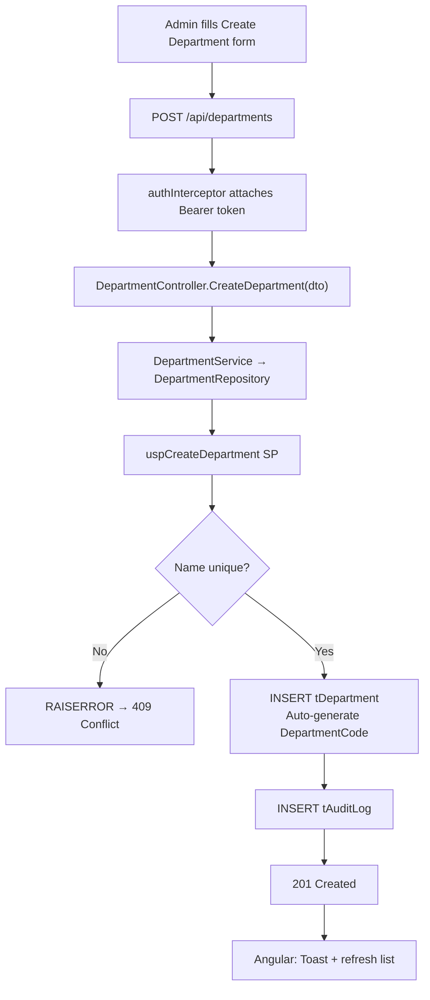

# Department Module — Complete Documentation

> **Stack:** ASP.NET Core 10 · Entity Framework Core 10 · SQL Server · Angular 21 · Bootstrap 5
> **Base URL:** `http://localhost:5131`
> **Generated:** 2026-03-06

---

## Table of Contents

1. [Module Overview](#1-module-overview)
2. [Role-Based Access Control](#2-role-based-access-control)
3. [Entity & DTOs](#3-entity--dtos)
4. [Repository Layer](#4-repository-layer)
5. [Service Layer](#5-service-layer)
6. [Controller Layer](#6-controller-layer)
7. [Complete API Reference](#7-complete-api-reference)
8. [End-to-End Data Flow](#8-end-to-end-data-flow)

---

## 1. Module Overview

The **Department Module** manages organizational units that group Users and Budgets. Only Admins can create/update/delete — all roles can read (needed in forms).

| Capability        | Description                                                        |
| ----------------- | ------------------------------------------------------------------ |
| List Departments  | All authenticated users view for dropdown selection                |
| Create Department | Admin creates department; `DepartmentCode` auto-generated          |
| Update Department | Admin modifies name / active state                                 |
| Soft Delete       | Admin deletes; blocked if users or budgets are still linked        |
| Uniqueness        | Both `DepartmentName` and `DepartmentCode` must be globally unique |
| Audit Logging     | All mutations logged to `tAuditLog`                                |

---

## 2. Role-Based Access Control



---

## 3. Entity & DTOs

### Entity: `Department` (table: `tDepartment`)

| Property          | Type      | Constraints               | Description         |
| ----------------- | --------- | ------------------------- | ------------------- |
| `DepartmentID`    | int       | PK, Identity              | Auto-generated key  |
| `DepartmentName`  | string    | Required, Max 100, Unique | Name                |
| `DepartmentCode`  | string    | Required, Max 50, Unique  | Auto-generated code |
| `IsActive`        | bool      | default true              | Active flag         |
| `CreatedDate`     | DateTime  | default GETUTCDATE()      | Creation time       |
| `CreatedByUserID` | int?      | FK → tUser                | Creator             |
| `UpdatedDate`     | DateTime? | —                         | Last update         |
| `UpdatedByUserID` | int?      | FK → tUser                | Updater             |
| `IsDeleted`       | bool      | default false             | Soft-delete flag    |
| `DeletedDate`     | DateTime? | —                         | Soft-delete time    |
| `DeletedByUserID` | int?      | FK → tUser                | Who deleted         |

**Global Query Filter:** `WHERE IsDeleted = 0` via EF Core.

### DTO: `DepartmentResponseDto`

| Field            | Type   | Description |
| ---------------- | ------ | ----------- |
| `DepartmentID`   | int    | Identifier  |
| `DepartmentName` | string | Name        |
| `DepartmentCode` | string | Code        |
| `IsActive`       | bool   | Active flag |

### DTO: `CreateDepartmentDto`

| Field            | Type   | Required | Validation               |
| ---------------- | ------ | -------- | ------------------------ |
| `DepartmentName` | string | Yes      | Max 100, globally unique |

### DTO: `UpdateDepartmentDto`

| Field            | Type   | Required | Validation                 |
| ---------------- | ------ | -------- | -------------------------- |
| `DepartmentName` | string | Yes      | Max 100, unique excl. self |
| `IsActive`       | bool   | Yes      | Active/Inactive            |

---

## 4. Repository Layer

### Interface: `IDepartmentRepository`

```csharp
public interface IDepartmentRepository
{
    Task<List<DepartmentResponseDto>> GetAllDepartmentsAsync();
    Task<int> CreateDepartmentAsync(CreateDepartmentDto dto, int createdByUserID);
    Task<bool> UpdateDepartmentAsync(int departmentID, UpdateDepartmentDto dto, int updatedByUserID);
    Task<bool> DeleteDepartmentAsync(int departmentID, int deletedByUserID);
}
```

| Method                   | Mechanism                | Description                                                                           |
| ------------------------ | ------------------------ | ------------------------------------------------------------------------------------- |
| `GetAllDepartmentsAsync` | EF Core LINQ             | All non-deleted departments                                                           |
| `CreateDepartmentAsync`  | `uspCreateDepartment` SP | Unique check, insert, audit                                                           |
| `UpdateDepartmentAsync`  | `uspUpdateDepartment` SP | Unique check, update, audit; `Description` appends `(Inactive)` when `IsActive=false` |
| `DeleteDepartmentAsync`  | `uspDeleteDepartment` SP | Link check, soft-delete, audit                                                        |

### `uspDeleteDepartment` Flow



---

## 5. Service Layer

`DepartmentService` implements `IDepartmentService` and delegates to `IDepartmentRepository`. There is no extra business logic — all constraints are enforced in stored procedures.

---

## 6. Controller Layer

```
Route:  api/departments
Base:   BaseApiController (extracts UserId from JWT)
```

| Method | Route                             | Roles | Handler             |
| ------ | --------------------------------- | ----- | ------------------- |
| GET    | `/api/departments`                | All   | `GetAllDepartments` |
| POST   | `/api/departments`                | Admin | `CreateDepartment`  |
| PUT    | `/api/departments/{departmentID}` | Admin | `UpdateDepartment`  |
| DELETE | `/api/departments/{departmentID}` | Admin | `DeleteDepartment`  |

**Error Handling:**

| Exception Pattern                             | Response                  |
| --------------------------------------------- | ------------------------- |
| `"already exists"` / `"duplicate"`            | 409 Conflict              |
| `"Department not found"` / `"does not exist"` | 404 Not Found             |
| SP RAISERROR (in-use)                         | 500 + SP message          |
| Unhandled                                     | 500 Internal Server Error |

---

## 7. Complete API Reference

### `GET /api/departments`

**Roles:** All authenticated

**Response `200 OK`:**
```json
[
  { "departmentID": 1, "departmentName": "Engineering", "departmentCode": "DEP2601", "isActive": true },
  { "departmentID": 2, "departmentName": "Finance",     "departmentCode": "DEP2602", "isActive": true }
]
```

---

### `POST /api/departments`

**Roles:** Admin only · **Request Body:**
```json
{ "departmentName": "Marketing" }
```

`201 Created`:
```json
{ "departmentId": 5, "message": "Department is created" }
```
`409 Conflict`:
```json
{ "success": false, "message": "Department name already exists" }
```

---

### `PUT /api/departments/{departmentID}`

**Roles:** Admin only · **Request Body:**
```json
{ "departmentName": "Engineering & DevOps", "isActive": true }
```

`200 OK`:
```json
{ "success": true, "message": "Department is updated" }
```
`404 Not Found`:
```json
{ "success": false, "message": "Department not found" }
```

---

### `DELETE /api/departments/{departmentID}`

**Roles:** Admin only · **Effect:** Soft delete.

> Blocked if active users or budgets are linked.

`200 OK`:
```json
{ "success": true, "message": "Department is deleted" }
```
`500` (in-use):
```json
{ "success": false, "message": "Cannot delete department: active users or budgets are linked" }
```

---

## 8. End-to-End Data Flow

### Admin Creates a Department


