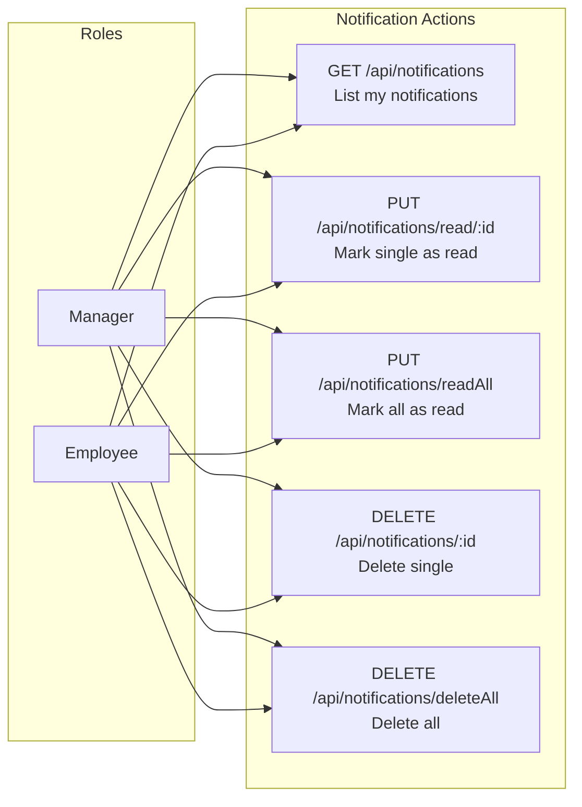
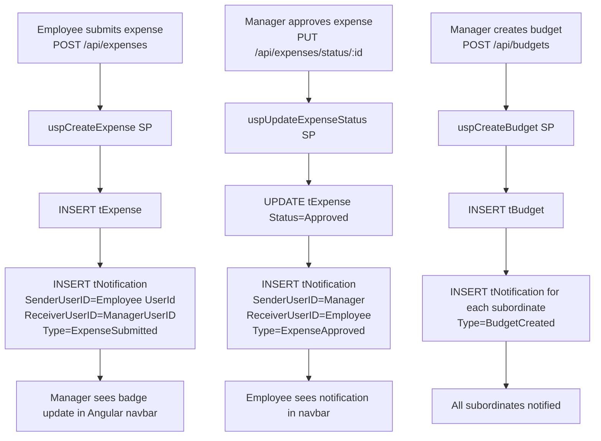
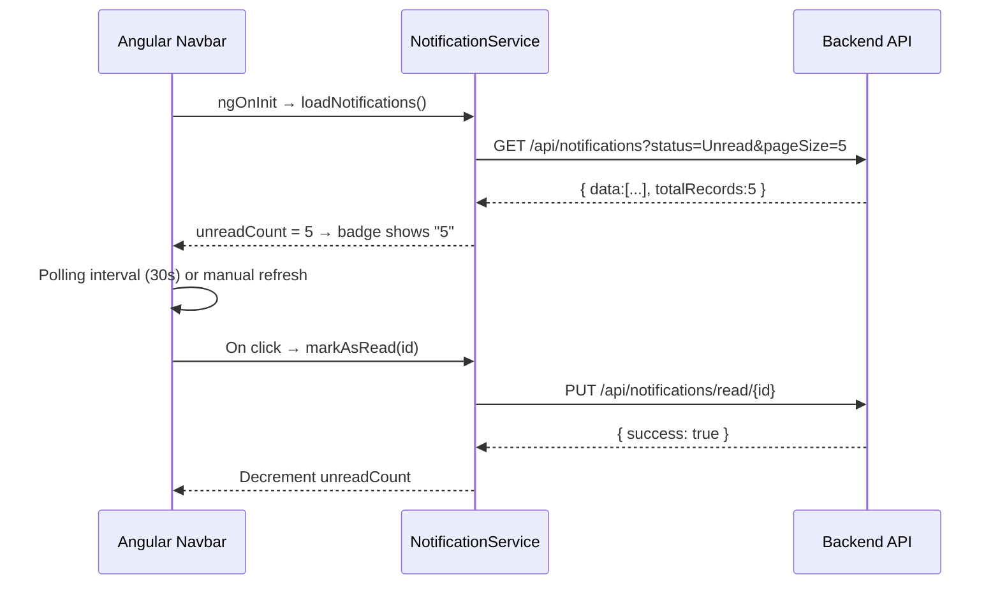

# Notification Module — Complete Documentation

> **Stack:** ASP.NET Core 10 · Entity Framework Core 10 · SQL Server · Angular 21 · Bootstrap 5
> **Base URL:** `http://localhost:5131`
> **Generated:** 2026-03-06

---

## Table of Contents

1. [Module Overview](#1-module-overview)
2. [Role-Based Access Control](#2-role-based-access-control)
3. [Entity & DTOs](#3-entity--dtos)
4. [Repository Layer](#4-repository-layer)
5. [Service Layer](#5-service-layer)
6. [Controller Layer](#6-controller-layer)
7. [Complete API Reference](#7-complete-api-reference)
8. [Notification Trigger Flow](#8-notification-trigger-flow)

---

## 1. Module Overview

The **Notification Module** delivers real-time in-app notifications to Managers and Employees when key events occur (expense submitted, approved, rejected; budget created, updated, deleted). Admins do not receive notifications.

| Capability | Description |
|-----------|-------------|
| Receive Notifications | Manager/Employee views their notifications (paginated) |
| Mark as Read | Mark a single notification read |
| Mark All as Read | Mark all user notifications read in one call |
| Delete Notification | Hard-delete a single notification |
| Delete All | Hard-delete all notifications for the user |
| Auto-Generated | Notifications are created automatically by Budget/Expense stored procedures |
| Ownership Check | Users can only read/delete their own notifications |

### Notification Triggers

| Event | Sender | Receiver | Type |
|-------|--------|----------|------|
| Employee submits expense | Employee | Manager | `ExpenseSubmitted` |
| Manager approves expense | Manager | Employee | `ExpenseApproved` |
| Manager rejects expense | Manager | Employee | `ExpenseRejected` |
| Manager creates budget | Manager | Subordinates | `BudgetCreated` |
| Manager updates budget | Manager | Subordinates | `BudgetUpdated` |
| Manager deletes budget | Manager | Subordinates | `BudgetDeleted` |

---

## 2. Role-Based Access Control



> **Admin is excluded** — Admins interact via audit logs, not notifications.

---

## 3. Entity & DTOs

### Entity: `Notification` (table: `tNotification`)

| Property | Type | Constraints | Description |
|----------|------|-------------|-------------|
| `NotificationID` | int | PK, Identity | Auto key |
| `SenderUserID` | int | FK → tUser, Required | Who triggered the event |
| `ReceiverUserID` | int | FK → tUser, Required, Indexed | Who receives |
| `Type` | NotificationType | Required | Enum: 1–6 |
| `Message` | string | Required, Max 500 | Notification text |
| `Status` | NotificationStatus | default Unread | 1=Unread, 2=Read |
| `CreatedDate` | DateTime | default GETUTCDATE() | When created |
| `ReadDate` | DateTime? | — | When marked read |
| `RelatedEntityType` | string? | Max 50 | e.g. `"Budget"`, `"Expense"` |
| `RelatedEntityID` | int? | — | ID of related entity |
| `IsDeleted` | bool | default false | Soft-delete flag |
| `DeletedDate` | DateTime? | — | Deletion time |

**Global Query Filter:** `WHERE IsDeleted = 0` via EF Core.

### Enum: `NotificationType`

| Value | Name | Trigger |
|-------|------|---------|
| 1 | `ExpenseSubmitted` | Employee submits expense |
| 2 | `ExpenseApproved` | Manager approves expense |
| 3 | `ExpenseRejected` | Manager rejects expense |
| 4 | `BudgetCreated` | Manager creates budget |
| 5 | `BudgetUpdated` | Manager updates budget |
| 6 | `BudgetDeleted` | Manager deletes budget |

### Enum: `NotificationStatus`

| Value | Name |
|-------|------|
| 1 | `Unread` |
| 2 | `Read` |

### DTO: `GetNotificationDto`

| Field | Type | Description |
|-------|------|-------------|
| `NotificationID` | int | Notification identifier |
| `Type` | NotificationType | Event type |
| `Message` | string | Notification message |
| `CreatedDate` | DateTime | When it was created |
| `SenderEmployeeID` | string | Sender's employee ID |
| `SenderName` | string | Sender's full name |
| `Status` | int | 1=Unread, 2=Read |
| `IsRead` | bool | Computed: `Status == 2` |

---

## 4. Repository Layer

### Interface: `INotificationRepository`

```csharp
public interface INotificationRepository
{
    Task<PagedResult<GetNotificationDto>> GetNotificationsByReceiverUserIdAsync(
        int receiverUserID,
        string? message = null,
        string? status = null,
        string sortOrder = "desc",
        int pageNumber = 1,
        int pageSize = 10
    );
    Task<bool> MarkNotificationAsReadAsync(int notificationID, int receiverUserID);
    Task<int> MarkAllNotificationsAsReadAsync(int receiverUserID);
    Task<bool> DeleteNotificationAsync(int notificationID, int receiverUserID);
    Task<int> DeleteAllNotificationsAsync(int receiverUserID);
}
```

### Implementation: `NotificationRepository`

| Method | Mechanism | Description |
|--------|-----------|-------------|
| `GetNotificationsByReceiverUserIdAsync` | EF Core or SP | Returns paginated notifications for user |
| `MarkNotificationAsReadAsync` | EF Core update | Sets Status=2, ReadDate=NOW(); validates ownership |
| `MarkAllNotificationsAsReadAsync` | EF Core bulk update | All unread → read for user; returns count |
| `DeleteNotificationAsync` | EF Core delete | Validates ownership then deletes record |
| `DeleteAllNotificationsAsync` | EF Core bulk delete | All notifications for user; returns count |

---

## 5. Service Layer

### Interface: `INotificationService`

```csharp
public interface INotificationService
{
    Task<PagedResult<GetNotificationDto>> GetNotificationsByReceiverUserIdAsync(
        int receiverUserID, string? message, string? status,
        string sortOrder, int pageNumber, int pageSize);
    Task<bool> MarkNotificationAsReadAsync(int notificationID, int receiverUserID);
    Task<int> MarkAllNotificationsAsReadAsync(int receiverUserID);
    Task<bool> DeleteNotificationAsync(int notificationID, int receiverUserID);
    Task<int> DeleteAllNotificationsAsync(int receiverUserID);
}
```

`NotificationService` is a thin pass-through to `NotificationRepository`. Ownership validation happens in the repository.

---

## 6. Controller Layer

### `NotificationController`

```
Route:  api/notifications
Auth:   [Authorize(Roles = "Manager,Employee")] — class-level
Base:   BaseApiController (UserId from JWT)
```

| Method | Route | Roles | Handler |
|--------|-------|-------|---------|
| GET | `/api/notifications` | Manager, Employee | `GetNotifications` |
| PUT | `/api/notifications/read/{notificationID}` | Manager, Employee | `MarkAsRead` |
| PUT | `/api/notifications/readAll` | Manager, Employee | `MarkAllAsRead` |
| DELETE | `/api/notifications/{notificationID}` | Manager, Employee | `DeleteNotification` |
| DELETE | `/api/notifications/deleteAll` | Manager, Employee | `DeleteAllNotifications` |

**Error Handling:**

| Exception Pattern | Response |
|-------------------|----------|
| `"Notification not found"` / `"does not exist"` | 404 Not Found |
| `"Unauthorized"` / `"not authorized"` | 401 Unauthorized |
| `"does not belong to user"` | 401 Unauthorized |
| `"not found"` / `"already been deleted"` | 404 Not Found |
| Unhandled | 500 Internal Server Error |

---

## 7. Complete API Reference

### `GET /api/notifications`

**Roles:** Manager, Employee

**Query Parameters:**

| Parameter | Type | Default | Description |
|-----------|------|---------|-------------|
| `message` | string? | — | Search by message text |
| `status` | string? | — | `Unread` or `Read` |
| `sortOrder` | string | `desc` | `asc` or `desc` by CreatedDate |
| `pageNumber` | int | `1` | Page index |
| `pageSize` | int | `10` | Max 100 |

**Response `200 OK`:**
```json
{
  "data": [{
    "notificationID": 12,
    "type": 1,
    "message": "Shivali Sharma submitted an expense: Monthly Cloud Hosting (₹109,913)",
    "createdDate": "2026-01-28T03:56:07",
    "senderEmployeeID": "EMP2601",
    "senderName": "Shivali Sharma",
    "status": 1,
    "isRead": false
  }],
  "pageNumber": 1,
  "pageSize": 10,
  "totalRecords": 5,
  "totalPages": 1,
  "hasNextPage": false,
  "hasPreviousPage": false
}
```

**Status Codes:**

| Code | When |
|------|------|
| `200` | Success |
| `401` | Not authenticated |
| `403` | Admin tried to access |
| `500` | Server error |

---

### `PUT /api/notifications/read/{notificationID}`

**Roles:** Manager, Employee

**Route Param:** `notificationID` (int)

**Response `200 OK`:**
```json
{ "success": true, "message": "Notification is read" }
```

`404 Not Found`:
```json
{ "success": false, "message": "Notification not found" }
```

`401 Unauthorized` (not owned by user):
```json
{ "success": false, "message": "Unauthorized: notification does not belong to you" }
```

---

### `PUT /api/notifications/readAll`

**Roles:** Manager, Employee

**Response `200 OK`:**
```json
{ "count": 5, "message": "5 notifications are read" }
```

---

### `DELETE /api/notifications/{notificationID}`

**Roles:** Manager, Employee

**Route Param:** `notificationID` (int)

**Response `200 OK`:**
```json
{ "success": true, "message": "Notification deleted" }
```

`404 Not Found`:
```json
{ "success": false, "message": "Notification not found or already been deleted" }
```

`401 Unauthorized`:
```json
{ "success": false, "message": "Notification does not belong to user" }
```

---

### `DELETE /api/notifications/deleteAll`

**Roles:** Manager, Employee

**Response `200 OK`:**
```json
{ "count": 8, "message": "8 notifications deleted" }
```

---

## 8. Notification Trigger Flow

### How Notifications Are Created

Notifications are not created via the Notification API — they are created **inside stored procedures** of other modules:



### Angular Notification Badge Update Flow


