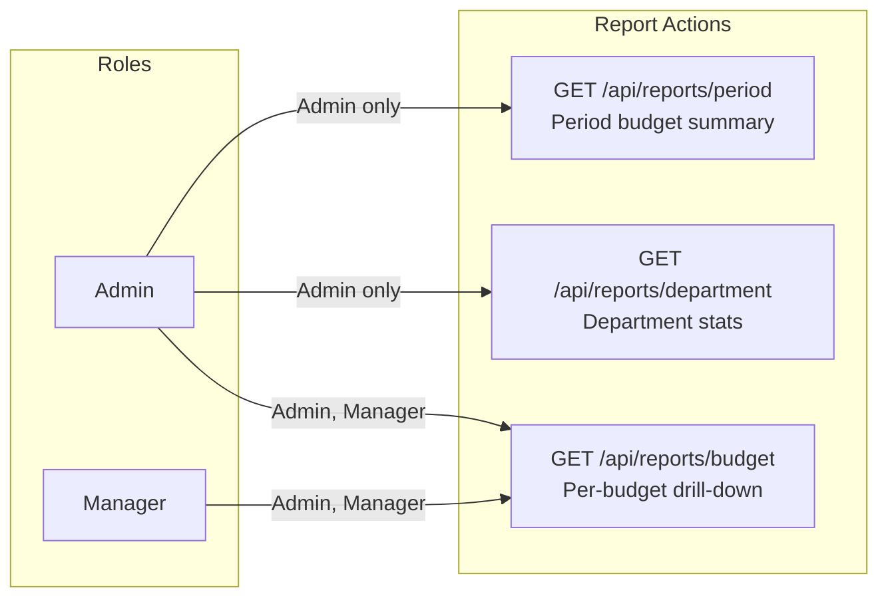
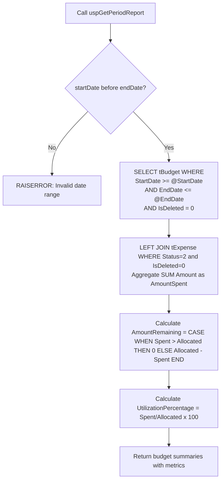
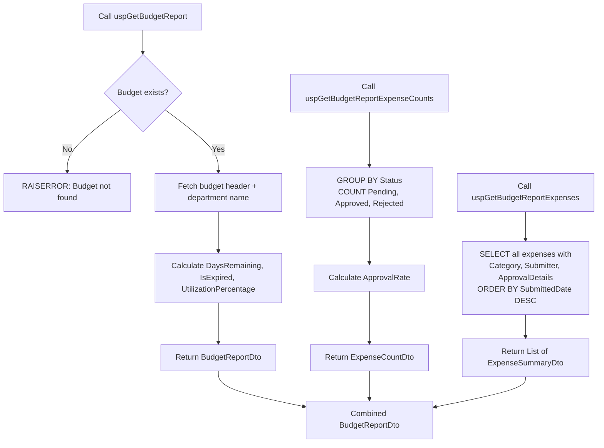
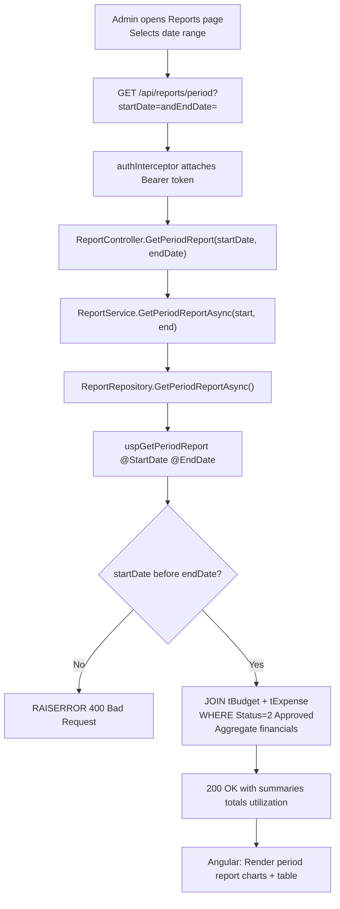
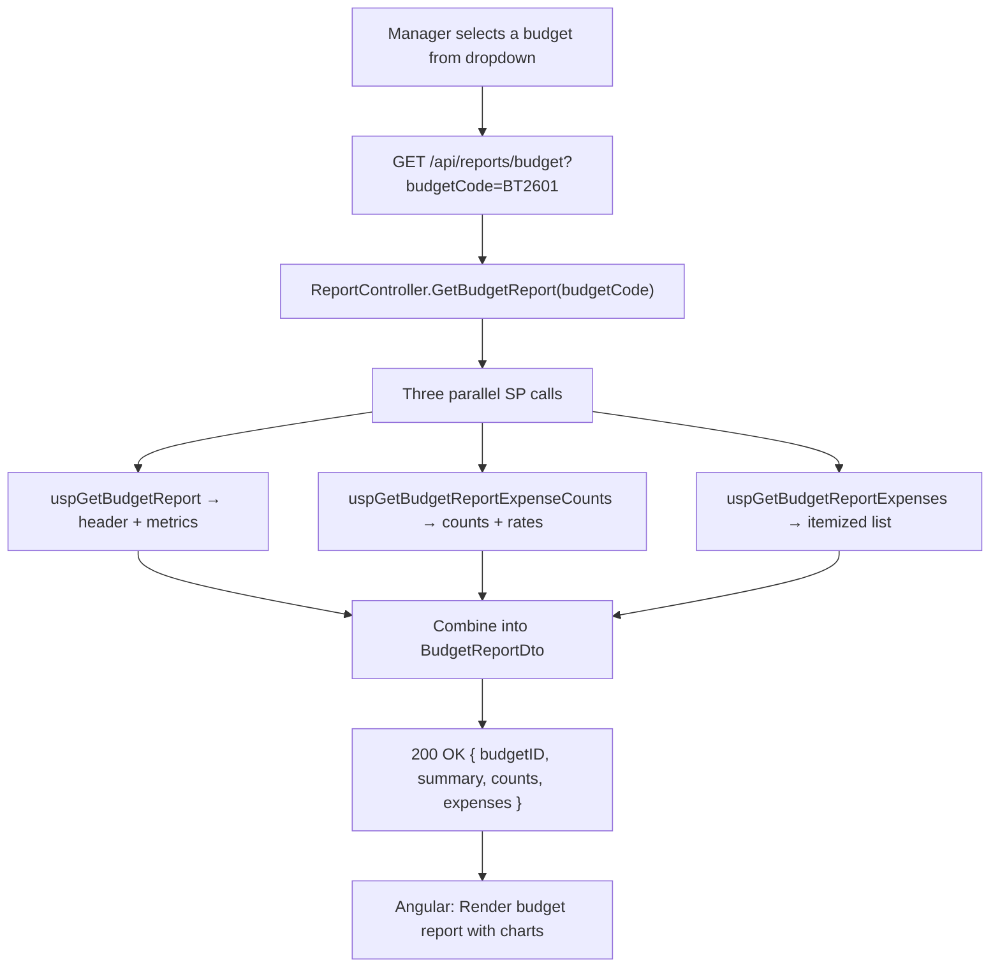

# Report Module — Complete Documentation

> **Stack:** ASP.NET Core 10 · Entity Framework Core 10 · SQL Server Stored Procedures · Angular 21 · Bootstrap 5
> **Base URL:** `http://localhost:5131`
> **Generated:** 2026-03-06

---

## Table of Contents

1. [Module Overview](#1-module-overview)
2. [Role-Based Access Control](#2-role-based-access-control)
3. [DTOs](#3-dtos)
4. [Repository Layer](#4-repository-layer)
5. [Service Layer](#5-service-layer)
6. [Controller Layer](#6-controller-layer)
7. [Complete API Reference](#7-complete-api-reference)
8. [End-to-End Data Flow Diagrams](#8-end-to-end-data-flow-diagrams)

---

## 1. Module Overview

The **Report Module** provides aggregated financial analytics across three scopes: time-period, department, and per-budget. All reporting is read-only and powered entirely by SQL Server stored procedures.

| Capability               | Description                                                                                         |
| ------------------------ | --------------------------------------------------------------------------------------------------- |
| Period Report            | Budget summary for a date range (Admin only)                                                        |
| Department Report        | Budget and expense stats grouped by department (Admin only)                                         |
| Budget Report            | Full drill-down of a specific budget with all expenses (Admin, Manager)                             |
| Stored Procedure Powered | All three use dedicated SPs for complex JOIN aggregations                                           |
| Utilization Metrics      | AmountAllocated, AmountSpent, AmountRemaining (capped at 0 — never negative), UtilizationPercentage |
| Expense Counts           | Pending, Approved, Rejected counts + approval rates                                                 |

---

## 2. Role-Based Access Control



---

## 3. DTOs

### DTO: `PeriodReportDto`

| Field                   | Type                     | Description                                                    |
| ----------------------- | ------------------------ | -------------------------------------------------------------- |
| `StartDate`             | DateTime                 | Report start date                                              |
| `EndDate`               | DateTime                 | Report end date                                                |
| `TotalBudgets`          | int                      | Budget count in period                                         |
| `TotalAllocated`        | decimal                  | Sum of AmountAllocated                                         |
| `TotalSpent`            | decimal                  | Sum of approved expenses                                       |
| `TotalRemaining`        | decimal                  | Sum of per-budget `AmountRemaining` from SP (each capped at 0) |
| `UtilizationPercentage` | decimal                  | TotalSpent / TotalAllocated × 100                              |
| `Summaries`             | List\<BudgetSummaryDto\> | Per-budget breakdown                                           |

### DTO: `BudgetSummaryDto`

| Field                   | Type     | Description                                    |
| ----------------------- | -------- | ---------------------------------------------- |
| `BudgetID`              | int      | Budget identifier                              |
| `Title`                 | string   | Budget title                                   |
| `Code`                  | string   | Budget code                                    |
| `DepartmentName`        | string   | Department                                     |
| `AmountAllocated`       | decimal  | Allocated amount                               |
| `AmountSpent`           | decimal  | Spent amount                                   |
| `AmountRemaining`       | decimal  | Remaining (capped at 0 by SP — never negative) |
| `UtilizationPercentage` | decimal  | Utilization %                                  |
| `Status`                | string   | Active / Closed                                |
| `StartDate`             | DateTime | Budget start                                   |
| `EndDate`               | DateTime | Budget end                                     |

### DTO: `DepartmentReportDto`

| Field     | Type                         | Description          |
| --------- | ---------------------------- | -------------------- |
| `Summary` | List\<DepartmentSummaryDto\> | Per-department stats |

### DTO: `DepartmentSummaryDto`

| Field                   | Type    | Description                                          |
| ----------------------- | ------- | ---------------------------------------------------- |
| `DepartmentID`          | int     | Department identifier                                |
| `DepartmentName`        | string  | Department name                                      |
| `TotalBudgets`          | int     | Budget count                                         |
| `TotalExpenses`         | int     | Expense count                                        |
| `TotalAllocated`        | decimal | Total allocated                                      |
| `TotalSpent`            | decimal | Total approved spent                                 |
| `TotalRemaining`        | decimal | Total remaining (capped at 0 by SP — never negative) |
| `UtilizationPercentage` | decimal | Utilization %                                        |

### DTO: `BudgetReportDto`

| Field                   | Type                      | Description                                    |
| ----------------------- | ------------------------- | ---------------------------------------------- |
| `BudgetID`              | int                       | Budget identifier                              |
| `Title`                 | string                    | Budget title                                   |
| `Code`                  | string                    | Budget code                                    |
| `DepartmentName`        | string                    | Department                                     |
| `AmountAllocated`       | decimal                   | Allocated                                      |
| `AmountSpent`           | decimal                   | Spent                                          |
| `AmountRemaining`       | decimal                   | Remaining (capped at 0 by SP — never negative) |
| `UtilizationPercentage` | decimal                   | Utilization %                                  |
| `StartDate`             | DateTime                  | Start                                          |
| `EndDate`               | DateTime                  | End                                            |
| `DaysRemaining`         | int                       | Days until expiry                              |
| `IsExpired`             | bool                      | Past end date?                                 |
| `Status`                | string                    | Active / Closed                                |
| `ExpenseCounts`         | ExpenseCountDto           | Pending/Approved/Rejected counts               |
| `Expenses`              | List\<ExpenseSummaryDto\> | All associated expenses                        |

### DTO: `ExpenseCountDto`

| Field           | Type    | Description                         |
| --------------- | ------- | ----------------------------------- |
| `TotalExpenses` | int     | Total count                         |
| `PendingCount`  | int     | Pending                             |
| `ApprovedCount` | int     | Approved                            |
| `RejectedCount` | int     | Rejected                            |
| `ApprovalRate`  | decimal | ApprovedCount / TotalExpenses × 100 |

---

## 4. Repository Layer

### Interface: `IReportRepository`

```csharp
public interface IReportRepository
{
    Task<PeriodReportDto> GetPeriodReportAsync(DateTime startDate, DateTime endDate);
    Task<DepartmentReportDto> GetDepartmentReportAsync(string? departmentName);
    Task<BudgetReportDto> GetBudgetReportAsync(string budgetCode);
}
```

### Implementation: `ReportRepository`

| Method                     | Stored Procedure                                                                        | Description                                                                                                                                                       |
| -------------------------- | --------------------------------------------------------------------------------------- | ----------------------------------------------------------------------------------------------------------------------------------------------------------------- |
| `GetPeriodReportAsync`     | `uspGetPeriodReport`                                                                    | Aggregates budgets within date range, joins with approved expenses; `AmountRemaining` capped at `0` per budget row; total sums SP results                         |
| `GetDepartmentReportAsync` | `uspGetDepartmentReport`                                                                | Groups budgets and expenses by department; `AmountRemaining` capped at `0` per department; `TotalBudgetAmountRemaining` sums SP results (not `allocated - spent`) |
| `GetBudgetReportAsync`     | `uspGetBudgetReport` + `uspGetBudgetReportExpenseCounts` + `uspGetBudgetReportExpenses` | Three SP calls for full budget analysis; `AmountRemaining` capped at `0`                                                                                          |

### `uspGetPeriodReport` Execution Flow



### `uspGetBudgetReport` Execution Flow



---

## 5. Service Layer

### Interface: `IReportService`

```csharp
public interface IReportService
{
    Task<PeriodReportDto> GetPeriodReportAsync(DateTime startDate, DateTime endDate);
    Task<DepartmentReportDto> GetDepartmentReportAsync(string? departmentName);
    Task<BudgetReportDto> GetBudgetReportAsync(string budgetCode);
}
```

`ReportService` delegates directly to `ReportRepository`. No additional business logic is applied — all computation is in stored procedures.

---

## 6. Controller Layer

### `ReportController`

```
Route:  api/reports
Auth:   [Authorize(Roles = "Manager,Admin,Employee")] class-level
Note:   Each endpoint overrides with stricter role
```

| Method | Route                     | Roles          | Handler               |
| ------ | ------------------------- | -------------- | --------------------- |
| GET    | `/api/reports/period`     | Admin only     | `GetPeriodReport`     |
| GET    | `/api/reports/department` | Admin only     | `GetDepartmentReport` |
| GET    | `/api/reports/budget`     | Admin, Manager | `GetBudgetReport`     |

**Error Handling:**

| Exception Pattern                  | Response                  |
| ---------------------------------- | ------------------------- |
| `"Invalid"` / `"must be"`          | 400 Bad Request           |
| `"not found"` / `"does not exist"` | 404 Not Found             |
| Unhandled                          | 500 Internal Server Error |

---

## 7. Complete API Reference

### `GET /api/reports/period`

**Roles:** Admin only

**Query Parameters:**

| Parameter   | Type     | Required | Description         |
| ----------- | -------- | -------- | ------------------- |
| `startDate` | DateTime | ✅        | ISO 8601 start date |
| `endDate`   | DateTime | ✅        | ISO 8601 end date   |

**Response `200 OK`:**
```json
{
  "startDate": "2026-01-01T00:00:00",
  "endDate": "2026-03-31T00:00:00",
  "totalBudgets": 5,
  "totalAllocated": 25000000.00,
  "totalSpent": 5340000.00,
  "totalRemaining": 19660000.00,
  "utilizationPercentage": 21.36,
  "summaries": [
    {
      "budgetID": 1,
      "title": "Engineering Operations",
      "code": "BT2601",
      "departmentName": "Engineering",
      "amountAllocated": 5000000.00,
      "amountSpent": 1068348.00,
      "amountRemaining": 3931652.00,
      "utilizationPercentage": 21.37,
      "status": "Active",
      "startDate": "2026-02-25T01:24:20",
      "endDate": "2027-02-25T01:24:20"
    }
  ]
}
```

**Status Codes:**

| Code  | When                                      |
| ----- | ----------------------------------------- |
| `200` | Success                                   |
| `400` | Invalid date range (startDate >= endDate) |
| `401` | Not authenticated                         |
| `403` | Not Admin                                 |
| `500` | Server error                              |

---

### `GET /api/reports/department`

**Roles:** Admin only

**No query parameters.**

**Response `200 OK`:**
```json
{
  "summary": [
    {
      "departmentID": 1,
      "departmentName": "Engineering",
      "totalBudgets": 3,
      "totalExpenses": 45,
      "totalAllocated": 15000000.00,
      "totalSpent": 3200000.00,
      "totalRemaining": 11800000.00,
      "utilizationPercentage": 21.33
    },
    {
      "departmentID": 2,
      "departmentName": "Finance",
      "totalBudgets": 2,
      "totalExpenses": 20,
      "totalAllocated": 10000000.00,
      "totalSpent": 2140000.00,
      "totalRemaining": 7860000.00,
      "utilizationPercentage": 21.40
    }
  ]
}
```

**Status Codes:**

| Code  | When              |
| ----- | ----------------- |
| `200` | Success           |
| `401` | Not authenticated |
| `403` | Not Admin         |
| `500` | Server error      |

---

### `GET /api/reports/budget`

**Roles:** Admin, Manager

**Query Parameters:**

| Parameter    | Type   | Required | Description                 |
| ------------ | ------ | -------- | --------------------------- |
| `budgetCode` | string | ✅        | Budget code (e.g. `BT2601`) |

**Response `200 OK`:**
```json
{
  "budgetID": 1,
  "title": "Engineering Operations",
  "code": "BT2601",
  "departmentName": "Engineering",
  "amountAllocated": 5000000.00,
  "amountSpent": 1068348.00,
  "amountRemaining": 3931652.00,
  "utilizationPercentage": 21.37,
  "startDate": "2026-02-25T01:24:20",
  "endDate": "2027-02-25T01:24:20",
  "daysRemaining": 365,
  "isExpired": false,
  "status": "Active",
  "expenseCounts": {
    "totalExpenses": 45,
    "pendingCount": 12,
    "approvedCount": 28,
    "rejectedCount": 5,
    "approvalRate": 84.85
  },
  "expenses": [
    {
      "expenseID": 1,
      "title": "Monthly Cloud Hosting",
      "amount": 109913.00,
      "categoryName": "Cloud Infrastructure",
      "status": "Approved",
      "submittedDate": "2026-01-28T03:56:07",
      "submittedByUserName": "Shivali Sharma",
      "submittedByEmployeeID": "EMP2601",
      "approvedByUserName": "Sanika Anil",
      "approvalComments": "Approved as per Q1 plan"
    }
  ]
}
```

**Status Codes:**

| Code  | When                  |
| ----- | --------------------- |
| `200` | Success               |
| `401` | Not authenticated     |
| `403` | Not Admin or Manager  |
| `404` | Budget code not found |
| `500` | Server error          |

---

## 8. End-to-End Data Flow Diagrams

### Admin Generates a Period Report



### Manager Generates a Budget Report


