# BudgetTrack — Complete Sequence Diagrams

> **Stack:** ASP.NET Core 10 · Entity Framework Core 10 · SQL Server · Angular 21 · Bootstrap 5
> **Base URL:** `http://localhost:5131`

---

## Table of Contents

1. [Participants Legend](#1-participants-legend)
2. [Authentication — Login](#2-authentication--login)
3. [Authentication — Token Refresh on 401](#3-authentication--token-refresh-on-401)
4. [Authentication — Session Restore on Page Refresh](#4-authentication--session-restore-on-page-refresh)
5. [Authentication — Logout](#5-authentication--logout)
6. [Authentication — Change Password](#6-authentication--change-password)
7. [User Management — Create User (Admin)](#7-user-management--create-user-admin)
8. [User Management — Update User](#8-user-management--update-user)
9. [User Management — Soft Delete User](#9-user-management--soft-delete-user)
10. [Budget — List Budgets (Role-Based)](#10-budget--list-budgets-role-based)
11. [Budget — Create Budget](#11-budget--create-budget)
12. [Budget — Update Budget](#12-budget--update-budget)
13. [Budget — Soft Delete Budget](#13-budget--soft-delete-budget)
14. [Expense — Submit Expense (Employee)](#14-expense--submit-expense-employee)
15. [Expense — Approve Expense (Manager)](#15-expense--approve-expense-manager)
16. [Expense — Reject Expense (Manager)](#16-expense--reject-expense-manager)
17. [Expense — List Expenses](#17-expense--list-expenses)
18. [Category — Create Category](#18-category--create-category)
19. [Category — Update Category](#19-category--update-category)
20. [Department — Create Department](#20-department--create-department)
21. [Department — Update Department](#21-department--update-department)
22. [Notification — Fetch Notifications](#22-notification--fetch-notifications)
23. [Notification — Mark as Read](#23-notification--mark-as-read)
24. [Notification — Mark All as Read](#24-notification--mark-all-as-read)
25. [Reports — Period Report](#25-reports--period-report)
26. [Reports — Department Report](#26-reports--department-report)
27. [Reports — Budget Report](#27-reports--budget-report)
28. [Audit — Fetch Audit Logs](#28-audit--fetch-audit-logs)
29. [Dashboard — Load KPI & Charts](#29-dashboard--load-kpi--charts)
30. [Cross-Cutting — Notification Fanout on Budget Create](#30-cross-cutting--notification-fanout-on-budget-create)

---

## 1. Participants Legend

| Alias  | Full Name                            | Layer                     |
| ------ | ------------------------------------ | ------------------------- |
| `U`    | User (Browser)                       | UI                        |
| `A`    | Angular App                          | Frontend                  |
| `GRD`  | authGuard / roleGuard                | Frontend Guard            |
| `INT`  | authInterceptor                      | Frontend HTTP Interceptor |
| `SVC`  | Angular Service (e.g. BudgetService) | Frontend Service          |
| `API`  | ASP.NET Core REST API                | Controller                |
| `MW`   | JwtMiddleware                        | Backend Middleware        |
| `CTRL` | Controller (e.g. BudgetController)   | Controller                |
| `BSvc` | Backend Service (e.g. BudgetService) | Business Logic            |
| `REPO` | Repository (e.g. BudgetRepository)   | Data Access               |
| `DB`   | SQL Server                           | Database                  |

---

## 2. Authentication — Login

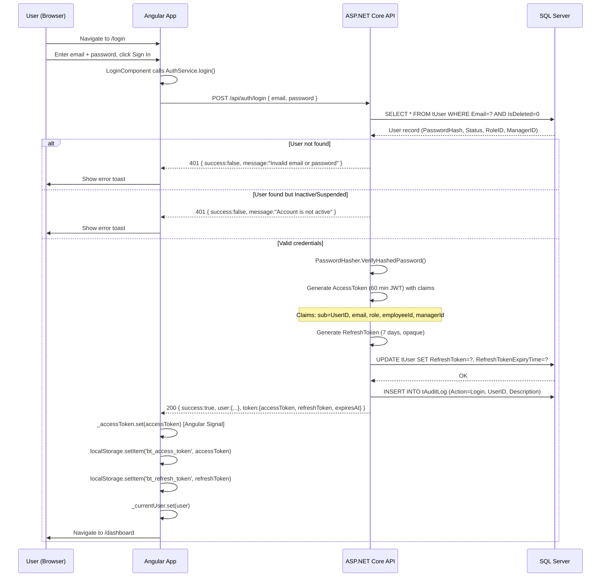
```mermaid
sequenceDiagram
    participant U as User (Browser)
    participant A as Angular App
    participant API as ASP.NET Core API
    participant DB as SQL Server

    U->>A: Navigate to /login
    U->>A: Enter email + password, click Sign In
    A->>A: LoginComponent calls AuthService.login()
    A->>API: POST /api/auth/login { email, password }

    API->>DB: SELECT * FROM tUser WHERE Email=? AND IsDeleted=0
    DB-->>API: User record (PasswordHash, Status, RoleID, ManagerID)

    alt User not found
        API-->>A: 401 { success:false, message:"Invalid email or password" }
        A->>U: Show error toast
    else User found but Inactive/Suspended
        API-->>A: 401 { success:false, message:"Account is not active" }
        A->>U: Show error toast
    else Valid credentials
        API->>API: PasswordHasher.VerifyHashedPassword()
        API->>API: Generate AccessToken (60 min JWT) with claims
        Note over API: Claims: sub=UserID, email, role, employeeId, managerId
        API->>API: Generate RefreshToken (7 days, opaque)
        API->>DB: UPDATE tUser SET RefreshToken=?, RefreshTokenExpiryTime=?
        DB-->>API: OK
        API->>DB: INSERT INTO tAuditLog (Action=Login, UserID, Description)
        API-->>A: 200 { success:true, user:{...}, token:{accessToken, refreshToken, expiresAt} }
        A->>A: _accessToken.set(accessToken) [Angular Signal]
        A->>A: localStorage.setItem('bt_access_token', accessToken)
        A->>A: localStorage.setItem('bt_refresh_token', refreshToken)
        A->>A: _currentUser.set(user)
        A->>U: Navigate to /dashboard
    end
```

---

## 3. Authentication — Token Refresh on 401

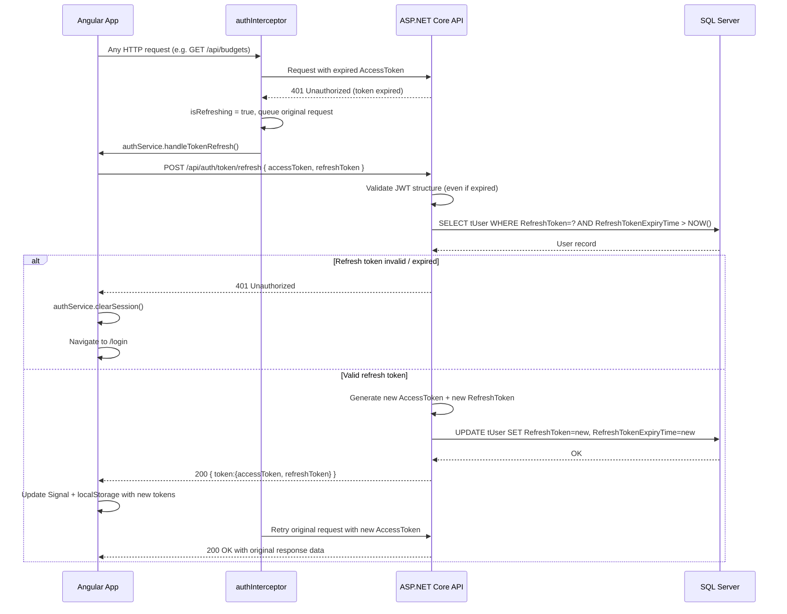
```mermaid
sequenceDiagram
    participant A as Angular App
    participant INT as authInterceptor
    participant API as ASP.NET Core API
    participant DB as SQL Server

    A->>INT: Any HTTP request (e.g. GET /api/budgets)
    INT->>API: Request with expired AccessToken
    API-->>INT: 401 Unauthorized (token expired)

    INT->>INT: isRefreshing = true, queue original request
    INT->>A: authService.handleTokenRefresh()
    A->>API: POST /api/auth/token/refresh { accessToken, refreshToken }

    API->>API: Validate JWT structure (even if expired)
    API->>DB: SELECT tUser WHERE RefreshToken=? AND RefreshTokenExpiryTime > NOW()
    DB-->>API: User record

    alt Refresh token invalid / expired
        API-->>A: 401 Unauthorized
        A->>A: authService.clearSession()
        A->>A: Navigate to /login
    else Valid refresh token
        API->>API: Generate new AccessToken + new RefreshToken
        API->>DB: UPDATE tUser SET RefreshToken=new, RefreshTokenExpiryTime=new
        DB-->>API: OK
        API-->>A: 200 { token:{accessToken, refreshToken} }
        A->>A: Update Signal + localStorage with new tokens
        INT->>API: Retry original request with new AccessToken
        API-->>A: 200 OK with original response data
    end
```

---

## 4. Authentication — Session Restore on Page Refresh

> **How it works:** All static routes are `RenderMode.Prerender` — prerendered at build time. Each component's `ngOnInit` skips API calls server-side via `isPlatformBrowser()`. At runtime, `authGuard` calls `tryRestoreSession()` which restores the session **entirely from localStorage without any API call**:
> 1. If `bt_user_profile` is cached and the token is still valid → restore instantly
> 2. Else if the token is still valid → decode user profile directly from JWT claims → restore instantly
> 3. Else → call `/api/auth/token/refresh`, then decode profile from the new JWT
>
> The backend being down has **zero effect** on whether the user stays logged in.

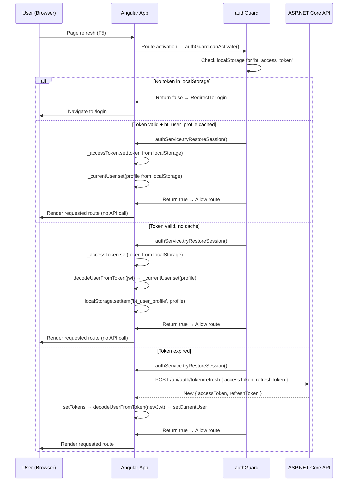
```mermaid
sequenceDiagram
    participant U as User (Browser)
    participant A as Angular App
    participant GRD as authGuard
    participant API as ASP.NET Core API

    U->>A: Page refresh (F5)
    A->>GRD: Route activation — authGuard.canActivate()
    GRD->>GRD: Check localStorage for 'bt_access_token'

    alt No token in localStorage
        GRD->>A: Return false → RedirectToLogin
        A->>U: Navigate to /login
    else Token valid + bt_user_profile cached
        GRD->>A: authService.tryRestoreSession()
        A->>A: _accessToken.set(token from localStorage)
        A->>A: _currentUser.set(profile from localStorage)
        GRD->>A: Return true → Allow route
        A->>U: Render requested route (no API call)
    else Token valid, no cache
        GRD->>A: authService.tryRestoreSession()
        A->>A: _accessToken.set(token from localStorage)
        A->>A: decodeUserFromToken(jwt) → _currentUser.set(profile)
        A->>A: localStorage.setItem('bt_user_profile', profile)
        GRD->>A: Return true → Allow route
        A->>U: Render requested route (no API call)
    else Token expired
        GRD->>A: authService.tryRestoreSession()
        A->>API: POST /api/auth/token/refresh { accessToken, refreshToken }
        API-->>A: New { accessToken, refreshToken }
        A->>A: setTokens → decodeUserFromToken(newJwt) → setCurrentUser
        GRD->>A: Return true → Allow route
        A->>U: Render requested route
    end
```

---

## 5. Authentication — Logout

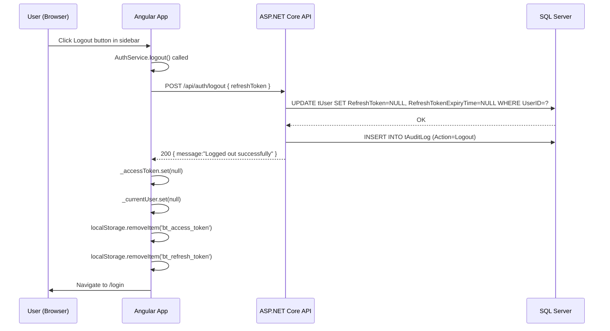
```mermaid
sequenceDiagram
    participant U as User (Browser)
    participant A as Angular App
    participant API as ASP.NET Core API
    participant DB as SQL Server

    U->>A: Click Logout button in sidebar
    A->>A: AuthService.logout() called
    A->>API: POST /api/auth/logout { refreshToken }
    API->>DB: UPDATE tUser SET RefreshToken=NULL, RefreshTokenExpiryTime=NULL WHERE UserID=?
    DB-->>API: OK
    API->>DB: INSERT INTO tAuditLog (Action=Logout)
    API-->>A: 200 { message:"Logged out successfully" }
    A->>A: _accessToken.set(null)
    A->>A: _currentUser.set(null)
    A->>A: localStorage.removeItem('bt_access_token')
    A->>A: localStorage.removeItem('bt_refresh_token')
    A->>U: Navigate to /login
```

---

## 6. Authentication — Change Password

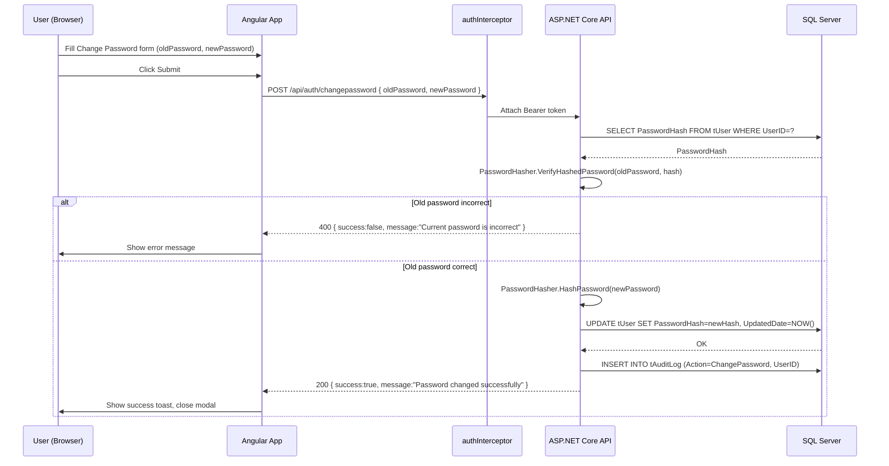
```mermaid
sequenceDiagram
    participant U as User (Browser)
    participant A as Angular App
    participant INT as authInterceptor
    participant API as ASP.NET Core API
    participant DB as SQL Server

    U->>A: Fill Change Password form (oldPassword, newPassword)
    U->>A: Click Submit
    A->>INT: POST /api/auth/changepassword { oldPassword, newPassword }
    INT->>API: Attach Bearer token
    API->>DB: SELECT PasswordHash FROM tUser WHERE UserID=?
    DB-->>API: PasswordHash
    API->>API: PasswordHasher.VerifyHashedPassword(oldPassword, hash)

    alt Old password incorrect
        API-->>A: 400 { success:false, message:"Current password is incorrect" }
        A->>U: Show error message
    else Old password correct
        API->>API: PasswordHasher.HashPassword(newPassword)
        API->>DB: UPDATE tUser SET PasswordHash=newHash, UpdatedDate=NOW()
        DB-->>API: OK
        API->>DB: INSERT INTO tAuditLog (Action=ChangePassword, UserID)
        API-->>A: 200 { success:true, message:"Password changed successfully" }
        A->>U: Show success toast, close modal
    end
```

---

## 7. User Management — Create User (Admin)

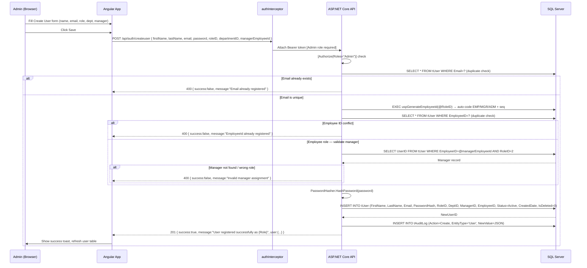
```mermaid
sequenceDiagram
    participant U as Admin (Browser)
    participant A as Angular App
    participant INT as authInterceptor
    participant API as ASP.NET Core API
    participant DB as SQL Server

    U->>A: Fill Create User form (name, email, role, dept, manager)
    U->>A: Click Save
    A->>INT: POST /api/auth/createuser { firstName, lastName, email, password, roleID, departmentID, managerEmployeeId }
    INT->>API: Attach Bearer token [Admin role required]
    API->>API: [Authorize(Roles="Admin")] check
    API->>DB: SELECT * FROM tUser WHERE Email=? (duplicate check)

    alt Email already exists
        API-->>A: 400 { success:false, message:"Email already registered" }
    else Email is unique
        API->>DB: EXEC uspGenerateEmployeeId(@RoleID) → auto-code EMP/MGR/ADM + seq
        API->>DB: SELECT * FROM tUser WHERE EmployeeID=? (duplicate check)

        alt Employee ID conflict
            API-->>A: 400 { success:false, message:"EmployeeId already registered" }
        else Employee role — validate manager
            API->>DB: SELECT UserID FROM tUser WHERE EmployeeID=@managerEmployeeId AND RoleID=2
            DB-->>API: Manager record

            alt Manager not found / wrong role
                API-->>A: 400 { success:false, message:"Invalid manager assignment" }
            end
        end

        API->>API: PasswordHasher.HashPassword(password)
        API->>DB: INSERT INTO tUser (FirstName, LastName, Email, PasswordHash, RoleID, DeptID, ManagerID, EmployeeID, Status=Active, CreatedDate, IsDeleted=0)
        DB-->>API: NewUserID
        API->>DB: INSERT INTO tAuditLog (Action=Create, EntityType='User', NewValue=JSON)
        API-->>A: 201 { success:true, message:"User registered successfully as {Role}", user:{...} }
        A->>U: Show success toast, refresh user table
    end
```

---

## 8. User Management — Update User

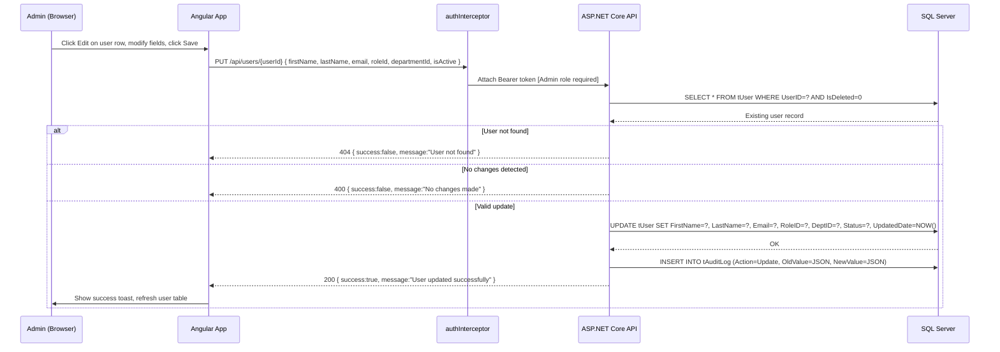
```mermaid
sequenceDiagram
    participant U as Admin (Browser)
    participant A as Angular App
    participant INT as authInterceptor
    participant API as ASP.NET Core API
    participant DB as SQL Server

    U->>A: Click Edit on user row, modify fields, click Save
    A->>INT: PUT /api/users/{userId} { firstName, lastName, email, roleId, departmentId, isActive }
    INT->>API: Attach Bearer token [Admin role required]
    API->>DB: SELECT * FROM tUser WHERE UserID=? AND IsDeleted=0
    DB-->>API: Existing user record

    alt User not found
        API-->>A: 404 { success:false, message:"User not found" }
    else No changes detected
        API-->>A: 400 { success:false, message:"No changes made" }
    else Valid update
        API->>DB: UPDATE tUser SET FirstName=?, LastName=?, Email=?, RoleID=?, DeptID=?, Status=?, UpdatedDate=NOW()
        DB-->>API: OK
        API->>DB: INSERT INTO tAuditLog (Action=Update, OldValue=JSON, NewValue=JSON)
        API-->>A: 200 { success:true, message:"User updated successfully" }
        A->>U: Show success toast, refresh user table
    end
```

---

## 9. User Management — Soft Delete User

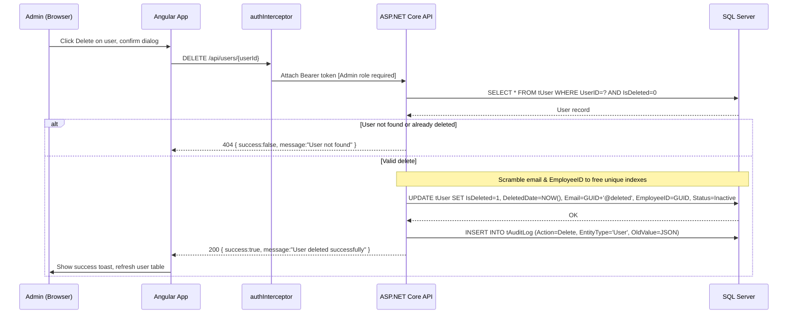
```mermaid
sequenceDiagram
    participant U as Admin (Browser)
    participant A as Angular App
    participant INT as authInterceptor
    participant API as ASP.NET Core API
    participant DB as SQL Server

    U->>A: Click Delete on user, confirm dialog
    A->>INT: DELETE /api/users/{userId}
    INT->>API: Attach Bearer token [Admin role required]
    API->>DB: SELECT * FROM tUser WHERE UserID=? AND IsDeleted=0
    DB-->>API: User record

    alt User not found or already deleted
        API-->>A: 404 { success:false, message:"User not found" }
    else Valid delete
        Note over API,DB: Scramble email & EmployeeID to free unique indexes
        API->>DB: UPDATE tUser SET IsDeleted=1, DeletedDate=NOW(), Email=GUID+'@deleted', EmployeeID=GUID, Status=Inactive
        DB-->>API: OK
        API->>DB: INSERT INTO tAuditLog (Action=Delete, EntityType='User', OldValue=JSON)
        API-->>A: 200 { success:true, message:"User deleted successfully" }
        A->>U: Show success toast, refresh user table
    end
```

---

## 10. Budget — List Budgets (Role-Based)

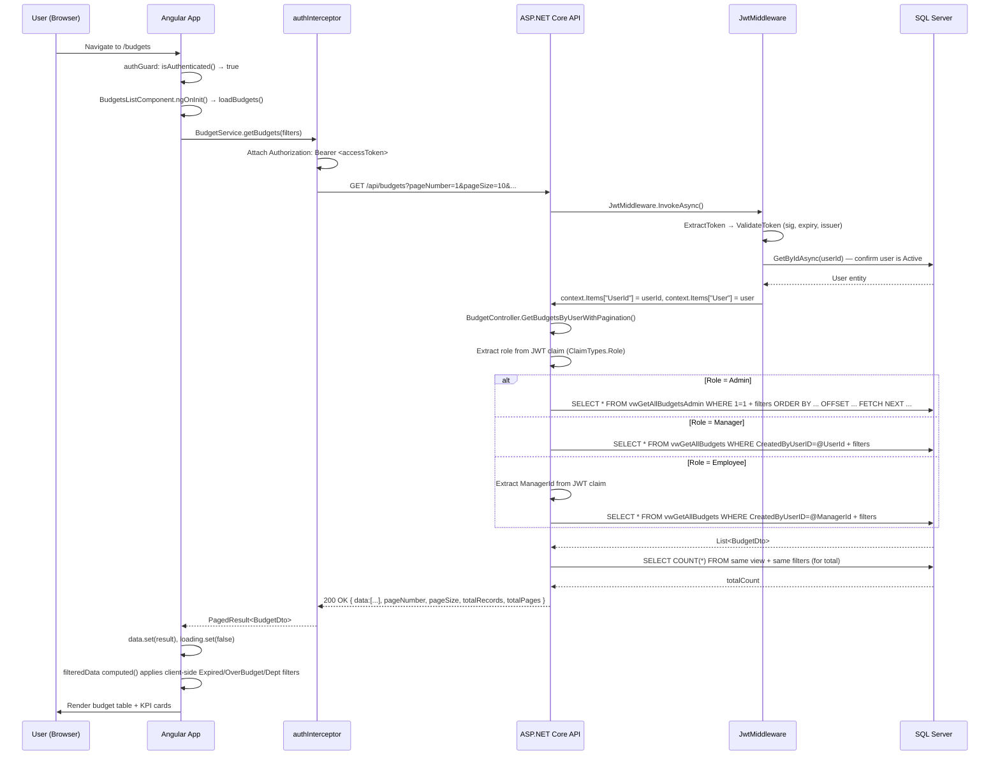
```mermaid
sequenceDiagram
    participant U as User (Browser)
    participant A as Angular App
    participant INT as authInterceptor
    participant API as ASP.NET Core API
    participant MW as JwtMiddleware
    participant DB as SQL Server

    U->>A: Navigate to /budgets
    A->>A: authGuard: isAuthenticated() → true
    A->>A: BudgetsListComponent.ngOnInit() → loadBudgets()
    A->>INT: BudgetService.getBudgets(filters)
    INT->>INT: Attach Authorization: Bearer <accessToken>
    INT->>API: GET /api/budgets?pageNumber=1&pageSize=10&...
    API->>MW: JwtMiddleware.InvokeAsync()
    MW->>MW: ExtractToken → ValidateToken (sig, expiry, issuer)
    MW->>DB: GetByIdAsync(userId) — confirm user is Active
    DB-->>MW: User entity
    MW->>API: context.Items["UserId"] = userId, context.Items["User"] = user

    API->>API: BudgetController.GetBudgetsByUserWithPagination()
    API->>API: Extract role from JWT claim (ClaimTypes.Role)

    alt Role = Admin
        API->>DB: SELECT * FROM vwGetAllBudgetsAdmin WHERE 1=1 + filters ORDER BY ... OFFSET ... FETCH NEXT ...
    else Role = Manager
        API->>DB: SELECT * FROM vwGetAllBudgets WHERE CreatedByUserID=@UserId + filters
    else Role = Employee
        API->>API: Extract ManagerId from JWT claim
        API->>DB: SELECT * FROM vwGetAllBudgets WHERE CreatedByUserID=@ManagerId + filters
    end

    DB-->>API: List<BudgetDto>
    API->>DB: SELECT COUNT(*) FROM same view + same filters (for total)
    DB-->>API: totalCount
    API-->>INT: 200 OK { data:[...], pageNumber, pageSize, totalRecords, totalPages }
    INT-->>A: PagedResult<BudgetDto>
    A->>A: data.set(result), loading.set(false)
    A->>A: filteredData computed() applies client-side Expired/OverBudget/Dept filters
    A->>U: Render budget table + KPI cards
```

---

## 11. Budget — Create Budget

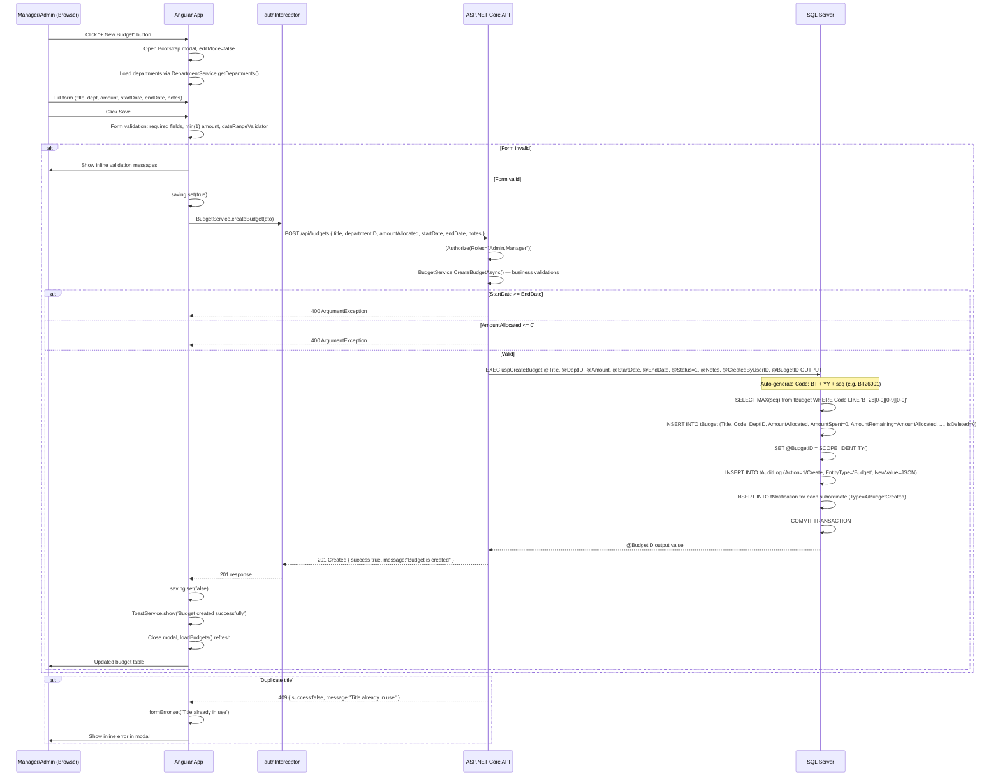
```mermaid
sequenceDiagram
    participant U as Manager/Admin (Browser)
    participant A as Angular App
    participant INT as authInterceptor
    participant API as ASP.NET Core API
    participant DB as SQL Server

    U->>A: Click "+ New Budget" button
    A->>A: Open Bootstrap modal, editMode=false
    A->>A: Load departments via DepartmentService.getDepartments()
    U->>A: Fill form (title, dept, amount, startDate, endDate, notes)
    U->>A: Click Save
    A->>A: Form validation: required fields, min(1) amount, dateRangeValidator
    alt Form invalid
        A->>U: Show inline validation messages
    else Form valid
        A->>A: saving.set(true)
        A->>INT: BudgetService.createBudget(dto)
        INT->>API: POST /api/budgets { title, departmentID, amountAllocated, startDate, endDate, notes }
        API->>API: [Authorize(Roles="Admin,Manager")]
        API->>API: BudgetService.CreateBudgetAsync() — business validations
        alt StartDate >= EndDate
            API-->>A: 400 ArgumentException
        else AmountAllocated <= 0
            API-->>A: 400 ArgumentException
        else Valid
            API->>DB: EXEC uspCreateBudget @Title, @DeptID, @Amount, @StartDate, @EndDate, @Status=1, @Notes, @CreatedByUserID, @BudgetID OUTPUT

            Note over DB: Auto-generate Code: BT + YY + seq (e.g. BT26001)
            DB->>DB: SELECT MAX(seq) from tBudget WHERE Code LIKE 'BT26[0-9][0-9][0-9]'
            DB->>DB: INSERT INTO tBudget (Title, Code, DeptID, AmountAllocated, AmountSpent=0, AmountRemaining=AmountAllocated, ..., IsDeleted=0)
            DB->>DB: SET @BudgetID = SCOPE_IDENTITY()
            DB->>DB: INSERT INTO tAuditLog (Action=1/Create, EntityType='Budget', NewValue=JSON)
            DB->>DB: INSERT INTO tNotification for each subordinate (Type=4/BudgetCreated)
            DB->>DB: COMMIT TRANSACTION
            DB-->>API: @BudgetID output value

            API-->>INT: 201 Created { success:true, message:"Budget is created" }
            INT-->>A: 201 response
            A->>A: saving.set(false)
            A->>A: ToastService.show('Budget created successfully')
            A->>A: Close modal, loadBudgets() refresh
            A->>U: Updated budget table
        end
    end

    alt Duplicate title
        API-->>A: 409 { success:false, message:"Title already in use" }
        A->>A: formError.set('Title already in use')
        A->>U: Show inline error in modal
    end
```

---

## 12. Budget — Update Budget

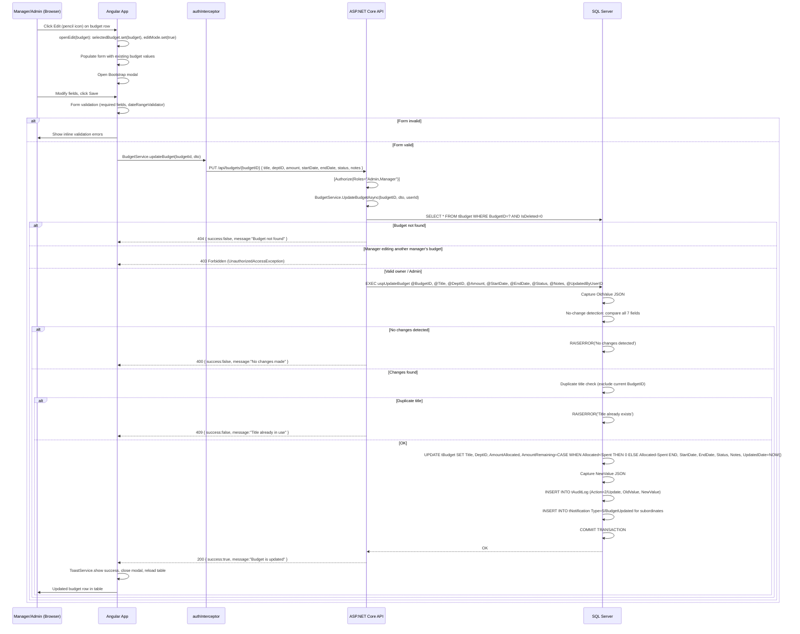
```mermaid
sequenceDiagram
    participant U as Manager/Admin (Browser)
    participant A as Angular App
    participant INT as authInterceptor
    participant API as ASP.NET Core API
    participant DB as SQL Server

    U->>A: Click Edit (pencil icon) on budget row
    A->>A: openEdit(budget): selectedBudget.set(budget), editMode.set(true)
    A->>A: Populate form with existing budget values
    A->>A: Open Bootstrap modal
    U->>A: Modify fields, click Save
    A->>A: Form validation (required fields, dateRangeValidator)
    alt Form invalid
        A->>U: Show inline validation errors
    else Form valid
        A->>INT: BudgetService.updateBudget(budgetId, dto)
        INT->>API: PUT /api/budgets/{budgetID} { title, deptID, amount, startDate, endDate, status, notes }
        API->>API: [Authorize(Roles="Admin,Manager")]
        API->>API: BudgetService.UpdateBudgetAsync(budgetID, dto, userId)
        API->>DB: SELECT * FROM tBudget WHERE BudgetID=? AND IsDeleted=0

        alt Budget not found
            API-->>A: 404 { success:false, message:"Budget not found" }
        else Manager editing another manager's budget
            API-->>A: 403 Forbidden (UnauthorizedAccessException)
        else Valid owner / Admin
            API->>DB: EXEC uspUpdateBudget @BudgetID, @Title, @DeptID, @Amount, @StartDate, @EndDate, @Status, @Notes, @UpdatedByUserID
            DB->>DB: Capture OldValue JSON
            DB->>DB: No-change detection: compare all 7 fields
            alt No changes detected
                DB->>DB: RAISERROR('No changes detected')
                API-->>A: 400 { success:false, message:"No changes made" }
            else Changes found
                DB->>DB: Duplicate title check (exclude current BudgetID)
                alt Duplicate title
                    DB->>DB: RAISERROR('Title already exists')
                    API-->>A: 409 { success:false, message:"Title already in use" }
                else OK
                    DB->>DB: UPDATE tBudget SET Title, DeptID, AmountAllocated, AmountRemaining=CASE WHEN Allocated<Spent THEN 0 ELSE Allocated-Spent END, StartDate, EndDate, Status, Notes, UpdatedDate=NOW()
                    DB->>DB: Capture NewValue JSON
                    DB->>DB: INSERT INTO tAuditLog (Action=2/Update, OldValue, NewValue)
                    DB->>DB: INSERT INTO tNotification Type=5/BudgetUpdated for subordinates
                    DB->>DB: COMMIT TRANSACTION
                    DB-->>API: OK
                    API-->>A: 200 { success:true, message:"Budget is updated" }
                    A->>A: ToastService.show success, close modal, reload table
                    A->>U: Updated budget row in table
                end
            end
        end
    end
```

---

## 13. Budget — Soft Delete Budget

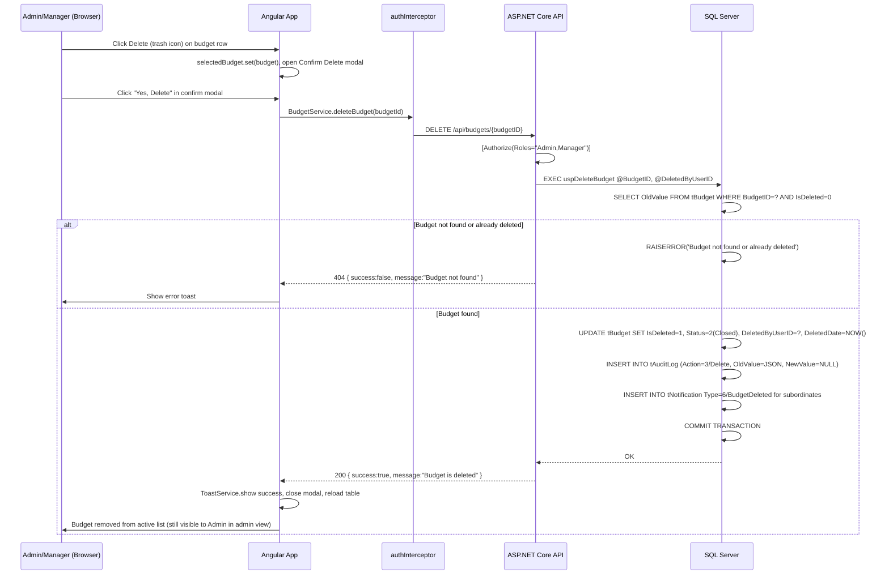
```mermaid
sequenceDiagram
    participant U as Admin/Manager (Browser)
    participant A as Angular App
    participant INT as authInterceptor
    participant API as ASP.NET Core API
    participant DB as SQL Server

    U->>A: Click Delete (trash icon) on budget row
    A->>A: selectedBudget.set(budget), open Confirm Delete modal
    U->>A: Click "Yes, Delete" in confirm modal
    A->>INT: BudgetService.deleteBudget(budgetId)
    INT->>API: DELETE /api/budgets/{budgetID}
    API->>API: [Authorize(Roles="Admin,Manager")]
    API->>DB: EXEC uspDeleteBudget @BudgetID, @DeletedByUserID
    DB->>DB: SELECT OldValue FROM tBudget WHERE BudgetID=? AND IsDeleted=0

    alt Budget not found or already deleted
        DB->>DB: RAISERROR('Budget not found or already deleted')
        API-->>A: 404 { success:false, message:"Budget not found" }
        A->>U: Show error toast
    else Budget found
        DB->>DB: UPDATE tBudget SET IsDeleted=1, Status=2(Closed), DeletedByUserID=?, DeletedDate=NOW()
        DB->>DB: INSERT INTO tAuditLog (Action=3/Delete, OldValue=JSON, NewValue=NULL)
        DB->>DB: INSERT INTO tNotification Type=6/BudgetDeleted for subordinates
        DB->>DB: COMMIT TRANSACTION
        DB-->>API: OK
        API-->>A: 200 { success:true, message:"Budget is deleted" }
        A->>A: ToastService.show success, close modal, reload table
        A->>U: Budget removed from active list (still visible to Admin in admin view)
    end
```

---

## 14. Expense — Submit Expense (Employee)

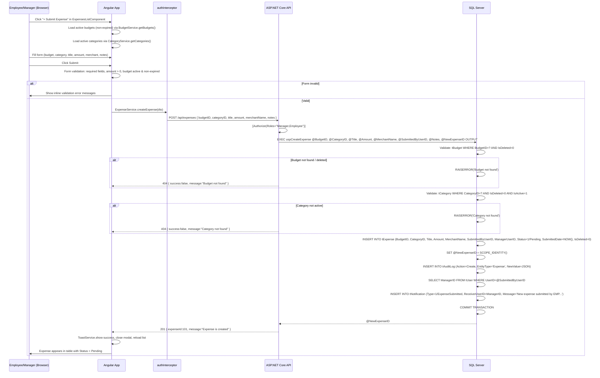
```mermaid
sequenceDiagram
    participant U as Employee/Manager (Browser)
    participant A as Angular App
    participant INT as authInterceptor
    participant API as ASP.NET Core API
    participant DB as SQL Server

    U->>A: Click "+ Submit Expense" in ExpensesListComponent
    A->>A: Load active budgets (non-expired) via BudgetService.getBudgets()
    A->>A: Load active categories via CategoryService.getCategories()
    U->>A: Fill form (budget, category, title, amount, merchant, notes)
    U->>A: Click Submit

    A->>A: Form validation: required fields, amount > 0, budget active & non-expired
    alt Form invalid
        A->>U: Show inline validation error messages
    else Valid
        A->>INT: ExpenseService.createExpense(dto)
        INT->>API: POST /api/expenses { budgetID, categoryID, title, amount, merchantName, notes }
        API->>API: [Authorize(Roles="Manager,Employee")]
        API->>DB: EXEC uspCreateExpense @BudgetID, @CategoryID, @Title, @Amount, @MerchantName, @SubmittedByUserID, @Notes, @NewExpenseID OUTPUT

        DB->>DB: Validate: tBudget WHERE BudgetID=? AND IsDeleted=0
        alt Budget not found / deleted
            DB->>DB: RAISERROR('Budget not found')
            API-->>A: 404 { success:false, message:"Budget not found" }
        end

        DB->>DB: Validate: tCategory WHERE CategoryID=? AND IsDeleted=0 AND IsActive=1
        alt Category not active
            DB->>DB: RAISERROR('Category not found')
            API-->>A: 404 { success:false, message:"Category not found" }
        end

        DB->>DB: INSERT INTO tExpense (BudgetID, CategoryID, Title, Amount, MerchantName, SubmittedByUserID, ManagerUserID, Status=1/Pending, SubmittedDate=NOW(), IsDeleted=0)
        DB->>DB: SET @NewExpenseID = SCOPE_IDENTITY()
        DB->>DB: INSERT INTO tAuditLog (Action=Create, EntityType='Expense', NewValue=JSON)
        DB->>DB: SELECT ManagerID FROM tUser WHERE UserID=@SubmittedByUserID
        DB->>DB: INSERT INTO tNotification (Type=1/ExpenseSubmitted, ReceiverUserID=ManagerID, Message='New expense submitted by EMP...')
        DB->>DB: COMMIT TRANSACTION
        DB-->>API: @NewExpenseID

        API-->>A: 201 { expenseId:101, message:"Expense is created" }
        A->>A: ToastService.show success, close modal, reload list
        A->>U: Expense appears in table with Status = Pending
    end
```

---

## 15. Expense — Approve Expense (Manager)

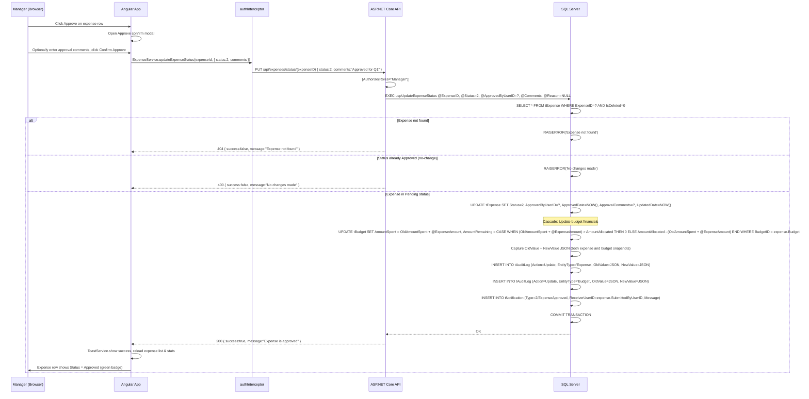
```mermaid
sequenceDiagram
    participant U as Manager (Browser)
    participant A as Angular App
    participant INT as authInterceptor
    participant API as ASP.NET Core API
    participant DB as SQL Server

    U->>A: Click Approve on expense row
    A->>A: Open Approve confirm modal
    U->>A: Optionally enter approval comments, click Confirm Approve
    A->>INT: ExpenseService.updateExpenseStatus(expenseId, { status:2, comments })
    INT->>API: PUT /api/expenses/status/{expenseID} { status:2, comments:"Approved for Q1" }
    API->>API: [Authorize(Roles="Manager")]
    API->>DB: EXEC uspUpdateExpenseStatus @ExpenseID, @Status=2, @ApprovedByUserID=?, @Comments, @Reason=NULL

    DB->>DB: SELECT * FROM tExpense WHERE ExpenseID=? AND IsDeleted=0
    alt Expense not found
        DB->>DB: RAISERROR('Expense not found')
        API-->>A: 404 { success:false, message:"Expense not found" }
    else Status already Approved (no-change)
        DB->>DB: RAISERROR('No changes made')
        API-->>A: 400 { success:false, message:"No changes made" }
    else Expense in Pending status
        DB->>DB: UPDATE tExpense SET Status=2, ApprovedByUserID=?, ApprovedDate=NOW(), ApprovalComments=?, UpdatedDate=NOW()
        Note over DB: Cascade: Update budget financials
        DB->>DB: UPDATE tBudget SET AmountSpent = OldAmountSpent + @ExpenseAmount, AmountRemaining = CASE WHEN (OldAmountSpent + @ExpenseAmount) > AmountAllocated THEN 0 ELSE AmountAllocated - (OldAmountSpent + @ExpenseAmount) END WHERE BudgetID = expense.BudgetID
        DB->>DB: Capture OldValue + NewValue JSON (both expense and budget snapshots)
        DB->>DB: INSERT INTO tAuditLog (Action=Update, EntityType='Expense', OldValue=JSON, NewValue=JSON)
        DB->>DB: INSERT INTO tAuditLog (Action=Update, EntityType='Budget', OldValue=JSON, NewValue=JSON)
        DB->>DB: INSERT INTO tNotification (Type=2/ExpenseApproved, ReceiverUserID=expense.SubmittedByUserID, Message)
        DB->>DB: COMMIT TRANSACTION
        DB-->>API: OK
        API-->>A: 200 { success:true, message:"Expense is approved" }
        A->>A: ToastService.show success, reload expense list & stats
        A->>U: Expense row shows Status = Approved (green badge)
    end
```

---

## 16. Expense — Reject Expense (Manager)

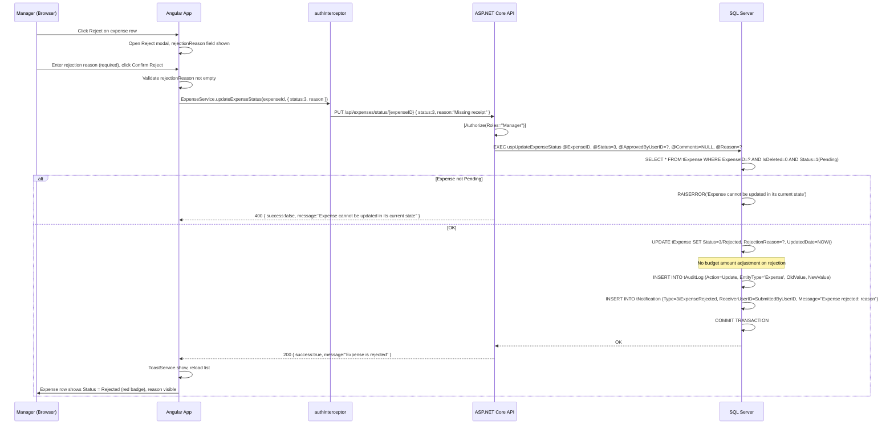
```mermaid
sequenceDiagram
    participant U as Manager (Browser)
    participant A as Angular App
    participant INT as authInterceptor
    participant API as ASP.NET Core API
    participant DB as SQL Server

    U->>A: Click Reject on expense row
    A->>A: Open Reject modal, rejectionReason field shown
    U->>A: Enter rejection reason (required), click Confirm Reject
    A->>A: Validate rejectionReason not empty
    A->>INT: ExpenseService.updateExpenseStatus(expenseId, { status:3, reason })
    INT->>API: PUT /api/expenses/status/{expenseID} { status:3, reason:"Missing receipt" }
    API->>API: [Authorize(Roles="Manager")]
    API->>DB: EXEC uspUpdateExpenseStatus @ExpenseID, @Status=3, @ApprovedByUserID=?, @Comments=NULL, @Reason=?

    DB->>DB: SELECT * FROM tExpense WHERE ExpenseID=? AND IsDeleted=0 AND Status=1(Pending)
    alt Expense not Pending
        DB->>DB: RAISERROR('Expense cannot be updated in its current state')
        API-->>A: 400 { success:false, message:"Expense cannot be updated in its current state" }
    else OK
        DB->>DB: UPDATE tExpense SET Status=3/Rejected, RejectionReason=?, UpdatedDate=NOW()
        Note over DB: No budget amount adjustment on rejection
        DB->>DB: INSERT INTO tAuditLog (Action=Update, EntityType='Expense', OldValue, NewValue)
        DB->>DB: INSERT INTO tNotification (Type=3/ExpenseRejected, ReceiverUserID=SubmittedByUserID, Message="Expense rejected: reason")
        DB->>DB: COMMIT TRANSACTION
        DB-->>API: OK
        API-->>A: 200 { success:true, message:"Expense is rejected" }
        A->>A: ToastService.show, reload list
        A->>U: Expense row shows Status = Rejected (red badge), reason visible
    end
```

---

## 17. Expense — List Expenses

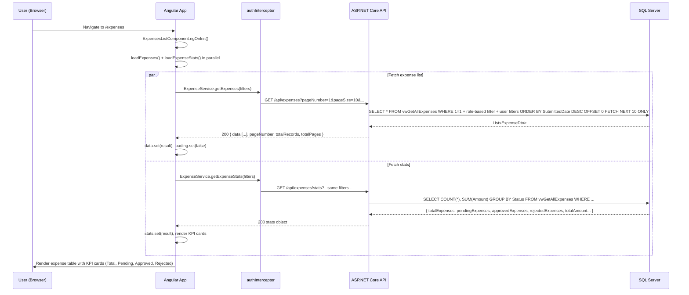
```mermaid
sequenceDiagram
    participant U as User (Browser)
    participant A as Angular App
    participant INT as authInterceptor
    participant API as ASP.NET Core API
    participant DB as SQL Server

    U->>A: Navigate to /expenses
    A->>A: ExpensesListComponent.ngOnInit()
    A->>A: loadExpenses() + loadExpenseStats() in parallel

    par Fetch expense list
        A->>INT: ExpenseService.getExpenses(filters)
        INT->>API: GET /api/expenses?pageNumber=1&pageSize=10&...
        API->>DB: SELECT * FROM vwGetAllExpenses WHERE 1=1 + role-based filter + user filters ORDER BY SubmittedDate DESC OFFSET 0 FETCH NEXT 10 ONLY
        DB-->>API: List<ExpenseDto>
        API-->>A: 200 { data:[...], pageNumber, totalRecords, totalPages }
        A->>A: data.set(result), loading.set(false)
    and Fetch stats
        A->>INT: ExpenseService.getExpenseStats(filters)
        INT->>API: GET /api/expenses/stats?...same filters...
        API->>DB: SELECT COUNT(*), SUM(Amount) GROUP BY Status FROM vwGetAllExpenses WHERE ...
        DB-->>API: { totalExpenses, pendingExpenses, approvedExpenses, rejectedExpenses, totalAmount... }
        API-->>A: 200 stats object
        A->>A: stats.set(result), render KPI cards
    end

    A->>U: Render expense table with KPI cards (Total, Pending, Approved, Rejected)
```

---

## 18. Category — Create Category

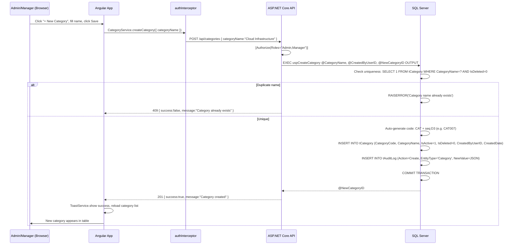
```mermaid
sequenceDiagram
    participant U as Admin/Manager (Browser)
    participant A as Angular App
    participant INT as authInterceptor
    participant API as ASP.NET Core API
    participant DB as SQL Server

    U->>A: Click "+ New Category", fill name, click Save
    A->>INT: CategoryService.createCategory({ categoryName })
    INT->>API: POST /api/categories { categoryName:"Cloud Infrastructure" }
    API->>API: [Authorize(Roles="Admin,Manager")]
    API->>DB: EXEC uspCreateCategory @CategoryName, @CreatedByUserID, @NewCategoryID OUTPUT

    DB->>DB: Check uniqueness: SELECT 1 FROM tCategory WHERE CategoryName=? AND IsDeleted=0
    alt Duplicate name
        DB->>DB: RAISERROR('Category name already exists')
        API-->>A: 409 { success:false, message:"Category already exists" }
    else Unique
        DB->>DB: Auto-generate code: CAT + seq:D3 (e.g. CAT007)
        DB->>DB: INSERT INTO tCategory (CategoryCode, CategoryName, IsActive=1, IsDeleted=0, CreatedByUserID, CreatedDate)
        DB->>DB: INSERT INTO tAuditLog (Action=Create, EntityType='Category', NewValue=JSON)
        DB->>DB: COMMIT TRANSACTION
        DB-->>API: @NewCategoryID
        API-->>A: 201 { success:true, message:"Category created" }
        A->>A: ToastService.show success, reload category list
        A->>U: New category appears in table
    end
```

---

## 19. Category — Update Category

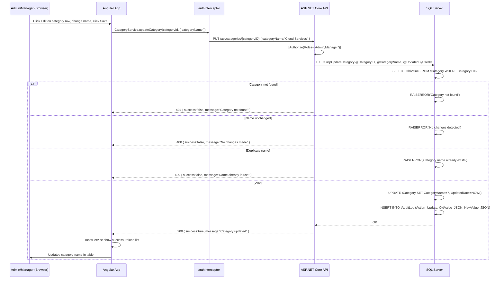
```mermaid
sequenceDiagram
    participant U as Admin/Manager (Browser)
    participant A as Angular App
    participant INT as authInterceptor
    participant API as ASP.NET Core API
    participant DB as SQL Server

    U->>A: Click Edit on category row, change name, click Save
    A->>INT: CategoryService.updateCategory(categoryId, { categoryName })
    INT->>API: PUT /api/categories/{categoryID} { categoryName:"Cloud Services" }
    API->>API: [Authorize(Roles="Admin,Manager")]
    API->>DB: EXEC uspUpdateCategory @CategoryID, @CategoryName, @UpdatedByUserID

    DB->>DB: SELECT OldValue FROM tCategory WHERE CategoryID=?
    alt Category not found
        DB->>DB: RAISERROR('Category not found')
        API-->>A: 404 { success:false, message:"Category not found" }
    else Name unchanged
        DB->>DB: RAISERROR('No changes detected')
        API-->>A: 400 { success:false, message:"No changes made" }
    else Duplicate name
        DB->>DB: RAISERROR('Category name already exists')
        API-->>A: 409 { success:false, message:"Name already in use" }
    else Valid
        DB->>DB: UPDATE tCategory SET CategoryName=?, UpdatedDate=NOW()
        DB->>DB: INSERT INTO tAuditLog (Action=Update, OldValue=JSON, NewValue=JSON)
        DB-->>API: OK
        API-->>A: 200 { success:true, message:"Category updated" }
        A->>A: ToastService.show success, reload list
        A->>U: Updated category name in table
    end
```

---

## 20. Department — Create Department

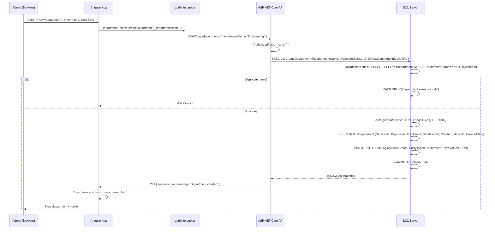
```mermaid
sequenceDiagram
    participant U as Admin (Browser)
    participant A as Angular App
    participant INT as authInterceptor
    participant API as ASP.NET Core API
    participant DB as SQL Server

    U->>A: Click "+ New Department", enter name, click Save
    A->>INT: DepartmentService.createDepartment({ departmentName })
    INT->>API: POST /api/departments { departmentName:"Engineering" }
    API->>API: [Authorize(Roles="Admin")]
    API->>DB: EXEC uspCreateDepartment @DepartmentName, @CreatedByUserID, @NewDepartmentID OUTPUT

    DB->>DB: Uniqueness check: SELECT 1 FROM tDepartment WHERE DepartmentName=? AND IsDeleted=0
    alt Duplicate name
        DB->>DB: RAISERROR('Department already exists')
        API-->>A: 409 Conflict
    else Unique
        DB->>DB: Auto-generate code: DEPT + seq:D3 (e.g. DEPT003)
        DB->>DB: INSERT INTO tDepartment (DeptCode, DeptName, IsActive=1, IsDeleted=0, CreatedByUserID, CreatedDate)
        DB->>DB: INSERT INTO tAuditLog (Action=Create, EntityType='Department', NewValue=JSON)
        DB->>DB: COMMIT TRANSACTION
        DB-->>API: @NewDepartmentID
        API-->>A: 201 { success:true, message:"Department created" }
        A->>A: ToastService.show success, reload list
        A->>U: New department in table
    end
```

---

## 21. Department — Update Department

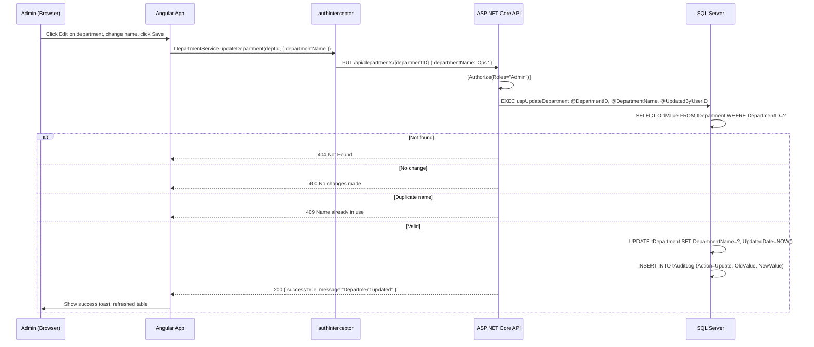
```mermaid
sequenceDiagram
    participant U as Admin (Browser)
    participant A as Angular App
    participant INT as authInterceptor
    participant API as ASP.NET Core API
    participant DB as SQL Server

    U->>A: Click Edit on department, change name, click Save
    A->>INT: DepartmentService.updateDepartment(deptId, { departmentName })
    INT->>API: PUT /api/departments/{departmentID} { departmentName:"Ops" }
    API->>API: [Authorize(Roles="Admin")]
    API->>DB: EXEC uspUpdateDepartment @DepartmentID, @DepartmentName, @UpdatedByUserID

    DB->>DB: SELECT OldValue FROM tDepartment WHERE DepartmentID=?
    alt Not found
        API-->>A: 404 Not Found
    else No change
        API-->>A: 400 No changes made
    else Duplicate name
        API-->>A: 409 Name already in use
    else Valid
        DB->>DB: UPDATE tDepartment SET DepartmentName=?, UpdatedDate=NOW()
        DB->>DB: INSERT INTO tAuditLog (Action=Update, OldValue, NewValue)
        API-->>A: 200 { success:true, message:"Department updated" }
        A->>U: Show success toast, refreshed table
    end
```

---

## 22. Notification — Fetch Notifications

```mermaid
sequenceDiagram
    participant U as User (Browser)
    participant A as Angular App
    participant INT as authInterceptor
    participant API as ASP.NET Core API
    participant DB as SQL Server

    U->>A: Click notification bell icon or navigate to /notifications
    A->>INT: NotificationService.getNotifications({ pageNumber:1, pageSize:10 })
    INT->>API: GET /api/notifications?pageNumber=1&pageSize=10&status=Unread
    API->>API: [Authorize] — extract UserId from JWT
    API->>DB: EXEC uspGetNotificationsByReceiverUserId @ReceiverUserID=?, @PageNumber=1, @PageSize=10, @Status=Unread, @SortOrder=desc

    DB->>DB: SELECT * FROM tNotification WHERE ReceiverUserID=? AND Status=1(Unread) AND IsDeleted=0 ORDER BY CreatedDate DESC OFFSET ... FETCH NEXT ...
    DB->>DB: SELECT COUNT(*) for total
    DB-->>API: Paginated notification list + total

    API-->>A: 200 { data:[{notificationID, type, message, status, createdDate,...}], pageNumber, totalRecords }
    A->>A: notifications.set(result)
    A->>U: Render notification panel with unread count badge
```

---

## 23. Notification — Mark as Read

```mermaid
sequenceDiagram
    participant U as User (Browser)
    participant A as Angular App
    participant INT as authInterceptor
    participant API as ASP.NET Core API
    participant DB as SQL Server

    U->>A: Click single notification to open/read it
    A->>INT: NotificationService.markAsRead(notificationId)
    INT->>API: PUT /api/notifications/read/{notificationID}
    API->>API: [Authorize] — extract UserId from JWT
    API->>DB: EXEC uspMarkNotificationAsRead @NotificationID=?, @ReceiverUserID=?

    DB->>DB: SELECT * FROM tNotification WHERE NotificationID=? AND ReceiverUserID=? AND IsDeleted=0
    alt Not found / not owned by user
        DB->>DB: RAISERROR('Notification not found')
        API-->>A: 404 Not Found
    else Already read
        API-->>A: 400 No changes made
    else Unread
        DB->>DB: UPDATE tNotification SET Status=2(Read), ReadDate=NOW()
        DB-->>API: OK
        API-->>A: 200 { success:true, message:"Notification marked as read" }
        A->>A: unreadCount -= 1, update notification badge
        A->>U: Notification item shows as read (greyed out)
    end
```

---

## 24. Notification — Mark All as Read

```mermaid
sequenceDiagram
    participant U as User (Browser)
    participant A as Angular App
    participant INT as authInterceptor
    participant API as ASP.NET Core API
    participant DB as SQL Server

    U->>A: Click "Mark all as read" button
    A->>INT: NotificationService.markAllAsRead()
    INT->>API: PUT /api/notifications/readAll
    API->>API: [Authorize] — extract UserId from JWT
    API->>DB: EXEC uspMarkAllNotificationsAsRead @ReceiverUserID=?
    DB->>DB: UPDATE tNotification SET Status=2(Read), ReadDate=NOW() WHERE ReceiverUserID=? AND Status=1(Unread) AND IsDeleted=0
    DB-->>API: RowsAffected
    API-->>A: 200 { success:true, message:"All notifications marked as read" }
    A->>A: unreadCount.set(0), reload notification list
    A->>U: Notification bell badge clears, all items appear read
```

---

## 25. Reports — Period Report

```mermaid
sequenceDiagram
    participant U as Admin/Manager (Browser)
    participant A as Angular App
    participant INT as authInterceptor
    participant API as ASP.NET Core API
    participant DB as SQL Server

    U->>A: Navigate to /reports, select Period tab
    U->>A: Set StartDate + EndDate, click Generate
    A->>INT: ReportService.getPeriodReport({ startDate, endDate })
    INT->>API: GET /api/reports/period?startDate=2026-01-01&endDate=2026-03-31
    API->>API: [Authorize(Roles="Admin,Manager")]
    API->>DB: EXEC uspGetPeriodReport @StartDate, @EndDate

    DB->>DB: SELECT budgets + SUM(approved expenses) WHERE StartDate >= @StartDate AND EndDate <= @EndDate
    DB-->>API: PeriodReportDto [ { budgetCode, title, dept, allocated, spent, remaining, utilPct, expenseCount } ]

    API-->>A: 200 { data:[...], generatedDate, totalAllocated, totalSpent }
    A->>A: Render Chart.js bar chart (Budget vs Spent per budget)
    A->>A: Render summary table with utilization percentages
    A->>U: Period report with chart + table displayed
```

---

## 26. Reports — Department Report

```mermaid
sequenceDiagram
    participant U as Admin/Manager (Browser)
    participant A as Angular App
    participant INT as authInterceptor
    participant API as ASP.NET Core API
    participant DB as SQL Server

    U->>A: Select Department tab in Reports, pick department, click Generate
    A->>INT: ReportService.getDepartmentReport({ departmentName })
    INT->>API: GET /api/reports/department?departmentName=Engineering
    API->>API: [Authorize(Roles="Admin,Manager")]
    API->>DB: EXEC uspGetDepartmentReport @DepartmentName

    DB->>DB: SELECT dept-level budget totals + approved expense aggregates WHERE DepartmentName LIKE ?
    DB-->>API: DepartmentReportDto [ { departmentName, totalBudgets, totalAllocated, totalSpent, totalRemaining, utilPct, expenseCount } ]

    API-->>A: 200 { data:[...] }
    A->>A: Render doughnut chart (spent vs remaining per dept)
    A->>A: Render department breakdown table
    A->>U: Department report with charts displayed
```

---

## 27. Reports — Budget Report

```mermaid
sequenceDiagram
    participant U as User (Browser)
    participant A as Angular App
    participant INT as authInterceptor
    participant API as ASP.NET Core API
    participant DB as SQL Server

    U->>A: Select Budget tab in Reports, search/pick a budget code, click Generate
    A->>INT: ReportService.getBudgetReport({ budgetCode })
    INT->>API: GET /api/reports/budget?budgetCode=BT26001
    API->>API: [Authorize]
    API->>DB: EXEC uspGetBudgetReport @BudgetCode

    DB->>DB: SELECT b.*, d.DepartmentName, u.ManagerName FROM tBudget b WHERE Code=@BudgetCode
    DB->>DB: SELECT e.*, c.CategoryName, eu.SubmitterName FROM tExpense e WHERE BudgetID=b.BudgetID GROUP BY Category
    DB-->>API: BudgetReportDto { budget:{...}, expenses:[{...}], categoryBreakdown:[{...}], utilizationPct }

    API-->>A: 200 { data: BudgetReportDto }
    A->>A: Render budget header (code, dept, manager, dates, utilization bar)
    A->>A: Render Chart.js pie (expense distribution by category)
    A->>A: Render expenses breakdown table
    A->>U: Single-budget detailed report displayed
```

---

## 28. Audit — Fetch Audit Logs

```mermaid
sequenceDiagram
    participant U as Admin (Browser)
    participant A as Angular App
    participant INT as authInterceptor
    participant API as ASP.NET Core API
    participant DB as SQL Server

    U->>A: Navigate to /audits
    A->>A: AuditListComponent.ngOnInit() → loadAuditLogs()
    A->>INT: AuditService.getAuditLogs(filters)
    INT->>API: GET /api/audits?pageNumber=1&pageSize=10&entityType=Budget&...
    API->>API: [Authorize(Roles="Admin")]
    API->>DB: SELECT * FROM tAuditLog JOIN tUser ON tAuditLog.UserID = tUser.UserID WHERE 1=1 + filters ORDER BY CreatedDate DESC OFFSET ... FETCH NEXT ...
    DB-->>API: List<AuditLogDto> { auditLogID, userID, userName, entityType, entityID, action, oldValue, newValue, description, createdDate }
    API-->>A: 200 { data:[...], pageNumber, totalRecords }
    A->>A: data.set(result), render audit table
    U->>A: Click row to expand — see OldValue vs NewValue JSON diff
    A->>U: Expandable audit detail with JSON diff shown
```

---

## 29. Dashboard — Load KPI & Charts

```mermaid
sequenceDiagram
    participant U as User (Browser)
    participant A as Angular App
    participant INT as authInterceptor
    participant API as ASP.NET Core API
    participant DB as SQL Server

    U->>A: Navigate to /dashboard
    A->>A: DashboardComponent.ngOnInit()
    Note over A: Parallel HTTP calls for all dashboard data

    par Budget KPIs
        A->>INT: BudgetService.getBudgets({ pageSize:500 })
        INT->>API: GET /api/budgets?pageSize=500
        API->>DB: SELECT * FROM vwGetAllBudgets (role-scoped)
        DB-->>API: Budget list with AmountAllocated, AmountSpent, UtilizationPct
        API-->>A: 200 Budget list
        A->>A: Compute: totalBudgets, totalAllocated, totalSpent; sum amountRemaining from DB for totalRemaining (never negative)
    and Expense Stats
        A->>INT: ExpenseService.getExpenseStats()
        INT->>API: GET /api/expenses/stats
        API->>DB: SELECT COUNT(*), SUM(Amount) BY Status FROM vwGetAllExpenses
        DB-->>API: { totalExpenses, pending, approved, rejected, amounts... }
        API-->>A: 200 Stats
        A->>A: Render KPI cards: Total, Pending, Approved, Rejected
    and Chart Data
        A->>INT: BudgetService.getBudgets({ pageSize:10, sortBy:'CreatedDate' })
        INT->>API: GET /api/budgets?pageSize=10
        DB-->>API: Top 10 budgets
        API-->>A: 200
        A->>A: Render Chart.js bar chart: Budget Code vs Allocated/Spent
    end

    A->>U: Dashboard displayed with KPI cards + charts
```

---

## 30. Cross-Cutting — Notification Fanout on Budget Create

```mermaid
sequenceDiagram
    participant MGR as Manager
    participant DB as SQL Server (uspCreateBudget)
    participant EMP1 as Employee 1 (tNotification)
    participant EMP2 as Employee 2 (tNotification)
    participant APP as Angular App (next poll)

    Note over MGR,DB: During uspCreateBudget execution
    MGR->>DB: EXEC uspCreateBudget ...
    DB->>DB: INSERT INTO tBudget → BudgetID = 7

    DB->>DB: SELECT UserID FROM tUser WHERE ManagerID = @CreatedByUserID AND IsDeleted = 0
    DB-->>DB: [UserID=5 (EMP1), UserID=6 (EMP2)]

    DB->>EMP1: INSERT INTO tNotification (Type=4/BudgetCreated, ReceiverUserID=5, SenderUserID=MGR, Message='New Budget BT26007 - Q1 Ops Created', Status=1/Unread)
    DB->>EMP2: INSERT INTO tNotification (Type=4/BudgetCreated, ReceiverUserID=6, SenderUserID=MGR, Message='New Budget BT26007 - Q1 Ops Created', Status=1/Unread)
    DB->>DB: COMMIT TRANSACTION

    Note over APP: On next Angular notification poll (topbar badge refresh)
    APP->>DB: GET /api/notifications?status=Unread (for EMP1 session)
    DB-->>APP: { unreadCount:1, data:[{type:BudgetCreated, message:...}] }
    APP->>APP: notificationBadge.set(unreadCount)
    Note right of APP: Employee sees bell badge with unread count
```

---

*BudgetTrack Sequence Diagrams — Complete · v1.0 · Generated 2026-03-06*
