# BudgetTrack — Low Level Design (LLD)

> **Version:** 1.0 · **Stack:** ASP.NET Core 10 · EF Core 10 · SQL Server · Angular 21 · Bootstrap 5
> **Date:** 2026-03-06

---

## Table of Contents

1. [System Architecture Overview](#1-system-architecture-overview)
2. [Database Design](#2-database-design)
3. [Backend Layer Design](#3-backend-layer-design)
4. [Security & Middleware Design](#4-security--middleware-design)
5. [API Design & Conventions](#5-api-design--conventions)
6. [Frontend Architecture](#6-frontend-architecture)
7. [Data Flow Patterns](#7-data-flow-patterns)
8. [Error Handling Strategy](#8-error-handling-strategy)
9. [Design Patterns Used](#9-design-patterns-used)
10. [Dependency Injection Map](#10-dependency-injection-map)

---

## 1. System Architecture Overview

BudgetTrack is a **two-tier decoupled web application** — an Angular SPA frontend communicates with an ASP.NET Core REST API backend over HTTP/JSON. All persistence is via SQL Server using a mix of EF Core LINQ queries and raw Stored Procedures.

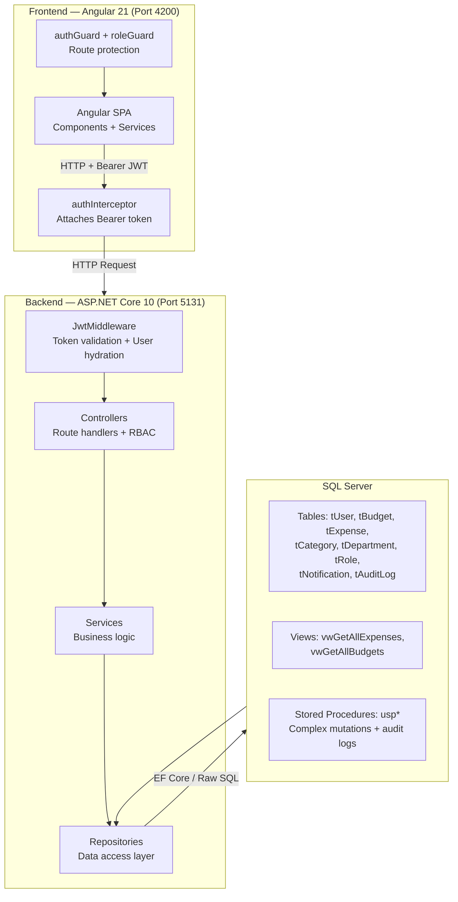

### Technology Stack

| Layer              | Technology                           | Version |
| ------------------ | ------------------------------------ | ------- |
| Frontend Framework | Angular                              | 21      |
| UI Styling         | Bootstrap                            | 5       |
| Charts             | Chart.js                             | —       |
| Backend Framework  | ASP.NET Core                         | 10      |
| ORM                | Entity Framework Core                | 10      |
| Database           | SQL Server                           | —       |
| Auth               | JWT Bearer (HMAC-SHA256)             | —       |
| Password Hashing   | ASP.NET Core Identity PasswordHasher | —       |
| API Documentation  | Swagger / OpenAPI                    | v3      |

---

## 2. Database Design

### 2.1 Entity Relationship Diagram

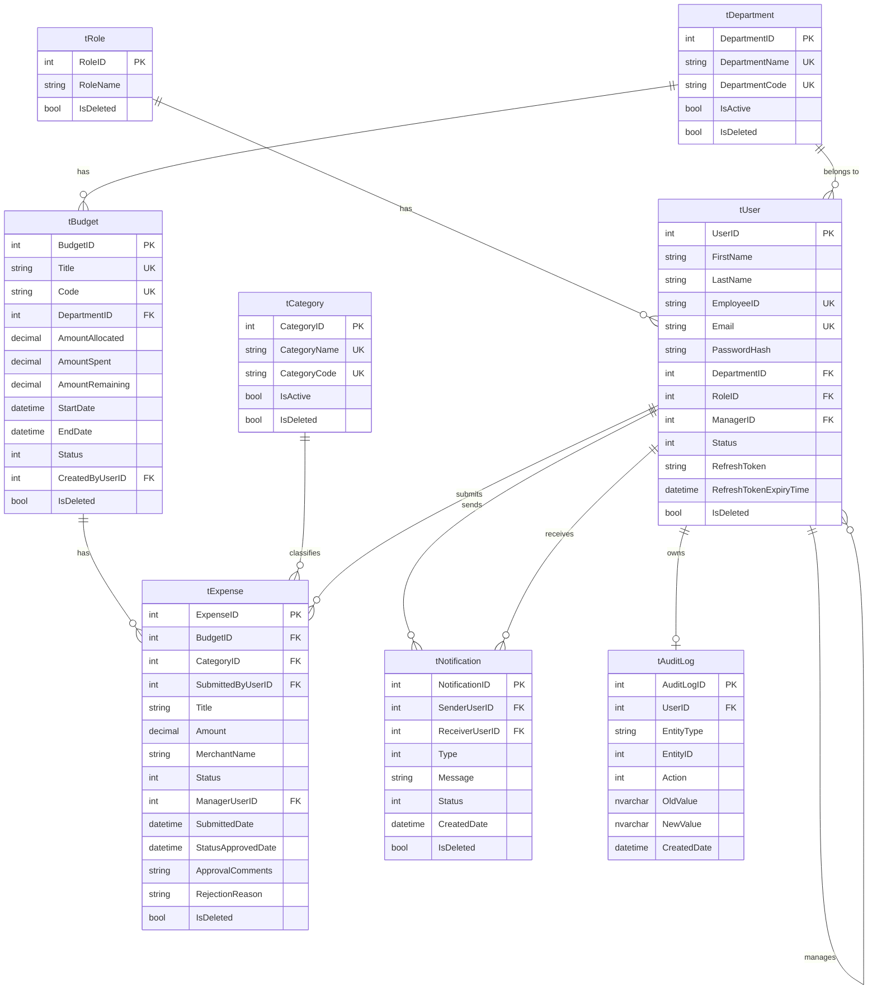

### 2.2 Table Definitions

| Table           | PK             | Unique Keys                    | FK Relationships                                       | Soft Delete |
| --------------- | -------------- | ------------------------------ | ------------------------------------------------------ | ----------- |
| `tRole`         | RoleID         | RoleName                       | —                                                      | ✅           |
| `tUser`         | UserID         | EmployeeID, Email              | RoleID, DepartmentID, ManagerID (self-ref)             | ✅           |
| `tDepartment`   | DepartmentID   | DepartmentName, DepartmentCode | CreatedByUserID, UpdatedByUserID, DeletedByUserID      | ✅           |
| `tBudget`       | BudgetID       | Title, Code                    | DepartmentID, CreatedByUserID                          | ✅           |
| `tCategory`     | CategoryID     | CategoryName, CategoryCode     | CreatedByUserID                                        | ✅           |
| `tExpense`      | ExpenseID      | —                              | BudgetID, CategoryID, SubmittedByUserID, ManagerUserID | ✅           |
| `tNotification` | NotificationID | —                              | SenderUserID, ReceiverUserID                           | ✅           |
| `tAuditLog`     | AuditLogID     | —                              | UserID (SetNull on delete)                             | ❌ Permanent |

### 2.3 Enumerations

| Enum                 | Values                                                                                                                  |
| -------------------- | ----------------------------------------------------------------------------------------------------------------------- |
| `BudgetStatus`       | `0=Active`, `1=Closed`                                                                                                  |
| `ExpenseStatus`      | `0=Pending`, `1=Approved`, `2=Rejected`                                                                                 |
| `UserStatus`         | `0=Active`, `1=Inactive`                                                                                                |
| `NotificationStatus` | `1=Unread`, `2=Read`                                                                                                    |
| `NotificationType`   | `1=ExpenseSubmitted`, `2=ExpenseApproved`, `3=ExpenseRejected`, `4=BudgetCreated`, `5=BudgetUpdated`, `6=BudgetDeleted` |
| `AuditAction`        | `1=Create`, `2=Update`, `3=Delete`                                                                                      |
| `UserRole`           | `1=Admin`, `2=Manager`, `3=Employee`                                                                                    |

### 2.4 Database Views

| View               | Purpose                                                                          | Used By                              |
| ------------------ | -------------------------------------------------------------------------------- | ------------------------------------ |
| `vwGetAllExpenses` | Joins tExpense with tBudget, tCategory, tUser (submitter + manager), tDepartment | ExpenseRepository (all list queries) |
| `vwGetAllBudgets`  | Joins tBudget with tDepartment, tUser                                            | BudgetRepository (all list queries)  |

### 2.5 Stored Procedures

| Stored Procedure                  | Module     | Side Effects                                                                                                                                                                 |
| --------------------------------- | ---------- | ---------------------------------------------------------------------------------------------------------------------------------------------------------------------------- |
| `uspCreateBudget`                 | Budget     | INSERT tBudget, INSERT tNotification (all subordinates), INSERT tAuditLog                                                                                                    |
| `uspUpdateBudget`                 | Budget     | UPDATE tBudget (no-change detection), recalculates `AmountRemaining = CASE WHEN Allocated < Spent THEN 0 ELSE Allocated - Spent END`, INSERT tNotification, INSERT tAuditLog |
| `uspDeleteBudget`                 | Budget     | Soft-delete, INSERT tNotification, INSERT tAuditLog                                                                                                                          |
| `uspCreateExpense`                | Expense    | Validates budget funds, INSERT tExpense, UPDATE tBudget amounts, INSERT tNotification (to manager), INSERT tAuditLog                                                         |
| `uspUpdateExpenseStatus`          | Expense    | UPDATE tExpense, recalculate tBudget amounts (`AmountRemaining` capped at `0` if over-budget), INSERT tNotification (to employee), INSERT tAuditLog                          |
| `uspGetExpenseStatistics`         | Expense    | SELECT aggregated KPIs (no write)                                                                                                                                            |
| `uspCreateCategory`               | Category   | Uniqueness check, INSERT tCategory, INSERT tAuditLog                                                                                                                         |
| `uspUpdateCategory`               | Category   | No-change detection, UPDATE tCategory, INSERT tAuditLog (Description appends `(Inactive)` when IsActive=false)                                                               |
| `uspDeleteCategory`               | Category   | Linked-expense check, soft-delete, INSERT tAuditLog                                                                                                                          |
| `uspCreateDepartment`             | Department | Uniqueness check, INSERT tDepartment, INSERT tAuditLog                                                                                                                       |
| `uspUpdateDepartment`             | Department | No-change detection, UPDATE tDepartment, INSERT tAuditLog (Description appends `(Inactive)` when IsActive=false)                                                             |
| `uspDeleteDepartment`             | Department | Linked-user/budget check, soft-delete, INSERT tAuditLog                                                                                                                      |
| `uspGetPeriodReport`              | Report     | SELECT aggregated budget/expense data for date range; `AmountRemaining` per budget capped at `0`                                                                             |
| `uspGetDepartmentReport`          | Report     | SELECT aggregated data grouped by department; `AmountRemaining` per department capped at `0`                                                                                 |
| `uspGetBudgetReport`              | Report     | SELECT budget header + expense metrics; `AmountRemaining` capped at `0`                                                                                                      |
| `uspGetBudgetReportExpenseCounts` | Report     | SELECT expense count breakdown for a budget                                                                                                                                  |
| `uspGetBudgetReportExpenses`      | Report     | SELECT itemized expenses for a budget                                                                                                                                        |

### 2.6 Global Query Filters (EF Core)

All entities except `tAuditLog` and `tRole` have an EF Core **global query filter** configured in `BudgetTrackDbContext.OnModelCreating`:

```csharp
modelBuilder.Entity<User>().HasQueryFilter(u => !u.IsDeleted);
modelBuilder.Entity<Budget>().HasQueryFilter(b => !b.IsDeleted);
modelBuilder.Entity<Expense>().HasQueryFilter(e => !e.IsDeleted);
modelBuilder.Entity<Category>().HasQueryFilter(c => !c.IsDeleted);
modelBuilder.Entity<Department>().HasQueryFilter(d => !d.IsDeleted);
modelBuilder.Entity<Notification>().HasQueryFilter(n => !n.IsDeleted);
```

This means **all LINQ queries automatically exclude soft-deleted records** without explicitly adding `.Where(x => !x.IsDeleted)` everywhere.

### 2.7 EF Core Relationships & Delete Behaviors

| Relationship                   | Behavior                                          |
| ------------------------------ | ------------------------------------------------- |
| Department → Users             | `Restrict` (cannot delete dept with active users) |
| Department → Budgets           | `Restrict`                                        |
| User → Role                    | `Restrict`                                        |
| User → Manager (self-ref)      | `Restrict`                                        |
| AuditLog → User                | `SetNull` (audit preserved even if user deleted)  |
| Budget → Expenses              | `Cascade` soft-delete via SP                      |
| Notification → Sender/Receiver | `Restrict`                                        |

---

## 3. Backend Layer Design

### 3.1 Layered Architecture

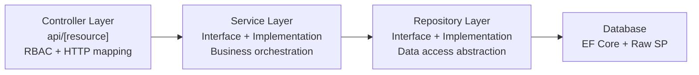

### 3.2 Namespace Structure

```
Budget_Track/
├── Controllers/
│   ├── Base/           BaseApiController.cs
│   ├── AuthController.cs
│   ├── BudgetController.cs
│   ├── CategoryController.cs
│   ├── DepartmentController.cs
│   ├── ExpenseController.cs
│   ├── NotificationController.cs
│   ├── ReportController.cs
│   ├── UserController.cs
│   └── AuditController.cs
├── Data/
│   ├── BudgetTrackDbContext.cs
│   └── DataSeeder.cs
├── Middleware/
│   ├── JwtMiddleware.cs
│   └── JwtSettings.cs
├── Models/
│   ├── Entities/       (9 domain entities)
│   ├── DTOs/           (41 DTO files across 8 modules)
│   └── Enums/          (9 enum files)
├── Repositories/
│   ├── Interfaces/     (8 repository interfaces)
│   └── Implementation/ (8 repository implementations)
├── Services/
│   ├── Interfaces/     (8 service interfaces)
│   └── Implementation/ (8 service implementations)
└── Program.cs
```

### 3.3 Controller Design

#### `BaseApiController`

All controllers except `AuditController` inherit from `BaseApiController`:

```csharp
[ApiController]
[Route("api/[controller]")]
public abstract class BaseApiController : ControllerBase
{
    protected int GetUserId()
    {
        var userId = HttpContext.Items["UserId"];
        if (userId is int id) return id;
        throw new UnauthorizedAccessException("User ID not found in context");
    }
}
```

This extracts the `UserId` injected by `JwtMiddleware` — no need to parse JWT claims manually in each controller.

#### Controller Responsibility Matrix

| Controller               | Route Prefix        | Inherits Base    | Class-level Auth                              |
| ------------------------ | ------------------- | ---------------- | --------------------------------------------- |
| `AuthController`         | `api/auth`          | ✅                | `[Authorize]` on specific actions             |
| `BudgetController`       | `api/budgets`       | ✅                | Per-action                                    |
| `CategoryController`     | `api/categories`    | ✅                | Per-action                                    |
| `DepartmentController`   | `api/departments`   | ✅                | Per-action                                    |
| `ExpenseController`      | `api/expenses`      | ✅                | Per-action                                    |
| `NotificationController` | `api/notifications` | ✅                | `[Authorize(Roles="Manager,Employee")]`       |
| `ReportController`       | `api/reports`       | ✅                | `[Authorize(Roles="Manager,Admin,Employee")]` |
| `UserController`         | `api/users`         | ✅                | Per-action                                    |
| `AuditController`        | `api/audits`        | ❌ ControllerBase | `[Authorize(Roles="Admin")]`                  |

### 3.4 Repository Design

Each repository follows a strict **interface → implementation** separation:

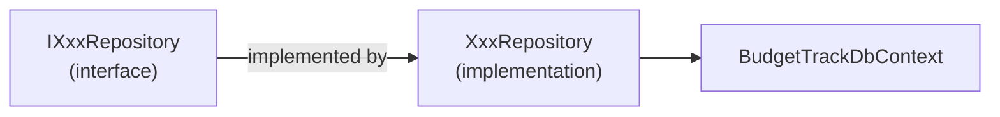

**Two query strategies coexist:**

| Strategy             | When Used                                    | Example                                                                       |
| -------------------- | -------------------------------------------- | ----------------------------------------------------------------------------- |
| EF Core LINQ         | Simple reads, paginated lists via Views      | `GetAllCategoriesAsync`, `GetAllExpensesAsync` via `vwGetAllExpenses`         |
| Raw Stored Procedure | Any write with side effects or complex joins | `CreateExpenseAsync`, `UpdateExpenseStatusAsync`, `GetExpenseStatisticsAsync` |

**Paging pattern** — all list methods return `PagedResult<T>`:

```csharp
public class PagedResult<T>
{
    public List<T> Data { get; set; }
    public int PageNumber { get; set; }
    public int PageSize { get; set; }
    public int TotalRecords { get; set; }
    public int TotalPages => (int)Math.Ceiling((double)TotalRecords / PageSize);
    public bool HasNextPage => PageNumber < TotalPages;
    public bool HasPreviousPage => PageNumber > 1;
}
```

### 3.5 Service Design

Services act as **thin orchestrators** in this application — they delegate directly to repositories. The service layer exists to:
1. Provide a clean interface boundary (controllers never touch repos directly)
2. Allow future business logic insertion without changing controllers
3. Enable unit testing isolation

```csharp
// Pattern: Service just delegates
public class CategoryService : ICategoryService
{
    private readonly ICategoryRepository _repo;
    public CategoryService(ICategoryRepository repo) => _repo = repo;

    public Task<List<CategoryResponseDto>> GetAllCategoriesAsync()
        => _repo.GetAllCategoriesAsync();
    // ... all methods delegate directly
}
```

**Exception**: `AuthService` is the one thick service — it orchestrates:
- Password hashing via `IPasswordHasher<User>`
- Token generation via `IJwtTokenService`
- RefreshToken DB persistence via `IUserRepository`
- Employee ID generation

---

## 4. Security & Middleware Design

### 4.1 JWT Authentication Pipeline

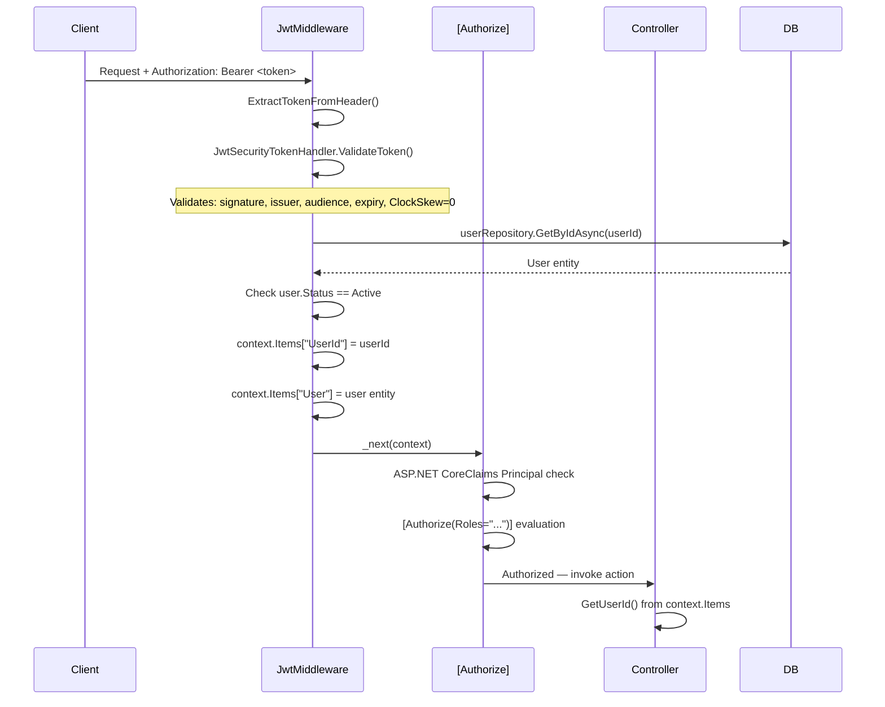

### 4.2 JWT Token Design

| Parameter         | Value                                 |
| ----------------- | ------------------------------------- |
| Algorithm         | HMAC-SHA256                           |
| Issuer            | `BudgetTrack` (from appsettings)      |
| Audience          | `BudgetTrackUsers` (from appsettings) |
| Access Token TTL  | 60 minutes                            |
| Refresh Token TTL | 7 days                                |
| ClockSkew         | `TimeSpan.Zero` (strict)              |

**Claims included in Access Token:**

| Claim Type                  | Value                                     |
| --------------------------- | ----------------------------------------- |
| `ClaimTypes.NameIdentifier` | `UserID` (int as string)                  |
| `ClaimTypes.Email`          | User email                                |
| `ClaimTypes.Role`           | Role name: `Admin`, `Manager`, `Employee` |
| `"EmployeeId"`              | Custom: `EMP2601`, `MGR2601`              |
| `"ManagerId"`               | Custom: Manager's UserID                  |

### 4.3 Refresh Token Design

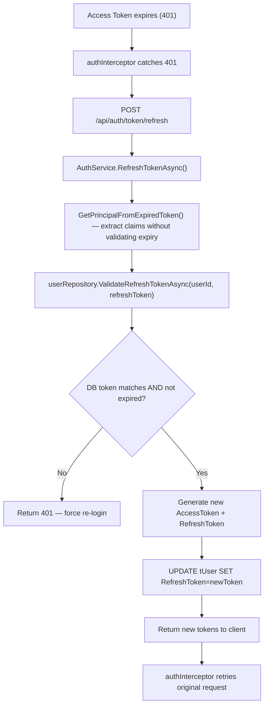

### 4.4 Role-Based Authorization Summary

| Role     | Numeric | Capabilities                                                                                          |
| -------- | ------- | ----------------------------------------------------------------------------------------------------- |
| Admin    | 1       | Full system access: manage users, categories, departments, view all expenses, all reports, audit logs |
| Manager  | 2       | Create/manage budgets, approve/reject expenses of team, view team expenses, budget reports            |
| Employee | 3       | Submit expenses, view own expenses and budgets, receive notifications                                 |

### 4.5 Password Security

```
User.Password → IPasswordHasher<User>.HashPassword()
             → PBKDF2/SHA256 with 128-bit salt
             → Stored as PasswordHash in tUser
```

Verification uses `IPasswordHasher<User>.VerifyHashedPassword()` — no plain-text passwords ever stored.

---

## 5. API Design & Conventions

### 5.1 URL Conventions

| Pattern         | Example                          |
| --------------- | -------------------------------- |
| Collection      | `GET /api/budgets`               |
| Single resource | `GET /api/budgets/{id}`          |
| Nested resource | `GET /api/budgets/{id}/expenses` |
| Sub-action      | `PUT /api/expenses/status/{id}`  |
| User-scoped     | `GET /api/users/{id}/employees`  |
| Reports by type | `GET /api/reports/period`        |

### 5.2 HTTP Status Code Conventions

| HTTP Code                   | When Used                                              |
| --------------------------- | ------------------------------------------------------ |
| `200 OK`                    | Successful GET, PUT, DELETE                            |
| `201 Created`               | Successful POST (entity created)                       |
| `400 Bad Request`           | Validation errors, business rule violations, no-change |
| `401 Unauthorized`          | No token / invalid token                               |
| `403 Forbidden`             | Valid token but insufficient role                      |
| `404 Not Found`             | Entity not found                                       |
| `409 Conflict`              | Duplicate unique key violation                         |
| `500 Internal Server Error` | Unhandled exceptions / SP RAISERROR                    |

### 5.3 Response Envelope Convention

**Success (list):**
```json
{
  "data": [...],
  "pageNumber": 1,
  "pageSize": 10,
  "totalRecords": 45,
  "totalPages": 5,
  "hasNextPage": true,
  "hasPreviousPage": false
}
```

**Success (mutation):**
```json
{ "success": true, "message": "Budget is created" }
```

**Error:**
```json
{ "success": false, "message": "Budget not found" }
```

### 5.4 Error Handling Pattern in Controllers

All controllers use the same cascading string-match pattern for exception routing:

```csharp
catch (Exception ex)
{
    var msg = ex.Message.ToLower();
    if (msg.Contains("not found") || msg.Contains("does not exist"))
        return NotFound(new { success = false, message = ex.Message });
    if (msg.Contains("already exists") || msg.Contains("duplicate"))
        return Conflict(new { success = false, message = ex.Message });
    if (msg.Contains("insufficient") || msg.Contains("exceeds") ||
        msg.Contains("already") || msg.Contains("only pending"))
        return BadRequest(new { success = false, message = ex.Message });
    return StatusCode(500, new { success = false, message = ex.Message });
}
```

### 5.5 Swagger Configuration

- **Base URL:** `http://localhost:5131`
- **Auth:** Bearer JWT via `SecurityDefinition`
- **Conflict resolution:** `ResolveConflictingActions` picks first descriptor
- **UI:** Full-screen at `/` (RoutePrefix = `""`) with filter and duration display

---

## 6. Frontend Architecture

### 6.1 Angular Application Structure

```
src/
├── app/
│   ├── auth/           login.component
│   ├── features/       Module feature components (10 features)
│   │   ├── audits/
│   │   ├── budgets/
│   │   ├── categories/
│   │   ├── dashboard/
│   │   ├── departments/
│   │   ├── expenses/
│   │   ├── notifications/
│   │   ├── profile/
│   │   ├── reports/
│   │   └── users/
│   ├── layout/
│   │   └── shell/      ShellComponent (navbar + sidebar + router-outlet)
│   └── shared/         Shared components / pipes
├── core/
│   ├── guards/         authGuard, roleGuard
│   ├── interceptors/   authInterceptor (HTTP)
│   └── services/       Core singleton services
├── models/             TypeScript interfaces (DTOs)
├── services/           Module-level Angular services
└── environments/       environment.ts (apiUrl config)
```

### 6.2 Routing Design

Angular uses **lazy-loaded standalone components** per route:

| Route                   | Component                  | Guards                                     |
| ----------------------- | -------------------------- | ------------------------------------------ |
| `/login`                | `LoginComponent`           | —                                          |
| `/dashboard`            | `DashboardComponent`       | `authGuard`                                |
| `/budgets`              | `BudgetsListComponent`     | `authGuard`                                |
| `/budgets/:id/expenses` | `ExpensesListComponent`    | `authGuard`                                |
| `/expenses`             | `ExpensesListComponent`    | `authGuard`                                |
| `/categories`           | `CategoriesListComponent`  | `authGuard`, `roleGuard(Admin,Manager)`    |
| `/departments`          | `DepartmentsListComponent` | `authGuard`, `roleGuard(Admin,Manager)`    |
| `/reports`              | `ReportsComponent`         | `authGuard`, `roleGuard(Admin,Manager)`    |
| `/users`                | `UsersListComponent`       | `authGuard`, `roleGuard(Admin,Manager)`    |
| `/audits`               | `AuditLogsComponent`       | `authGuard`, `roleGuard(Admin)`            |
| `/notifications`        | `NotificationsComponent`   | `authGuard`, `roleGuard(Manager,Employee)` |
| `/profile`              | `ProfileComponent`         | `authGuard`                                |
| `**`                    | redirect to `/login`       | —                                          |

### 6.3 Guard Design

**`authGuard`** — checks if user is authenticated:
```typescript
export const authGuard: CanActivateFn = () => {
    const auth = inject(AuthService);
    const router = inject(Router);
    if (auth.isAuthenticated()) return true;
    return router.createUrlTree(['/login']);
};
```

**`roleGuard`** — factory guard, checks role:
```typescript
export const roleGuard = (...allowedRoles: string[]): CanActivateFn =>
    () => {
        const auth = inject(AuthService);
        const router = inject(Router);
        const role = auth.currentUser()?.roleName;
        if (role && allowedRoles.includes(role)) return true;
        return router.createUrlTree(['/dashboard']);
    };
```

### 6.4 Auth Interceptor Design

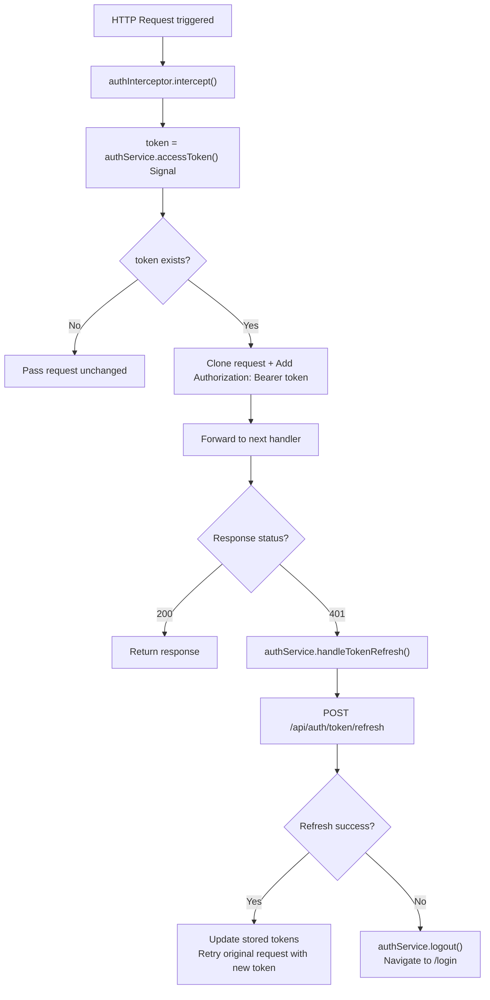

### 6.5 State Management

BudgetTrack uses **Angular Signals** for reactive state — no NgRx or RxJS BehaviorSubject:

| Signal         | Type                      | Scope         | What it stores                       |
| -------------- | ------------------------- | ------------- | ------------------------------------ |
| `_accessToken` | `Signal<string>`          | `AuthService` | Current JWT access token (in-memory) |
| `_currentUser` | `Signal<UserResponseDto>` | `AuthService` | Logged-in user info                  |

Token persistence:
- `accessToken` → `localStorage` key: `bt_access_token`
- `refreshToken` → `localStorage` key: `bt_refresh_token`

### 6.6 Service Communication Pattern

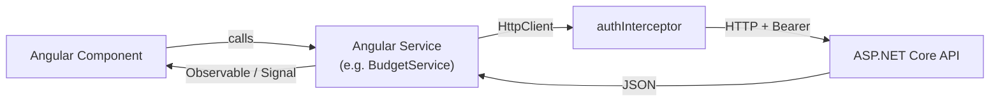

All Angular services inject `HttpClient` and `environment.apiUrl` (`http://localhost:5131`).

---

## 7. Data Flow Patterns

### 7.1 Create Flow (POST)

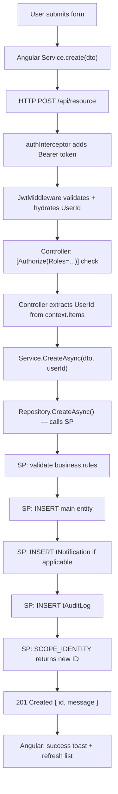

### 7.2 Read/List Flow (GET paginated)

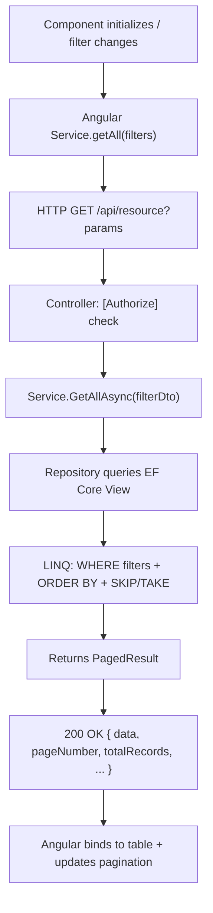

### 7.3 Soft Delete Flow (DELETE)

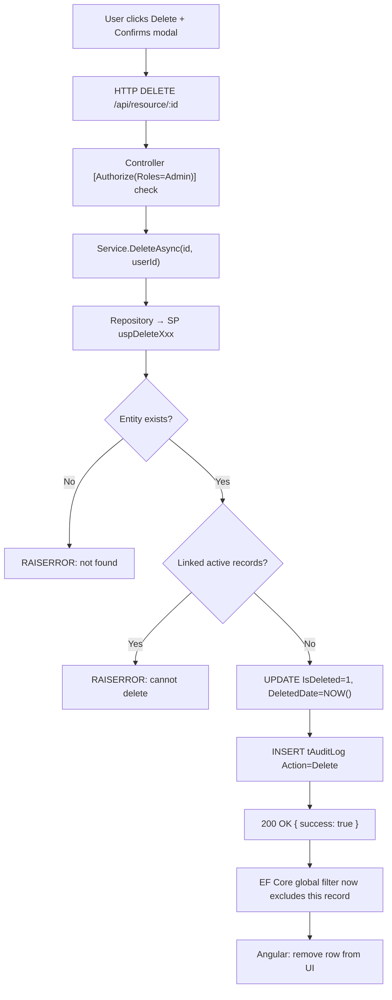

---

## 8. Error Handling Strategy

### 8.1 Backend Error Layers

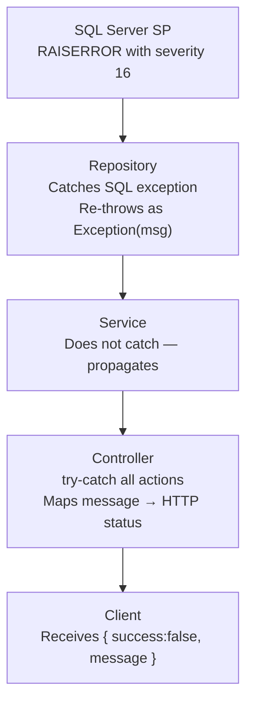

### 8.2 No-Change Detection

Budget and Expense stored procedures implement **no-change detection** — they compare old vs new field values before updating:

```sql
-- SP pattern for no-change detection
IF @OldTitle = @NewTitle AND @OldAmount = @NewAmount AND @OldStatus = @NewStatus
    RAISERROR('No changes detected. Update skipped.', 16, 1);
```

If no fields changed, the SP raises an error → repository re-throws → controller returns `400 Bad Request`.

### 8.3 Frontend Error Handling

| Scenario           | Angular Behavior                                            |
| ------------------ | ----------------------------------------------------------- |
| `401 Unauthorized` | authInterceptor attempts token refresh; on failure → logout |
| `403 Forbidden`    | Show toast "Access denied"                                  |
| `404 Not Found`    | Show error message in UI                                    |
| `400 Bad Request`  | Show API `message` in form or toast                         |
| `409 Conflict`     | Show duplicate warning in form                              |
| `500 Server Error` | Show generic error toast                                    |
| Network failure    | Show "Unable to connect" toast                              |

---

## 9. Design Patterns Used

### 9.1 Repository Pattern

Abstracts all data access behind interfaces. Controllers and services never reference `BudgetTrackDbContext` directly — only repositories do.

```
IExpenseRepository  ←  ExpenseService  ←  ExpenseController
       ↑
ExpenseRepository (EF Core + SP)
```

### 9.2 Service Layer Pattern

Provides a business logic boundary between controllers and repositories. All `[Authorize]` checks happen at the controller layer, all data access at the repository layer — services sit cleanly in between.

### 9.3 DTO (Data Transfer Object) Pattern

Domain entities (`tBudget`, `tExpense`, etc.) are **never exposed directly** to API consumers. All responses use DTOs:

| DTO Type     | Direction            | Example                                       |
| ------------ | -------------------- | --------------------------------------------- |
| Request DTO  | Client → API         | `CreateExpenseDTO`, `UserLoginDto`            |
| Response DTO | API → Client         | `AllExpenseDto`, `AuthResponseDto`            |
| Filter DTO   | Query params bundled | `ExpenseFilterDto`, `ManagedExpenseFilterDto` |

### 9.4 Factory Guard Pattern (Angular)

`roleGuard` is a **factory function** that returns a `CanActivateFn`, accepting allowed roles as parameters:

```typescript
canActivate: [roleGuard('Admin', 'Manager')]  // inline, no extra class needed
```

### 9.5 Interceptor Pattern (Angular)

`authInterceptor` implements the **HTTP Interceptor** pattern — automatically attaches Bearer token to all outgoing requests and handles 401 retry with token refresh transparently to all other services and components.

### 9.6 Soft Delete Pattern

Instead of hard deletes, all entities (except AuditLog) use:
- `IsDeleted: bool` flag
- `DeletedDate: DateTime?` timestamp
- `DeletedByUserID: int?` FK

Combined with EF Core global query filters, deleted records are invisible to all LINQ queries without any extra code.

### 9.7 Audit Trail Pattern

All mutation stored procedures write an audit log with:
- Full JSON snapshot of **old state** (`OldValue`)
- Full JSON snapshot of **new state** (`NewValue`)
- Actor (`UserID`), entity type, entity ID, action, timestamp

This gives a complete, immutable history of every data change.

---

## 10. Dependency Injection Map

All registrations are in `Program.cs` using ASP.NET Core's built-in DI container.

### 10.1 Service Lifetimes

| Registration                           | Lifetime      | Reason                               |
| -------------------------------------- | ------------- | ------------------------------------ |
| `BudgetTrackDbContext`                 | **Scoped**    | One EF Core context per HTTP request |
| All `IXxxRepository` → `XxxRepository` | **Scoped**    | Per-request data access              |
| All `IXxxService` → `XxxService`       | **Scoped**    | Per-request business logic           |
| `IJwtTokenService` → `JwtTokenService` | **Scoped**    | Per-request token operations         |
| `IAuthService` → `AuthService`         | **Scoped**    | Per-request auth                     |
| `IPasswordHasher<User>`                | **Scoped**    | Per-request hashing                  |
| `JwtSettings`                          | **Singleton** | Static config, read once at startup  |

### 10.2 Full DI Registration

```csharp
// Repositories (Scoped)
services.AddScoped<IExpenseRepository, ExpenseRepository>();
services.AddScoped<IUserRepository, UserRepository>();
services.AddScoped<ICategoryRepository, CategoryRepository>();
services.AddScoped<IBudgetRepository, BudgetRepository>();
services.AddScoped<IReportRepository, ReportRepository>();
services.AddScoped<IAuditRepository, AuditRepository>();
services.AddScoped<INotificationRepository, NotificationRepository>();
services.AddScoped<IDepartmentRepository, DepartmentRepository>();

// Services (Scoped)
services.AddScoped<IBudgetService, BudgetService>();
services.AddScoped<IExpenseService, ExpenseService>();
services.AddScoped<IJwtTokenService, JwtTokenService>();
services.AddScoped<IAuthService, AuthService>();
services.AddScoped<ICategoryService, CategoryService>();
services.AddScoped<IReportService, ReportService>();
services.AddScoped<IAuditService, AuditService>();
services.AddScoped<INotificationService, NotificationService>();
services.AddScoped<IDepartmentService, DepartmentService>();

// Infrastructure (Singleton / Scoped)
services.AddSingleton<JwtSettings>(jwtSettings);
services.AddScoped<IPasswordHasher<User>, PasswordHasher<User>>();
services.AddDbContext<BudgetTrackDbContext>(opt =>
    opt.UseSqlServer(connectionString));
```

### 10.3 Middleware Pipeline Order

```
Request →
  1. UseMiddleware<JwtMiddleware>()     ← Token validation + user hydration
  2. UseHttpsRedirection()
  3. UseCors("AllowAll")
  4. UseAuthentication()               ← ASP.NET Core JWT Bearer scheme
  5. UseAuthorization()                ← [Authorize] attribute evaluation
  6. MapControllers()                  ← Route to controller action
← Response
```

> **Important:** `JwtMiddleware` runs **before** `UseAuthentication()`. It enriches `HttpContext.Items` with the resolved `UserId` int (not just the claim string), which is what `BaseApiController.GetUserId()` uses.
